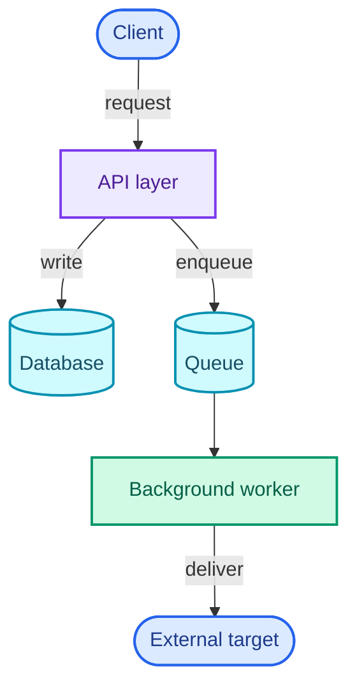

# rishabh0111.github.io

Personal site built with Jekyll on GitHub Pages.

- **Home** (`index.md`) — the whole portfolio, all of it in the front matter.
  Rendered by `_layouts/home.html` as full-width rows that alternate between
  the open scene and a tinted band, each row a different component, with a
  rail in the left margin naming the section you are reading. See below.
- **Blog** (`/blogs/`) — original long-form articles, standalone or grouped into a series.
- **News** (`/news/`) — bi-weekly annotated-reading digests.

Most of this file documents the format every file in `_posts/` must follow, so the
layouts render it correctly. It is listed under `exclude:` in `_config.yml`, so it is
never built or served — safe to keep at the repo root.

---

## The home page

Everything the page shows lives in `index.md`'s front matter; the body is empty.
To change the page, change that file.

| Key | What it becomes |
| --- | --- |
| `profile.name` / `.surname` / `.role` / `.avatar` | The hero (name, eyebrow, portrait) |
| `profile.tagline`, `profile.status` | **About** — the standfirst line and the "now" line (moved out of the hero) |
| `links` | The link pills, in the hero and the closing plane |
| `metrics` | The first band: four stat tiles, figures counting up on scroll |
| `pillars` | **About** — the three claims as icon tiles (`icon` names a glyph in `_includes/icon.html`) |
| `about` | **About** — the essay, folded behind "The longer version" |
| `projects` | **Projects** — a band of poster cards, however many entries, no tiers. Each card: `shots` as the cover (or a plate with the first stack mark), name, `blurb`, stack chips, `links`; the write-up (`promise`, `body`, `points`, `glance`, `parts` as cards) is folded behind "The full write-up" |
| `experience` | **Experience** — a timeline. Each job is a card on the spine (`current: true` lights its dot) with `summary`, `ventures` as tiles and `stack`; the bullets are folded behind "What I did there" |
| `skills` | **Toolkit** — a logo grid |
| `education`, `certifications`, `awards` | **Credentials** — two panels: education, then certifications and awards, each entry a row with its kind's mark |
| `contact` | The closing plane |

Two conventions worth knowing:

- **`promise`** is the one sentence a system makes and never violates — the same
  device the webhook write-up opens with. It is the hook; the blog post carries
  the argument. Keep it to a sentence.
- **`shots`** need a `src`. Add `src_dark` **only** if the image is unreadable on
  the dark theme — a screenshot of a light UI usually is not. A lone image gets
  no theme class; tagging it would hide it on the dark theme and leave a gap.
  Same rule as `logo` / `logo_dark` in `experience`.
- **`parts`** turns a project into cards, one per separable piece. Nivara Desk
  uses it for its AI layer, API and front ends.
- **One component per section, on alternating grounds.** Rows alternate
  between the open scene and a tinted band (`.ds-band`), so the eye finds
  where one section ends without a box around each. About is spotlight
  tiles, Projects a band of poster cards with a glow border, Experience a
  timeline, Toolkit a band of edge-to-edge logo loops, Writing a dated list,
  Credentials two panels of rows. The reader gets each section's gist from
  its silhouette before reading a word. The hover effects follow React Bits
  (SpotlightCard, MagicBento, LogoLoop) rewritten as plain CSS on the site's
  tokens; the component choices track shadcn/ui's catalog (Card, Item,
  Carousel).
- **Everything arrives as you reach it.** Every tile, row and card carries
  `data-anim` (up / left / fade) and rises in with a stagger when scrolled
  to; the metrics count up; the About lede reveals word by word as it
  climbs the viewport; the contact address carries a slow sheen. All after
  React Bits (AnimatedContent, FadeContent, CountUp, ScrollReveal,
  ShinyText) as plain CSS driven by a few lines in the home script; under
  reduced motion or without JS the page is simply there.
- **Any number of projects.** The grid shows four; from the fifth on, an
  "All N projects" button reveals the rest in place, same card as the
  first four. Ten projects is five rows, not a carousel that hides them.
- **No tiers among projects.** A weekend repo and a flagship get the same
  card; `kind` and `year` are the only things that differ.
- **The fold.** Every project, every job and the About essay keep their full
  text behind a native `<details>` (styled as `details.more`), closed by
  default. A new project or job takes the same room as the last one however
  much it has to say. Nothing is cut: open the fold and it is all there, and
  it still works without JS.

Adding a project means adding to `projects:` — the layout does not change.

### Home page motion

`assets/js/home-fx.js` and `assets/js/home-bits.js` (loaded `defer`, home only) carry the page's motion,
every piece a plain-JS port of a [React Bits](https://reactbits.dev) component
fetched from its shadcn registry (`reactbits.dev/r/<Name>-JS-CSS`). To browse
that registry through the shadcn MCP, add a local, untracked `components.json`
with `"registries": { "@react-bits": "https://reactbits.dev/r/{name}" }`:

| Where | React Bits | What it does |
| --- | --- | --- |
| the scene | Topography | the contour map, alive — the shader on raw WebGL2, no library; still SVG on touch / reduced motion |
| hero name | Warp Text | the name as a pane of glass: slow undulation, a lens under the pointer, a hair of RGB split — on raw WebGL2. Split Text (letters rising in) where it can't run |
| "Hi, I'm" | Blur Text | words from above, out of a blur |
| role eyebrow | Rotating Text | the three words take turns |
| portrait | Profile Card | the photo as a card: tilt, glare, a Nord-palette sheen, a glass strip with handle · location |
| link pills | Magnet | pull toward a nearby pointer |
| everywhere | Click Spark | a burst of lines on click |
| header nav | Pill Nav | a disc rises to fill the pill on hover |
| tile marks | Glass Icons | a frosted front over a turned, tinted back |
| projects | Magic Bento | border glow per card, one soft light over the band |
| metrics | Count Up | figures count up on arrival |
| about lede | Scroll Reveal | words focus as the paragraph climbs |
| contact | Shiny Text | a sheen across the address |
| all cards | Animated Content | rise in with a stagger |
| the rail | Line Sidebar | the beads and labels reach for the pointer |
| the cursor | Target Cursor | corner brackets that snap around links and cards |
| metrics | Counter | rolling odometer digits |
| mono labels | Decrypted Text | scramble into place on arrival |
| the "now" line | Text Type | types itself out |
| hero pills | Dock | magnify near the pointer |
| project covers | Accordion Gallery | shots as expanding panels |
| cover plates | Pixel Card | a pixel field on hover |
| projects band | Dot Grid | dots that tint and get shoved by a fast pointer |
| current job | Electric Border | a live, turbulent edge |
| contact plane | Magnet Lines | needles that point at the pointer |
| "All N projects" | Specular Button | a highlight that follows the pointer |
| off-hours | True Focus | a frame hopping word to word |
| toolkit loops | Scroll Velocity | speed up with the scroll |
| viewport foot | Gradual Blur | the page dissolves at the bottom edge |

No GSAP, motion, ogl or React; CSS keyframes and a few hundred lines of
script. Reduced motion, a coarse pointer or no JS leave the page still.

## Where posts live

```
_posts/
  blogs/YYYY-MM-DD-slug.md     → a blog post
  news/YYYY-MM-DD-slug.md      → a news digest
```

Rules:

- The **subfolder decides the category**. `_posts/blogs/…` → category `blogs`;
  `_posts/news/…` → category `news`. The layouts, listings, breadcrumb, prev/next and
  related-posts band all key off that category.
- The filename **must** start with `YYYY-MM-DD-`. Jekyll refuses to build a post otherwise.
- The date in the filename should match the `date:` in the front matter.
- `slug` becomes the URL slug for news; blogs set their URL explicitly via `permalink:`.
- `future: true` is set in `_config.yml`, so a post dated in the future still builds and
  publishes immediately.

---

## Front matter — every post

All posts use `layout: post`. YAML front matter, fenced by `---`.

| Key | Required | Type | Notes |
| --- | --- | --- | --- |
| `layout` | yes | string | Always `post`. |
| `title` | yes | string | Quote it. Used as `<h1>`, `<title>`, breadcrumb, listings, prev/next. |
| `date` | yes | datetime | `YYYY-MM-DD HH:MM:SS +0530`. Blogs use `09:00:00`, news digests use `00:00:00` by convention. Timezone is `Asia/Kolkata`. |
| `categories` | yes | string | `blogs` or `news`. Matches the subfolder. Keep it explicit even though the folder also sets it. |
| `tags` | recommended | list | `[a, b, c]`. Shown as pills: 3 max in the blog list, 4 max in the news list, all of them at the foot of the article. |
| `read_time` | recommended | integer | Minutes, written by hand. Renders as "N min read" and "N min" in listings. Omit and the field just disappears. |
| `excerpt` | see below | string | One or two sentences. Overrides Jekyll's auto-excerpt. |

`excerpt` behaviour:

- **Blog** — optional. Shows under the title in the post header. Not shown in the blog list.
- **News** — effectively required. Shows in the post header **and** as the summary line in
  the news list (truncated to ~120 chars there), so write it as a real standalone summary.

---

## Blog posts

### Standalone blog post

```yaml
---
layout: post
title: "A short, specific title for the post"
date: 2026-01-15 09:00:00 +0530
author: Rishabh Sharma
categories: blogs
tags: [topic-one, topic-two, topic-three]
read_time: 12
permalink: /blogs/post-slug/
excerpt: "One or two sentences that state what the piece is about and why it is worth reading."
---
```

Blog-only keys:

| Key | Required | Type | Notes |
| --- | --- | --- | --- |
| `permalink` | yes (convention) | string | `/blogs/<slug>/` with the trailing slash. Every blog post sets this so the URL is clean and stable regardless of date. |
| `author` | optional | string | Renders in the meta line before the date. Omit to drop it. |

### Series blog post (multi-part)

A series is just a set of blog posts that share a `series:` value. Presence of `series:`
turns on the left-hand "parts" rail, adds a series pill to the breadcrumb, and groups the
posts under a "Series" heading (above the standalone posts) on the blog index.

```yaml
---
layout: post
title: "Part Two: the sub-topic this instalment covers"
date: 2026-02-03 09:00:00 +0530
author: Rishabh Sharma
categories: blogs
tags: [series-topic, sub-topic, series]
read_time: 9
permalink: /blogs/series-topic-part-two/
excerpt: "A standalone summary of this part — it should make sense without having read the others."
series: "The Series Name"
series_order: 2
series_total: 7
---
```

Series keys:

| Key | Required | Type | Notes |
| --- | --- | --- | --- |
| `series` | yes | string | The series name. Must be **byte-identical** across every part — it is the join key. |
| `series_order` | yes | integer | Part number. Drives sort order in the rail and the "Part N of M" label. |
| `series_total` | recommended | integer | Planned number of parts. Without it, the count falls back to the number of parts **already published**, so a series that is still coming out reads "Part 2 of 2" instead of "Part 2 of 7". Set it on every part while the series is in progress. |

Notes:

- Give the tag list a `series` tag by convention (the old posts do).
- Parts are ordered by `series_order`, not by date, in the rail — but keep dates ascending
  anyway so prev/next and the index year-grouping stay sane.
- Cross-link parts in the body by hand: `Next: [Part Three title](/blogs/series-topic-part-three/)`.

---

## News digests

```yaml
---
layout: post
title: "The headline theme of this digest window"
date: 2026-01-19 00:00:00 +0530
categories: news
tags: [digest, topic-one, topic-two, topic-three]
read_time: 6
excerpt: "A real standalone summary of the digest — the two or three threads it pulls together, written so it reads well on its own in the news list."
---
```

News-specific:

| Key | Required | Type | Notes |
| --- | --- | --- | --- |
| `source` | optional | string | Renders as "via {source}" in the meta line. Use it when the digest is built around one publication. |
| `permalink` | optional | string | Usually omitted. Jekyll then serves it at `/news/YYYY/MM/DD/slug.html`. Set `permalink: /news/<slug>/` if you want a clean URL. |
| `author` | — | — | Not used on news. Leave it out. |

Conventions the existing digests follow (not enforced, but the layout and tone assume them):

- `tags` starts with `digest`.
- The body opens with a one-paragraph framing of the window, then `---`.
- Each item is an `## Heading`, a paragraph or two, then bolded takeaway lines
  (`**Why it matters:**`, `**If you're building X:**`).
- Closing sections: `## Elsewhere worth a click` (bullet list) and
  `## One to read this weekend` (a single link + why).

---

## Writing the body

Markdown is **kramdown** with GFM input and **Rouge** highlighting (`_config.yml`).

### Headings and the table of contents

- Use `##` and `###` only. `#` is the title (front matter). `####` exists but is tiny.
- The right-hand "In this article" TOC is generated from the `##`/`###` in the body.
  It only appears when there are **2 or more** headings; otherwise the card hides itself.
- Every `##` automatically gets a decorative `§` marker to its left via CSS. **Do not type
  it.** (If you ever do, the TOC strips a leading `§ ` from the entry text.)

### Code

Fenced blocks with a language tag get highlighted:

    ```js
    const result = await client.send(payload);
    ```

Line numbers are off globally.

### Mermaid diagrams

A ```` ```mermaid ```` fence renders as a live, **theme-aware** diagram. `mermaid@10` is
loaded only on pages that contain such a fence. The diagram re-renders when the reader
flips the light/dark toggle.



How the theming works — worth understanding so diagrams don't come out mis-coloured:

- **Flowcharts**: colour nodes by giving them a `classDef` **role**, then `class Node role`.
  The site recognises these role names and rewrites their colours per theme:

  | Role | Intended meaning |
  | --- | --- |
  | `actor` | external client / person / target |
  | `gateway` | API / entry point |
  | `service` | worker or background job |
  | `store` | database, queue, cache |
  | `flow` | plain process step |
  | `warn` | decision / caution |
  | `ok` | success terminal state |
  | `error` | failure / dead state |

  Write the light-mode colours in the `classDef` (as above); the dark-mode equivalents are
  substituted automatically. A `classDef` with any **other** name is left exactly as you
  wrote it — and will therefore look wrong on one of the two themes, so stick to the roles.

- **Sequence diagrams**: no `classDef` needed. Actors, signals, notes and activation bars
  are themed automatically from the same palette.

- Any `%%{init: …}%%` directive in the diagram source is **stripped** before rendering, so
  a baked-in theme can't override the page theme. Don't rely on one.

### Images

- Put files in `assets/img/`. Reference with ``.
- Any image or mermaid diagram in the article body opens in a zoom/pan lightbox when
  clicked — unless the image is wrapped in a link, in which case the link wins.
- `figure` / `figcaption` are styled (centred, small caption).

### Tables and blockquotes

Both are styled. Blockquotes are used for the load-bearing one-liner / pull-quote.
Tables get striped rows; keep them narrow — they scroll on mobile but wide tables are ugly.

### Horizontal rules

`---` renders as a centred dot separator. Used liberally between sections.

---

## Build and publish

- Push to `master`. GitHub Pages builds with the plugins in `_config.yml`
  (`jekyll-feed`, `jekyll-seo-tag`, `jekyll-sitemap`) — all natively supported.
- `_config.yml` `exclude:` keeps `README.md`, `Gemfile*`, `vendor`, `dump`,
  `_templates` and `_preview` out of the build. Anything private belongs outside
  this directory entirely — the repo is public, so an ignore rule is a weaker
  guarantee than the file simply not being here.
- `_site/` is the build output — never edit it, never commit changes to it by hand.

### Local preview

```
bundle install                                   # first time only
bundle exec jekyll serve --port 4001 --watch     # http://127.0.0.1:4001/
```

Add `--future` if you're testing a future-dated post and have overridden the
config. `--incremental` speeds up rebuilds but occasionally misses a change to a
layout — drop it if a save doesn't show up.

The `Gemfile` uses the **`github-pages`** gem rather than plain `jekyll`, so the
local build is Jekyll 3.10 — the version Pages actually runs. Installing
`jekyll` on its own would give you Jekyll 4, which differs in enough small ways
that a green local build would not prove much.

On Windows this needs **Ruby with DevKit** (MSYS2), because several gems compile
native extensions:

```
winget install RubyInstallerTeam.RubyWithDevKit.3.2
```

`vendor/`, `.bundle/` and `Gemfile.lock` are gitignored — GitHub Pages resolves
its own versions and ignores a committed lockfile anyway.

## Quick checklist for a new post

- [ ] File in `_posts/blogs/` or `_posts/news/`, named `YYYY-MM-DD-slug.md`
- [ ] `layout: post`, `title`, `date`, `categories` set
- [ ] `tags`, `read_time`, `excerpt` filled in (excerpt mandatory for news)
- [ ] Blog: `permalink: /blogs/<slug>/`
- [ ] Series part: `series`, `series_order`, and `series_total` while the series is in progress
- [ ] Headings are `##` / `###`; no hand-typed `§`
- [ ] Mermaid diagrams use the role names from the table above
- [ ] Images in `assets/img/`
