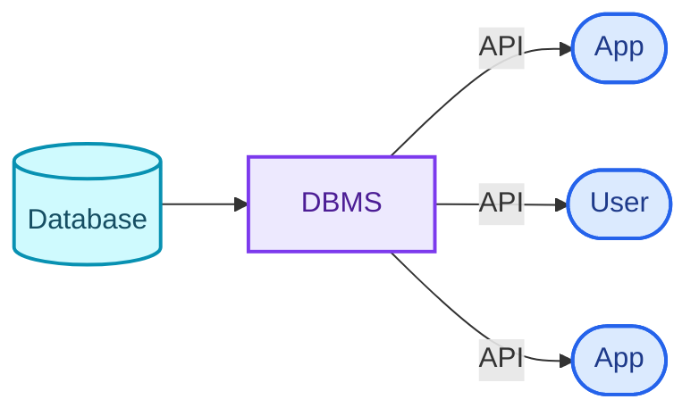
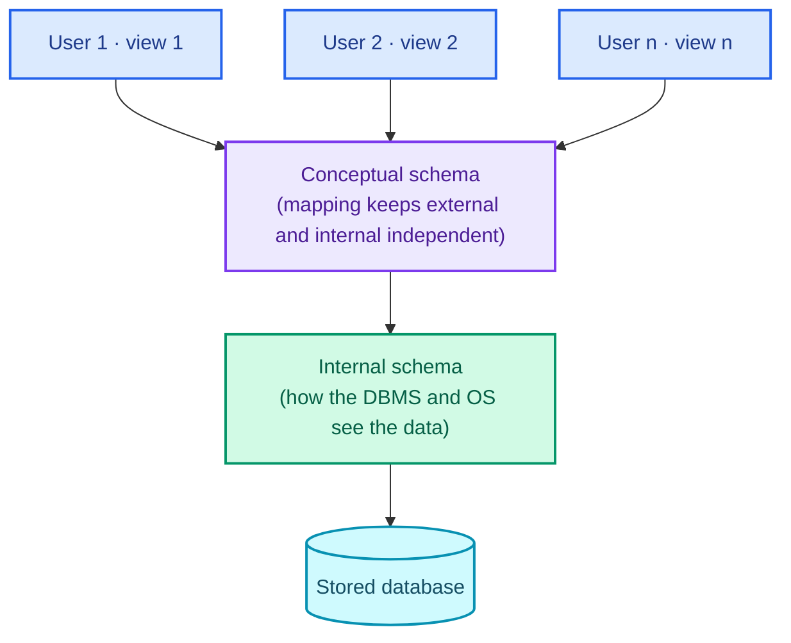
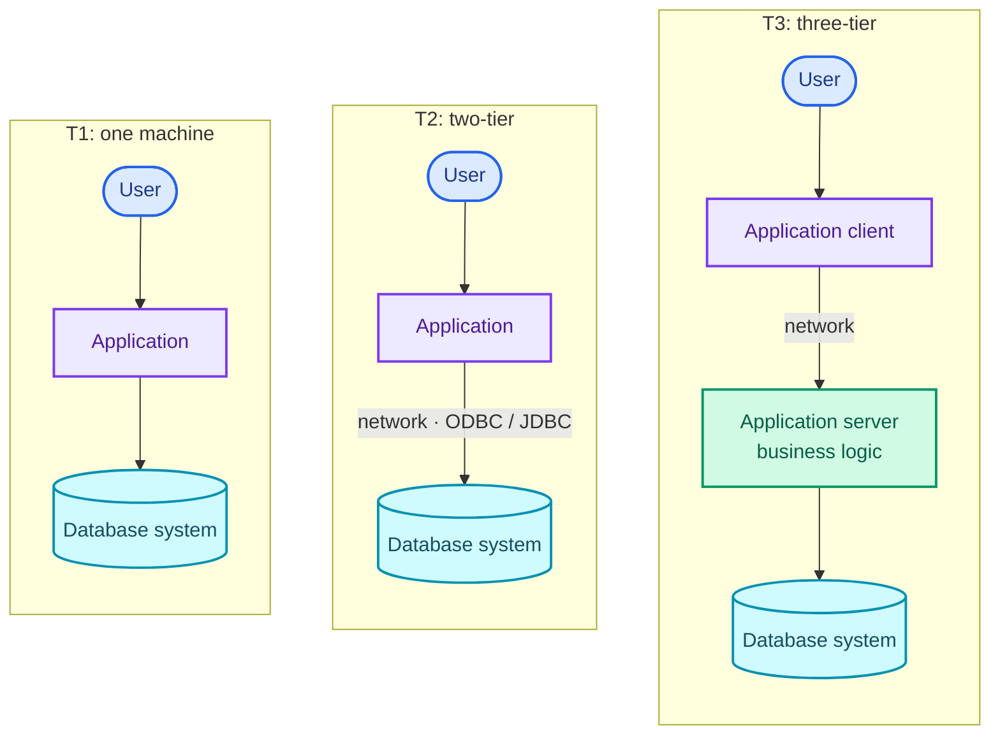
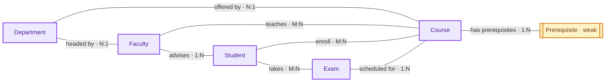

These are my DBMS notes, cleaned up into three posts. This one covers the ground a schema is built
on: what a database system is, how it is layered, and how you go from a description of a business
to an ER diagram to a set of tables. [Part Two](/blogs/dbms-sql-and-queries/) is SQL, and
[Part Three](/blogs/dbms-optimisation-transactions-and-scaling/) is normalisation, transactions,
indexing, NoSQL and scaling.

## Introduction

### What is data?

Data is a collection of raw facts and details with no purpose or meaning of its own. It is
measured in bits and bytes and has to be processed before it tells you anything.

| Type | Examples |
| --- | --- |
| Quantitative | Numerical, such as the weight, volume or cost of an item |
| Qualitative | Descriptive and non-numerical, such as a person's name, gender or hair colour |

### What is information?

Information is data that has been processed, organised and structured so that it has context and
can support a decision. You get it by analysing and interpreting pieces of data.

Say you have data on the people in your locality. Analysed, it becomes information: the number of
senior citizens, the sex ratio, the number of newborns.

### What is a database?

A database is an electronic system where data is stored so that it can be accessed, managed and
updated easily.

### What is a DBMS?

A database-management system (DBMS) is a collection of interrelated data together with the
programs that access it. Its job is to store, retrieve and manage that data through operations
such as adding, reading, updating and deleting records. Applications and users never touch the
stored data directly; they go through the DBMS, usually over an API.

### DBMS vs file systems

Before database systems, data lived in files that each program read and wrote in its own way. The
table below is also the list of reasons to use a DBMS.

| Aspect | DBMS | File system |
| --- | --- | --- |
| Data redundancy | Keeps repetition and the inconsistencies it causes to a minimum | Prone to redundancy and inconsistency |
| Data access | Efficient, easy access | Data is hard to get at |
| Data isolation | Controlled access, data kept separate | Little control over isolation |
| Data integrity | Constraints keep data accurate and consistent | Prone to integrity problems |
| Atomicity | Transactions either complete fully or are aborted | Hard to guarantee a change completes |
| Concurrent access | Handles simultaneous access without conflicts | Breaks when several users write at once |
| Security | Strong access control | Open to security holes |

---

## DBMS architecture

### View of data: the three-schema architecture

A DBMS hides how data is stored and maintained by giving users an abstract view of it, through
three levels of abstraction.

1. **Physical (internal) level.** The lowest level. It deals with how data is physically stored:
   low-level data structures, storage allocation (N-ary trees), compression and encryption. The
   goal here is to define algorithms that make access efficient.
2. **Logical (conceptual) level.** The design of the database: what data is stored and how the
   pieces relate. Users at this level are shielded from the physical structures, and DBAs work here
   to decide what the database should hold. The goal is ease of use.
3. **View (external) level.** The highest level. Each user or group gets a view schema that shows
   the part of the database they care about and hides the rest. The external level holds several
   such subschemas, and restricting what a view shows doubles as a security measure.

### Instances and schemas

- An **instance** is the data stored in the database at a particular moment.
- A **schema** is the overall design of the database: a structural description of the data. There
  are three kinds, matching the three levels: physical, logical and view schemas (subschemas). The
  analogy is a program: the schema is the variable declarations, the instance is the values. Data
  changes far more often than the schema does.
- The logical schema matters most to application programs, because programmers build applications
  against it.
- **Physical data independence** means the physical schema can change without the logical schema,
  or the programs built on it, having to change.

### Data models

A data model is a set of conceptual tools for describing the design of a database at the logical
level: the data, the relationships between it, its semantics and its consistency constraints.
Examples are the ER model, the relational model, the object-oriented model and the
object-relational model.

### Database languages

1. **Data definition language (DDL)** specifies the schema. It also declares consistency
   constraints, which are checked every time the database is updated.
2. **Data manipulation language (DML)** expresses queries and updates. Data manipulation means:
    1. retrieving information stored in the database,
    2. inserting new information,
    3. deleting information,
    4. updating existing information.

   The part of DML that asks for data back is called the query language.

In practice both are parts of one language, SQL.

### How applications talk to the database

Applications are written in a host language (C/C++, Java, JavaScript) and send DML statements to
the database. A bank's payroll module, for example, reads the database by running DML from the
host language.

The database exposes an API for sending DML and DDL statements and reading the results back:

- **ODBC** (Open Database Connectivity), from Microsoft, for C.
- **JDBC** (Java Database Connectivity), for Java.
- **NDBC** (Node.js Database Connectivity), for JavaScript on Node.js.

### Database administrator (DBA)

The DBA is the person with central control over both the data and the programs that access it. A
DBA's jobs are:

1. Schema definition.
2. Choosing storage structures and access methods.
3. Modifying the schema and the physical organisation.
4. Authorisation control.
5. Routine maintenance:
    1. periodic backups,
    2. security patches,
    3. upgrades.

### DBMS application architectures

Remote database users work on client machines; the database system runs on server machines. How
the application is split between them gives three architectures.

1. **T1 (one-tier).** The client, the server and the database are all on one machine.
2. **T2 (two-tier).** The application is split into two parts. The client machine calls database
   functionality on the server directly with query-language statements, using an API standard such
   as ODBC or JDBC.
3. **T3 (three-tier).** The application is split into three logical parts. The client is only a
   front end and makes no direct database calls. It talks to an application server, and the
   application server talks to the database. The business logic, meaning what to do under which
   condition, lives in the application server. Three-tier suits web applications, and it brings:
    - **Scalability**, because application servers can be distributed.
    - **Data integrity**, because the application server sits between client and database and
      filters what reaches the data, which lowers the chance of corruption.
    - **Security**, because the client cannot reach the database directly.

---

## The ER model

### What is the ER model?

The Entity-Relationship (ER) model is a high-level data model that describes the real world as
entities and the relationships between them. Its picture is the ER diagram, which serves as the
blueprint for a database.

<figure>
  
  <figcaption>The ER notation used in the diagrams below.</figcaption>
</figure>

### Entity, entity set and attributes

**Entity.** A distinct real-world thing or object that exists physically, such as a college
student, and can be uniquely identified by a primary attribute (the primary key).

- A **strong entity** can be identified on its own.
- A **weak entity** depends on a strong entity to exist and does not have enough attributes to be
  identified by itself. Take Loan (strong) and Payment (weak): payments are numbered 1, 2, 3 within
  each loan, so "payment 3" means nothing until you say which loan.

**Entity set.** A collection of entities of the same type that share the same attributes, such as
Student, or Customer at a bank.

**Attributes** describe an entity. Each attribute takes its value from a set of allowed values
called its domain. A Student entity might have Student_ID, Name, Standard, Course, Batch, Contact
number and Address.

Types of attribute:

1. **Simple:** cannot be divided further. A customer's account number, a student's roll number.
2. **Composite:** can be split into parts. A person's Name is first name, middle name and last
   name. Useful when you sometimes need the whole value and sometimes one part.
3. **Single-valued:** holds one value. Student ID, loan number.
4. **Multivalued:** holds more than one value, such as phone numbers or email addresses, often
   with a limit on how many.
5. **Derived:** computed from other attributes. Age, loan age, membership period.

**NULL.** An attribute is NULL when an entity has no value for it. NULL can mean "not applicable"
(a person with no middle name) or "unknown" (a missing name, or an employee's salary that has not
been fixed yet).

### Relationships

A relationship is an association among two or more entities: a person **has** a vehicle, a parent
**has** a child, a customer **borrows** a loan.

- A **strong relationship** is between two independent entities.
- A **weak relationship** is between a weak entity and its owner, the strong entity. For example,
  Loan <instalment-payments> Payment.

**Degree of a relationship** is the number of entity sets taking part in it.

- **Unary:** one entity set. Employee manages Employee.
- **Binary:** two. Student takes Course.
- **Ternary:** three. Employee works-on Branch, Employee works-on Job.

Binary relationships are the common case.

#### Relationship constraints

**1. Mapping cardinality (cardinality ratio).** The number of entities another entity can be
associated with through a relationship. With A and B as entity sets:

- **One to one:** an entity in A is associated with at most one entity in B, and an entity in B
  with at most one in A. Citizen has Aadhaar card.
- **One to many:** an entity in A is associated with N entities in B, and an entity in B with at
  most one in A. Citizen has Vehicle.
- **Many to one:** an entity in A is associated with at most one entity in B, and an entity in B
  with N entities in A. Course taken by Professor.
- **Many to many:** an entity in A is associated with N entities in B, and an entity in B with N
  entities in A. Customer buys Product.

**2. Participation constraint (minimum cardinality).**

1. **Partial participation:** not every entity takes part in the relationship.
2. **Total participation:** every entity must take part in at least one relationship instance.

In Customer borrows Loan, Loan has total participation, since a loan cannot exist without a
customer. Customer has partial participation, since not every customer has a loan. A weak entity
always has total participation; a strong entity may or may not.

---

### Extended ER features

The basic ER features can model most databases. As the design grows more complex, the extended
features below make the schema easier to express.

### Specialisation

- Sometimes an entity set needs to be split into subgroups that differ from each other in some
  way.
- Specialisation splits an entity set into sub-entity sets based on their functions, specialities
  and features.
- It is a **top-down** approach.
- Example: the Person entity set divides into Customer, Student and Employee. Person is the
  superclass and the others are subclasses.
    1. Superclass and subclass are joined by an **is-a** relationship.
    2. The ER diagram draws it as a triangle.

<figure>
  
  <figcaption>Specialisation: Person splits into Employee and Customer.</figcaption>
</figure>

Why specialise?

- Some attributes apply only to some entities of the parent set.
- It lets the designer show what is distinctive about each sub-entity.
- Grouping those entities this way refines the whole design.

### Generalisation

- The reverse of specialisation.
- A designer may notice that two entity sets share a lot of properties and decide to make a new,
  generalised entity set that becomes their superclass.
- Subclass and superclass are again joined by **is-a**.
- Example: Car, Jeep and Bus share many attributes. To avoid repeating them, the designer
  generalises them into a new entity set, Vehicle.
- It is a **bottom-up** approach.

<figure>
  
  <figcaption>Generalisation: bike and car roll up into Vehicle.</figcaption>
</figure>

Why generalise?

1. The database becomes more refined and simpler.
2. Common attributes are not repeated.

### Inheritance

- **Attribute inheritance.** Both specialisation and generalisation have it: lower-level entity
  sets inherit the attributes of higher-level ones. Customer and Employee inherit Person's
  attributes.
- **Participation inheritance.** If a parent entity set takes part in a relationship, its child
  entity sets take part in it too.

### Aggregation

- How do you show a relationship among relationships? With aggregation.
- The relationship is abstracted and treated as a higher-level entity, an abstract entity.
- Treating the relationship as an entity set of its own avoids redundancy.

<figure>
  
  <figcaption>Employee works on Project in Department, and a Manager manages that whole arrangement.</figcaption>
</figure>

---

### Steps to make an ER diagram

The method is the same every time: gather requirements, find the entity sets, list their
attributes and attribute types, then name the relationships with their mapping and participation
constraints. Four worked examples follow.

#### Example: banking system

1. **Requirements**
    1. The banking system has branches (name is the primary key).
    2. The bank has customers.
    3. Customers hold accounts and take loans.
    4. A customer is assigned a banker.
    5. The bank has employees.
    6. Accounts are savings or current accounts.
    7. A loan is originated by a branch, is held by one or more customers, and has a payment
       schedule.
2. **Entity sets**
    1. Branch
    2. Customer
    3. Employee
    4. Savings account
    5. Current account
    6. Loan
    7. Payment (weak entity)
3. **Attributes and their types**
    1. Branch: name (PK), city, assets, liabilities
    2. Customer: cust-id (PK), name, address (composite), contact no. (multivalued), DOB, age
       (derived)
    3. Employee: emp-id (PK), name, contact no., dependent name (multivalued), years of service
       (derived), start date (single-valued)
    4. Generalised entity Account: acc-number (PK), balance
        1. Savings account: interest rate, daily withdrawal limit
        2. Current account: per-transaction charges, overdraft amount
    5. Loan: loan-number (PK), amount
    6. Payment (weak): payment no., date, amount
4. **Relationships and constraints**
    1. Customer <borrow> Loan (M:N) [total participation]
    2. Loan <originated by> Branch (N:1) [total participation]
    3. Loan <loan-payment> Payment (weak) (1:N) [total participation]
    4. Customer <deposit> Account (M:N) [partial participation]
    5. Customer <banker> Employee (N:1) [total participation]
    6. Employee <managed by> Employee (N:1) [partial participation]

<figure>
  
  <figcaption>The banking ER diagram, drawn from the steps above.</figcaption>
</figure>

#### Example: online delivery system

1. **Requirements**
    1. The system has customers.
    2. Customers place orders and have addresses.
    3. Orders contain products.
    4. Customers have payment methods.
    5. The system has vendors.
    6. Vendors supply products.
    7. Orders go out for delivery.
2. **Entity sets**
    1. System
    2. Customer
    3. Order
    4. Address
    5. Product
    6. Payment method
    7. Vendor
    8. Delivery
3. **Attributes and their types**
    1. System: system_id (PK), name, version
    2. Customer: customer_id (PK), name, email, phone, registration_date
    3. Order: order_id (PK), order_date, total_amount
    4. Address: address_id (PK), street, city, state, postal_code
    5. Product: product_id (PK), name, description, price
    6. Payment method: payment_id (PK), method_type, card_number, expiration_date
    7. Vendor: vendor_id (PK), name, email, phone
    8. Delivery: delivery_id (PK), delivery_date, status
4. **Relationships and constraints**
    1. Customer <places> Order (1:N) [total participation]
    2. Order <contains> Product (M:N) [partial participation]
    3. Customer <selects> Payment method (M:N) [partial participation]
    4. Customer <has> Address (1:N) [total participation]
    5. Vendor <supplies> Product (1:N) [total participation]
    6. Order <assigned to> Delivery (1:1) [partial participation]

<figure>
  
  <figcaption>A close relative of the delivery model: an online pizza-ordering system, where the products are pizzas and non-pizza items built from ingredients.</figcaption>
</figure>

#### Example: university

1. **Requirements**
    1. The university has departments (name is the primary key).
    2. Departments offer courses.
    3. Students take courses.
    4. Students enrol and take exams.
    5. Each student has a faculty advisor.
    6. Faculty teach courses.
    7. Courses have prerequisites.
    8. Exams follow an exam schedule.
2. **Entity sets**
    1. University
    2. Department
    3. Course
    4. Student
    5. Faculty
    6. Exam
    7. Enrollment (weak entity)
    8. Prerequisite (weak entity)
    9. Exam schedule
3. **Attributes and their types**
    1. University: name (PK), location, founding year, contact info
    2. Department: name (PK), head of department, office location
    3. Course: code (PK), title, credits, syllabus
    4. Student: student-id (PK), name, address, contact no., DOB, age (derived)
    5. Faculty: faculty-id (PK), name, specialisation, office location, contact no.
    6. Exam: exam-id (PK), date, time, location
    7. Enrollment (weak): enrollment-id (PK), enrollment date
    8. Prerequisite (weak): prerequisite-course-code (PK)
    9. Exam schedule: schedule-id (PK), exam date, start time, end time, location
4. **Relationships and constraints**
    1. Student <enroll> Course (M:N) [partial participation]
    2. Course <offered by> Department (N:1) [total participation]
    3. Student <takes> Exam (M:N) [partial participation]
    4. Course <has prerequisites> Prerequisite (1:N) [total participation]
    5. Faculty <advises> Student (1:N) [total participation]
    6. Faculty <teaches> Course (M:N) [partial participation]
    7. Department <headed by> Faculty (N:1) [partial participation]
    8. Exam <scheduled for> Course (1:N) [total participation]

The core of that, as an entity-relationship sketch:

#### Example: a Facebook-like social network

1. **Requirements**
    1. The platform has users.
    2. Users write posts and comments.
    3. Users form friendships.
    4. Users send messages.
    5. Users follow pages.
    6. Posts get likes and tags.
    7. Pages publish posts.
2. **Entity sets**
    1. User
    2. Post
    3. Comment
    4. Friendship
    5. Message
    6. Page
    7. Like (weak entity)
    8. Tag (weak entity)
3. **Attributes and their types**
    1. User: user-id (PK), username, email, date of birth, gender, profile picture, bio
    2. Post: post-id (PK), content, timestamp
    3. Comment: comment-id (PK), text, timestamp
    4. Friendship: friendship-id (PK), user1-id (FK), user2-id (FK), status
    5. Message: message-id (PK), sender-id (FK), receiver-id (FK), content, timestamp
    6. Page: page-id (PK), page name, description
    7. Generalised entity Interaction: interaction-id (PK), user-id (FK), timestamp
        1. Like (weak): post-id (FK), interaction-id (FK)
        2. Tag (weak): post-id (FK), interaction-id (FK)
4. **Relationships and constraints**
    1. User <create> Post (1:N) [total participation]
    2. User <create> Comment (1:N) [total participation]
    3. User <send> Message (1:N) [total participation]
    4. User <send friendship request> User (M:N) [partial participation]
    5. User <like> Post (M:N) [partial participation]
    6. User <tag> Post (M:N) [partial participation]
    7. User <follow> Page (M:N) [partial participation]
    8. Page <publish> Post (1:N) [total participation]

<figure>
  
  <figcaption>A trimmed version drawn by hand: user profiles, posts, comments, likes and friendships. The relational section below turns this diagram into tables.</figcaption>
</figure>

---

## The relational model

### What is the relational model?

- The relational model (RM) organises data into relations, which are tables. A relational database
  is a set of uniquely named tables, and each row in a table records a relationship among a set of
  values.
- A **tuple** is one row: a single record.
- A **column** is an attribute of the relation, and each attribute has a domain of allowed values.
- The **relation schema** is the design of the relation: its name and all its columns.
- DBMSs built on the relational model are called RDBMSs. Oracle, IBM Db2, MySQL and MS Access are
  common ones.

### Degree and cardinality

- **Degree** of a table: its number of attributes (columns).
- **Cardinality**: its number of tuples (rows).

### Properties of a table

- Every relation has a name distinct from all other relations.
- Values are atomic: they cannot be broken down further.
- Every attribute (column) name within a relation is unique.
- Every tuple is unique.
- The order of rows and columns carries no meaning.
- Tables follow integrity constraints, which keep data consistent across tables.

### Keys

> A relational key is a set of attributes that uniquely identifies each tuple.

1. **Super key (SK):** any combination of attributes that uniquely identifies each tuple.
2. **Candidate key (CK):** a minimal super key: one that still identifies each tuple but has no
   redundant attribute. A CK value cannot be NULL.
3. **Primary key (PK):** the candidate key chosen to identify rows, usually the one with the fewest
   attributes.
4. **Alternate key (AK):** every candidate key that was not chosen as the PK.
5. **Unique key:** a key that enforces unique values across its attribute(s).
6. **Foreign key (FK):**
    - Creates a relation between two tables.
    - A relation r1 may include among its attributes the PK of another relation r2. That attribute
      is a foreign key from r1 referencing r2.
    - r1 is the **referencing (child)** relation of the dependency, and r2 is the **referenced
      (parent)** relation.
    - Foreign keys are how you cross-reference between two relations.
7. **Composite key:** a PK made of at least two attributes.
8. **Compound key:** a PK made of two foreign keys.
9. **Surrogate key:**
    1. A synthetic PK.
    2. Generated automatically by the database, usually an integer.
    3. Can be used as the PK.

<figure>
  
  <figcaption>The keys on one example. Primary, candidate and alternate keys are all super keys.</figcaption>
</figure>

### Integrity constraints

- CRUD operations have to follow an integrity policy so the database is always consistent.
- The constraints exist so you do not corrupt the database by accident.

**Domain constraints**

- Restrict the values an attribute can take, i.e. specify its domain.
- Restrict the data type of every attribute.
- Example: enrolment should only be allowed for candidates born before 2002.

**Entity constraints**

- Every relation must have a PK, and the PK cannot be NULL.

**Referential constraints**

- Defined between two relations, they keep the tuples of the two consistent with each other.
- **Insertion constraint:** a value in the referencing relation's specified attributes must also
  appear in the specified attributes of at least one tuple in the referenced relation.
- **Deletion constraint:** if an FK in the referencing table points to the PK of the referenced
  table, every FK value must be NULL or present in the referenced table. So you cannot delete a
  parent row while children still point to it.
- In short: every FK value must have a matching PK in the parent table, or be NULL.

Can you delete a parent row whose value is still used in the child table, without breaking the
deletion constraint? Two options:

- **ON DELETE CASCADE:** deleting the parent row automatically deletes the child rows that
  reference it.
- **ON DELETE SET NULL:** this also answers "can an FK be NULL?" Yes. When the parent row is
  deleted, the child rows' FK values are set to NULL. Referential integrity holds and nothing
  cascades.

### Key constraints

1. **NOT NULL:** the column cannot hold NULL, so every row has a value for it.
2. **UNIQUE:** every value in the column is different from every other.
3. **DEFAULT:** sets a default value, used when an insert gives none.
4. **CHECK:** an integrity constraint that keeps data valid before and after each CRUD operation.
5. **PRIMARY KEY:** an attribute or set of attributes that uniquely identifies each entity. Values
   must be unique and not NULL.
6. **FOREIGN KEY:** when two entities are related, they share an attribute. That attribute is the
   PK of one entity set and becomes a foreign key in the other. The FK blocks any action that would
   break the link between the tables.

### From ER model to relational model

The ER model and the relational model are both abstract, logical representations of a real
enterprise, and they follow similar design principles. So an ER design can be converted into a
relational design: turning each piece of the ER diagram into tables is how you get from the
diagram to a relational schema.

How each ER construct becomes a relation:

1. **Strong entity**
    - Becomes its own table named after the entity; its attributes become columns.
    - The entity's PK becomes the relation's PK.
    - FKs are added to link it to other relations.
2. **Weak entity**
    - Becomes a table with all the entity's attributes.
    - The PK of its owning strong entity is added as an FK.
    - The PK is composite: {FK + partial discriminator key}.
3. **Single-valued attributes**
    - Become columns directly.
4. **Composite attributes**
    - Each component becomes its own column in the original relation, and the composite itself is
      dropped.
    - Example: Address {street-name, house-no} on Customer becomes two columns,
      address_street_name and address_house_no, and there is no Address column.
5. **Multivalued attributes**
    - Each multivalued attribute gets a new table, named after the attribute.
    - The entity's PK goes into the new table as an FK.
    - A column holding the attribute's values is added.
    - The new table's PK is {FK + value column}.
    - Example: Employee has the multivalued attribute dependent-name. A new table dependent_name
      is created with columns emp_id and dname; PK {emp_id, dname}; FK {emp_id}.
6. **Derived attributes** are not stored in tables.
7. **Generalisation**
    - **Method 1:** create a table for the higher-level entity set. For each lower-level entity
      set, create a table with a column for each of its own attributes plus a column for each
      attribute of the higher-level set's primary key. For the banking Account generalisation:
        1. account (account_number, balance)
        2. savings_account (account_number, interest_rate, daily_withdrawal_limit)
        3. current_account (account_number, overdraft_amount, per_transaction_charges)
    - **Method 2:** if the generalisation is **disjoint** (no entity belongs to two lower-level
      sets) and **complete** (every higher-level entity belongs to some lower-level set), skip the
      higher-level table. Each lower-level table gets its own attributes plus all the higher-level
      attributes:
        1. savings_account (account_number, balance, interest_rate, daily_withdrawal_limit)
        2. current_account (account_number, balance, overdraft_amount, per_transaction_charges)
    - **Drawbacks of method 2:** on an overlapping generalisation, values such as balance would be
      stored twice. On an incomplete one, an account that is neither savings nor current has no
      table to live in.
8. **Aggregation**
    - Make a table for the relationship set.
    - Its columns are the primary keys of the entity set and of the entities inside the
      aggregation.
    - Add any descriptive attributes the relationship has.
9. **Unary relationships**
    - Create a new table for the relationship, with a column for the entity's PK and an FK back to
      the same entity.
    - For "supervises", make an Employee_Supervises table with employee_id (FK) and supervisor_id
      (also an FK).
    - The two IDs together form the PK, so each supervisory link appears once.

#### Facebook: from ER diagram to tables

Applying those rules to the hand-drawn Facebook diagram above gives nine relations. Underlined
columns in the original drawing are the key; here the key is listed first.

| # | Relation | Columns |
| --- | --- | --- |
| 1 | user_profile | **username**, name_first, name_last, password, DOB |
| 2 | user_profile_email | **username** (FK), **email** |
| 3 | user_profile_contact | **username** (FK), **contact_number** |
| 4 | friendship | **profile_req** (FK), **profile_accept** (FK), a compound key |
| 5 | post_like | **post_like_id**, timestamp, post_id (FK), username (FK) |
| 6 | user_post | **post_id**, created_timestamp, modified_timestamp, text_content, username (FK) |
| 7 | user_post_image | **post_id** (FK), **image_url** |
| 8 | user_post_video | **post_id** (FK), **video_url** |
| 9 | post_comment | **post_comment_id**, text_content, timestamp, post_id (FK), username (FK) |

Email and contact are multivalued, so they became tables 2 and 3 (rule 5). Image and video on a
post are multivalued too, so they became 7 and 8. Age was derived, so it is gone (rule 6).
Friendship is a unary M:N relationship on user_profile, so it became its own table whose key is
two foreign keys (rule 9, and a compound key from the key list).

---

That is the design side: from raw facts to a schema. The next part writes that schema, and queries
it, in SQL.

Next: [Part Two: SQL, from CREATE TABLE to fifty interview queries](/blogs/dbms-sql-and-queries/)
