[Part One](/blogs/dbms-foundations-and-data-modelling/) designed a schema and
[Part Two](/blogs/dbms-sql-and-queries/) queried it. This part is about keeping that database
correct and fast: removing redundancy, making changes atomic and durable, finding rows without
scanning, and spreading data over more than one machine once one is not enough.

## Normalisation

### Functional dependency (FD)

- If A and B are attributes of relation R, B is functionally dependent on A (written A → B) when
  each value of A in R is associated with exactly one value of B.
- It is usually a relationship between the primary key and another attribute of the relation.
- In X → Y, the left side is the **determinant** and the right side the **dependent**.

**Types of FD**

1. **Trivial FD**
    - A → B is trivial if B is a subset of A. A → A and B → B are trivial as well.
    - {Emp_id, Name} → Emp_id; Emp_id → Emp_id.
2. **Non-trivial FD**
    - A → B is non-trivial if B is not a subset of A (A ∩ B is empty).
    - {Emp_id, Name} → Emp_Address; Emp_id → Department.

**Rules of FD (Armstrong's axioms)**

1. **Reflexivity**
    - If A is a set of attributes and B is a subset of A, then A → B.
    - If A ⊇ B then A → B.
2. **Augmentation**
    - If B can be determined from A, adding the same attributes to both sides changes nothing.
    - If A → B, then AX → BX for any set of attributes X.
3. **Transitivity**
    - If A determines B and B determines C, A determines C.
    - If A → B and B → C, then A → C.

### Why normalise?

- Normalisation is a first step in optimising a database.
- Its purpose is to avoid storing redundant data.
- Redundant data causes insertion, deletion and update **anomalies**.

### Anomalies

Anomaly means abnormality. Redundancy produces three kinds.

1. **Insertion anomaly:** some data cannot be inserted without other data being present.
2. **Deletion anomaly:** deleting some data unintentionally loses other, important data.
3. **Update (modification) anomaly:** changing one value means updating many rows. Miss one and
   the data becomes inconsistent.

These anomalies grow the database and slow it down.

### What is normalisation?

- A method of reducing redundancy in relations, and with it the insertion, update and deletion
  anomalies.
- It splits composite attributes into individual attributes, or a large table into smaller ones
  linked by relationships.
- Each normal form is a rule that removes one kind of redundancy.

### The normal forms

#### 1NF (first normal form)

- Every cell holds an atomic value.
- The relation has no multivalued attributes.

Example. Knowledge is multivalued:

| FirstName | LastName | Knowledge |
| --- | --- | --- |
| Thomas | Mueller | Java, C++, PHP |
| Ursula | Meier | PHP, Java |
| Igor | Mueller | C++, Java |

To reach 1NF, make a separate tuple for each value of the multivalued attribute:

| FirstName | LastName | Knowledge |
| --- | --- | --- |
| Thomas | Mueller | C++ |
| Thomas | Mueller | PHP |
| Thomas | Mueller | Java |
| Ursula | Meier | Java |
| Ursula | Meier | PHP |
| Igor | Mueller | Java |
| Igor | Mueller | C++ |

#### 2NF (second normal form)

- The relation is in 1NF.
- There is no **partial dependency**:
    - every non-prime attribute depends on the whole primary key;
    - no non-prime attribute depends on only part of it.

Example. The dependencies are:

1. Prof (the professor's name) depends on IDProf: IDProf → Prof.
2. LastName (the student's name) depends on IDSt: IDSt → LastName.
3. Grade depends on both IDSt and IDProf: {IDSt, IDProf} → Grade.

| IDSt | LastName | IDProf | Prof | Grade |
| --- | --- | --- | --- | --- |
| 1 | Mueller | 3 | Schmid | 5 |
| 2 | Meier | 2 | Borner | 4 |
| 3 | Tobler | 1 | Bernasconi | 6 |

- The table is in 1NF, since every attribute is single-valued, but it is not in 2NF.
- If student 1 leaves and that tuple is deleted, we lose everything we knew about Professor Schmid,
  because the professor is stored only as part of a student's row.
- The fix: a new Professor table with the professor's name and the key IDProf, and a third table,
  Grades, that joins students to professors and holds the grades.
- Grades holds only the two IDs and the grade. Deleting a student no longer loses a professor.

Students

| IDSt | LastName |
| --- | --- |
| 1 | Mueller |
| 2 | Meier |
| 3 | Tobler |

Professors

| IDProf | Professor |
| --- | --- |
| 1 | Bernasconi |
| 2 | Borner |
| 3 | Schmid |

Grades

| IDSt | IDProf | Grade |
| --- | --- | --- |
| 1 | 3 | 5 |
| 2 | 2 | 4 |
| 3 | 1 | 6 |

#### 3NF (third normal form)

- The relation is in 2NF.
- There is no **transitive dependency**: a non-prime attribute does not determine another
  non-prime attribute.

Example. The dependencies are:

1. Name, Account_No and Bank_Code_No depend on ID: ID → Name, Account_No, Bank_Code_No.
2. Bank depends on Bank_Code_No: Bank_Code_No → Bank.

Start: `Vendor (ID, Name, Account_No, Bank_Code_No, Bank)`

- The table is in 1NF and in 2NF.
- But Bank_Code_No → Bank is a transitive dependency, because Bank_Code_No is not the key.
- To reach 3NF, move the bank name into its own table, keyed by the bank code:

`Vendor (ID, Name, Account_No, Bank_Code_No)` and `Bank (Bank_Code_No, Bank)`

#### BCNF (Boyce-Codd normal form)

- The relation is in 3NF.
- For every FD A → B, A is a super key.
- So no prime attribute can be derived from any combination of prime or non-prime attributes that
  is not a super key.

---

## Transactions and ACID

### Transaction

- A transaction is a logical unit of work: a sequence of SQL statements run against the database.
- Either all of them complete and their changes become permanent, or a failure at any point rolls
  them back and every change is undone.

### ACID properties

To keep data intact, the database guarantees four properties for every transaction.

1. **Atomicity:** either all of the transaction's operations are reflected in the database, or none
   are.
2. **Consistency:** integrity constraints hold before and after the transaction. The database is
   consistent once the transaction finishes.
3. **Isolation:** transactions may run concurrently, but for every pair Ti and Tj, it appears to Ti
   that Tj either finished before Ti started or started after Ti finished. Each transaction is
   unaware of the others running alongside it, so concurrent transactions do not interfere.
4. **Durability:** once a transaction completes, its changes persist, even if the system fails.

### Transaction states

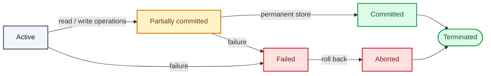

1. **Active.** The first state. All reads and writes happen here. If they run without error the
   transaction moves to partially committed; if an error occurs it moves to failed.
2. **Partially committed.** The transaction has run, and its changes sit in a buffer in main
   memory. If they are made permanent in the database it moves to committed; on any failure it
   moves to failed.
3. **Committed.** The updates are permanent in the database. A committed transaction cannot be
   rolled back. The database has reached a new consistent state.
4. **Failed.** A failure occurred during execution and the transaction cannot continue.
5. **Aborted.** From failed, every change made in the buffer is reversed and the transaction is
   rolled back completely. The database is back to its state before the transaction.
6. **Terminated.** A transaction has terminated once it has either committed or aborted.

### How atomicity and durability are implemented

Both are the job of the DBMS's recovery mechanism. Two ways to build it follow.

### Shadow-copy scheme

- Based on making copies of the database, called shadow copies.
- Assumes only one transaction (T) is active at a time.
- A pointer called **db-pointer** is kept on disk. At any instant it points to the current copy of
  the database.
- A transaction that wants to update the database first makes a complete copy of it.
- All updates go to the new copy; the original, the shadow copy, is left untouched.
- If T has to be aborted, the system deletes the new copy. The old copy was never affected.
- If T succeeds, it commits like this:
    - The OS makes sure every page of the new copy has been written to disk.
    - The database updates db-pointer to point to the new copy.
    - The new copy becomes the current copy.
    - The old copy is deleted.
    - T counts as committed at the moment the updated db-pointer is written to disk.

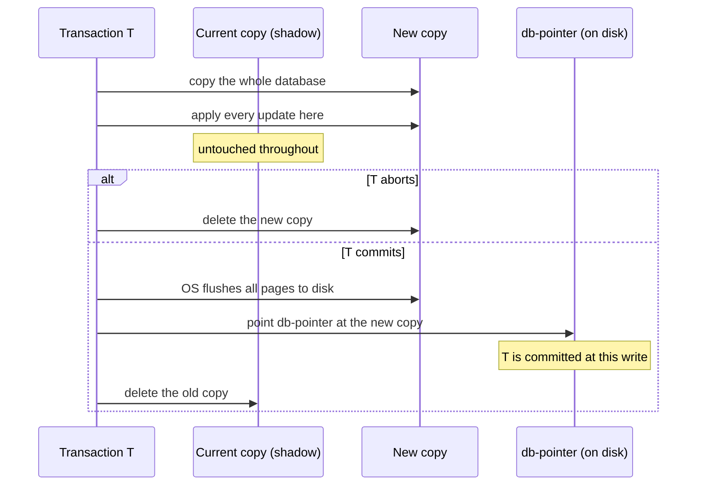

**Atomicity**

- If T fails at any time before db-pointer is updated, the old contents of the database are
  unaffected.
- Aborting T is just deleting the new copy.
- So either all updates are reflected, or none.

**Durability**

- Suppose the system fails at any point before the updated db-pointer is written to disk. On
  restart it reads db-pointer, sees the original database, and none of T's effects are visible.
- T is only considered successful once db-pointer is updated.
- If the system fails after db-pointer is updated, all pages of the new copy were already on disk
  before that. On restart it reads the new copy.

The scheme depends on the write to db-pointer being atomic. Disks provide atomic updates to a whole
block, or at least a sector, so db-pointer is stored at the start of a block and never straddles
two sectors.

It is inefficient: the whole database is copied for every transaction.

### Log-based recovery

- The log is a sequence of records. Each transaction's log is kept in stable storage so the
  database can be recovered from it after a failure.
- Every operation on the database is recorded in the log.
- The log record is written **before** the change is applied to the database.
- **Stable storage** is storage that guarantees atomicity for any single write and lets software be
  written to survive some hardware and power failures.

**1. Deferred (postponed) database modification**

- Guarantees atomicity by recording every modification in the log but deferring all the actual
  writes until the transaction's final action has executed.
- When T completes, the log is used to perform the deferred writes.
- If the system crashes before T completes, or T is aborted, its log records are ignored.
- If T completes, its log records are used to carry out the deferred writes.
- If a failure happens while those writes are in progress, recovery performs a **redo**.

**2. Immediate database modification**

- Modifications are written to the database while T is still active.
- Writes made by an active transaction are called **uncommitted modifications**.
- After a crash or a transaction failure, the system uses the **old value** field of the log
  records to restore the modified values.
- A change is written to the database only after its log record is in stable storage.
- **Checkpoints.** At intervals the system writes a checkpoint to the log, recording the state of
  the database at that moment. On recovery only the log after the last checkpoint needs to be
  considered, which cuts down the redo and undo work.
- **Failure handling:**
    - If the system fails before T completes, or T is aborted, the old-value field is used to
      **undo** T.
    - If T completes and the system then crashes, the new-value field is used to **redo** every T
      that has a commit record in the log.

### BASE properties

BASE stands for:

1. **Basically available:** the system keeps operating despite failures.
2. **Soft state:** data may be temporarily inconsistent while it is changing.
3. **Eventual consistency:** availability comes first, and the data converges to a consistent
   state over time.

ACID puts strong consistency and strict integrity first, which suits critical systems like banking.
BASE is the choice in NoSQL databases and distributed systems that need high availability under
heavy concurrent access and can accept eventual consistency, such as social media and other
large distributed platforms.

---

## Indexing

### Why index?

- An index improves performance by reducing the number of disk accesses a query needs.
- It is a data structure used to find and read rows in a table quickly. Each index entry has two
  fields:

  | Search key (the key) | Data reference (the value) |
  | --- | --- |
  | A copy of the primary key, a candidate key, or another column | A pointer to the disk block where the row with that key is stored |

- It speeds up reads: `SELECT` queries, `WHERE` clauses and the like.
- An index is optional. It is not the primary way to reach a tuple but a secondary one that makes
  access faster.
- The index file is always sorted.

### Indexing methods

#### Primary index (clustering index)

A file can have several indexes on different search keys. If the data file is stored in sequential
order, a primary index is the index whose search key defines that order.

> The term "primary index" is sometimes used to mean an index on the primary key. That usage is
> non-standard and best avoided.

The data file is ordered on some search key, which can be the primary key or a non-key attribute.

<figure>
  
  <figcaption>One index entry per block of the data file.</figcaption>
</figure>

Types of primary index:

1. **Dense index**
    - Has an index record for every search-key value in the data file.
    - Each record holds the search-key value and a pointer to the first data record with that
      value.
    - The other records with the same value are stored right after that first one.
    - It takes more space, since there is an index record, key plus pointer to the record on disk,
      for every value.
2. **Sparse index**
    - Has index records for only some search-key values.
    - It addresses the space cost of a dense index: a range of key values shares one entry holding
      a block address, and to read a row you fetch that block and search within it.

A primary index is built over a data file sorted on either a key or a non-key attribute.

1. **On a key attribute**
    - The data file is sorted on the primary key.
    - The PK is the index's search key.
    - The index is sparse: number of index entries = number of blocks in the data file.
2. **On a non-key attribute**
    - The data file is sorted on a non-key attribute.
    - Number of index entries = number of distinct values of that attribute.
    - This is a dense index, since every distinct value has an entry.
    - Example: a company has hired many employees across departments. A clustering index on
      department groups every employee of a department together.

<figure>
  
  <figcaption>Clustered index on a non-key attribute. The pointers go to blocks, not to records.</figcaption>
</figure>

**Multilevel index**

- An index with two or more levels.
- When a single-level index grows so large that binary search over it is itself slow, split it
  into levels: a small outer index over a larger inner one.

<figure>
  
  <figcaption>A small index in RAM over a larger index on disk, over the data.</figcaption>
</figure>

#### Secondary index (non-clustering index)

- The data file is not sorted on this key, so a primary index is not possible.
- Can be built on a key or a non-key attribute.
- Called secondary because a primary index usually exists already.
- Number of index entries = number of records in the data file.
- It is a dense index.

<figure>
  
  <figcaption>The dense index is sorted on the secondary key; the blocks stay as they are.</figcaption>
</figure>

### Advantages and limitations

- **Advantages**
    - Faster access and retrieval.
    - Less I/O.
- **Limitations**
    - Extra space to store the index.
    - Slower `INSERT`, `DELETE` and `UPDATE`, because the index has to be maintained too.

---

## Clustering (replica sets)

- Clustering combines several servers or instances behind a single database. When one server
  cannot hold the data or serve the requests, you need a cluster. Database clustering, SQL Server
  clustering and SQL clustering are closely related terms, since SQL is the language used to manage
  these databases.
- The same dataset is replicated on different servers.

**Advantages**

1. **Data redundancy:** the same data lives on several servers, so it stays available when a server
   fails.
2. **Load balancing:** work is spread across the servers, so the cluster supports more users and
   absorbs traffic spikes.
3. **High availability:** with load balancing and spare machines, the database stays reachable even
   when a server shuts down.

**How it works.** Requests are split among the machines by a load balancer. If one node fails,
another handles the request, so a single failure does not take the system down.

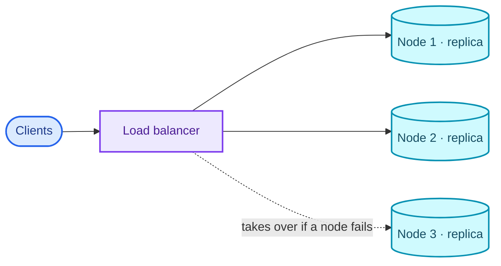

**What is a content delivery network (CDN)?** A network of geographically spread servers, called
points of presence (PoPs) or edge servers, placed to deliver web content from close to the user.
Shorter distance means lower latency. A CDN also improves performance, availability and security,
and absorbs traffic surges without loading a single origin server.

## Partitioning and sharding

- Partitioning splits a big problem into smaller ones. A large database is divided into
  partitions, slices that SQL queries can work on without changing. DDL then runs on the smaller
  slices instead of the whole database, which makes large tables much easier to manage.
- The partitions can be placed on separate servers, for performance and for control over the
  data. This is how relational databases scale horizontally: spread the partitions across
  machines so big data stays manageable.

**Types**

1. **Vertical partitioning**
    - The relation is sliced by columns.
    - Reading a complete tuple means going to several servers.
2. **Horizontal partitioning**
    - The relation is sliced by rows.
    - Independent chunks of tuples are stored on different servers.

**When to partition**

- The dataset has become so large that managing it is a chore.
- There are so many requests that a single server is slow to answer and the system's response time
  climbs.

**Advantages**

- Parallelism
- Availability
- Performance
- Manageability
- Lower cost, since scaling up (vertical scaling) gets expensive.

**Distributed database.** A single logical database spread across several servers in different
locations and connected over a network. It is what you get from applying clustering, partitioning
and sharding.

**Sharding**

- A way to implement horizontal partitioning.
- Instead of keeping all the data on one database instance, you split it up and add a **routing
  layer** that forwards each request to the instance that holds its data.
- **Pros**
    - Scalability
    - Availability
- **Cons**
    - **Complexity:** you have to build the partition mapping and the routing layer, and uneven
      data distribution eventually forces re-sharding.
    - **Poor fit for analytical queries:** the data is spread across instances, so a query has to
      ask every shard and merge the answers (the scatter-gather problem).

<figure>
  
  <figcaption>Horizontal partitioning on customer_id: each shard holds whole rows for some customers.</figcaption>
</figure>

## CAP theorem

- CAP is the key idea behind designing distributed databases.
- It stands for:
    1. **Consistency:** every node sees the same data at the same time. A read returns the most
       recent write, so all users see the same data, whichever node they hit.
    2. **Availability:** the system is always operational and answers every request, even when some
       nodes are down. The answer is not guaranteed to be the most recent data.
    3. **Partition tolerance:** a break in communication between nodes does not bring the system
       down. Records are replicated across nodes and networks, so the system survives dropped or
       delayed messages.

> A distributed system can provide only two of the three properties at the same time: consistency,
> availability and partition tolerance. When a partition happens, you trade consistency against
> availability.

<figure>
  
  <figcaption>Two out of three; the centre is not on offer.</figcaption>
</figure>

1. **CA databases** give consistency and availability but not partition tolerance. In a
   distributed system partitions are inevitable, so CA is not practical there. Relational databases
   such as MySQL and PostgreSQL are usually described as CA, which holds on a single node, not in a
   multi-node setup.
2. **CP databases** give consistency and partition tolerance and give up availability. MongoDB is
   the usual example, used in big-data and distributed applications. Writes go through a primary in
   a primary-secondary setup, which puts consistency ahead of availability, a fit for systems like
   banking.
3. **AP databases** give availability and partition tolerance and give up consistency. Apache
   Cassandra and Amazon DynamoDB stay available during a partition and rely on eventual
   consistency, which suits an application like Facebook where availability matters most.

---

## NoSQL databases

### What are they?

- NoSQL ("not only SQL") databases store data in something other than relational tables. The main
  types are document, key-value, wide-column and graph. They offer flexible schemas and scale to
  large data volumes and user loads.
- They are schema-free.
- Their data structures are not tabular; they are flexible and can change dynamically.
- They handle very large amounts of data.
- Most are open source and scale horizontally.

### Where NoSQL came from

In the late 2000s storage got cheap and NoSQL databases appeared. They optimise for the developer
and for flexibility. As unstructured data grew, defining a schema up front got expensive; NoSQL let
teams store large amounts of unstructured data and iterate on it. As cloud computing took off,
databases like MongoDB offered resilience, distribution and geographic placement for applications.

### Advantages

1. **Flexible schema.** A relational database's schema is fixed in advance, which hurts when data
   is missing or the shape needs to change on the fly.
2. **Horizontal scaling** (scale-out) means adding nodes to share the load. In a relational
   database this is hard, because related data ends up spread across nodes. In a non-relational
   database a collection is self-contained, so it distributes easily, and queries do not need
   complex joins across nodes.

   > Horizontal scaling is done with sharding or replica sets.

3. **High availability.** Data is replicated automatically, restored to a consistent state after a
   failure, and reachable from several servers.
4. **Easy inserts and reads.**

   Why can NoSQL queries be faster than SQL queries? SQL data is usually normalised, so a query
   about one object often joins several tables, and those joins get costly as the tables grow. NoSQL
   data is usually stored the way it will be queried. MongoDB's rule of thumb is to store together
   the data that is read together, which removes most joins and speeds up reads. The cost shows up
   in updates and deletes.

5. **Caching.**
6. It is mostly used for cloud applications.

### When to use NoSQL

- Fast-paced, agile development.
- Storing structured and semi-structured data.
- Very large volumes of data.
- A scale-out architecture.
- Modern patterns such as microservices and real-time streaming.

### Misconceptions

1. **"Relationship data belongs in a relational database."** The misconception is that NoSQL
   cannot handle relationships well. It stores them differently, and often more easily: related
   data can be nested inside a single structure.
2. **"NoSQL has no ACID transactions."** Some do. MongoDB supports ACID transactions.

### Types of NoSQL data model

#### 1. Key-value stores

- Each element is a pair: an attribute name (the key) and its value. Picture a relational table
  with only two columns, such as "state" and "Alaska".
- Uses: shopping carts, user preferences, user profiles.
- Examples: Oracle NoSQL, Amazon DynamoDB, Redis, and MongoDB, which also supports key-value
  storage.
- The value can be anything from a string to a complex object, and it is looked up by its key. It
  works like a dictionary or map, except the storage is persistent and managed by a DBMS.
- Efficient index structures let the database find a value by its key quickly, which suits systems
  that need constant-time lookups.
- Key-value stores fit best for:
    1. real-time random data access, such as user-session attributes in gaming or finance apps;
    2. caching frequently used data or configuration by key;
    3. applications built around simple key-based queries.

<figure>
  
  <figcaption>The value can be a single string or an entire customer object.</figcaption>
</figure>

#### 2. Column-oriented (columnar, C-store, wide-column)

- Data is stored by column: the values of each column are kept together.
- A relational database handles data row by row; a column store handles it column by column. An
  analytics query can read just the columns it needs and skip the rest, which saves memory. A
  column's values usually share a type, so they compress well and read faster. Aggregating a column,
  such as total sales for a year, is quick. Column stores are built for analytics.
- Examples: Cassandra, Redshift, Snowflake.

<figure>
  
  <figcaption>Row-oriented vs column-oriented storage of the same three rows.</figcaption>
</figure>

#### 3. Document stores

- Data is stored in documents similar to JSON (JavaScript Object Notation) objects.
- Each document holds field-value pairs. Values can be strings, numbers, booleans, arrays or
  objects.
- Uses: e-commerce platforms, trading platforms, mobile apps in many industries.
- They support ACID properties, so they suit transactions.
- Examples: MongoDB, CouchDB.

<figure>
  
  <figcaption>The same beers as table rows and as documents.</figcaption>
</figure>

#### 4. Graph stores

- Graph databases focus on the relationships between elements. Elements are nodes (people in a
  social graph, say) and the links between them are stored directly. A relational database only
  implies links through the data.
- They are good at capturing and searching connections, without the overhead of SQL table joins.
- They rarely stand alone; in real business systems they usually sit next to a traditional
  database.
- Uses: fraud detection, social networks, knowledge graphs.

<figure>
  
  <figcaption>Nodes with properties, and relationships stored as first-class edges.</figcaption>
</figure>

### Disadvantages

1. **Data redundancy.** NoSQL databases optimise for queries rather than for avoiding duplication,
   so they can be larger than the SQL equivalent. Cheap storage makes this a small concern, and
   some offer compression.
2. **Updates and deletes are costly.**
3. **No single data model fits every need.** A graph database is great at relationship analysis
   but weak at everyday retrieval such as range queries. Match the database to your use cases; a
   general-purpose one like MongoDB may serve better.
4. **ACID is not supported in general** (MongoDB and a few others are exceptions, as above).
5. **No consistency constraints on data entry.**

### SQL vs NoSQL

| | SQL databases | NoSQL databases |
| --- | --- | --- |
| Storage model | Tables with fixed rows and columns | Document: JSON documents. Key-value: key-value pairs. Wide-column: tables with rows and dynamic columns. Graph: nodes and edges |
| History | Developed in the 1970s, focused on reducing data duplication | Developed in the late 2000s, focused on scaling and on rapid application change driven by agile and DevOps |
| Examples | Oracle, MySQL, Microsoft SQL Server, PostgreSQL | Document: MongoDB, CouchDB. Key-value: Redis, DynamoDB. Wide-column: Cassandra, HBase. Graph: Neo4j, Amazon Neptune |
| Schema | Fixed | Flexible |
| Scaling | Vertical (scale up) | Horizontal (scale out across commodity servers) |
| ACID | Supported | Not supported, except in databases like MongoDB |
| Joins | Usually required | Usually not required |
| Data-to-object mapping | Needs an object-relational mapper (ORM) | Many need no ORM; MongoDB documents map directly to data structures in most popular languages |

---

## Types of database

### 1. Relational databases

Covered in Parts One and Two.

### 2. Object-oriented databases

- The **object-oriented data model** follows the object-oriented programming paradigm: inheritance,
  object identity and encapsulation. Objects are accessed through methods, and structured and
  collection types are supported. Encapsulation and object identity are what set it apart from the
  ER model.
- Complex databases make relationships hard to maintain.
- Data is treated as objects.
- All the data about something is bundled into one object package, so it is available at once.
- **Advantages**
    - Efficient storage and retrieval.
    - Handles complex relationships and many data types.
    - Suits modelling complex real-world problems.
    - Matches how OOP languages work.
- **Disadvantages**
    - The complexity hurts performance of operations such as CRUD.
    - Small community; nowhere near as widely adopted as relational databases.
    - No views, unlike relational databases.
- **Examples:** ObjectDB, GemStone.

### 3. NoSQL databases

Covered above.

### 4. Hierarchical databases

- Suited to data that is a genuine hierarchy, such as employees reporting to departments.
- The schema is a tree. A root links to child branches, and each branch can link to further
  branches.
- Every child has exactly one parent, and a parent can have many children. Each field in a record
  holds a single value. To retrieve data you traverse the tree from the root.
- The structure maps directly onto disk storage, so it doubles as the physical model.
- **Advantage:** simplicity. Traversal is fast, which is why the model suits drop-down menus and
  folder trees like those in Windows. Adding or removing data does not disturb the rest of the
  database, and many languages can read tree structures.
- **Disadvantage:** inflexibility. The one-to-many structure cannot express a child with several
  parents. Sequential search is slow, and the tree layout causes redundancy.
- **Example:** IBM IMS.

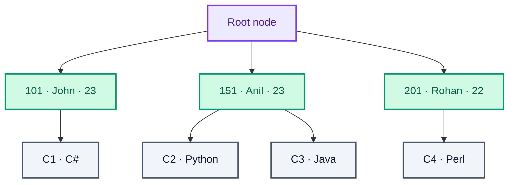

Students (S_id, S_name, S_age) hang off the root, and each student's courses (C_id, C_name) hang
off the student. A course two students take would have to be stored twice.

### 5. Network databases

- An extension of the hierarchical model.
- A child record can have **several parent records**.
- Organised as a graph.
- Can handle complex relationships.
- Tedious to maintain.
- M:N links can make retrieval slow.
- Little community support on the web.
- **Examples:** Integrated Data Store (IDS), IDMS (Integrated Database Management System), Raima
  Database Manager, TurboIMAGE.

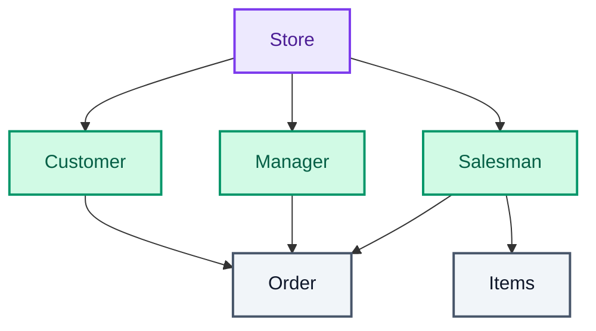

Order has three parents, which a hierarchical database cannot express.

---

## Database scaling patterns

### A case study: a cab-booking app

- A tiny startup.
- About 10 customers.
- One small machine runs the database and stores everything: customers, trips, locations, bookings
  and trip history.
- About 1 booking every 5 minutes.

### The app gets popular, and the problems start

- Bookings climb to 30 a minute.
- The tiny database starts performing badly.
- API latency goes up sharply.
- Transactions hit deadlocks, starvation and frequent failures.
- The app feels sluggish.
- Customers are unhappy.

### Pattern 1: query optimisation and a connection pool

- Cache data that is read often and changes rarely: booking history, payment history, user
  profiles.
- Introduce some deliberate redundancy in the database (or consider NoSQL).
- Use a connection-pool library to reuse database connections.

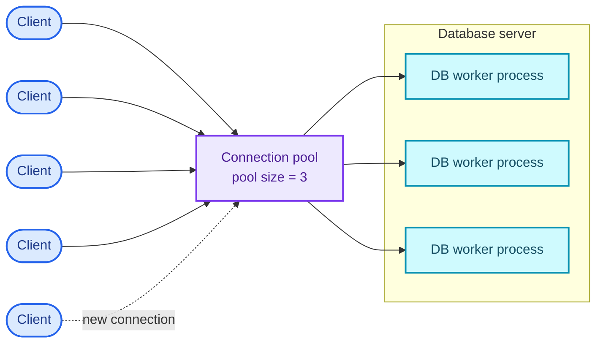

- Many application threads share the same few database connections.
- That is enough for now. The business expands to one more city and reaches about 100 bookings a
  minute.

### Pattern 2: vertical scaling (scale up)

- Upgrade the original machine: 2x the RAM, 3x the SSD, and so on.
- Scaling up is affordable only up to a point.
- Past that, cost rises steeply with every step.
- That is enough for now. The business grows to 3 more cities and 300 bookings a minute.

### Pattern 3: command query responsibility segregation (CQRS)

- The big machine can no longer handle all the reads and writes.
- Separate reads and writes onto different physical machines.
- Add 2 more machines as replicas of the primary.
- Send every read query to the replicas.
- Send every write query to the primary.

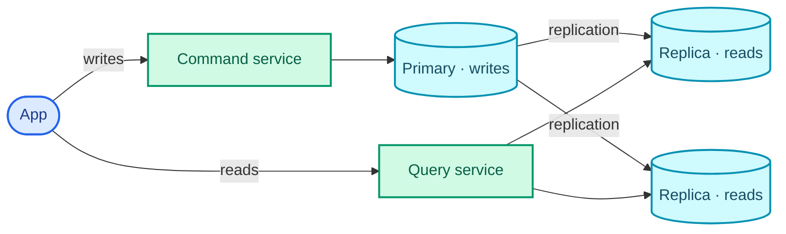

- The business grows to 2 more cities.
- The primary can no longer handle all the writes.
- Replication lag between primary and replicas starts to show in the user experience.

### Pattern 4: multi-primary replication

- Why not send writes to the replicas too?
- Every machine acts as both primary and replica.
- The multi-primary setup forms a logical circular ring.
- Write to any node.
- Read from whichever node answers the broadcast first.

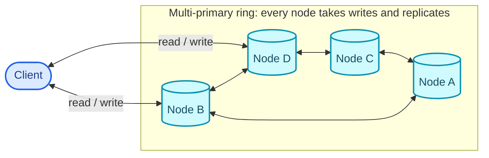

- The business expands to 5 more cities, about 50 requests a second, and the system is in pain
  again.

### Pattern 5: partitioning data by functionality

- Move the location tables into a separate database schema.
- Put that database on its own machines, with a primary-replica or multi-primary setup.
- Different databases host data grouped by function.
- The backend (application layer) now has to join results across them.
- Plans are made to expand to another country.

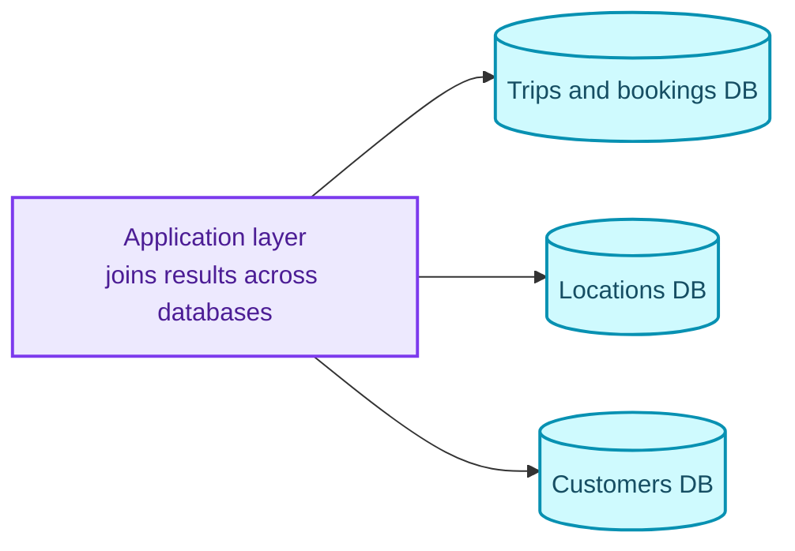

### Pattern 6: horizontal scaling (scale out)

- Sharding: many shards.
- Allocate 50 machines, all with the same schema, each holding part of the data.
- Keep related data together on the same shard (data locality).
- Each shard can have its own replicas, for failure recovery.
- Sharding is hard to apply. No pain, no gain.

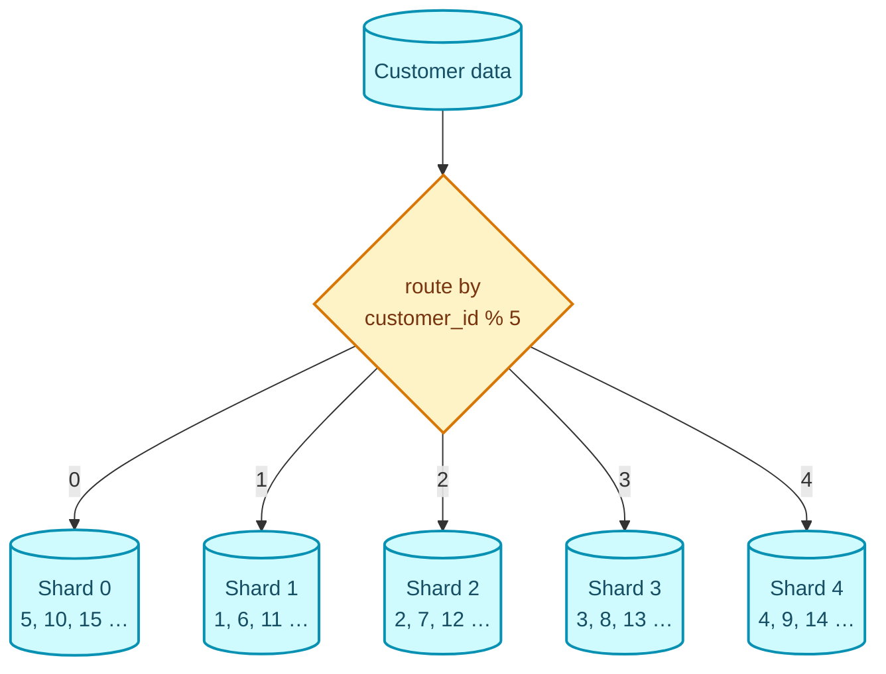

- The business now spans continents.

### Pattern 7: partitioning by data centre

- Requests crossing continents have high latency.
- Distribute traffic across data centres instead.
- Put data centres on each continent.
- Turn on cross-data-centre replication, which also gives disaster recovery.
- The system stays available.
- Now plan for the IPO. :p

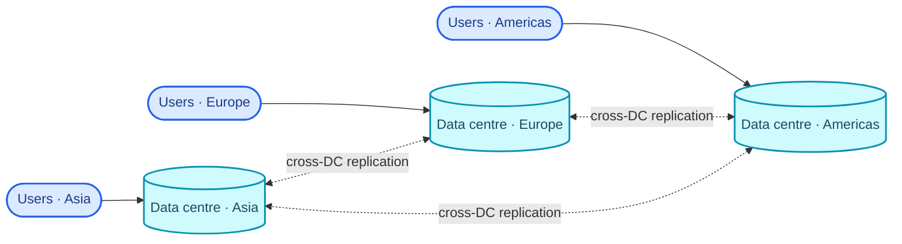

## Master-slave architecture

- Master-slave is a general way to handle I/O when there are more requests than a single database
  server can serve efficiently.

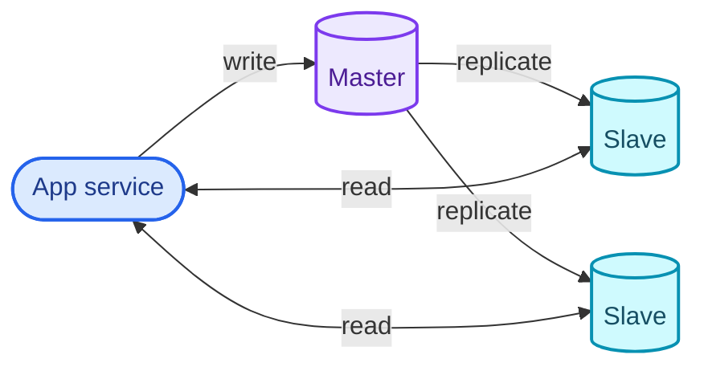

- It is Pattern 3 above, command query responsibility segregation.
- The true, latest data is kept on the master, so writes go there. Reads are served only by the
  slaves. This protects the site's reliability and availability and lowers latency. If a busy site
  had only a master, that one database would be flooded with reads and writes and the whole site
  would slow down for everyone.
- Database replication copies data from the master to the slaves. It can be synchronous or
  asynchronous, depending on what the system needs.

---

That closes the series. Part One went from data to a schema, Part Two from a schema to queries, and
this part from one machine that works to many machines that keep working.
