These are my computer-networking notes, cleaned up into three posts. This one covers the basics
and the bottom two layers: how devices are wired together and how a frame gets from one to the
next. [Part Two](/blogs/networking-network-and-transport-layers/) is the network and transport
layers (IP, routing, TCP and UDP), and
[Part Three](/blogs/networking-application-layer-dns-dhcp/) is the layers above them, DNS, DHCP
and the everyday questions and commands.

> A **computer network** is a collection of interconnected devices that exchange data and share
> resources.

## Basics

### Types of network topology

A topology is the shape of the connections between devices.

#### 1. Point to point

Two devices joined by one dedicated link.

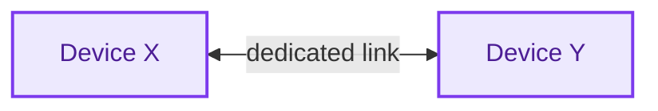

- **Advantages:** efficient, because devices talk directly; more secure, because no intermediate
  device can be compromised; and simple to configure, with almost nothing to manage.
- **Disadvantages:** does not scale, since every new device needs its own links, which is slow and
  expensive to add; each device has to be maintained separately; and there is no redundancy, so a
  failed link or an offline device breaks the connection.

#### 2. Bus

Every device hangs off one shared backbone cable, with a terminator at each end.

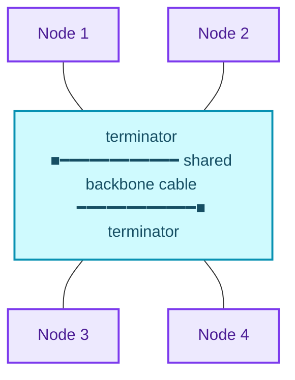

- **Advantages:** the simplest way to connect computers or peripherals in a line. It works well for
  a small network, needs less cable than a star, and devices can be added or removed without
  affecting the others. It is the cheapest topology compared with mesh and star, and it is easy to
  understand and to extend by joining two cables.
- **Disadvantages:** not suited to large networks. When the whole network goes down the fault is
  hard to find, and troubleshooting a single device is hard. Both ends of the backbone need
  terminators, every added device slows the network, and packet loss is high. It is slower than
  other topologies, and if the backbone is damaged the whole network fails or splits in two.
- Ethernet LANs on a bus share the medium through MAC (media access control) protocols such as
  TDMA, pure ALOHA, slotted ALOHA and CDMA, covered in the data-link section below.

#### 3. Ring

Each device connects to the next, and the last back to the first. Data travels one way round.

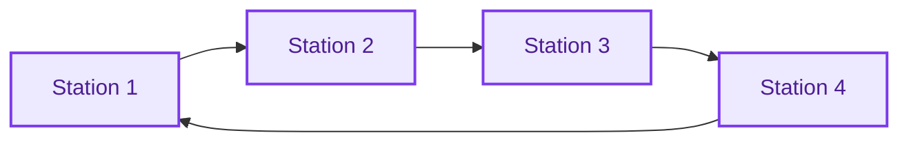

- **Advantages:** data flows in one direction, so collisions are rare. Workstations can be added
  without hurting performance. Every station has equal access without a controlling server. It is
  cheap to install and extend. Under heavy traffic it outperforms a bus, because access is by
  token passing: only the station holding the token transmits. It is easy to manage and orderly.
- **Disadvantages:** in a one-directional ring the token has to pass through every node, so one
  station going down takes the whole network down. It is slower than a bus under light load and
  more expensive. Adding or removing a node is difficult and disrupts the network, and the ring is
  hard to troubleshoot. Every computer must be on for all of them to communicate, everything
  depends on one cable, and it does not scale.

#### 4. Star

Every device connects to a central hub or switch.

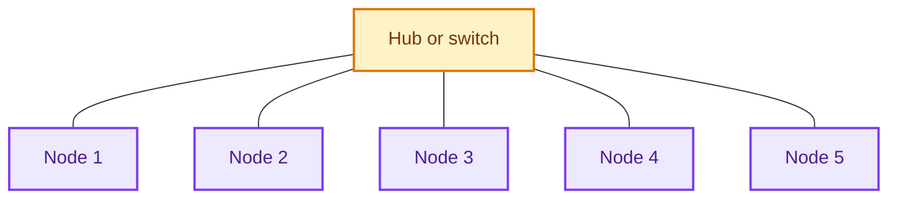

- **Advantages:** reliable, since one failed cable or device leaves the rest working. No collisions
  between devices on their own links, so it performs well. Each device needs only one port and one
  link to the hub, so N devices need N cables; it is easy to set up and robust. Faults are easy to
  find because each link is identifiable, and devices can be connected or removed without
  disrupting the network.
- **Disadvantages:** needs more cable than a bus. The central device is a single point of failure:
  if the hub or switch goes down, nothing attached to it can communicate. That central hardware
  adds cost, needs more resources and regular maintenance, and caps the network's performance.
- Ethernet LAN protocols such as CSMA/CD (carrier sense multiple access with collision detection)
  are used here.
- A star forms a local area network (LAN).

#### 5. Mesh

Devices link directly to many, or all, of the others.

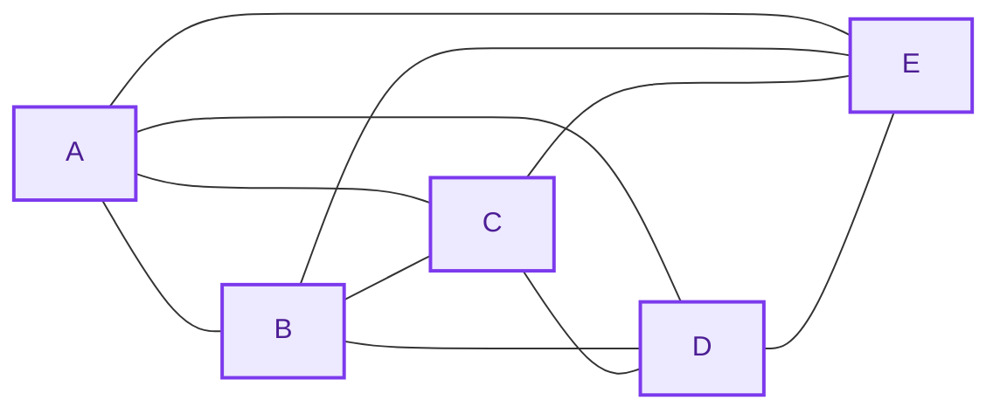

- **Types:**
    1. **Full mesh:** every node connects to every other, so each of the n nodes has n − 1 links and
       the network needs **n(n − 1)/2** links in total (10 for the five nodes above). Very
       redundant, expensive, and typical of network backbones.
    2. **Partial mesh:** not every pair is connected. More practical and cheaper; a common design
       uses a full-mesh backbone with the outer networks attached by partial mesh.
- **Advantages:** one failed device does not break the network. Each link is a dedicated
  point-to-point connection, so there is no shared traffic problem. Faults are easy to locate.
  There are many paths to every destination, so it is highly redundant and keeps delivering data
  through failures. Links are private, so it is secure. New devices do not disrupt traffic, and
  there is no central authority.
- **Disadvantages:** costlier than star, bus or point to point, and very hard to install. Every
  node must stay powered and share the load, so power use is higher. It is complex, many links are
  redundant, each node adds cost, and maintenance is demanding.
- Protocols used include AHCP (Ad Hoc Configuration Protocol) and DHCP.

#### 6. Tree

A combination of bus and star: star networks hanging off a hierarchy of hubs.

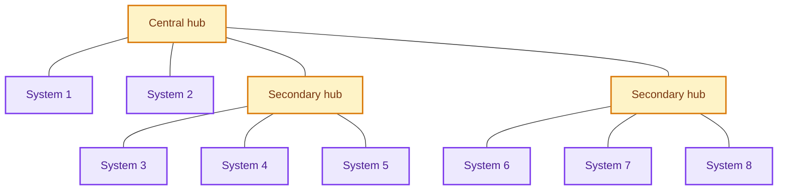

#### 7. Hybrid

Two or more topologies joined together, here a star linked to a ring.

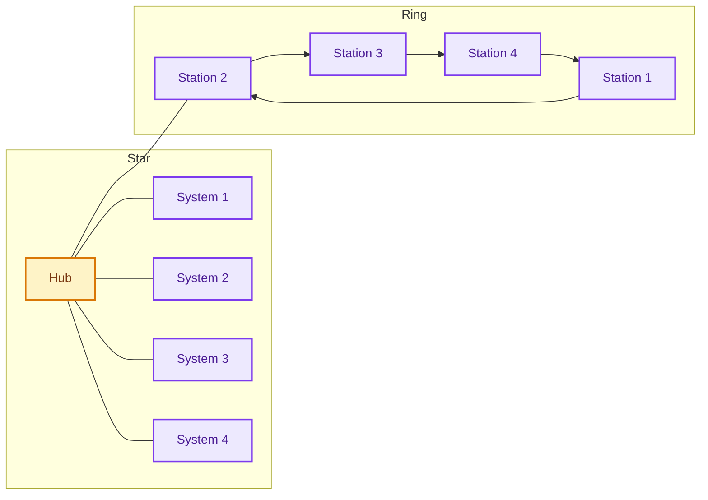

---

### Types of network

1. **PAN (personal area network)**
    - Connects a person's own electronic devices. It can be wired, or wireless (WPAN). It is easy to
      use, portable and secure, but its range is short, data transfer is slow, and radio signals
      can interfere with it.
    - Range: a few metres, typically up to about 10 m.
    - Bluetooth and infrared (IR) are the common examples.
2. **LAN (local area network)**
    - Connects computers and workstations in a small area. It is fast, private, and works over
      several kinds of transmission medium, but it costs money to set up, is limited in size, and
      carries privacy and data-security risks.
    - Much faster than a WAN, around 100 Mbps.
    - Range: a single building up to a small area such as a campus.
    - Example: in an office, employees' computers join a LAN to share printers and exchange
      information inside the building.
3. **MAN (metropolitan area network)**
    - Connects several LANs across a city, providing high-speed data and internet access, usually
      over optical fibre. It allows resource sharing, fast connectivity and central management, but
      faces security threats, scaling limits and high cost. A MAN can be wired or wireless, serve
      many industries, and connect to other networks.
    - Range: a city or metropolitan area, several kilometres across.
    - Examples: a network linking the buildings of a large university, or a cable TV network.
4. **WAN (wide area network)**
    - Covers a large geographical area and connects LANs and MANs. It has broad reach, high
      capacity, uses public carriers and shares resources, but suffers congestion, low fault
      tolerance, noise and errors, and is slower than a LAN.
    - Range: across cities, countries and continents.
    - Example: the internet, which connects networks across the globe.

---

## The OSI and TCP/IP models

The rest of the series walks the layers from the bottom up. The OSI model has seven layers;
TCP/IP, the model the internet actually runs on, folds them into four or five. The notes follow
OSI's names and put session, presentation and application together at the top, as TCP/IP does.

| OSI layer | TCP/IP layer | Unit of data | Addresses by | Typical devices and protocols |
| --- | --- | --- | --- | --- |
| 7. Application | Application | Data / message | – | HTTP, DNS, DHCP, SMTP, FTP, SSH |
| 6. Presentation | Application | Data | – | TLS/SSL, encoding, compression |
| 5. Session | Application | Data | – | RPC, session management |
| 4. Transport | Transport | Segment (TCP) / datagram (UDP) | Port number | TCP, UDP |
| 3. Network | Internet | Packet | IP address | Router, IP, ICMP, ARP, OSPF, BGP |
| 2. Data link | Network access (link) | Frame | MAC address | Switch, bridge, NIC, Ethernet |
| 1. Physical | Network access (link) | Bit | – | Hub, repeater, cables |

## 1. The physical layer

### Network devices

#### 1. Repeater

- Works at the physical layer.
- A two-port device that amplifies and regenerates a weak or corrupted signal. Its job is to extend
  how far a signal travels on the same network before it becomes too weak: it copies the signal bit
  by bit and sends it on at full strength.

<figure>
  
  <figcaption>A wired repeater: signal in on one port, regenerated out of the other.</figcaption>
</figure>

<figure>
  
  <figcaption>The same idea for Wi-Fi: a wireless repeater extends a network's range.</figcaption>
</figure>

#### 2. Hub

- Works at the physical layer.
- A multi-port repeater at the centre of a star topology. It connects the cables from several
  devices and sends every incoming packet to every port, with no filtering. All its devices
  therefore share one collision domain.
- A **collision domain** is a part of the network where devices compete for the medium, so two
  transmitting at once collide. Every device in it has to listen to every message whatever its
  destination, and in half-duplex mode they wait and retransmit. A hub has no intelligence to route
  packets, so it is inefficient and wasteful.
- Types of hub:
    - **Active hub:** acts as a repeater and a wiring centre, and boosts the signal.
    - **Passive hub:** relays signals without cleaning or boosting them.
    - **Intelligent hub:** adds remote management, flexible data rates, traffic monitoring and
      per-port configuration.

<figure>
  
  <figcaption>A 16-port hub.</figcaption>
</figure>

#### 3. Bridge

- Works at the data-link layer.
- A repeater that can also filter traffic by MAC address. It is a two-port device that connects two
  LANs running the same protocol.
- Types:
    - **Transparent bridges:** the stations do not know the bridge exists. They work through
      *bridge forwarding* and *bridge learning*: the bridge learns which MAC addresses sit on which
      side and forwards frames only when needed.
    - **Source routing bridges:** the sending station decides the route, and each frame carries
      the route to follow. Stations find routes by sending *discovery frames* that spread through
      the network.

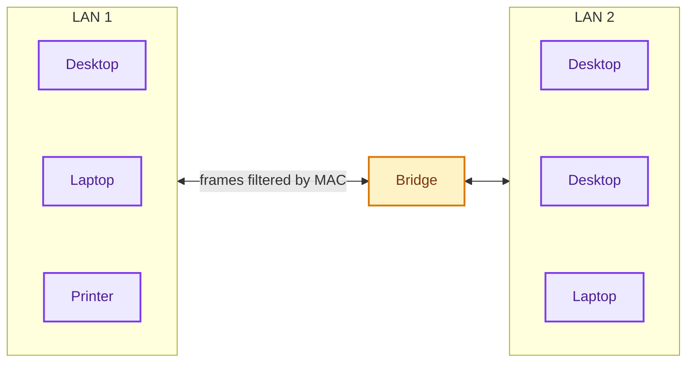

<figure>
  
  <figcaption>A small multi-port box of the kind that bridges or switches a few devices.</figcaption>
</figure>

#### 4. Switch

- Works at the data-link layer.
- A multi-port bridge with buffers. It checks frames for errors and forwards only good frames, and
  only to the port the destination is on. Each port is its own collision domain, but all ports stay
  in the same broadcast domain.
- A **broadcast domain** is the logical area in which a broadcast reaches every device. Broadcasts
  there cause congestion and eat everyone's bandwidth, often called LAN congestion.
- Types of switch:

  | Type | Description |
  | --- | --- |
  | Unmanaged | Plug and play, no configuration. For small networks or to extend a larger one. |
  | Managed | Configurable: VLANs, QoS, link aggregation. For larger networks with central management. |
  | Smart | Some managed features, easier to set up. For small to medium networks. |
  | Layer 2 | Works at the data-link layer, forwarding within one network segment. |
  | Layer 3 | Works at the network layer, routing between segments. For larger networks. |
  | PoE | Power over Ethernet: supplies power to devices over the data cable. |
  | Gigabit | Supports gigabit Ethernet speeds. |
  | Rack-mounted | Built for server racks, in data centres and large networks. |
  | Desktop | Small, for desks and small offices. |
  | Modular | Takes add-on modules, so it can be expanded or customised. For large networks and data centres. |

<figure>
  
  <figcaption>A 48-port rack switch.</figcaption>
</figure>

#### 5. Router

- A network-layer device that forwards packets by IP address. It connects LANs and WANs and decides
  where each packet goes using a routing table that it keeps up to date. A router separates
  broadcast domains.

| Device | Separates collision domains | Separates broadcast domains |
| --- | --- | --- |
| Hub / repeater | No | No |
| Switch / bridge | Yes | No |
| Router | Yes | Yes |

How the devices combine in a network:

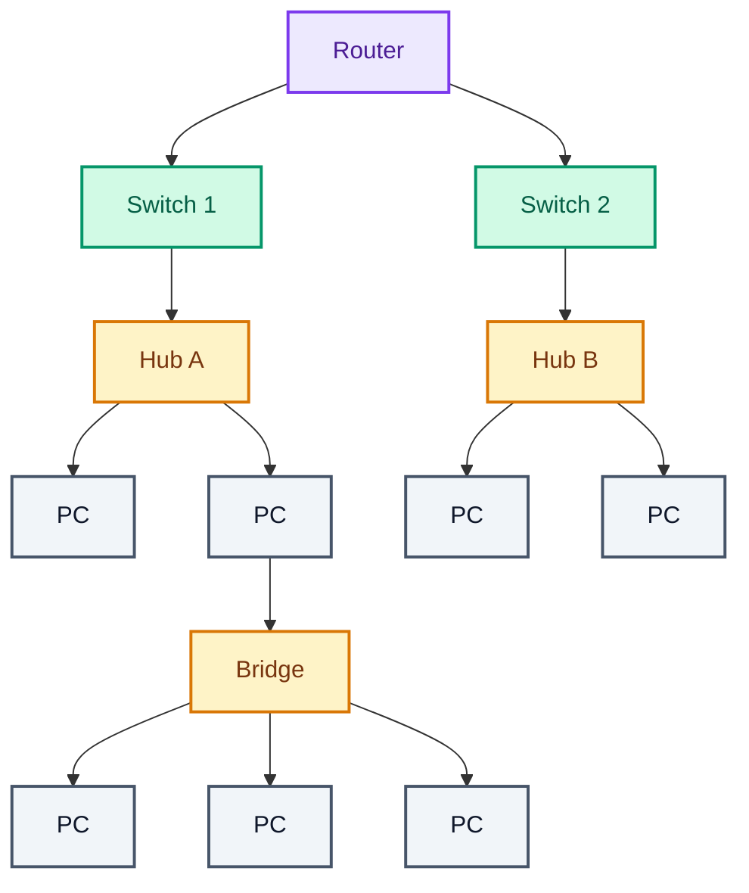

<figure>
  
  <figcaption>A home wireless router: a router, a switch and a Wi-Fi access point in one box.</figcaption>
</figure>

#### 6. Gateway

- Works at the network layer (layer 3) or the application layer (layer 7).
- At layer 3 it connects two networks that use **different networking models**. It acts as a
  messenger that interprets and passes data between the systems, which is why it is also called a
  **protocol converter**. Gateways are usually more complex than switches or routers.
- At layer 7 it is an entry or exit point that converts between applications or services using
  different protocols or data formats. These are called **application gateways** or **proxy
  servers**.

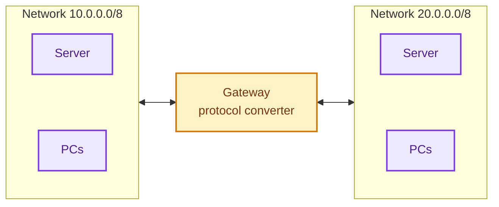

<figure>
  
  <figcaption>A gateway appliance.</figcaption>
</figure>

#### 7. Brouter

- A bridging router: it combines a bridge and a router. It can route packets between networks and
  filter LAN traffic, at either the data-link layer or the network layer.

#### 8. NIC

- The network interface card is a layer 2 (data link) adapter that connects a computer to the
  network. It carries a unique ID, the **MAC address**, and a cable interface (an Ethernet RJ-45
  port). It lets the computer join a LAN and talk to the router or modem at the physical and
  data-link layers.

<figure>
  
  <figcaption>A PCI network interface card.</figcaption>
</figure>

---

### Transmission media

A transmission medium is the physical path between the transmitter and the receiver.

#### 1. Guided media

Also called wired or bounded media: fast and secure over shorter distances.

1. **Twisted pair cable**, the most widely used medium.
    1. **UTP (unshielded twisted pair):** two insulated copper wires twisted together. Cheap, easy
       to install and fast, but picks up external interference. Used in telephony and LANs.

       <figure>
         
         <figcaption>UTP: four twisted pairs, no shielding.</figcaption>
       </figure>

    2. **STP (shielded twisted pair):** adds a copper braid or foil shield that blocks external
       interference. Performs better at higher data rates and eliminates crosstalk, but is harder
       to make and install, more expensive and bulkier. Used where extra shielding is needed,
       including cold climates.

       <figure>
         
         <figcaption>STP: each pair wrapped in foil.</figcaption>
       </figure>

2. **Coaxial cable:** a centre conductor and an outer conductor sharing one axis, inside a plastic
   jacket. High bandwidth and good noise immunity. Used for cable TV, computer networks such as
   early Ethernet, and radio-frequency transmission. Easy to install and extend, but one failed
   cable can disrupt the network. From the outside in: protective plastic jacket, braided metal
   conductor (the shield), insulator, copper centre conductor.

   <figure>
     
     <figcaption>Coaxial cable, cut away.</figcaption>
   </figure>

   <figure>
     
     <figcaption>The four layers of a coaxial cable.</figcaption>
   </figure>

3. **Optical fibre cable:** a core and cladding of glass or plastic that carry light. Very high
   capacity and bandwidth, light, low attenuation, immune to electromagnetic interference and
   resistant to corrosion. On the other hand it is hard to install and maintain, expensive and
   fragile. Used in medical instruments, aerospace data links, internet backbone cables, and
   industrial and automotive lighting. From the outside in: outer jacket, strength member, coating,
   cladding, core.

   <figure>
     
     <figcaption>A multi-fibre cable, cut open.</figcaption>
   </figure>

   <figure>
     
     <figcaption>The layers of a single optical fibre.</figcaption>
   </figure>

#### 2. Unguided media

Also called wireless or unbounded media: electromagnetic signals sent through the air. They cover
longer distances but are less secure than wired links.

1. **Radio waves:** easy to generate and able to pass through buildings. Used by AM and FM radio and
   cordless phones, split into terrestrial and satellite. Frequency range 3 kHz to 1 GHz. Wi-Fi and
   Bluetooth are examples.
2. **Microwaves:** line-of-sight transmission, so the sending and receiving antennas must be
   aligned, and the distance a signal reaches grows with antenna height. Frequency range 1 GHz to
   300 GHz. Used mainly for mobile phones and television distribution.
3. **Infrared:** short-range only. It cannot pass through obstacles, which also keeps devices from
   interfering with each other. Frequency range 300 GHz to 400 THz. Used by TV remotes, wireless
   mice and keyboards, and printers.

---

### Transmission modes

Also called communication modes: which way data can flow between two devices.

**1. Simplex.** One direction only: one device transmits, the other only receives. Cheap, reliable,
and needs no coordination, but there is no way to reply or confirm the data.

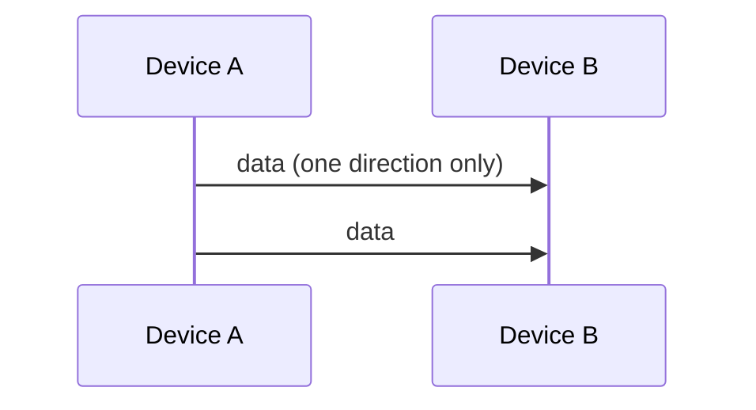

**2. Half duplex.** Both devices can transmit and receive, but not at the same time. It allows
two-way communication and is more efficient than simplex, but it is less reliable, adds delay, and
the devices have to take turns.

Channel capacity = bandwidth × propagation delay

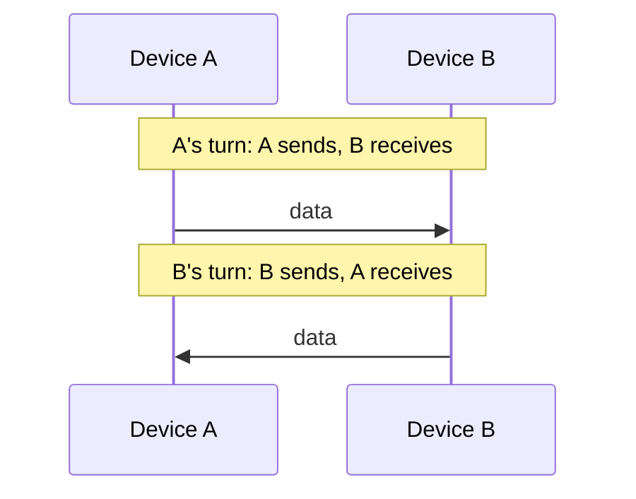

**3. Full duplex.** Both sides transmit and receive at the same time, which suits real-time
applications. The most efficient and most reliable, but also the most expensive and complex, and
not every kind of communication needs it.

Channel capacity = 2 × bandwidth × propagation delay

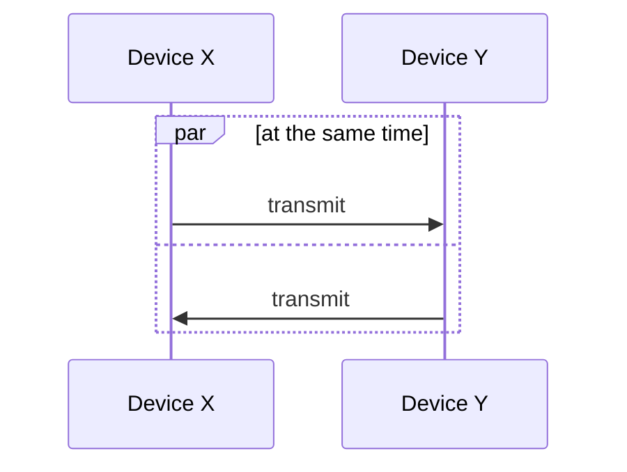

### Functions of the physical layer

1. **Interface:** defines the interface between devices and the transmission medium.
2. **Representation of bits:** data here is a stream of bits, which must be encoded into signals.
   The layer defines the encoding, i.e. how 0s and 1s become signals.
3. **Data rate:** defines the transmission rate in bits per second.
4. **Transmission mode:** defines the direction of transmission: simplex, half duplex or full
   duplex.
5. **Line configuration:** connects devices to the medium point to point or multipoint.
6. **Topology:** devices are connected in some topology: mesh, star, bus, ring and so on.

### Design issues in the physical layer

- The physical layer is about transmitting raw bits over a channel.
- The design issues are the electrical, mechanical and timing interfaces, and the physical medium
  below the layer.
- The core issue is making sure that a 1 bit sent from one side arrives as a 1 bit on the other,
  not as a 0.

### Line configuration

A link is the path that carries data from one device to another. There are two kinds of
connection:

1. **Point-to-point:** a dedicated link between two devices, over wire, cable, microwave or
   satellite. Simple to set up and understand, so it is the conventional choice. Example: a remote
   control and a television.
2. **Multipoint (multidrop):** two or more devices share one link, the *shared channel*. The link
   is shared in one of two ways:
    1. **Spatial sharing:** several devices use the link at the same time.
    2. **Temporal (time) sharing:** devices take turns.

---

## 2. The data-link layer

### Services the data-link layer provides

The data-link layer serves the network layer above it. It carries frames from the sending
machine's data-link layer to the receiving machine's network layer. The *actual* path goes down
through the physical layer and across the medium; the network layer sees a *virtual* path straight
across to its peer, provided by the data-link protocol.

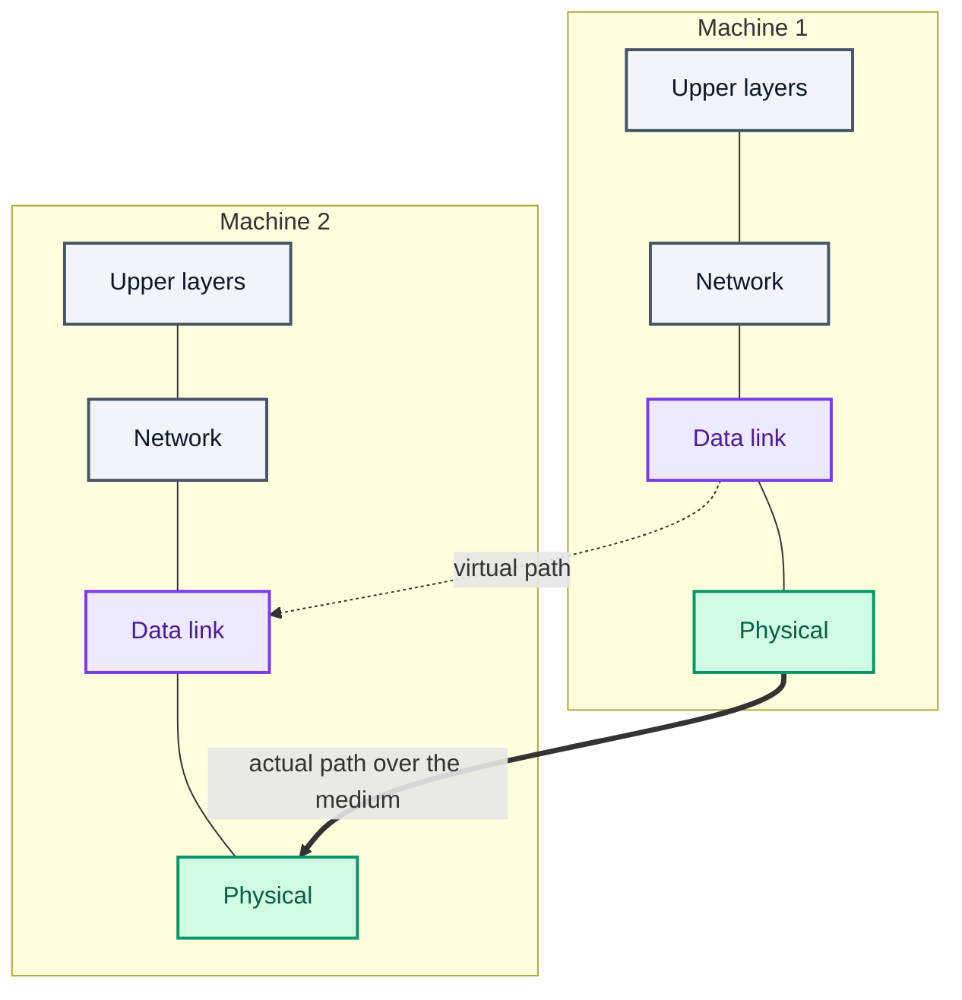

Types of service:

1. **Unacknowledged connectionless:** datagram-style delivery with no error or flow control. The
   source sends independent frames without acknowledgements, sets up no connection before or after,
   and makes no attempt to detect or recover lost frames. Ethernet works this way.
2. **Acknowledged connectionless:** every frame is acknowledged individually, so the sender knows
   what arrived. Reliable, and used on unreliable channels such as wireless and Wi-Fi.
3. **Acknowledged connection-oriented:** a connection is set up before data moves, and every frame
   is numbered, so delivery is guaranteed and in order.

### Sub-layers of the data-link layer

1. **Logical link control (LLC):** handles multiplexing and the flow of data between applications
   and services, and provides error messages and acknowledgements.
2. **Media access control (MAC):** addresses frames and controls access to the physical medium.

### Functions of the data-link layer

#### 1. Framing

- A **frame** is the unit of transmission at the data-link layer: a distinguishable block of bits
  that carries error-checking codes, so delivery is organised and controlled.
- **Problems in framing:**
    - **Detecting the start of a frame:** stations look for a special bit sequence, the start frame
      delimiter (SFD), that marks where a frame begins.
    - **Detecting the end of a frame:** knowing when to stop reading.
    - **Handling errors:** noise and transmission errors corrupt frames, so error detection such as
      the cyclic redundancy check (CRC) is needed to verify them.
    - **Framing overhead:** headers and trailers use bandwidth that could carry data, which matters
      most for small frames.
    - **Framing incompatibility:** devices and protocols that frame data differently can misread
      each other's frames.
    - **Framing synchronisation:** stations must agree on frame boundaries and timing to avoid
      collisions, which is hard in complex networks with varying load.
    - **Framing efficiency:** good framing keeps overhead low and bandwidth and latency good.
- **Types of framing:**
    1. **Fixed size:** the frame's length is its delimiter, so no explicit boundaries are needed.
       Small payloads waste space (internal fragmentation), which padding fills.
    2. **Variable size:** the end of one frame and the start of the next have to be marked. Two
       ways:
        1. **Length field:** a field states the frame's length. Used by Ethernet (802.3). The risk
           is that the length field itself gets corrupted.
        2. **End delimiter (ED):** a bit pattern marks the end of the frame. Used by Token Ring. The
           risk is that the pattern also appears in the data, which is solved by stuffing:
            1. **Character (byte) stuffing**, for frames made of characters. If the data contains
               the ED, an extra byte is stuffed in to mark it as data.
                - Say ED = `$`. A `$` in the data is escaped as `\O$`.
                - If the data contains `\O$`, it becomes `\O\O\O$`: the `$` is escaped with `\O`,
                  and the `\O` is escaped with another `\O`.
                - It is costly and obsolete.
            2. **Bit stuffing:**
                - Say ED = `01111` and the data is `01111`.
                - The sender stuffs a bit to break the pattern: after `0111` it inserts a `0`, so
                  the data goes out as `011101`.
                - The receiver sees `011101`, removes the stuffed `0`, and reads the data.
                - Example: data `011100011110` with ED `0111`. After every `011` the sender inserts
                  a `0`, giving `011`**`0`**`100011`**`0`**`11`**`0`**`0`, i.e. `011010001101100`.

#### 2. Addressing

- The data-link layer puts the source and destination **MAC (physical) addresses** in each frame's
  header, for node-to-node delivery.
- A MAC address is **48 bits (6 bytes)**, written like `00:1A:2B:3C:4D:5E` or
  `00-1A-2B-3C-4D-5E`. The first half identifies the manufacturer, the second half the device.
- The IEEE keeps them unique by assigning blocks of addresses to manufacturers.

#### 3. Error control

Error control makes sure frames arrive correctly: it detects lost or corrupted frames and has them
retransmitted, through **automatic repeat request (ARQ)**.

##### Error detection

**Types of error.** The same 8 bits sent, three ways to receive them:

| Error | Sent | Received | What changed |
| --- | --- | --- | --- |
| Single-bit | `10110011` | `10110111` | one bit (bit 6, 0 → 1) |
| Multiple-bit | `10110011` | `10100111` | two separate bits (bit 4, 1 → 0; bit 6, 0 → 1) |
| Burst | `10110011` | `11000111` | a run of consecutive bits (bits 2 to 4) |

**Error-detection methods:**

**1. Simple parity check (even parity).**

- If the block has an odd number of 1s, append a 1; if even, append a 0.
- That makes the total number of 1s even, hence *even* parity.
- It cannot detect an even number of flipped bits, since those leave the count even.

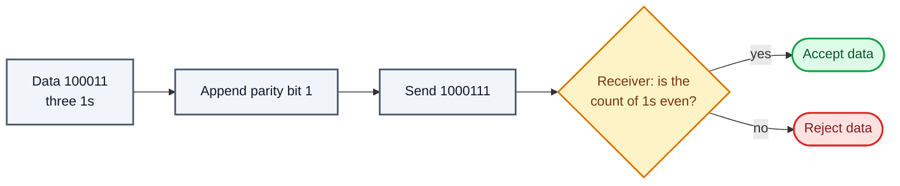

**2. Two-dimensional parity.** Parity bits are computed for each row, as in a simple parity check,
and also for each column. Both go with the data, and the receiver recomputes and compares them.

For the data `10011001 11100010 00100100 10000100`, arranged as rows:

| Row | Data | Row parity |
| --- | --- | --- |
| 1 | `10011001` | `0` |
| 2 | `11100010` | `0` |
| 3 | `00100100` | `0` |
| 4 | `10000100` | `0` |
| Column parity | `11011011` | `0` |

Data sent: `100110010 111000100 001001000 100001000 110110110`.

**3. Checksum.**

Sender:

- Divide the data into *k* segments of *m* bits.
- Add the segments using one's-complement arithmetic (carries wrap around and are added back in).
- Complement the sum: that is the checksum, sent with the data.

Receiver:

- Add all received segments, checksum included, in one's-complement arithmetic.
- Complement the sum.
- If the result is zero, accept the data; otherwise discard it.

Worked through with k = 4, m = 8 and the same data as above:

| Step | Sender | Receiver |
| --- | --- | --- |
| Segments | `10011001` `11100010` `00100100` `10000100` | the same four, plus checksum `11011010` |
| Sum with carries wrapped | `00100101` | `11111111` |
| Complement | `11011010` = checksum | `00000000` |
| Result | send data + checksum | zero, so accept |

**4. Cyclic redundancy check (CRC).** The sender appends *n* zeros to the data, where the divisor
(generator) has *n* + 1 bits, and divides by the generator using XOR (modulo-2) division. The
*n*-bit remainder is the CRC, and it replaces the zeros. The receiver divides what it gets by the
same generator; a zero remainder means no error was detected.

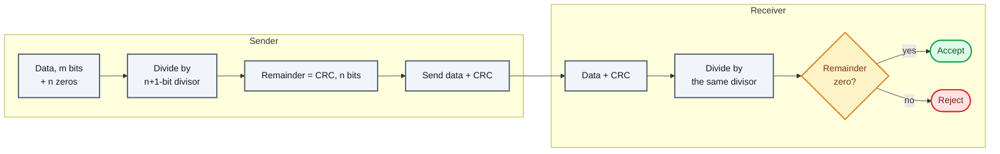

Worked example: message `1010000`, generator x³ + 1 = `1001` (4 bits, so append 3 zeros).

| Step | Bits under the divisor | XOR with `1001` |
| --- | --- | --- |
| 1 | `1010` | `0011` |
| 2 | `1100` | `0101` |
| 3 | `1010` | `0011` |
| 4 | `1100` | `0101` |
| 5 | `1010` | `0011` |
| Remainder | | `011` |

The sender transmits `1010000` + `011` = `1010000011`. The receiver divides `1010000011` by `1001`
and gets remainder `000`, so it accepts the data.

##### Error correction

Error correction lets the receiver fix errors itself, without a reverse channel to ask for a
retransmission. Techniques:

1. **Hamming distance:** to correct *t* errors, codewords must differ by a minimum Hamming distance
   of **2t + 1**. That takes many redundant bits, so it is rarely used.
2. **XOR:** split a packet into *N* chunks and also send the XOR of all of them, *N* + 1 chunks in
   total. If any one chunk is lost or corrupted, the receiver rebuilds it from the rest. With
   N = 4, that is 25% extra data, and one lost chunk out of four can be recovered.
3. **Chunk interleaving:** data is cut into chunks written row by row, but packets are made by
   reading the chunks column by column, so every packet carries one chunk from several original
   packets. Lose a packet and each original packet is missing just one small chunk, which
   multimedia can usually tolerate.

##### Techniques for error control

**1. Stop-and-wait ARQ.**

Useful terms:

> - **Propagation delay:** the time a packet takes to physically travel from one router to the
>   next.
> - **Round-trip time (RTT):** the time for a packet to reach the receiver plus the time for its
>   acknowledgement to come back.
> - **Timeout (TO):** usually set to 2 × RTT.
> - **Time to live (TTL):** the notes give 2 × timeout, with a maximum of 255. In IP itself, TTL is
>   an 8-bit hop count (maximum 255) that each router decrements, not a time.

Characteristics:

- The link is used as half duplex.
- It is the sliding-window protocol with a window size of 1.
- However many packets the sender has, it needs only two sequence numbers, 0 and 1.

How it works:

1. Sender A sends a frame with sequence number 0.
2. Receiver B replies with acknowledgement 1, the sequence number of the frame it expects next.

With a one-bit sequence number, sender and receiver each need a buffer for just one frame. When a
frame or an acknowledgement is lost, the sender's timeout fires and it resends; the sequence number
lets the receiver spot and discard a duplicate.

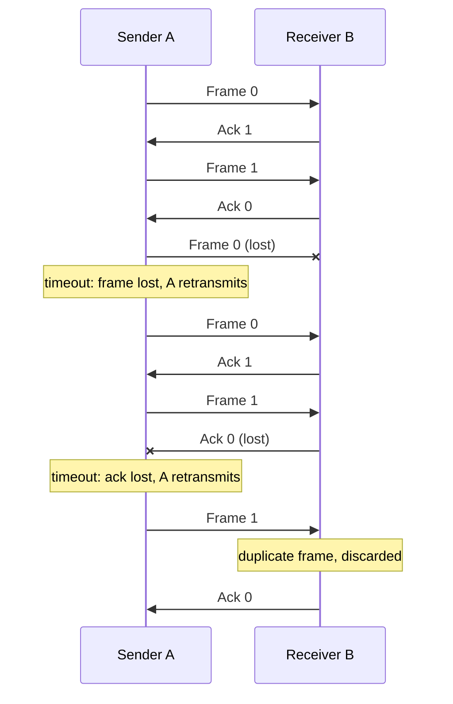

Advantages:

1. **Simple** to implement in hardware and software, so cheap and efficient.
2. **Error detection** through checksums or CRC.
3. **Reliable:** every packet is acknowledged before the next is sent, so nothing is corrupted or
   reordered.
4. **Flow control:** the receiver sets the pace, useful when its buffers or processing are limited.
5. **Backward compatible** with many existing systems and protocols.

Disadvantages:

1. **Low efficiency:** the sender sits idle waiting for acknowledgements, which is slow for large
   transfers.
2. **High latency** for the same reason, which hurts real-time applications.
3. **Poor bandwidth use:** only one packet is in flight at a time.
4. **Limited error recovery:** a lost or corrupted packet is resent whole.
5. **Sensitive to channel noise:** errors cause frequent retransmissions.

**2. Sliding-window ARQ.**

- Stop-and-wait gives error and flow control but performs badly because the sender waits. The
  sliding-window protocol fixes that by letting several packets be in flight at once.
- This is **pipelining**: a window of packets is sent without waiting for each acknowledgement. How
  many packets fit in one cycle follows from the transmission time and the propagation time.
  Pipelining keeps packets flowing and cuts idle time.
- Sliding window is the idea of picking the best window size; in practice it is implemented as two
  protocols:

**Go-Back-N (GBN):**

- The sender window (WS) is N, with N > 1 for pipelining.
- The receiver window (WR) is always 1.
- If a packet is lost, the sender goes back and resends everything from that packet on.
- Acknowledgements can be **cumulative** (one ack covers several packets: less traffic, less
  reliable) or **independent** (one ack per packet: more reliable, more traffic).
- It needs at least N + 1 sequence numbers so duplicates cannot be confused with new packets.

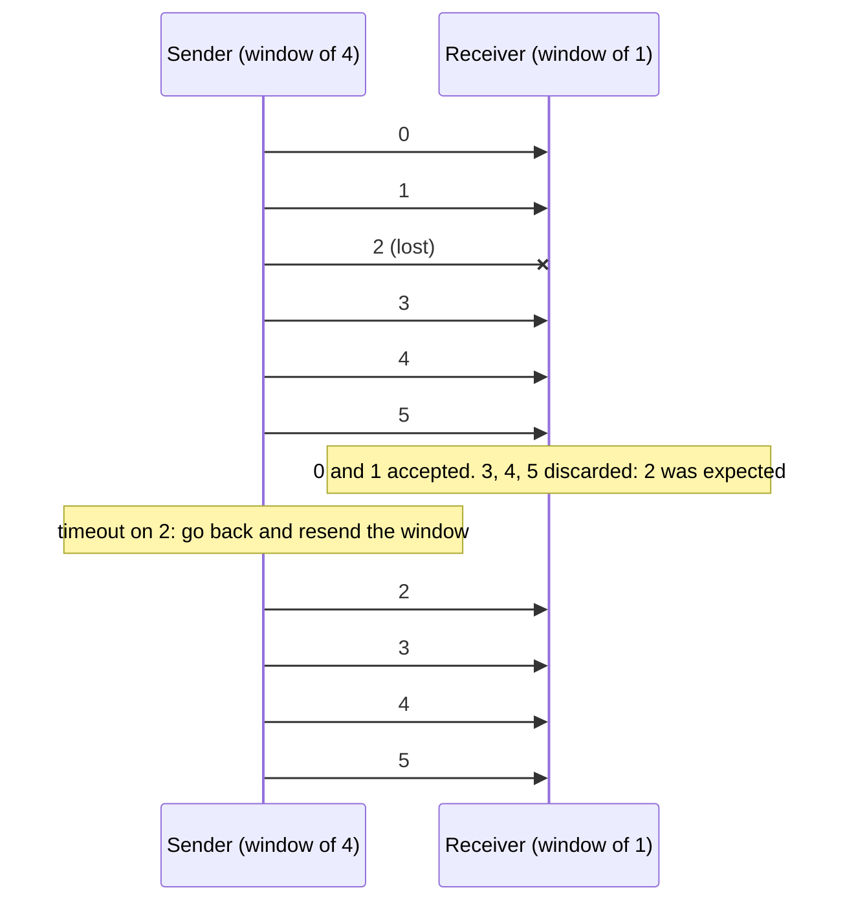

**Selective Repeat (SRP):**

- A variation of Go-Back-N.
- Both sender and receiver keep a buffer, each with a window of a set size.
- Suited to unreliable links where retransmissions are common.
- Only the frames that need it are retransmitted, not the whole window, so it is more efficient.
- Needs a full-duplex link, since the receiver sends acknowledgements back while data flows.
- The sender can send new packets as long as they are within the window of unacknowledged packets.
- The sender resends an unacknowledged packet on a timeout or when it receives a NAK (negative
  acknowledgement).
- The receiver acknowledges every correct packet and holds them until they can be delivered in
  order.

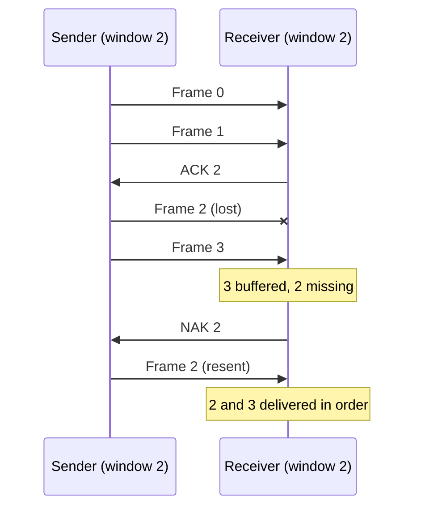

#### 4. Flow control

Flow control matches the sender's speed to the receiver's. The sender and receiver can transmit
and process at different rates; flow control keeps the receiver from being overloaded and paces
frames by the receiver's acknowledgements.

**Approaches:**

- **Feedback-based:** the receiver sends feedback, and the sender sends more data according to the
  receiver's processing status and acknowledgements.
- **Rate-based:** when the sender is faster than the receiver, a mechanism built into the protocol
  caps the rate, without any feedback from the receiver.

**Techniques:**

1. **Stop-and-wait flow control**
    - The message is split into frames; the receiver signals when it is ready; the sender waits for
      an acknowledgement before sending the next frame. One frame at a time. Inefficient when the
      propagation delay is longer than the transmission delay.
    - Advantages: simple, and every frame is checked and acknowledged, so it is accurate.
    - Disadvantages: slow, one frame at a time.
2. **Sliding-window flow control**
    - Reliable, in-order delivery where the sender can send several frames before any
      acknowledgement, which raises throughput. The receiver takes them one by one and acknowledges
      with the next frame number it expects.
    - Advantages: faster and more efficient than stop-and-wait, with frames sent back to back.
    - Disadvantages: more complex at both ends, and frames can arrive out of sequence.

#### 5. Access control

When many stations share one channel, a **multiple-access protocol** decides who transmits when,
so that simultaneous transmissions do not collide. It is like a teacher deciding which student
answers next.

##### Types of multiple-access protocol

**1. Random access.**

1. **ALOHA** (hello and goodbye in Hawaiian). Every station has equal priority and sends depending
   on whether the medium is idle or busy. There is no fixed time to send and no fixed order of
   stations.
    1. **Pure ALOHA:** a station sends and waits for an acknowledgement. If none arrives in time,
       it waits a random **back-off time (Tb)** and resends. Because stations wait different
       random times, a second collision becomes less likely.
    2. **Slotted ALOHA:** time is divided into slots and a station may only start sending at the
       beginning of a slot. Miss it and you wait for the next, which cuts collisions further.
2. **CSMA (carrier sense multiple access):** a station senses the medium before sending. If it is
   idle, the station transmits; if busy, it waits. Collisions still happen because of propagation
   delay: A starts sending, but before its signal reaches B, B senses an idle medium and starts
   too.

   CSMA access modes:

    - **1-persistent:** if the channel is idle, send immediately; if not, keep sensing and send the
      moment it goes idle (with probability 1).
    - **Non-persistent:** if the channel is idle, send; if not, check again after a random interval.
    - **p-persistent:** if the channel is idle, send with probability *p*; with probability 1 − *p*,
      wait a slot and sense again, repeating until the frame is sent. Used in Wi-Fi and packet
      radio.
    - **O-persistent:** stations have a fixed order of priority and each sends only in its own
      time slot when the medium is idle.
3. **CSMA/CD (collision detection):** stations detect collisions while transmitting and stop. For
   that to work a frame must be long enough to still be sending when a collision comes back: the
   transmission time must be at least twice the maximum propagation delay. Slots lost to collisions
   are called contention slots. Used by classic (half-duplex, wired) Ethernet.
4. **CSMA/CA (collision avoidance):** used in **wireless** networks, where a station cannot reliably
   hear a collision while it transmits, because its own signal drowns out everyone else's. Instead
   of detecting collisions, it works to avoid them:

    1. **Interframe space (IFS):** when the medium goes idle, the station waits a further period,
       the IFS, before sending. Stations with higher priority get a shorter IFS.
    2. **Contention window:** time is split into slots and a ready station waits a random number of
       them. Each time the medium is found busy, the window doubles; when it goes idle, the timer
       resumes.
    3. **Acknowledgement:** if no acknowledgement arrives within the timeout, the sender assumes the
       frame was lost and retransmits.

---

**2. Controlled access.** Stations consult one another to decide which one has the right to send.
Only one node sends at a time, so messages on the shared medium never collide. Three methods:

1. **Reservation:** stations reserve before sending. A fixed-length reservation interval is
   divided into slots, one per station, and a station announces its intent to send in its slot, so
   data then goes out in order with no collisions. Advantages: predictable performance, less
   contention, QoS support, efficient bandwidth use, good for multimedia. Disadvantages: depends on
   the reservation scheme working, wastes capacity under light load, and adds turn-around time.
2. **Polling:** a controller asks each node in turn whether it has data, like a roll call, and
   exchanges data only with the node it has selected. Advantages: fixed access times and data
   rates, high efficiency, and priorities are possible. Disadvantages: high overhead, depends on
   the controller staying up, slow, can be biased in sharing the link, and wastes rate under light
   load.
3. **Token passing:** stations form a logical ring and a token circulates among them in a set
   order. Only the station holding the token may send a frame; afterwards it passes the token on,
   and it waits for all N stations to have had their turn. The hard parts are duplicated or lost
   tokens and stations joining or leaving.

---

**3. Channelisation.**

1. **FDMA (frequency division multiple access):** the bandwidth is divided into equal bands, one
   per station, with **guard bands** between them to prevent overlap, crosstalk and noise.
2. **TDMA (time division multiple access):** the stations share the whole bandwidth but take turns
   in time slots. Each station must know its slot, which costs synchronisation bits in every slot,
   and guard times absorb propagation delay.
3. **CDMA (code division multiple access):** all stations transmit at once over the whole channel,
   with no split in bandwidth or time. Each uses a different code, like people talking in a room in
   different languages without confusing each other.
4. **OFDMA (orthogonal frequency division multiple access):** splits the bandwidth into many small
   subcarriers for better performance. Widely used in 5G. Efficient, fast and suited to multimedia,
   but complex to implement.
5. **SDMA (spatial division multiple access):** uses multiple antennas to separate users by
   direction. Common in MIMO (multiple-input, multiple-output) wireless systems. It uses the
   frequency band well, improves signal quality and raises data rates, but is complex and needs
   accurate channel information.

---

In short: contention-based protocols such as CSMA listen before sending, with collision detection
(CD) or collision avoidance (CA) added, while token passing hands out exclusive turns. Contention
can waste bandwidth under load; token passing can use it more fully.

### Ethernet

- The most widely used LAN technology, defined by IEEE 802.3.
- Works at the physical and data-link layers.
- Uses **CSMA/CD** to handle collisions and **Manchester encoding** (in classic 10 Mbps Ethernet).
  Current Ethernet runs at up to 100 Gbps and beyond.
- **Advantages:** fast (faster than wireless), energy efficient, good quality (resistant to noise),
  reliable (error detection), cheap, interoperable, secure (supports encryption and
  authentication), manageable, compatible, scalable, widely available, simple and standardised.
- **Disadvantages:** distance limits (100 m on twisted pair), shared bandwidth, security
  weaknesses, complexity, compatibility issues, cabling work, and physical limits on network
  design.

### Ethernet (IEEE 802.3) frame format

| Field | Size | Purpose |
| --- | --- | --- |
| Preamble | 7 bytes | Alternating 0s and 1s for bit synchronisation |
| Start frame delimiter (SFD) | 1 byte | `10101011`: marks the start of the frame |
| Destination address | 6 bytes | MAC address of the destination |
| Source address | 6 bytes | MAC address of the sender (always unicast) |
| Length | 2 bytes | Length of the frame's data; the field could express up to 65,534, but Ethernet caps data at 1,500 bytes |
| Data | 46–1,500 bytes | The payload, padded if under 46 bytes |
| CRC (frame check sequence) | 4 bytes | Checksum over destination, source, length and data, for error detection |

The Ethernet header is the 14 bytes from destination address to length. Related features:

- **VLAN tagging:** a 4-byte tag inserted after the source address splits one physical network into
  several virtual ones.
- **Jumbo frames:** frames with more than 1,500 bytes of payload, for higher throughput.
- **EtherType:** in Ethernet II framing the length field instead identifies the protocol in the
  payload, e.g. IP or ARP.
- **Multicast and broadcast frames:** Ethernet can address a group of devices, or all of them.
- **Collision detection:** half-duplex Ethernet uses CSMA/CD to detect and handle collisions.

> An IEEE 802.3 Ethernet frame is **64 to 1,518 bytes**, of which the data is 46 to 1,500 bytes.
> The preamble and SFD are not counted in that size.

### VLAN

- A VLAN (virtual LAN) groups devices logically at layer 2. A switch then keeps each VLAN in its
  own broadcast domain, and **inter-VLAN routing** forwards packets between them. The result is
  smaller, more manageable sub-networks.

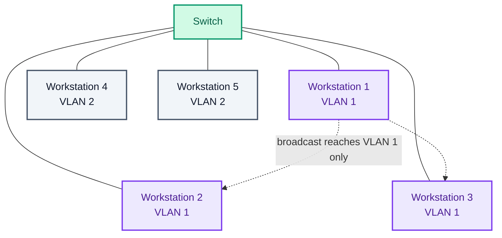

VLANs can also span switches, with a router joining them:

```mermaid
flowchart TD
    R[Router<br/>inter-VLAN routing] --- S1[Switch 1]
    R --- S2[Switch 2]
    S1 --- V1[VLAN 1: Manufacturing]
    S1 --- V2a[VLAN 2: Sales]
    S2 --- V3[VLAN 3: HR]
    S2 --- V2b[VLAN 2: Sales]
    classDef gateway fill:#EDE9FE,stroke:#7C3AED,color:#4C1D95,stroke-width:2px
    classDef service fill:#D1FAE5,stroke:#059669,color:#065F46,stroke-width:2px
    classDef flow    fill:#F1F5F9,stroke:#475569,color:#0F172A,stroke-width:2px
    class R gateway
    class S1,S2 service
    class V1,V2a,V3,V2b flow
```

- VLANs improve security and performance, simplify management, and add flexibility, cost savings
  and scalability: they separate traffic logically, cut broadcast traffic, allow dynamic
  configuration, reduce hardware, and segment the network.
- Key features: **VLAN tagging** to mark which VLAN a frame belongs to, **VLAN membership** to
  assign devices, **VLAN trunking** to carry several VLANs over one link, and **VLAN management**
  to configure and administer them.
- **Types of link:**
    1. **Trunk link:** every device on it must be VLAN-aware; frames carry a VLAN tag.
    2. **Access link:** connects VLAN-unaware devices to a VLAN-aware switch; frames are untagged.
    3. **Hybrid link:** both at once, carrying tagged and untagged frames, for VLAN-aware and
       VLAN-unaware devices.
- **Advantages:** better performance by cutting unnecessary broadcast and multicast traffic,
  grouping devices logically (by department, say), better security, more flexibility, lower cost
  since fewer routers are needed, and smaller broadcast domains that are easier to manage.
- **Disadvantages:** configuration and management complexity, limited scalability, limited
  security, limited interoperability, limited mobility, cost, and less visibility for monitoring
  and troubleshooting.
- **Real-time uses:** better VoIP quality, prioritised video conferencing, secure remote access,
  efficient cloud backup and recovery, prioritised gaming, and IoT security.

---

That is everything up to the frame. The next part lifts it into a packet and sends it across
networks.

Next: [IP addressing, routing, TCP and UDP: the network and transport layers](/blogs/networking-network-and-transport-layers/)
