[Part One](/blogs/networking-basics-physical-and-data-link/) got a frame from one device to the
next. This part is about going further: the network layer moves packets between networks, and the
transport layer delivers their contents to the right process on the right host.

## 3. The network layer

### Services the network layer provides

1. **Packet forwarding and routing:** relays packets between network segments, choosing the most
   efficient path.
2. **Connectionless communication (IP):** each packet is addressed and routed on its own, as a
   packet-switched network requires.
3. **Fragmentation:** splits packets that are too large for a link into fragments, which are
   reassembled at the destination.

### Switching techniques

#### 1. Circuit switching

- A dedicated path is set up between the devices for the whole session, and no one else can use it.
  Common in voice and data communication.
- **Advantages:** guaranteed bandwidth for the whole call; low latency, because the path is fixed
  and nothing is set up per packet; predictable performance, with no competition for resources; and
  a good fit for real-time voice and video.
- **Disadvantages:** wastes bandwidth, since it is reserved for the whole call; limited scale,
  since there are only so many circuits; and expensive, because the resources stay dedicated for
  the call's duration.

#### 2. Packet switching

- Data is split into **packets**, each carrying source and destination addresses, and each routed
  across the network on its own. Packets can arrive out of order, or late when the network is
  congested.
- **Advantages:** efficient use of bandwidth, flexibility with different data rates and packet
  sizes, scales to heavy traffic, and cheap because users share resources.
- **Disadvantages:** higher latency from passing through many nodes, weak quality-of-service (QoS)
  guarantees, packets lost to congestion or errors, and so a poor fit for real-time voice and
  video.

#### 3. Message switching

The notes list this one without detail. In message switching there is no dedicated path and the
data is not cut into packets: each node receives the **whole message**, stores it, and forwards it
to the next node when a link is free (*store and forward*). It needs no setup, but every node needs
enough storage for complete messages and the delays are long, so packet switching replaced it.
Early telegraph and email relay systems worked this way.

### IPv4

- IPv4 (Internet Protocol version 4) was introduced on ARPANET in 1983.
- An IPv4 address is a **32-bit** integer, so the address space is 2³² addresses, usually written in
  dotted-decimal (or hexadecimal) notation.
- In dotted decimal each of the four parts is 0 to 255, written without leading zeros.
- The parts of an IPv4 address:
    - **Network part:** identifies the network, and in classful addressing its class.
    - **Host part:** identifies the machine on that network.
    - **Subnet number:** a network with many hosts is divided into subnets, each given a subnet
      number.

### IP addressing

#### 1. Classful addressing

- On a network, every host ID must be unique. The **network address** has all host-ID bits set to 0
  and names the network; the **broadcast address** has all host-ID bits set to 1 and reaches every
  host on it.
- Classful addressing divides the 32-bit space into **five classes**:

| Class | Leading bits | Network ID bits | Host ID bits | Networks | Addresses per network | Default mask | Range | Purpose |
| --- | --- | --- | --- | --- | --- | --- | --- | --- |
| A | `0` | 8 | 24 | 2⁷ − 2 (126) | 2²⁴ − 2 | 255.0.0.0 | 1.0.0.0 – 126.255.255.255 | Networks with very many hosts |
| B | `10` | 16 | 16 | 2¹⁴ | 2¹⁶ − 2 | 255.255.0.0 | 128.0.0.0 – 191.255.255.255 | Medium to large networks |
| C | `110` | 24 | 8 | 2²¹ | 2⁸ − 2 (254) | 255.255.255.0 | 192.0.0.0 – 223.255.255.255 | Small networks |
| D | `1110` | – | – | – | – | – | 224.0.0.0 – 239.255.255.255 | Multicast |
| E | `1111` | – | – | – | – | – | 240.0.0.0 – 255.255.255.255 | Experimental / research |

Notes per class:

- **A:** 0.x.x.x and 127.x.x.x are special. 127.0.0.0 to 127.255.255.255 is reserved for
  **loopback**, used to test networking on the local machine. 0.0.0.0/8 means "this network": it is
  used as a source address by a host that does not know its address yet (as in DHCP).
- **B:** **APIPA** (Automatic Private IP Addressing) lets a device give itself a **link-local
  address** in 169.254.0.0 to 169.254.255.255 when no DHCP server answers.
- **C:** **TEST-NET** ranges are reserved for testing and documentation: 192.0.2.0/24,
  198.51.100.0/24 and 203.0.113.0/24.
- **D:** multicast addresses have no network and host parts; they identify multicast groups.
- **E:** reserved for future and experimental use, not for public use.

On a bit ruler (0, 8, 16, 24, 32), the leading bits fix the class and the rest splits into network
and host:

| Class | Bits 1–8 | Bits 9–16 | Bits 17–24 | Bits 25–32 |
| --- | --- | --- | --- | --- |
| A | `0` + 7 network bits | host | host | host |
| B | `10` + 6 network bits | network | host | host |
| C | `110` + 5 network bits | network | network | host |
| D | `1110` + 4 bits | multicast group address (28 bits in all) | | |
| E | `1111` + 4 bits | experimental (28 bits in all) | | |

---

#### 2. Classless addressing

**Why classless addressing was adopted:**

- *Reason 1:* classful addressing hands out fixed-size blocks, which wastes addresses. Classless
  addressing assigns a block of whatever size the customer needs.
- *Reason 2:* addresses had to be shared out fairly among organisations, and internet service
  providers (ISPs) needed variable-size blocks for their different customers.

**CIDR notation:**

- A classless address is split into a **prefix** (the network ID) and a **suffix** (the host).
- All addresses in a block share the prefix; each host in the block has a different suffix.
- The prefix length *n* can be anything from 0 to 32, and the suffix is 32 − *n* bits.
- The prefix length is written after the address with a slash: **CIDR (Classless Inter-Domain
  Routing) notation**.
- In 167.199.170.82/27, the prefix is 27 bits, so the suffix is 32 − 27 = 5 bits.

**Rules for a CIDR block:**

1. The addresses in a block must be contiguous.
2. The number of addresses must be a power of 2.
3. The first address must be divisible by the number of addresses in the block.

**Formulas:**

- Number of addresses in a block: N = 2^(32 − n), where *n* is the prefix length.
- First address = (any address in the block) AND (network mask)
- Last address = (any address in the block) OR (NOT network mask)

**Example: 167.199.170.82/27**

- A /27 prefix means 2⁵ = **32** addresses in the block.
- First address, by ANDing with the mask:

| | Binary | Decimal |
| --- | --- | --- |
| Address | `10100111 11000111 10101010 01010010` | 167.199.170.82 |
| Mask (/27) | `11111111 11111111 11111111 11100000` | 255.255.255.224 |
| AND = first address | `10100111 11000111 10101010 01000000` | **167.199.170.64** |

- Last address, by ORing with the inverted mask:

| | Binary | Decimal |
| --- | --- | --- |
| Address | `10100111 11000111 10101010 01010010` | 167.199.170.82 |
| NOT mask | `00000000 00000000 00000000 00011111` | 0.0.0.31 |
| OR = last address | `10100111 11000111 10101010 01011111` | **167.199.170.95** |

- The block runs from **167.199.170.64** to **167.199.170.95**: 32 contiguous addresses, a power
  of 2, and 64 is divisible by 32, so it satisfies all three rules.

### IPv4 header

The header is 20 bytes without options and at most 60 bytes, laid out in 32-bit rows:

| Field | Bits | Meaning |
| --- | --- | --- |
| Version | 4 | IP version: 4 for IPv4 |
| HLEN | 4 | Header length in 32-bit words: minimum 5 (20 bytes), maximum 15 (60 bytes) |
| Type of service | 8 | Requested handling: low delay, high throughput, reliability |
| Total length | 16 | Header plus data, 20 to 65,535 bytes |
| Identification | 16 | Packet ID shared by all fragments of one datagram |
| Flags | 3 | Reserved bit (must be 0), Don't Fragment (DF), More Fragments (MF) |
| Fragment offset | 13 | Where this fragment's data sits in the original datagram, in units of 8 bytes (maximum 65,528 bytes) |
| Time to live | 8 | Hop limit: each router decrements it, and the packet is dropped at 0, so it cannot loop forever |
| Protocol | 8 | Which protocol the payload goes to (e.g. 6 = TCP, 17 = UDP) |
| Header checksum | 16 | Error check over the header only |
| Source IP address | 32 | Sender's address |
| Destination IP address | 32 | Receiver's address |
| Options | 0–320 (0–40 bytes) | Optional extras such as source route or record route, used by administrators to check whether a path works |

### Unicast, broadcast and multicast

1. **Unicast:** one sender to one receiver, each with its own IP address. One-to-one.

   ```mermaid
   flowchart LR
       subgraph NA[Network A]
           A1[Host]
       end
       subgraph NB[Network B]
           B1[Host]
       end
       A1 -->|one packet, one receiver| B1
       classDef gateway fill:#EDE9FE,stroke:#7C3AED,color:#4C1D95,stroke-width:2px
       class A1,B1 gateway
   ```

2. **Broadcast** (one to all), in two forms:
    1. **Limited broadcast:** sent to **255.255.255.255**, it reaches every device on the sender's
       own network.

       ```mermaid
       flowchart LR
           S[Sender] --> H1[Host]
           S --> H2[Host]
           S --> H3[Host]
           S --> H4[Host]
           S --> H5[Host]
           classDef gateway fill:#EDE9FE,stroke:#7C3AED,color:#4C1D95,stroke-width:2px
           classDef flow    fill:#F1F5F9,stroke:#475569,color:#0F172A,stroke-width:2px
           class S gateway
           class H1,H2,H3,H4,H5 flow
       ```

    2. **Directed broadcast:** a host on one network sends to every host on *another* network, by
       setting all the host-ID bits of the destination address to 1 (e.g. 192.168.20.255 for
       192.168.20.0/24).

       ```mermaid
       flowchart LR
           subgraph NA[Network A]
               S[Sender]
           end
           subgraph NB[Network B]
               H1[Host]
               H2[Host]
               H3[Host]
               H4[Host]
           end
           S --> H1
           S --> H2
           S --> H3
           S --> H4
           classDef gateway fill:#EDE9FE,stroke:#7C3AED,color:#4C1D95,stroke-width:2px
           classDef flow    fill:#F1F5F9,stroke:#475569,color:#0F172A,stroke-width:2px
           class S gateway
           class H1,H2,H3,H4 flow
       ```

3. **Multicast:** between unicast and broadcast. One or more senders reach a group of receivers
   that have joined: the server sends one stream and the network copies it to each member. It uses
   **IGMP** (Internet Group Management Protocol), multicast routing, and the **class D** addresses.

### IPv6

- IPv6 was developed by the **IETF** as the answer to IPv4 address exhaustion. Addresses are
  **128 bits**, a space of 2¹²⁸, written in hexadecimal as **8 groups of 16 bits** separated by
  colons.
- Leading zeros in a group can be dropped, and one run of all-zero groups can be replaced by `::`:

| Form | Address |
| --- | --- |
| Full | `2001:0df8:00f2:0000:0000:0000:0000:0f11` (groups 1–8) |
| Groups 4 to 7 are all zeros, so compress them | `2001:0df8:00f2::0f11` (groups 1, 2, 3 and 8) |

- IPv6 has a more efficient header with options moved out into separate headers, new features and
  room for extension, support for resource allocation and real-time traffic, and built-in security
  options for encryption and authentication.
- **Addressing methods:**
    1. **Unicast:** identifies one network interface; packets go to that interface.
    2. **Multicast:** identifies a group of hosts; packets go to every member at once.
    3. **Anycast:** assigned to a group of interfaces, but a packet goes to only one of them,
       normally the nearest.

  IPv6 has no broadcast addresses.

#### IPv6 header

A fixed 40-byte header, followed by optional extension headers and then the payload:

| Field | Bits | Meaning |
| --- | --- | --- |
| Version | 4 | IP version: `0110` (6) |
| Traffic class | 8 | Priority, so routers can treat traffic by class. In the original scheme, 0–7 was for congestion-controlled traffic and 8–15 for traffic that is not, typically audio and video. The source sets it and routers may change it. |
| Flow label | 20 | Marks packets of the same flow so routers can handle them the same way; a source and destination can have several flows. |
| Payload length | 16 | Size of everything after the fixed header, extension headers included. Above 65,535 bytes it is set to 0 and the jumbo-payload option is used. |
| Next header | 8 | Type of the first extension header, or of the upper-layer protocol (TCP, UDP) if there is none. |
| Hop limit | 8 | Like IPv4's TTL: decremented by each router, packet discarded at 0. |
| Source address | 128 | The original sender. |
| Destination address | 128 | The final destination, used by routers on the way. |

**Extension headers** replace IPv4's options field. The next-header field points to the first one,
and each points to the next, forming a chain.

### Routing

Routing is what layer 3 devices do: choose the best path to deliver a packet from one network to
another.

#### Types of routing

1. **Static routing**
    - Routes are added to the routing table by hand.
    - Advantages: no routing work for the router's CPU, more security because the router only
      routes to the networks it is told about, and no bandwidth spent between routers.
    - Disadvantages: in a large network an administrator must add routes on every router by hand,
      and needs to know the whole topology.

   An example topology, with a static route on each router for every network it is not directly
   connected to:

   ```mermaid
   flowchart LR
       LAN3["LAN 10.10.10.0/24"] --- R3[R3]
       R3 ---|"s0/0 172.16.10.1/30 ↔ s0/0/0 172.16.10.2/30"| R2[R2]
       R3 ---|"s0/1 172.16.10.5/30 ↔ s0/0/1 172.16.10.6/30"| R1[R1]
       R2 --- LAN2["LAN 192.168.10.0/24 + PC"]
       R1 --- LAN1["LAN 192.168.20.0/24 + PC"]
       classDef gateway fill:#EDE9FE,stroke:#7C3AED,color:#4C1D95,stroke-width:2px
       classDef store   fill:#CFFAFE,stroke:#0891B2,color:#164E63,stroke-width:2px
       class R1,R2,R3 gateway
       class LAN1,LAN2,LAN3 store
   ```

2. **Default routing**
    - Every packet goes to one configured next-hop router, whatever the destination. Used on **stub
      routers**, which have only one way out to all other networks.
3. **Dynamic routing**
    - Routers exchange route information with protocols such as **RIP** and **OSPF**, and adjust
      their tables as the topology changes.
    - Easy to configure, picks good routes and discovers remote networks, but it uses more bandwidth
      talking to neighbours and is less secure than static routing.

#### Routing protocols

##### 1. Intra-domain (interior gateway) protocols

**Distance vector routing (DVR)**

- Each router periodically tells its **neighbours** its distances to every destination.
- Also known as the **old ARPANET routing** algorithm, or the **Bellman-Ford** algorithm.
- **The algorithm:**
    1. A router sends its distance vector to each neighbour in a routing packet.
    2. Each router saves the latest distance vector from each neighbour.
    3. A router recalculates its own vector when:
        - a neighbour sends a vector with different information than before, or
        - it finds that the link to a neighbour has gone down.

**Example.** Three routers with link costs X–Y = 1, Y–Z = 2 and X–Z = 5. At first each router knows
only its own direct links:

| From | to X | to Y | to Z |
| --- | --- | --- | --- |
| X | 0 | 1 | 5 |
| Y | 1 | 0 | 2 |
| Z | 5 | 2 | 0 |

X receives Y's vector and sees that X → Y → Z costs 1 + 2 = 3, less than the direct 5, so it
updates its route to Z to 3 via Y. Z does the same for its route to X. Once the vectors have been
exchanged, every router holds the same, converged table:

| From | to X | to Y | to Z |
| --- | --- | --- | --- |
| X | 0 | 1 | **3** (via Y) |
| Y | 1 | 0 | 2 |
| Z | **3** (via Y) | 2 | 0 |

**Routing Information Protocol (RIP)**

- Uses **hop count** as its metric for the best path. Runs on UDP port **520**.
- Hop count is the number of routers between source and destination. RIP caps it to prevent
  routing loops: the maximum is **15**, and **16** means "network unreachable".
- Features: routers exchange updates periodically, broadcast (or multicast) them, send their whole
  routing table each time, and trust what their neighbours say, which is why it is called *routing
  on rumours*.
- **RIP versions:**

| RIP v1 | RIP v2 | RIPng |
| --- | --- | --- |
| Updates are broadcast | Updates are multicast | Updates are multicast |
| Broadcast to 255.255.255.255 | Multicast to 224.0.0.9 | Multicast to FF02::9 (RIPng runs only on IPv6) |
| No authentication of updates | Supports authentication of updates | – |
| Classful | Classless | Classless |

- Common in small and medium networks, legacy networks and labs. Easy to configure, needs little
  maintenance, and serves as a backup routing protocol in some networks.
- Advantages: simple, easy to implement, automatic updates, low overhead in a small network, works
  with most devices.
- Limitations: poor scalability, slow convergence (the notes list both fast and slow; slow is right
  for large networks), routing loops, little load-balancing support, security weaknesses, and
  wasted bandwidth from sending full tables.

**Link state routing**

- Routers exchange messages to learn the whole **network topology**, then compute their routing
  tables with a shortest-path calculation.
- Each router floods **link-state packets** describing its links. Together they form a
  **link-state database**, on which each router runs **shortest path first** (Dijkstra's
  algorithm) to build its routing table of paths and interfaces.

**Example.** The network, with link costs:

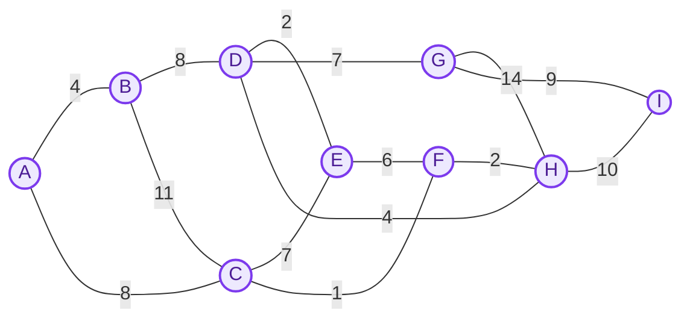

Dijkstra from A: at each step, fix the closest node not yet fixed, then update its neighbours'
tentative distances.

| Step | Fixed (shortest distance known) | Tentative distances |
| --- | --- | --- |
| 1 | A 0 | B 4, C 8 |
| 2 | A 0, B 4 | C 8, D 12 (via B) |
| 3 | A 0, B 4, C 8 | D 12, E 15 (via C), F 9 (via C) |
| 4 | … F 9 | D 12, E 15 (via F), H 11 (via F) |
| 5 | … H 11, D 12 | E 14 (via D), G 19 (via D), I 21 (via H) |
| Final | A 0, B 4, C 8, D 12, E 14, F 9, G 19, H 11, I 21 | – |

The resulting shortest-path tree from A:

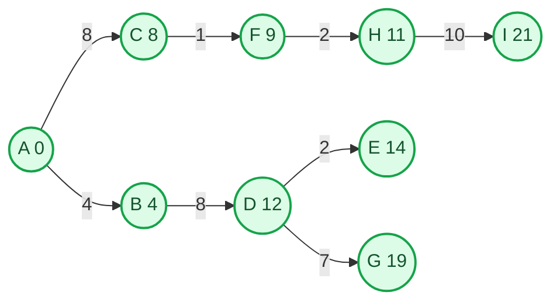

**Open Shortest Path First (OSPF)**

- A link-state protocol: routers exchange topology information with their neighbours and compute
  end-to-end paths with a variant of Dijkstra's algorithm.
- Its main strength is that routes can be computed against specific criteria, which is useful for
  traffic engineering and quality of service.
- Its main weakness is scaling: as routers are added, topology updates get larger and more frequent
  and route calculation takes longer. (OSPF areas are the standard way to contain this.)
- Each router describes its local state in **link-state advertisements (LSAs)**, from which every
  router builds an identical topology database.
- From the database, each router computes its routing table with the SPF algorithm: destinations,
  next-hop IP addresses and outgoing interfaces.
- It recalculates routes when the topology changes, and keeps routing traffic to a minimum.

**Enhanced Interior Gateway Routing Protocol (EIGRP)**

- A dynamic routing protocol that finds the best path between layer 3 devices using a composite
  metric. It runs directly over IP as **protocol number 88**.
- EIGRP talks to its neighbours with these messages:
    - **Hello:** exchanged to discover or recover neighbours and check that a device runs EIGRP.
      They carry the AS number and the k values. Hellos can be multicast or unicast, and a hello
      with no data doubles as an acknowledgement.
    - **Null update:** used to compute the smooth round-trip timer (SRTT), the time for a packet to
      reach the neighbour and be acknowledged, and the retransmission timeout (RTO), how long to
      wait for an acknowledgement when multicast fails.
    - **Full update:** exchanged once neighbours are formed, carrying all best routes.
    - **Partial update:** sent when the topology changes or links are added; only new routes, and
      multicast.
    - **Query:** multicast when a route is lost and there is no alternative in the topology table.
    - **Reply:** answers a query with a route to the requested network.
    - **Acknowledgement:** acknowledges updates, queries and replies.

  Hello and acknowledgement packets are not acknowledged. Updates, queries and replies are reliable
  and must be.

##### 2. Inter-domain (exterior gateway) protocols

**Border Gateway Protocol (BGP)**

- The internet's routing protocol between **autonomous systems** (ASes): it exchanges reachability
  information so that networks with different internal topologies can reach each other.
- It uses the **next-hop** paradigm, lets several BGP speakers in one AS coordinate, carries **path
  information** in its advertisements, and lets administrators apply **custom policies**. It runs
  over **TCP** for reliable delivery, saves bandwidth by sending incremental updates, supports
  **CIDR**, and supports authentication of sessions between peers.
- Three main functions:
    1. **Peer acquisition and authentication:** peers open a TCP connection and exchange messages to
       agree to communicate.
    2. **Sending reachability information:** peers exchange both positive and negative information
       about which routes are available.
    3. **Verifying connectivity:** peers check each other and the link between them keep working.
- It also manages route information: storing, updating, selecting and advertising routes.

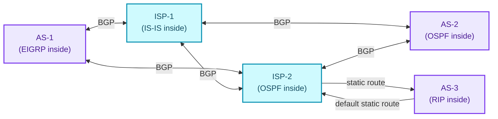

Inside each AS an interior protocol runs; between them, BGP. A small AS with one link to its ISP
(AS-3) needs no BGP: a static route in and a default route out are enough.

### Network address translation (NAT)

- NAT lets many devices on a private network reach the internet through one **public IP address**.
  It rewrites private addresses to public ones on the way out and back on the way in, and also
  rewrites **port numbers**. It usually runs on a router or firewall.
- **How it works:** the border router, configured for NAT, translates local IP addresses to global
  ones as packets leave the network, and back again as replies come in. If the NAT address pool is
  exhausted, packets are dropped and an **ICMP host unreachable** message goes back to the sender.

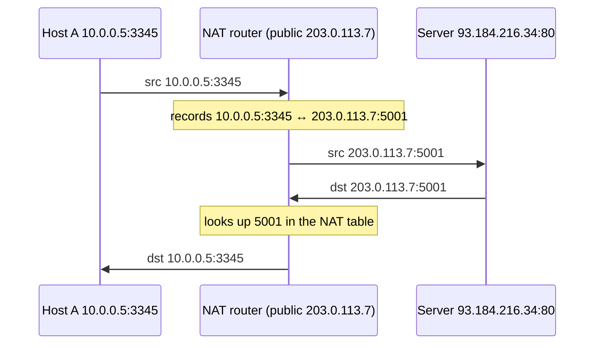

- **Why translate port numbers too?**
    - Hosts A and B on the network contact the same destination at the same moment, both from the
      same source port.
    - If NAT rewrote only the IP addresses, both would leave with the router's public IP and the
      same port.
    - Replies come back to the router's public IP, and NAT could not tell which reply belongs to
      which host, because the ports are identical.
    - So NAT also rewrites the **source port**, giving each connection a unique one.
    - It keeps a **NAT table** mapping each public port back to the right host.
- **Inside and outside addresses:**
    - **Inside local:** the address assigned to a host on the inside network, usually a private
      address rather than one from the ISP. The inside host as seen from inside.
    - **Inside global:** the public address that represents one or more inside local addresses to
      the outside world. The inside host as seen from outside.
    - **Outside local:** the address of the outside destination host as it appears inside the
      network, after translation.
    - **Outside global:** the outside host's real address as seen on the outside network, before
      translation.
- **Types of NAT:**
    1. **Static NAT:** a fixed one-to-one mapping between a private and a public address. Used for
       hosting web servers, but expensive when many public addresses are needed.
    2. **Dynamic NAT:** private addresses are mapped to public addresses from a pool. Only as many
       hosts as there are pool addresses can be translated at once, and packets may be dropped when
       the pool is full. Suits a fixed number of users, but still needs several public addresses.
    3. **PAT (port address translation)**, or NAT overload: many private addresses share one public
       address, told apart by port number. Thousands of users can share one public address, so it
       is cheap, and it is by far the most common type.
- **Advantages:** saves registered public addresses, gives some privacy by hiding devices'
  addresses, and avoids renumbering when the network changes.
- **Disadvantages:** adds delay on the switching path, breaks some applications, complicates
  tunnelling protocols such as IPsec, and makes the router handle port numbers, beyond a network
  layer device's usual job.

### Tunnelling

- Tunnelling connects two networks of one type across an intermediate network of another type. It
  wraps (encapsulates) packets of one protocol inside packets of another, following a layered
  model such as OSI or TCP/IP.

<figure>
  
  <figcaption>The IP packet rides inside the payload of a WAN packet between M1 and M2.</figcaption>
</figure>

- The WAN becomes one "big tunnel" between the multiprotocol routers M1 and M2, and hosts A and B
  talk as if it were not there: M1 encapsulates the IP packet inside a WAN packet and M2 takes it
  out.
- **Tunnelling protocols:**
    1. **GRE (Generic Routing Encapsulation):** wraps an IP packet in a GRE header plus a new
       delivery header with its own source and destination, hiding the original. The routers at
       each end add and strip it, so the original packet crosses the tunnel and emerges unchanged.
       (GRE itself does not encrypt.)
    2. **IPsec (Internet Protocol Security):** an IETF protocol suite that secures traffic between
       two points on an IP network, with data authentication, integrity, confidentiality, and key
       exchange and management.
    3. **IP-in-IP:** encapsulates an IP packet inside another IP packet.
    4. **SSH (Secure Shell):** a cryptographic protocol for secure, encrypted transfer over a
       network, used for remote login (with key-based logins, without typing a password for each
       system) and for tunnelling other traffic.
    5. **PPTP (Point-to-Point Tunneling Protocol):** a long-standing VPN protocol that builds a
       tunnel and uses PPP (Point-to-Point Protocol) to encrypt packets. Supported on Windows, Mac
       and Linux (and now considered insecure).
    6. **SSTP (Secure Socket Tunneling Protocol):** Microsoft's VPN protocol, secured with SSL/TLS,
       mainly on Windows.
    7. **L2TP (Layer 2 Tunneling Protocol):** published in 2000 for VPNs over the internet. It
       combines the best of PPTP and L2F so ISPs can offer VPN services.
    8. **VXLAN (Virtual Extensible LAN):** a network virtualisation technology that stretches layer
       2 across layer 3 networks by wrapping Ethernet frames in VXLAN packets with IP addresses,
       which scales further than VLANs.
- **What is SSL tunnelling?** A client that needs an SSL/TLS connection to a backend service goes
  through a proxy server. The proxy opens the connection to the backend and then copies bytes in
  both directions without touching the encrypted SSL session.

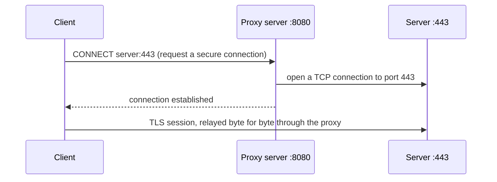

### ARP and RARP

**The ARP family:**

1. **Address Resolution Protocol (ARP)**
    - Finds the **MAC address** that goes with an **IP address** on the same network. It works
      between the network layer and the data-link layer.
    - Before sending an IP packet the sender must know the destination's MAC address. It broadcasts
      an **ARP request**, only the machine with that IP answers with a unicast **ARP reply**, the
      sender stores the answer in its **ARP cache**, and from then on sends unicast frames.

   ```mermaid
   sequenceDiagram
       participant P1 as PC1
       participant P2 as PC2 (192.168.1.2)
       participant P3 as PC3
       participant P4 as PC4
       P1->>P2: ARP request (broadcast): who has 192.168.1.2?
       P1->>P3: same broadcast
       P1->>P4: same broadcast
       Note over P3,P4: not 192.168.1.2, ignore it
       P2-->>P1: ARP reply (unicast): 192.168.1.2 is at my MAC
       Note over P1: stores the mapping in its ARP cache
   ```

2. **Reverse ARP (RARP)**
    - A device that knows its MAC address but not its IP address asks for one. A **RARP server** on
      the LAN answers the broadcast by looking the MAC up in its IP-to-MAC table.
    - It worked over Ethernet, Ethernet II, Token Ring and FDDI, but is little used today: BOOTP and
      DHCP do the job better.

   ```mermaid
   sequenceDiagram
       participant A as Device A (MAC known, IP unknown)
       participant R as RARP server
       A->>R: broadcast: my MAC is 210, what is my IP address?
       R-->>A: your IP address is IPA
   ```

3. **Inverse ARP (InARP):** finds an IP address from a link-layer identifier in networks such as
   ATM and Frame Relay. It maps a local identifier (a DLCI) to the remote end's IP address when
   the identifier is known but the address is not.
4. **Proxy ARP:** lets devices on different segments of one IP network, separated by a router,
   reach each other. The router answers ARP requests on the other segment's behalf with its own
   MAC address and forwards the traffic, since the broadcast would not cross it.
5. **Gratuitous ARP:** a host announces its own IP-to-MAC mapping, unasked, typically at boot or
   when its address changes. It detects IP conflicts (someone else answering means the address is
   taken), and updates other hosts' ARP caches and switches' MAC tables.

**ARP poisoning (ARP spoofing)**

- An attacker on the LAN sends **forged ARP messages** that tie the attacker's MAC address to a
  legitimate device's IP address.
- Traffic meant for that IP then goes to the attacker, who can **read, change or stop** it in
  transit.
- It opens the door to worse attacks: **man-in-the-middle**, **denial of service** and **session
  hijacking**.

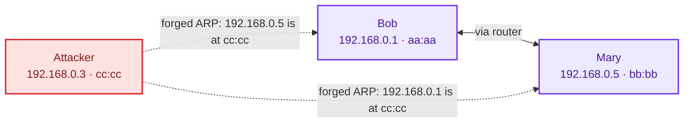

With both caches poisoned, Bob's and Mary's traffic to each other flows through the attacker.

**ARP vs RARP**

| ARP | RARP |
| --- | --- |
| Maps an IP address to a physical (MAC) address | Maps a physical (MAC) address to an IP address |
| Finds the MAC of a device whose IP is known | Finds the IP of a device whose MAC is known |
| The client broadcasts an IP address and asks for the MAC | The client broadcasts its MAC and asks for an IP |
| The owner of the IP answers with its MAC | The RARP server answers with the IP |
| Used everywhere in modern networks | Rarely used; devices get IPs from DHCP |
| Each host keeps its own ARP table | The RARP server keeps the RARP table |
| Fetches the receiver's MAC address | Fetches the device's own IP address |
| ARP replies update the ARP table | RARP replies configure the IP address |
| Used by hosts and routers to find MAC addresses | Used by small, diskless machines |
| Used on the sender's side to map the receiver's MAC | Used on the requesting side to learn its own IP |

---

## 4. The transport layer

### How the transport layer works

- **At the sender:** it takes the message from the application layer and **segments** it, adds the
  source and destination **port numbers** to each segment's header, and hands the segments to the
  network layer.
- **At the receiver:** it takes data from the network layer, **reassembles** the segments, reads
  the header, finds the port number, and passes the message to the right application.

### Responsibilities of the transport layer

#### 1. Process-to-process delivery

- The data-link layer needs **MAC addresses** to deliver a *frame*; the network layer needs **IP
  addresses** to route a *packet*.
- In the same way, the transport layer needs a **port number** to deliver a *segment* to the right
  *process* among the many running on a host.
- A port number is a **16-bit** address that identifies a program on a host.

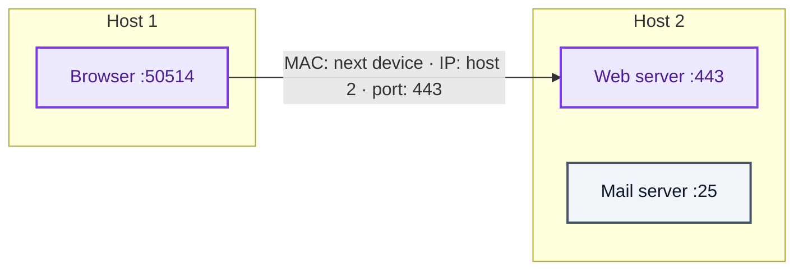

#### 2. End-to-end connection between hosts

- The transport layer creates the end-to-end connection between hosts, mainly with **TCP** and
  **UDP**.
- **TCP** is a reliable, connection-oriented protocol. It sets up the connection with a handshake
  and guarantees delivery.
- **UDP** is stateless and unreliable: best-effort delivery. It suits applications that care little
  about flow and error control and send a lot of data, such as video conferencing, and it is often
  used for multicast.

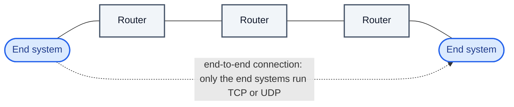

#### 3. Multiplexing and demultiplexing

- **Multiplexing** (many to one): at the sender, data from several processes is gathered,
  given headers, and sent over one network connection.
- It lets many processes on a host use the network at once, told apart by their **port numbers**.
- **Demultiplexing** (one to many): at the receiver, incoming segments are handed out to the right
  processes.
- The transport layer takes segments from the network layer and demultiplexes them, delivering each
  to the process it is addressed to.

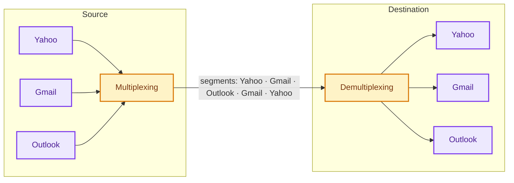

#### 4. Congestion control

- **Congestion** happens when too many sources send at once: router buffers overflow, packets are
  lost, and they have to be retransmitted.

**Congestion control algorithms:**

1. **Leaky bucket**
    1. When a host wants to send a packet, it drops it into the bucket.
    2. The bucket leaks at a constant rate: the interface transmits at a fixed rate.
    3. Bursty traffic comes out as smooth, uniform traffic.
    4. In practice the bucket is a finite queue emptied at a fixed rate.

   <figure>
     
     <figcaption>Bursty in, constant out.</figcaption>
   </figure>

2. **Token bucket**
    - A more flexible alternative to the leaky bucket for traffic shaping and rate limiting.
    - Tokens are added to the bucket at a fixed rate, one every tick, and each packet must take a
      token to be sent. When tokens have built up, a burst of packets can go out at once.

   <figure>
     
     <figcaption>(A) The bucket holds 3 tokens and 5 packets wait. (B) 3 packets were sent; 2 wait for more tokens.</figcaption>
   </figure>

**TCP congestion control**

TCP keeps a **congestion window** (cwnd) as well as the receiver's window, so both the receiver and
the network limit how much the sender has in flight. It moves through three phases:

1. **Slow start:** cwnd starts at 1 MSS (maximum segment size) and grows by 1 MSS for every
   acknowledgement, which doubles it every round trip: exponential growth.
   cwnd = cwnd + MSS (per ACK).

   | After round trip | Congestion window | Result |
   | --- | --- | --- |
   | 1 | 2¹ | 2 MSS |
   | 2 | 2² | 4 MSS |
   | 3 | 2³ | 8 MSS |

   ```mermaid
   sequenceDiagram
       participant S as Sender
       participant R as Receiver
       Note over S: cwnd = 1 MSS
       S->>R: segment 1
       R-->>S: ack
       Note over S: cwnd = 2 MSS
       S->>R: segments 1–2
       R-->>S: acks 1–2
       Note over S: cwnd = 4 MSS
       S->>R: segments 1–4
       R-->>S: acks 1–4
       Note over S: cwnd = 8 MSS
   ```

2. **Congestion avoidance:** once cwnd reaches the slow-start threshold, it grows **linearly**: by
   1 MSS per round trip (in practice MSS × MSS / cwnd per acknowledgement, which adds up to one MSS
   per round trip). It keeps growing until it reaches the receiver's window size.
3. **Congestion detection:** the sender reacts to a lost segment according to how it found out:
    1. **Timeout:** the timer expires before the acknowledgement arrives. This is the stronger sign
       of congestion; a segment has probably been dropped. Reaction:
        - set the threshold to half the current window,
        - drop cwnd to 1 MSS,
        - go back to slow start.
    2. **Three duplicate acknowledgements:** the weaker sign. One segment was probably lost while
       later ones got through. Reaction:
        - set the threshold to half the current window,
        - set cwnd to the new threshold,
        - continue in congestion avoidance.

<figure>
  
  <figcaption>Exponential up to the threshold, linear after it, capped by the receiver.</figcaption>
</figure>

#### 5. Data integrity and error correction

- The transport layer checks application data for errors with **error-detection codes and
  checksums**, verifies it is not corrupted, and uses **ACK** (acknowledgement) and **NACK**
  (negative acknowledgement) to tell the sender whether it arrived. The checksum works as in Part
  One: the sender adds the n-bit subunits, complements the sum and sends it with the data; the
  receiver adds everything, complements, and a result of 0 means no error.

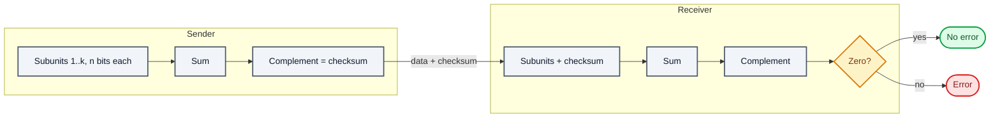

**Error control in TCP**

- TCP detects **corrupted, missing, out-of-order and duplicated** segments.
- It does so with three simple mechanisms:
    1. **Checksum:** every segment carries one. A corrupted segment is discarded by the receiver
       and treated as lost.
    2. **Acknowledgement:** confirms that data segments arrived. Control segments that carry no
       data but consume sequence numbers (SYN, FIN) are acknowledged too; pure ACK segments are
       not.
    3. **Retransmission:** a missing, delayed or corrupted segment is sent again, either when a
       timer runs out or when three duplicate ACKs arrive:
        1. **After RTO:** TCP keeps a retransmission timeout (RTO) timer for unacknowledged
           segments. When it expires, the earliest one is resent. The RTO is updated continually
           from measured round-trip times.
        2. **After three duplicate ACKs** (fast retransmit): if the RTO is long, three duplicate
           ACKs trigger an immediate resend of the missing segment instead of waiting for the
           timer.

#### 6. Flow control

- TCP stops a fast sender from overrunning a slow receiver, so no data is lost to the speed
  difference. It uses a **sliding window**: the receiver tells the sender how much it can accept,
  and the sender never has more than that outstanding.

### Port numbers

- A port number is a 16-bit integer, 0 to 65,535.
    - **Servers** listen on **well-known ports**, 0 to 1023, which are privileged.
    - **Clients** use **ephemeral** (short-lived) ports.
- The **Internet Assigned Numbers Authority (IANA)** keeps the list of assignments:
    - **Well-known ports** (0–1023) are controlled and assigned by IANA.
    - **Registered ports** (1024–49151) are registered with IANA for convenience. 49151 is about
      three quarters of the 65,536 possible ports.
    - **Dynamic ports** (49152–65535) are the ephemeral ports.

### Sockets

- A **socket** is one endpoint of a two-way communication link between two programs on a network.
- Its address is an **IP address plus a port number**.
- It enables **inter-process communication (IPC)** by giving each side a named point of contact.
- It is created with the `socket` system call, much as `pipe` creates a pipe.
- It gives bidirectional **FIFO** communication over the network.
- Sockets are the basis of **client-server** applications:
    - The server creates a socket, binds it to a port and waits for clients.
    - The client creates a socket and connects it to the server's socket.
    - Once the connection is up, data flows.

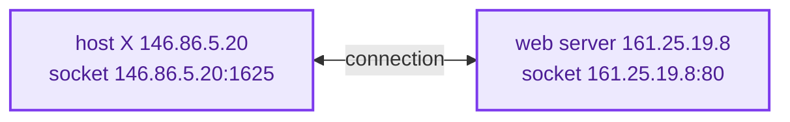

- **Types of socket:**
    - **Datagram socket:** connectionless, like a mailbox: packets posted to it are collected and
      delivered to the receiving socket.
    - **Stream socket:** connection-oriented, a sequenced flow of bytes with no record boundaries.
      Like a phone call: a connection is set up and the two ends talk over it.
- **Socket calls:**

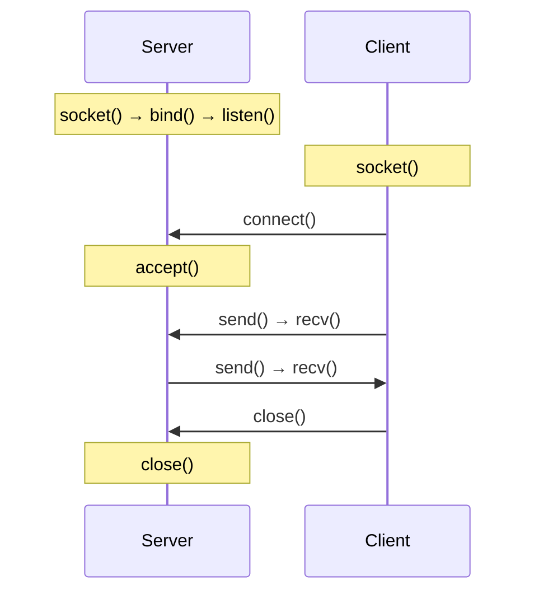

| Call | What it does |
| --- | --- |
| `socket()` | Create a socket |
| `bind()` | Give the socket an address, like a phone number to be reached on |
| `listen()` | Get ready to accept connections |
| `connect()` | Connect to a listening socket, as the caller |
| `accept()` | Accept an incoming connection, like answering a call |
| `write()` / `send()` | Send data |
| `read()` / `recv()` | Receive data |
| `close()` | Close the connection |

### TCP

- TCP (Transmission Control Protocol) is a reliable, **connection-oriented** protocol that delivers
  data securely and **in order** across interconnected networks, in **full duplex**.
- **Advantages:** reliable, with error checking and recovery; flow control; delivery and order are
  guaranteed; it is an open protocol owned by no one; and, as part of the TCP/IP suite, it works
  with IP addressing and domain names so hosts can be told apart.
- **Disadvantages:** heavyweight for small networks with few resources, its several layers can slow
  things down, it belongs to the TCP/IP suite and cannot run on other stacks such as Bluetooth's,
  and its core design has changed little since it was created decades ago.

#### Sequence and acknowledgement numbers

- **Byte number:** every byte to be sent is numbered, starting from an arbitrary value.
- **Sequence number:** a segment's sequence number is the byte number of its first byte, so the
  receiver can put segments back in order even if they arrive out of order.
- **Acknowledgement number:** because TCP is full duplex, each side also acknowledges. The
  acknowledgement number is the next byte the receiver expects, which confirms every byte before
  it.

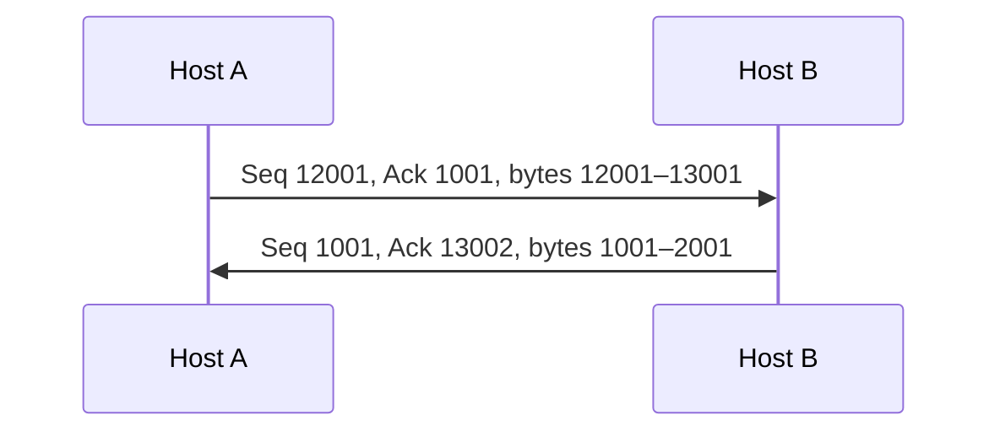

A's acknowledgement 1001 says it has everything up to byte 1000 and expects 1001 next. B's
acknowledgement 13002 says it has received A's bytes up to 13001 and expects 13002 next.

#### TCP header

20 to 60 bytes, followed by the data:

| Field | Bits | Meaning |
| --- | --- | --- |
| Source port | 16 | Port of the sending application |
| Destination port | 16 | Port of the receiving application |
| Sequence number | 32 | Byte number of the first data byte in this segment, for reassembly |
| Acknowledgement number | 32 | The next byte the receiver expects, acknowledging everything before it |
| Header length (HLEN) | 4 | Header length in 4-byte words: 5 (20 bytes, the minimum) to 15 (60 bytes, the maximum) |
| Reserved | 6 | Unused |
| Control flags | 6 | URG, ACK, PSH, RST, SYN, FIN (below) |
| Window size | 16 | How many bytes the sender of this segment can receive |
| Checksum | 16 | Error check; mandatory in TCP, unlike UDP |
| Urgent pointer | 16 | Valid only with URG: added to the sequence number, gives the byte number of the last urgent byte |
| Options and padding | 0–320 (0–40 bytes) | Extras such as MSS and window scaling |

The six flags control setting up, tearing down and aborting connections, flow control and how data
is handed over:

- **URG:** the urgent pointer is valid.
- **ACK:** the acknowledgement number is valid.
- **PSH:** push the data to the application now.
- **RST:** reset the connection.
- **SYN:** synchronise sequence numbers.
- **FIN:** finish (close) the connection.

#### The three-way handshake

- TCP uses **positive acknowledgement with retransmission (PAR)**: receipt is confirmed with
  acknowledgements, and anything lost or corrupted is sent again.
- The transport layer's PDU (protocol data unit) is the **segment**.
- A damaged segment fails its checksum and is discarded by the receiver.
- The sender keeps retransmitting until it gets a positive acknowledgement.
- Three segments are exchanged to set up a connection:
    - **Step 1 (SYN):** the client sends a segment with SYN set, telling the server it wants to talk
      and what sequence number it will start from.
    - **Step 2 (SYN + ACK):** the server replies with both flags set: ACK acknowledges the client's
      segment, and SYN gives the sequence number the server will start from.
    - **Step 3 (ACK):** the client acknowledges the server's reply. The connection is up and data
      transfer can start.

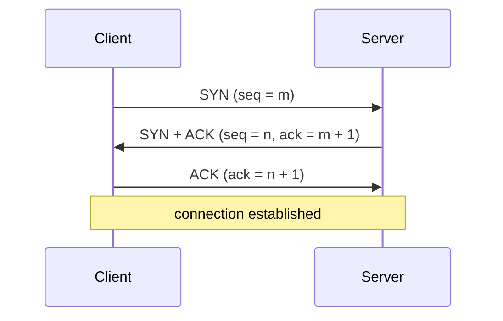

#### Connection establishment, with real numbers

1. The sender opens with:
    - **Seq = 521:** its random initial sequence number (RISN).
    - **SYN = 1:** asks the receiver to synchronise with that sequence number.
    - **MSS = 1460 B:** its maximum segment size, so segments will not need fragmenting.
    - **Window = 14600 B:** how much it can buffer from the receiver.
2. The receiver replies with:
    - **Seq = 2000:** its own random initial sequence number.
    - **SYN = 1:** asks the sender to synchronise with it.
    - **MSS = 500 B:** its maximum segment size; the two sides use the smaller.
    - **Window = 10000 B:** how much it can buffer from the sender.
    - **Ack = 522:** acknowledges the SYN and asks for byte 522 next.
    - **ACK = 1:** the acknowledgement number is valid.
3. The sender finishes with:
    - **Seq = 522:** the next sequence number.
    - **Ack = 2001:** acknowledges the receiver's SYN and asks for byte 2001 next.
    - **ACK = 1.**

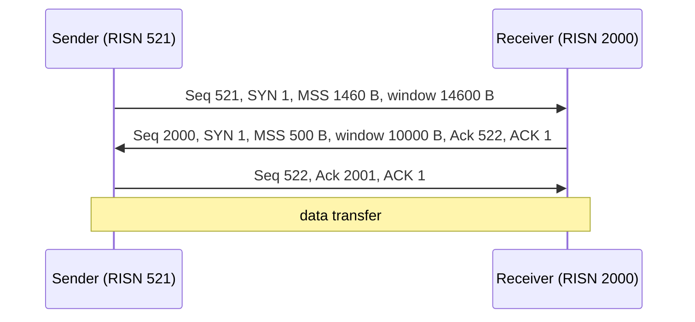

> A SYN consumes 1 sequence number, a bare ACK consumes 0, and every data byte consumes 1. That is
> why the acknowledgements are 522 and 2001 even though no data has been sent.

#### Connection termination

TCP releases connections in two ways:

1. **Graceful release:** the connection stays open until both sides have closed their half.
2. **Abrupt release:** one side is forced to close, or one user closes both directions at once.

**Abrupt release with RST (reset).** An RST segment is sent when:

- a segment other than SYN arrives for a connection that does not exist;
- a segment arrives with an invalid header, to fend off attacks;
- there are not enough resources for the connection, or the remote host is unreachable.

**Graceful release with FIN.** The notes' version of this sequence had the states tangled; here it
is as TCP defines it:

1. The client (the side closing first) sends a segment with **FIN** set and enters **FIN_WAIT_1**.
2. The server acknowledges it with an **ACK** and enters **CLOSE_WAIT**. The client, on getting the
   ACK, enters **FIN_WAIT_2**. Data can still flow from server to client.
3. When the server is done, it sends its own **FIN** and enters **LAST_ACK**.
4. The client acknowledges that FIN and enters **TIME_WAIT**. The server, on getting the ACK,
   closes.
5. The client stays in TIME_WAIT for a while (twice the maximum segment lifetime) in case its final
   ACK was lost and the server's FIN is retransmitted.
6. Then the client closes too and releases its resources.

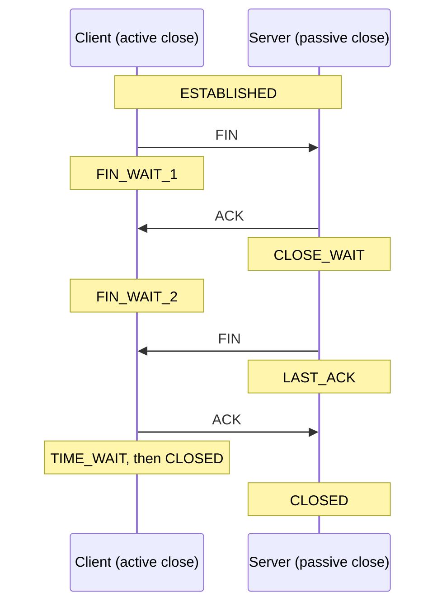

#### Piggybacking

- **Piggybacking** means holding back an acknowledgement and attaching it to the next outgoing data
  frame, so the ACK travels with the data instead of on its own.

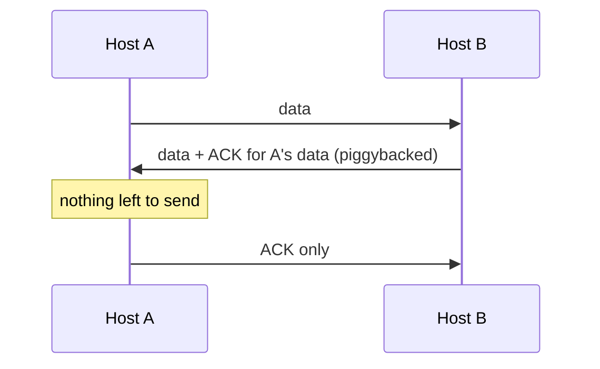

- **Context:** sliding-window algorithms let a sender have several frames unacknowledged at once.
  Both ends keep finite buffers, timers resend anything unacknowledged, the sender can send a whole
  window before the first ACK comes back, and the receiver advertises its window so its buffer
  never overflows.
- **Raising efficiency:** full-duplex transmission lets both sides send at once, like having two
  half-duplex links.
- **Why piggyback:** in full duplex you can either run two separate channels, each carrying data
  one way and ACKs the other, or piggyback: the receiver waits until it has data of its own to send
  and carries the ACK on it.
- **Advantages:** better use of channel bandwidth, lower cost, lower latency, and fewer delays and
  retransmissions thanks to short timers.
- **Disadvantages:** more complexity, and if the receiver waits too long to send its
  acknowledgement, the sender times out and retransmits the frame.

### UDP

- UDP (User Datagram Protocol) is a **connectionless**, **unreliable** transport protocol in the
  TCP/IP suite. It is low-latency and tolerates loss, with no connection set up first.

**UDP header** (8 bytes, followed by the data):

| Field | Bits | Meaning |
| --- | --- | --- |
| Source port | 16 | Port of the sender |
| Destination port | 16 | Port the datagram is for |
| Length | 16 | Length of header plus data |
| Checksum | 16 | One's complement of the one's-complement sum of the UDP header, a pseudo-header of fields from the IP header, and the data, padded with a zero byte if needed to an even length |

> Unlike TCP, UDP's checksum is optional (in IPv4). UDP has no error control or flow control, so it
> relies on IP and ICMP to report errors. It does provide port numbers, so requests from different
> users can be told apart.

- **Where UDP is used:**
    - Simple request-response exchanges with small amounts of data and little need for flow or
      error control.
    - Multicast and broadcast, which UDP supports and TCP does not.
    - Some routing protocols, such as **RIP**.
    - Real-time traffic: **online gaming** and streaming such as **IPTV and online radio**, **VoIP**
      (Skype, WhatsApp calls) and **video conferencing**, where low latency matters most.
    - **DNS** queries and responses.
    - **DHCP**, which assigns IP addresses; also **NTP, BOOTP, NNTP, TFTP, RTSP and RIP**.
    - Tools such as traceroute.
- **Advantages:** faster, lower latency, a simpler protocol, broadcast support, and smaller packets.
- **Disadvantages:** no reliability, no congestion control, no flow control, open to abuse (such as
  spoofing and amplification), and fewer suitable uses.

### TCP vs UDP

| Basis | TCP | UDP |
| --- | --- | --- |
| Type of service | Connection-oriented: the two ends set up a connection before sending and close it afterwards | Datagram-oriented: no opening, maintaining or closing a connection; efficient for broadcast and multicast |
| Reliability | Guarantees delivery to the destination | Delivery is not guaranteed |
| Error checking | Extensive, with flow control and acknowledgements | Basic, a checksum only |
| Acknowledgement | Yes | No |
| Sequencing | Yes: data arrives in order | No: if order matters, the application must handle it |
| Speed | Slower | Faster, simpler, more efficient |
| Retransmission | Lost packets are retransmitted | No retransmission |
| Header length | 20–60 bytes, variable | 8 bytes, fixed |
| Weight | Heavyweight | Lightweight |
| Handshake | SYN, SYN-ACK, ACK | None |
| Broadcasting | Not supported | Supported |
| Used by | HTTP, HTTPS, FTP, SMTP, Telnet | DNS, DHCP, TFTP, SNMP, RIP, VoIP |
| Stream type | Byte stream | Message stream |
| Overhead | Low, but higher than UDP | Very low |
| Applications | Where safe, dependable delivery is needed: email, web browsing, military services | Where speed matters more than dependability: VoIP, game streaming, video and music streaming |

---

Packets now reach the right network, and segments the right process. What is left is what the
processes say to each other.

Next: [DNS, DHCP and the application layer, plus the questions and commands that come up every day](/blogs/networking-application-layer-dns-dhcp/)
