[Part One](/blogs/networking-basics-physical-and-data-link/) moved frames and
[Part Two](/blogs/networking-network-and-transport-layers/) moved packets and segments. This part
is the top of the stack, where applications talk, then the two services every network depends on
(DNS and DHCP), a packet's whole journey, and a set of short answers and commands.

## 5. The upper layers

TCP/IP treats everything above transport as one application layer. OSI splits it into three:
session, presentation and application.

### Session layer

**What it is**

- The **5th layer** of the OSI model.
- It manages **communication sessions**: it sets up and maintains connections between end-user
  applications, handles data for the presentation layer, and uses the transport layer underneath.
- It takes **streams of data**, marks them, and **resynchronises** them, so a message is not cut off
  at the start and no data is lost.
- Setting up a session involves mapping addresses, choosing transport-quality parameters (packet
  loss, bit rate, delay, jitter, throughput, availability and so on), negotiating session
  parameters, sending limited user data, and monitoring the transfer.
- It is what makes it possible to send large files reliably.

**Functions**

- **Dialog control:** communication in half-duplex or full-duplex mode.
- **Token management:** stops two sides from running a critical operation at the same time.
- **Synchronisation:** adds **checkpoints** to data streams, so a session can be checkpointed and
  recovered.
- **Session management:** opens, closes and manages sessions between application processes.
- In practice these services are usually implemented through **remote procedure calls (RPCs)**.
- Synchronises information from different sources.
- **Connection control:** manages one or several connections per application.
- **Checkpoint procedures:** checkpoints for pausing, restarting and ending.
- **Fault tolerance:** resumes a session from a checkpoint after a failure.
- **Data handling:** takes data from the transport layer and passes it to the presentation layer.

**Protocols**

- **ADSP (AppleTalk Data Stream Protocol):** self-configuring LAN connections, alongside AARP
  (AppleTalk Address Resolution Protocol) and NBP (Name Binding Protocol).
- **RTCP (Real-time Transport Control Protocol):** out-of-band statistics and control for multimedia
  sessions, reporting on quality of service.
- **PPTP (Point-to-Point Tunneling Protocol):** VPNs built from a TCP control channel and a GRE
  (Generic Routing Encapsulation) tunnel, for remote access.
- **PAP (Password Authentication Protocol):** user validation in PPP, widely supported when a link
  is first set up.
- **RPC protocol:** runs procedures in another address space, for client-server interaction.
- **SDP (Sockets Direct Protocol):** socket streams over RDMA (Remote Direct Memory Access) fabrics,
  faster with no changes to applications.

### Presentation layer

**What it is**

- The **6th layer** of the OSI model, also called the **translation layer**.
- Data from the application layer is extracted and transformed here.
- Also called the **syntax layer**, because it makes sure data has the right syntax for the layers
  it passes to.

**Functions**

1. **Translation:** if sender and receiver use different encodings, such as ASCII and EBCDIC, it
   converts between them so the receiver can use the data.
2. **Encryption and decryption:** data in transit must be protected from eavesdropping and
   tampering. Plaintext is encrypted into unreadable ciphertext before sending and decrypted at the
   receiver, which keeps it confidential and intact.
3. **Compression and decompression:** large files are hard to send, so they are compressed for the
   trip and decompressed to their original size at the receiver.

**Sub-layers**

1. **CASE (Common Application Service Element):** serves the application layer (7) and requests
   services from the session layer (5). It supports general application services such as RTSE
   (Reliable Transfer Service Element), ROSE (Remote Operation Service Element), ACSE (Association
   Control Service Element) and CCR (Commitment, Concurrency and Recovery).
2. **SASE (Specific Application Service Element):** application-specific protocols such as MOTIS
   (Message Oriented Text Interchange Standard), RDA (Remote Database Access), FTAM (File Transfer,
   Access and Management), CMIP (Common Management Information Protocol), VT (Virtual Terminal), DTP
   (Distributed Transaction Processing) and JTM (Job Transfer and Manipulation).

**Protocols**

- **AFP (Apple Filing Protocol):** Apple's proprietary protocol for file services on Macs.
- **LPP (Lightweight Presentation Protocol):** ISO presentation services over TCP/IP.
- **NCP (NetWare Core Protocol):** file, print, directory, synchronisation, messaging and remote
  command services.
- **NDR (Network Data Representation):** defines data types and their representation on the wire.
- **XDR (External Data Representation):** a standard for describing and encoding data so it can move
  between different computer architectures.
- **SSL (Secure Sockets Layer):** secures data between a browser and a server by encrypting the
  link, so everything passed between them stays private.

### Application layer

**What it is**

The top layer of the OSI model. It gives users access to the network and talks directly to
applications, such as web services. It requests what it needs from the presentation layer, and
serves the application process.

**Functions**

- Lets users reach and work with data over the network: forwarding, storing and retrieving email,
  and accessing remote files.
- Lets software talk to other software and provides shared information and protocols for
  meaningful data exchange.
- Acts as an abstraction layer, defining the shared protocols and interfaces.
- Presents data to the user and works with the operating system to store it.
- Its protocols depend on what information is being exchanged, and include host initialisation
  and remote login.

**What application-layer protocols define**

- How the communicating parties set up the exchange.
- Which message types the two hosts exchange.
- The syntax of those messages.
- How a message is sent and what response is expected.
- How they interact with the layer below.

### Application-layer protocols

#### 1. Telnet

- **TEL**etype **NET**work, for **terminal emulation**.
- A Telnet client can use resources on a Telnet server, which is handy for managing files remotely
  and for the first setup of devices such as switches.
- The `telnet` command uses the protocol to talk to remote systems.
- Port **23**. It sends everything, passwords included, in plain text, which is why SSH replaced it.

```bash
telnet [\\RemoteServer]
telnet 192.168.0.100
```

#### 2. SSH (Secure Shell)

- A protocol for secure remote access to devices.
- Port **22** by default, over **TCP**.
- Encrypts everything between client and server.
- Supports password, public-key and certificate authentication.
- Allows remote command execution, file transfer, and tunnelling of other protocols (X11, for
  example).
- Strong protection against unauthorised access and eavesdropping.
- Used for secure server administration and file transfer.

```bash
ssh username@hostname
ssh john@example.com
ssh john@192.168.0.100
```

#### 3. FTP (File Transfer Protocol): how file transfer works

- Transfers files between a local and a remote file system.
- Uses two parallel TCP connections: the **control connection** on port **21** for commands, and
  the **data connection** on port **20** for the file itself (in active mode).
- Preferred over protocols like HTTP for bulk file transfer for its clarity and focus, and for
  handling differences between systems.
- Supports ASCII, EBCDIC and image (binary) file types.
- A session starts with the client opening the control connection; a data connection is then set up
  for each transfer.
- Client-server: the FTP client on the user's machine opens the connections and moves the files.
- Supports three data structures: **file**, **record** and **page**.
- Runs over TCP, with the well-known port 21.
- Advantages: speed, file sharing, efficiency. Disadvantages: file size limits, no support for
  multiple receivers, and no encryption.
- **Anonymous FTP** lets anyone download public files from some sites without a username or
  password.

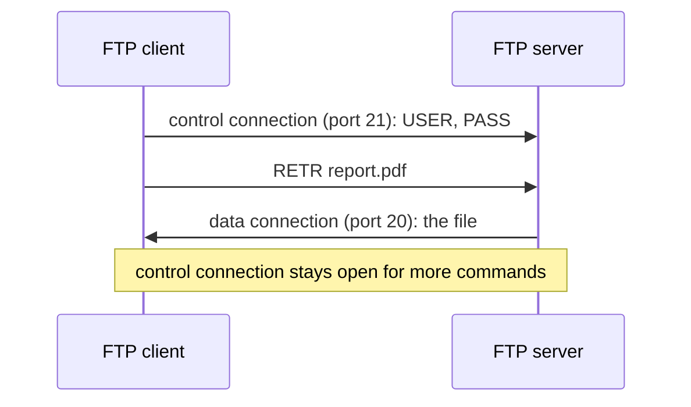

#### 4. TFTP (Trivial File Transfer Protocol)

- A stripped-down, simplified FTP, for moving files between network devices when you know exactly
  what you want and where it is.
- Port **69** (over UDP).

#### 5. NFS (Network File System)

- Lets remote hosts **mount file systems** over the network and use them as if they were local.
- Centralises storage on servers, which gives administrators more control and efficiency.
- Port **2049**.

#### 6. SNMP (Simple Network Management Protocol)

- A management station collects data by polling network devices, which report specific
  information.
- Devices share their current state, and administrators can change predefined values.
- Ports **161** (queries to agents) and **162** (traps sent by agents), both normally over **UDP**.

#### 7. HTTP and HTTPS (Hypertext Transfer Protocol, and HTTP Secure)

- HTTP is how the World Wide Web delivers data.
- **Hypertext** is text organised with links between documents.
- Client-server, over **TCP**.
- **Stateless:** the server keeps no memory of earlier requests.
- HTTP uses port **80**, HTTPS port **443**.

| HTTP | HTTPS |
| --- | --- |
| Sent as plain text: anyone who intercepts it between browser and server can read it | Encrypted, at the cost of some processing time: browser and server first exchange keys, using certificates, before any data moves |
| An application-layer protocol running directly on TCP | The same HTTP, run inside a TLS session between HTTP and TCP |
| No encryption, so low security | Encryption, so much better security |
| Faster | Slightly slower |
| No protection for the data in transit | Data is encrypted before it is sent and decrypted on the other side, with integrity checks |
| Transfers text, video and images on web pages | Transfers data securely over the network |

Over HTTP a login form sends `username: username / password: password` exactly as typed. Over
HTTPS the same fields cross the network as ciphertext such as
`qhgVtu0873LqtlOhhGGD5h/41638bVghRFg`, readable only by the server.

#### 8. SMTP (Simple Mail Transfer Protocol)

- Part of the TCP/IP suite. Moves email across networks with **store and forward**.
- Works with the **mail transfer agent (MTA)** to get mail to the right server and into the right
  inbox.
- Port **25**.

#### 9. POP (Post Office Protocol)

- Retrieves messages from a mail server.
- Current version: **POP3**.
- Port **110**, over **TCP**.
- Two modes: **delete** (messages are removed from the server once downloaded) and **keep**
  (messages stay on the server for later).

#### 10. IMAP (Internet Message Access Protocol)

- Retrieves and synchronises messages with a mail server.
- Current version: **IMAP4**.
- Port **143**, over **TCP**.
- Works in **synchronisation mode**: mail is read and managed on the server itself.
- Supports **server-side folders**: create, delete and organise folders on the server.
- **Multi-device sync:** a change on one device shows up on all of them.
- **Offline access** to messages already synchronised.

#### 11. MIME (Multipurpose Internet Mail Extensions)

- Extends SMTP to carry **non-ASCII data**: audio, video, programs and other files. It works
  alongside the other mail protocols to extend what they can carry.

#### 12. DNS and 13. DHCP

Both get their own sections next.

---

## DNS (Domain Name System)

- DNS is a set of **distributed databases**, run by a hierarchy of **name servers**, that translate
  **domain names** into **IP addresses**. The internet depends on it.
- **Why DNS?** Hosts are identified by IP addresses, which people find hard to remember, and a
  site's IP address can change. DNS maps a stable name to the current address.
- **Why DNS uses UDP rather than TCP:** DNS answers ordinary queries over **UDP port 53** because it
  is faster, suits small queries, scales, and has no connection to manage. UDP is unreliable, but
  the application adds reliability itself: it waits for a response and resends the query after a
  timeout. (DNS does use TCP port 53 for responses too large for a UDP packet and for zone
  transfers.)

### Types of domain

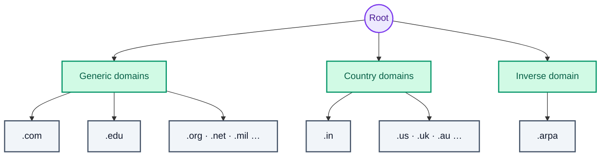

1. **Generic domains:** .com (commercial), .edu (educational), .mil (military), .org (non-profit),
   .net (similar to commercial).
2. **Country domains:** .in (India), .us, .uk and so on.
3. **Inverse domain:** maps an address back to a name. When a server gets a request from a client,
   it can check whether the client is authorised by asking DNS to map the client's address to a
   name.

### Components of DNS

- **DNS record:** holds a domain name, its IP address, validity, time to live, and everything else
  about that name. Records are stored in a tree.
- **Domain namespace:** the set of possible names, flat or hierarchical. The naming system keeps a
  set of **bindings** from names to values, and a **resolution mechanism** returns the value for a
  name. The tree can have 128 levels, from level 0 (the root) to level 127.
- **Name server:** implements the resolution mechanism; it is the internet's name service. Its
  database of names and addresses is distributed across many servers, following the name hierarchy
  and divided into **zones**.

Each node in the tree has a **label**, and a node's domain name is its labels read upward to the
root:

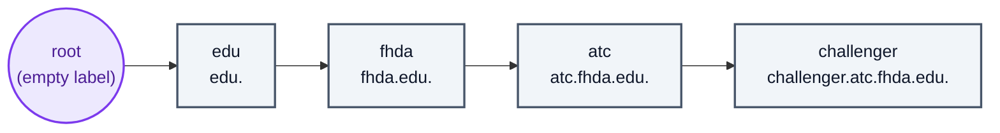

- **Fully qualified domain name (FQDN):** a complete, unambiguous name, with every label up to the
  root:
    - `www.example.com`
    - `mail.google.com`
    - `ftp.microsoft.com`
- **Partially qualified domain name (PQDN):** a name missing some labels, used inside local
  networks and internal systems:
    - `www` (no domain or top-level domain)
    - `mailserver` (no domain or top-level domain)
    - `dbserver.internal` (no higher-level domains)

### DNS architecture

- A **domain** is a subtree of the namespace: a named area of control. A **zone** is the part of a
  domain that one server is responsible for, with its own **zone file**. If a domain has no
  subdomains delegated elsewhere, the domain and the zone are the same thing.

<figure>
  
  <figcaption>Every subtree is a domain, and domains nest.</figcaption>
</figure>

<figure>
  
  <figcaption>The com server's zone is only part of the com domain; for mhhe, which delegates nothing further, zone and domain coincide.</figcaption>
</figure>

For example, the servers for `edu`, `berkeley.edu` and `cs.berkeley.edu` can each hold their own
zone:

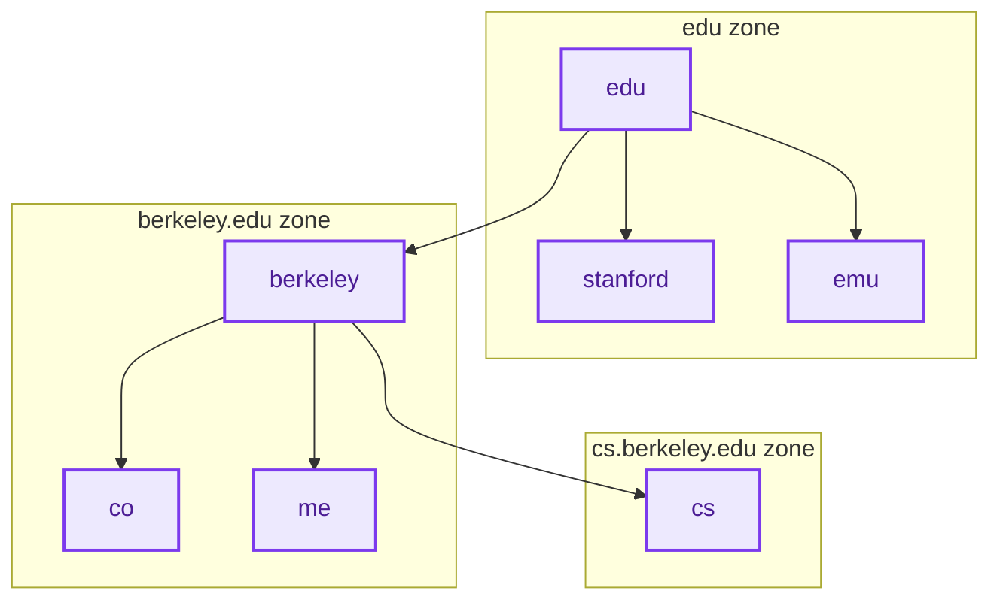

**The hierarchy of name servers:**

1. **Root servers:** the top of the hierarchy, covering the whole tree. They hold no information
   about domains themselves but **delegate authority** to other servers. There are **13 root
   server** identities (each run as many machines around the world).
2. **Primary server:** an authoritative server that stores the zone file for its zone and has the
   authority to create, maintain and update it. It loads the zone from a file on disk.
3. **Secondary server:** an authoritative server that copies the whole zone from another server,
   primary or secondary. It cannot create or change the zone file; it loads everything from the
   primary.

A typical external DNS request, as it flows through that hierarchy:

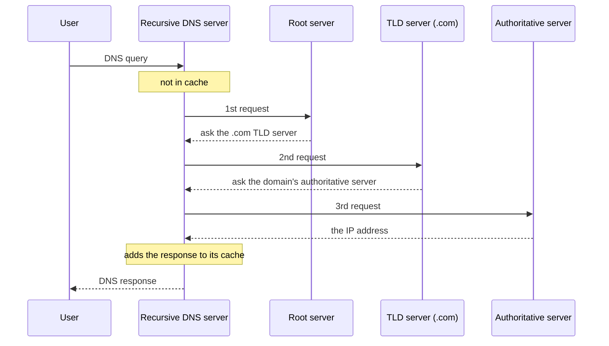

**Why distribute DNS?** Load balancing across the enormous volume of global queries, faster
answers from servers close to the user, redundancy so there is no single point of failure, and
simpler maintenance and updates.

### Address resolution in DNS

- The hierarchy: **root servers**, contacted by any server that cannot resolve a name itself;
  **top-level domain (TLD) servers** for com, org, edu and so on; and **authoritative servers** run
  by organisations or providers, which hold the definitive name-to-address mappings.
- **The resolver:**
    - DNS is a client-server application. A host that needs a mapping calls a DNS client, the
      **resolver**, which sends the request to the nearest DNS server.
    - If that server has the answer, it returns it. If not, it either **refers** the resolver to
      another server or **asks** other servers itself.
    - The resolver checks whether the response is a real answer or an error, and hands the result
      to the process that asked.
- **Mapping names to addresses:** the server looks the name up in the generic or country part of
  the tree. For a generic name like `chal.atc.fhda.edu`, the resolver asks its local DNS server,
  which refers or asks onward if it cannot answer. A country name like `ch.fhda.cu.ca.us` goes the
  same way.
- **Mapping addresses to names:** a client sends an IP address and asks for the name, a **PTR
  query**. DNS uses the inverse domain: the address is written backwards and `in-addr.arpa` is
  appended. To look up 132.34.45.121, the resolver asks for `121.45.34.132.in-addr.arpa`.

#### Recursive and iterative resolution

1. **Recursive resolution:** the client asks its local server for the mapping or an error, and
   each server that cannot answer forwards the query on its own behalf: the local server asks the
   root, the root asks the TLD server, and so on. The answer travels back along the same chain to
   the local server and then to the client.

   ```mermaid
   sequenceDiagram
       participant C as Client
       participant L as fhda.edu (local)
       participant E as edu server
       participant R as Root server
       participant Com as com server
       participant M as mcgraw.com
       C->>L: 1
       L->>E: 2
       E->>R: 3
       R->>Com: 4
       Com->>M: 5
       M-->>Com: 6
       Com-->>R: 7
       R-->>E: 8
       E-->>L: 9
       L-->>C: 10
   ```

2. **Iterative resolution:** each server that cannot answer returns the address of the next server
   to ask, and the client does the asking. The query goes to the local server, then the root, then
   the TLD server, and so on, until one of them returns the address.

   ```mermaid
   sequenceDiagram
       participant C as Client
       participant L as fhda.edu (local)
       participant E as edu server
       participant R as Root server
       participant Com as com server
       participant M as mcgraw.com
       C->>L: 1
       L-->>C: 2 (referral)
       C->>E: 3
       E-->>C: 4 (referral)
       C->>R: 5
       R-->>C: 6 (referral)
       C->>Com: 7
       Com-->>C: 8 (referral)
       C->>M: 9
       M-->>C: 10 (answer)
   ```

| Property | Iterative | Recursive |
| --- | --- | --- |
| Server's response | Best match or a referral | The mapping, or an error |
| Who forwards the query | Each server returns the next server's address | Each server forwards the query itself |
| Load on the queried servers | Lower: each only answers or refers | Higher on the servers that do the chasing |
| Response time for the client | Longer, since the client makes every query | Shorter from the client's view |
| Caching | Less useful, since servers return referrals | More useful, since servers see the final answers |
| Security | Lower: many servers could tamper with the answer | Higher: the client trusts only its local server |

(In the notes the load row had the two swapped: in recursive resolution it is the servers doing the
work, which is why root and TLD servers only answer iteratively in practice.)

#### Caching

- In both iterative and recursive resolution, servers **cache** the mappings they receive, so the
  next lookup is faster. A cached answer is marked **unauthoritative**.
- Each cached mapping has a **TTL**. Servers drop mappings whose TTL has expired, so clients are
  not given stale answers: caching speeds things up without serving outdated data.

### DNS delegation

**Delegation** happens when the authoritative server for a domain, asked about a subdomain, answers
with **name server (NS) records** pointing to other servers: it hands authority for the subdomain
over to them.

### Types of DNS attack

1. **Denial of service (DoS):** the attacker makes a server unavailable by overwhelming it or
   exhausting its resources.
2. **Distributed denial of service (DDoS):** the attacker uses many machines to flood the victim
   with traffic.
3. **DNS spoofing:** the victim gets a wrong IP address for the site it asked for. Attackers exploit
   flaws in DNS to insert a fake entry and redirect users to a malicious site.

   ```mermaid
   flowchart LR
       C([Client]) -->|1. request for the real site| D[(DNS server)]
       Att[Attacker] -->|2. injects a fake DNS entry| D
       D -->|3. resolves to the fake site| F[Fake website]
       D -.-x|never reached| Real[Real website]
       classDef actor fill:#DBEAFE,stroke:#2563EB,color:#1E3A8A,stroke-width:2px
       classDef store fill:#CFFAFE,stroke:#0891B2,color:#164E63,stroke-width:2px
       classDef error fill:#FEE2E2,stroke:#DC2626,color:#7F1D1D,stroke-width:2px
       classDef ok    fill:#DCFCE7,stroke:#16A34A,color:#14532D,stroke-width:2px
       class C actor
       class D store
       class Att,F error
       class Real ok
   ```

   Defences: **DNSSEC** (DNS Security Extensions) digitally signs DNS data; source authentication
   with **IPsec or TLS**; **response rate limiting** against amplification attacks; **DNS
   filtering** to block known malicious domains and addresses; **monitoring and analysis** to spot
   anomalies; and keeping DNS software **patched**.

4. **Fast flux:** constantly changing the DNS records behind a name to hide where the attacker
   really is.
5. **Reflected attacks:** queries are sent with the victim's address spoofed as the source, so the
   answers go to the victim.
6. **Reflective amplification DoS:** the same, with queries chosen so the answers are much larger
   than the questions, amplifying the flood.

General measures: **digital signatures and certificates** to authenticate sessions and protect
data, running current software such as recent **BIND** versions, applying patches, **replicating
data** across servers so nothing is lost, blocking **redundant queries** to hinder spoofing, and
**limiting the number of queries** a client can make.

---

## DHCP (Dynamic Host Configuration Protocol)

- DHCP is an application-layer protocol that **hands out IP addresses** to clients on a network,
  using a client-server model. Along with the address it provides settings such as:

```text
Subnet mask              (option 1,  e.g. 255.255.255.0)
Router address           (option 3,  e.g. 192.168.1.1)
DNS server address       (option 6,  e.g. 8.8.8.8)
Vendor-specific info     (option 43, e.g. 'unifi' = 192.168.1.9, where unifi is a controller)
```

- **Why use DHCP?** It automates and centralises IP address management: it offers **leases** to
  DHCP-enabled clients and keeps every host's address unique.

**Components**

1. **DHCP server:** holds the IP addresses and configuration.
2. **DHCP client:** a device that receives configuration from the server.
3. **DHCP relay:** passes messages between clients and a server on another network.
4. **IP address pool:** the addresses the server can hand out.
5. **Subnets:** smaller portions of the network, used to partition it.
6. **Lease:** how long the configuration a client receives stays valid.
7. **DNS servers:** the server can tell clients which DNS servers to use.
8. **Default gateway:** where to send packets bound outside the local network.
9. **Options:** further settings, such as the subnet mask, domain name and time server.
10. **Renewal:** a client asks to extend its lease before it expires.
11. **Failover:** two servers configured to back each other up.
12. **Dynamic updates:** the server can update DNS records with clients' addresses.
13. **Audit logging:** the server logs transactions for monitoring and management.

### How DHCP works: DORA

A client gets its address through four messages, abbreviated **DORA**:

| Message | Sent by | Purpose |
| --- | --- | --- |
| Discover | Client | Finds a DHCP server |
| Offer | Server | Offers a unique IP address and the other settings the client needs |
| Request | Client | Asks for the settings in the offer |
| Acknowledgement | Server | Assigns the IP address, mask, default router and DNS server |

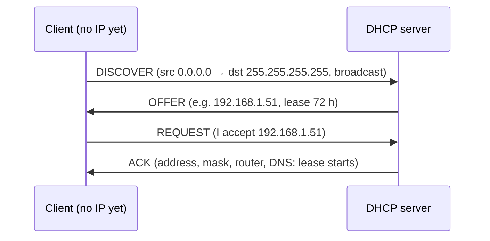

- DHCP runs over UDP on IP, so its messages are IP packets.
- A host with no address yet uses **0.0.0.0** as its source address.
- It sends to the local broadcast address **255.255.255.255**.
- If the DHCP server is not on the local LAN, the router is configured with an **IP helper
  address**: the DHCP server's address.
- The router rewrites broadcast DHCP packets to the helper address, so the DORA exchange can reach
  a server outside the LAN.

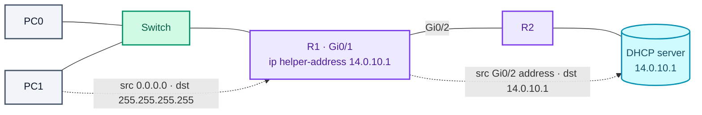

1. PC1 broadcasts a Discover, but there is no DHCP server on its LAN.
2. R1 receives the packet and, because of its IP helper address, rewrites the destination to the
   DHCP server, 14.0.10.1, and the source to its own outgoing interface, Gi0/2.
3. The DHCP server receives the Discover and responds.
4. It sends the Offer with its own address as source and R1's Gi0/2 address as destination: it
   reverses the addresses of the packet it received.
5. R1 receives the Offer and forwards it to PC1.
6. The Request and Acknowledge are exchanged the same way.

### The eight DHCP messages

1. **DHCPDISCOVER:** the first message, broadcast by the client to find DHCP servers (342 or 576
   bytes). Example: source MAC 08002B2EAF2A, destination MAC FFFFFFFFFFFF, source IP 0.0.0.0,
   destination IP 255.255.255.255.
2. **DHCPOFFER:** the server's broadcast reply (342 bytes), offering an unleased IP address and
   configuration, including its server ID. Example: source IP 172.16.32.12, destination IP
   255.255.255.255, source MAC 00AA00123456, destination MAC FFFFFFFFFFFF, offering 192.16.32.51
   with a 72-hour lease, for client ID 08002B2EAF2A.
3. **DHCPREQUEST:** on receiving an offer, the client first sends a **gratuitous ARP** for the
   offered address. If nobody answers, the address is free, and the client broadcasts a request
   accepting it, with its client ID (source IP 0.0.0.0, destination IP 255.255.255.255, source MAC
   08002B2EAF2A, destination MAC FFFFFFFFFFFF).
4. **DHCPACK:** the server **binds** the address and lease to that client ID and grants it,
   recording the client in its lease table. Example: destination MAC FFFFFFFFFFFF, destination IP
   255.255.255.255, source IP 172.16.32.12, source MAC 00AA00123456.
5. **DHCPNAK:** the server refuses a request for an invalid address, for example when it has no
   unused addresses left and the pool is empty.
6. **DHCPDECLINE:** the client rejects the configuration because the parameters are invalid, or
   because its gratuitous ARP got an answer, meaning the address is already in use.
7. **DHCPRELEASE:** the client gives its address back and cancels the rest of its lease.
8. **DHCPINFORM:** a client that already has an address, configured by hand, asks only for other
   local settings such as the domain name. The server answers with a unicast ACK carrying the
   settings, without assigning an address.

> Any of these messages can also be unicast, by a **DHCP relay agent**, when the server is on a
> different network.

The client's side of the protocol as a state machine:

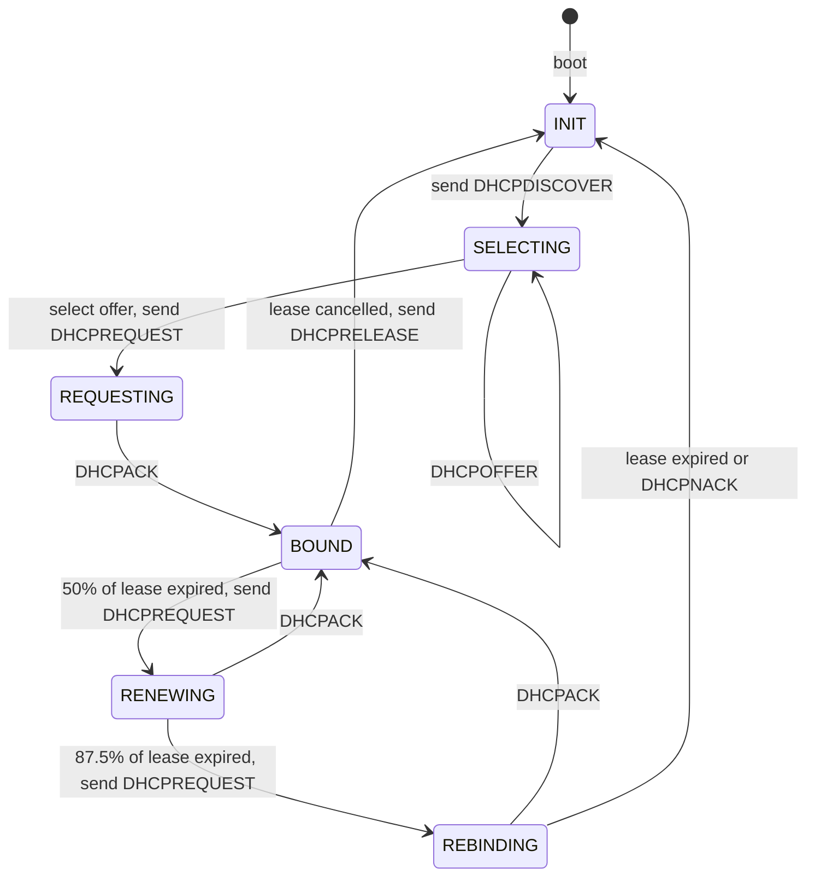

**Advantages:** central management of IP addresses, automatic TCP/IP configuration, easy to add
new clients, addresses are reused, address changes are handled efficiently, the address space is
easy to reconfigure, and new users are easy to handle.

**Disadvantages:** possible IP conflicts, the risk of clients accepting a rogue DHCP server, no
network access when the DHCP server is down, and a machine's name is not updated automatically
when it gets a new address.

## RPC (Remote Procedure Call)

- An inter-process communication technique for building distributed client-server applications.
- The client calls the server as if it were calling an ordinary local procedure.
- It works like a function call: the arguments go to the remote procedure and the caller waits for
  the result.

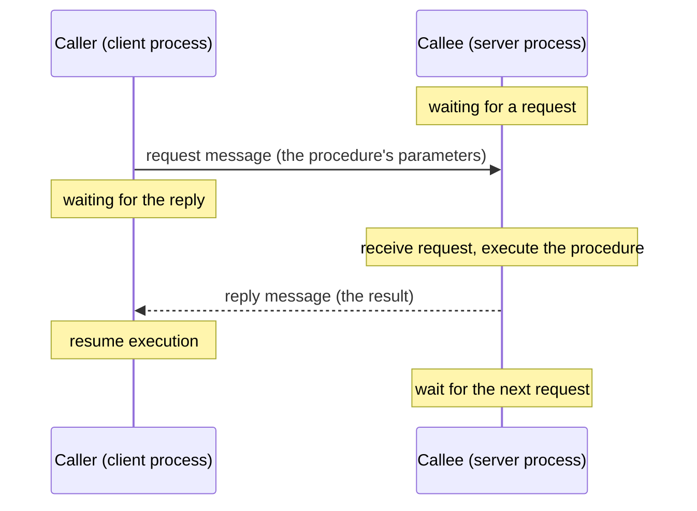

- **Features:** a well-defined interface; the procedure runs in the server process; the processes
  can be on the same machine or different ones; parameters are passed by value.
- **Advantages:** makes client-server communication easy, supports process- and thread-oriented
  models, hides the message passing from the programmer, works in distributed environments, and
  needs little rewriting of existing code.
- **Drawbacks:** calls take longer than local ones, more can fail because several machines and
  processes are involved, implementations are not standardised, it is inflexible about hardware
  architecture, and each call costs more.
- **Types:** **callback RPC** (enables a peer-to-peer style), **broadcast RPC** (the request is
  processed by several servers), and **batch-mode RPC** (requests are queued and sent in batches).
- **Architecture:** the **client** makes requests, the **server** answers them, the **client stub**
  packages the call, the **runtime library** manages the RPC, and the **server stub** holds the
  server's procedures and unpacks the call.

---

## How a packet travels

1. **Sender:** the packet starts at a device on a network, such as a computer or a server.
2. **Encapsulation:** the sender wraps the data into packets, each with a header (control
   information such as source and destination addresses) and a payload (the data).
3. **Sender to switch:** if sender and receiver are on the same LAN, the packet goes from the
   sender to the local switch, a data-link (layer 2) device.
4. **Switch examines:** the switch reads the destination MAC address to find the right port.
5. **Switch forwards:** it sends the frame out of the port the receiver is on, so the two
   communicate directly within the LAN.
6. **Switch to router:** if the receiver is on a different network or subnet, the packet must go
   through a router. The switch delivers it to the router on the sender's LAN.
7. **Router examines:** the router reads the destination IP address to work out how to reach the
   receiver's network.
8. **Routing decision:** using its routing table, routing protocols and other information, it picks
   the next hop.
9. **Router to router:** the packet passes from router to router along the path; the routers keep
   their tables current with protocols such as RIP or OSPF.
10. **Router to switch:** the packet reaches the router on the receiver's LAN, which checks the
    destination IP once more to pick the outgoing interface.
11. **Switch to receiver:** that router hands the packet to the receiver's switch, which reads the
    destination MAC address and forwards it to the receiver's port.
12. **Receiver:** the packet arrives, and the device unwraps it to get the original data.

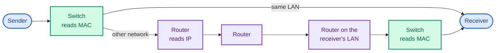

(One detail the steps gloss over: between routers the IP addresses stay the same end to end, but
each hop builds a new frame with new MAC addresses, the ones for that hop only. That is what ARP,
from Part Two, is for.)

---

## Short answers

### What is the difference between the internet and the web?

The **internet** is a global network of networks. The **web** (World Wide Web) is a collection of
information reached over the internet. The internet is the infrastructure and the web is software
running on it: the web uses **HTTP** (port **80**, or 443 for HTTPS) to carry documents in **HTML,
CSS and JavaScript**, while the internet carries many other protocols on many other ports.

### What are a client, a server, a host and a peer?

- A **client** is hardware or software that uses a service a **server** provides, usually (not
  always) on a different machine.
- A **server** is a computer that runs **services** for others: file storage, databases, media
  sharing, printing, serving websites.
- A **host** is any computer that provides or uses data or services over a network and has an
  **IP address**, unlike devices such as modems, hubs and switches.
- A **peer** is a computer that both **requests** and **provides** data or services, acting as
  client and server with no hierarchy, so peers share resources with each other.

### What is network bandwidth?

The maximum rate at which a link can carry **data**, which sets the transfer rate and how many
devices it can support. It is measured in bits per second (bps) and its multiples. On a
**symmetrical** connection upload and download are the same; on an **asymmetrical** one, upload is
usually smaller.

### What is jitter?

Variation in the delay of **packets** over a connection, caused by **congestion** or **route
changes**. It degrades **video** and **audio**, especially in **conference calls** and **VoIP**.

### What is localhost?

- **127.0.0.1** (`http://localhost`) is your own computer, reached through the **loopback
  interface** without touching the network. It is used to run a local server for testing web
  applications, to block malicious sites through the hosts file, and to simulate connections
  without network errors.
- Your machine also has a separate address on your local network, such as **192.168.0.x**,
  usually handed out by your router's DHCP server (the notes said by the ISP; the ISP assigns the
  router's public address).
- Tools such as **XAMPP** are commonly used to run a test server on localhost.

### What is noise?

- Any unwanted signal or disturbance that interferes with a **transmission**, weakening it and
  making communication less efficient.
- **Thermal noise** comes from temperature and is present in all media and equipment.
  **Intermodulation (IM) noise** comes from spurious frequencies produced by non-linear devices
  or media.
- **Crosstalk** is electromagnetic interference between circuits or cable pairs, so signals
  overlap.
- **Impulse noise** is a sudden, brief disturbance.

### What are distortion and attenuation?

- **Distortion** is a change to a signal in transit that makes it arrive unclear. It is common in
  **sound**, **video** and **display** signals, and in **data cables** such as network cables.
- **Attenuation** is loss of **signal strength** along a cable or connection, which leads to
  distortion. Better cables and **amplifiers or repeaters** counter it.

### What is an API gateway?

- A single **entry point** for clients that routes requests to the right services (and API
  versions), keeps communication with **microservices** secure and scalable, and can combine
  results from several services into one response.
- It works for monolithic and microservice applications alike. Its basic jobs:
    - Authenticating callers (AuthN)
    - Checking they are allowed to make the request (AuthZ)
    - Routing requests to the right backends
    - Rate-limiting to protect your systems from overload
    - Rate-limiting to blunt DDoS attacks
    - Terminating SSL/TLS to take that work off the backends
    - Handling errors and exceptions

### What is SSL/TLS?

**SSL (Secure Sockets Layer)** and its successor **TLS (Transport Layer Security)** set up
authenticated, encrypted links between computers on a network. SSL was deprecated when TLS 1.0
came out in 1999, but people still say "SSL" or "SSL/TLS" for both. The current version is
**TLS 1.3**, defined in [RFC 8446](https://tools.ietf.org/html/rfc8446) (August 2018).

### What is a reverse proxy?

- A **proxy server** (forward proxy) sits between client machines and web servers, taking the
  clients' requests and forwarding them on their behalf. Used to get around restrictions, control
  what content can be reached, or add anonymity.

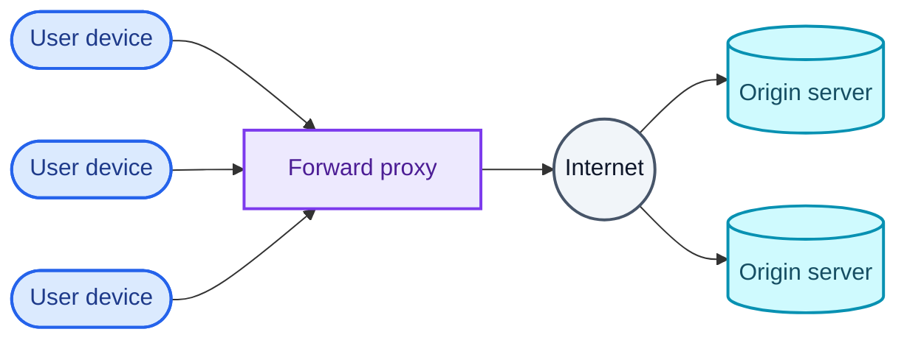

- A **reverse proxy** sits in front of the **origin servers** instead: it takes clients' requests
  from the internet and forwards them to the servers. It gives **load balancing**, protection from
  **attacks**, **global server load balancing (GSLB)**, **caching** and **SSL termination**.

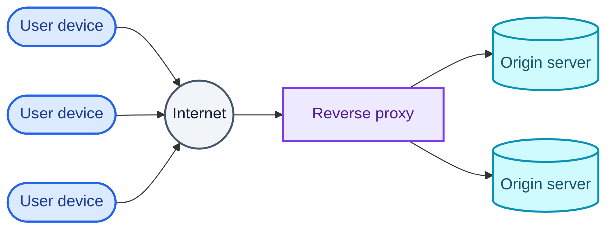

The difference is which side the proxy works for: a forward proxy acts for the clients, a reverse
proxy for the servers.

### What is load balancing?

Spreading network traffic across several **servers**, for high **availability**, scalability and
reliability, with less **downtime**, more **redundancy**, more **flexibility** and better
**efficiency**.

### What is a VIP?

A **virtual IP** is an address not tied to one physical device or interface, which several devices
can share. It provides **high availability**, **load balancing** or **failover**. For example, a
web server cluster can publish one VIP for clients while requests are spread across the servers
behind it. If a server fails, another takes over the VIP and keeps serving.

### What is caching, and how is a website cached?

**Caching** stores copies of files or data in temporary storage, a **cache**, so they can be
fetched faster. A website is cached by **browsers**, **DNS servers** and **CDNs**, which keep a copy
of its content locally or nearby, so the next request is served from the cache instead of the
origin server.

### REST API vs HTTP API

In these notes, "HTTP API" means an RPC-style API that happens to run over HTTP, as opposed to one
designed around REST's constraints. REST itself is not tied to HTTP, and an HTTP API can use more
than GET and POST; the table reflects the typical contrast.

| REST API | HTTP API |
| --- | --- |
| An architectural style for distributed hypermedia systems: **Representational State Transfer** | An API that exposes operations over the HTTP protocol |
| Not a standard or specification, but a set of principles and constraints | Follows HTTP's defined rules and methods |
| Can use any protocol with a uniform interface, such as HTTP | Uses only HTTP |
| Requires stateless operations and uniquely identified resources | May be stateful, keeping client state in cookies and sessions |
| Supports multiple formats: XML, JSON, HTML | Usually one format, JSON or XML |
| Uses HTTP verbs (GET, POST, PUT, DELETE…) on resources | Often uses just GET and POST, naming the operation in the URL |
| Scales well thanks to statelessness and resource identification | Session state can make it harder to scale |
| E-commerce: `GET /products` for product info, `POST /orders` to place an order | Email service: `POST /send-email` with parameters |

### Performance vs scalability

| Performance | Scalability |
| --- | --- |
| Measured by response time, throughput, availability, or requests over time | The ability to get past performance limits by adding resources |
| Affected by system load, resource use and application state | Affected by application topology, synchronisation and consistency |
| Improved by processing requests and using resources more efficiently | Improved by scaling up or scaling out |

### Latency vs throughput

| Latency | Throughput |
| --- | --- |
| The time for a packet to cross the network | The amount of data sent and received per unit of time |
| Measured in milliseconds (ms) | Measured in bits per second (bps) |
| Affected by distance, number of routers and network design | Affected by bandwidth, hardware performance and congestion |
| Says how fast packets arrive | Says how many packets get through in a period |
| High latency makes services slow and choppy | Low throughput means poor quality and lost packets |

### 1G vs 2G vs 3G vs 4G vs 5G

| Generation | Key features |
| --- | --- |
| 1G | Analogue, with poor battery life and voice quality. Up to 2.4 kbps. |
| 2G | Digital, with CDMA and GSM. Introduced SMS and international roaming. Up to 50 kbps (GPRS) or 1 Mbps (EDGE). |
| 3G | UMTS core network. Brought web browsing, email and multimedia. At least 200 kbps; up to 2 Mbps stationary, 384 kbps on the move. |
| 4G | A big jump in speed. IP telephony, mobile web, HD mobile TV. Up to 100 Mbps in motion and 1 Gbps stationary. |
| 5G | Faster (up to 20 Gbps), lower latency, more capacity, massive IoT and AR support, with network slicing and mMTC (massive machine-type communication). |

### How does a VPN work?

A VPN builds a **secure tunnel** from your device to a **VPN server**. Your traffic is encrypted
inside the tunnel and leaves from the server, which hides your IP address and protects what you do
from your ISP and other third parties on the way.

### How does Bluetooth work?

- It uses **radio waves** to connect devices.
- Devices form **ad hoc networks** (temporary networks with no central infrastructure) called
  **piconets**, with one **master** and up to seven **slaves**.
- The master sets the timing and frequency hopping, and can swap roles with a slave.
- Several piconets can be linked into a **scatternet**.
- It runs in the **2.4 GHz ISM band** and uses spread-spectrum frequency hopping to avoid
  interference and add security.
- Data rates and range depend on the device class and Bluetooth version.

### How does a hotspot work?

- A **hotspot** gives **wireless internet access** to devices in range.
- It can be a **device** (a phone, router or dongle) sharing its **cellular data** with others.
- It can be a **place** (a café, hotel or park) offering **public Wi-Fi**.
- It lets you get online without your own data plan or a wired connection.
- It may be limited in **speed**, **bandwidth**, **security** and **availability**.

### How does ATM work?

**Asynchronous Transfer Mode (ATM)** is a *cell relay* technology that carries many kinds of
traffic, data, video and voice, in *small fixed-size packets* called *cells* (53 bytes). It sets up
end-to-end connections with *virtual circuits* and *cell switching*, and gives each type of traffic
its own *quality of service*. The notes describe four layers:

- The **ATM adaptation layer** shields higher-layer protocols from ATM's details and cuts user data
  into cells.
- The **physical layer** sends and receives bits on the medium and packs cells into frames.
- The **ATM layer** transmits and switches cells, handles congestion control and cell headers, and
  shares virtual circuits over the physical link.
- The **WAN layer** carries ATM service over long distances, routers and broadband networks.

ATM has been used for *WANs*, *multimedia VPNs*, *frame relay backbones*, *residential broadband*
and *carrier infrastructure*.

---

## Networking commands

### 1. ping

- Tests whether a host is **reachable** by sending ICMP **echo requests** and waiting for
  **replies**, which helps pin down network problems.
- Example: if an office's internet connection is down, ping shows whether the problem is inside the
  office or in the provider's network.

| Option | Description (Windows `ping`) |
| --- | --- |
| `target` | The IP address or hostname to ping. |
| `-a` | Resolve the target's IP address to a hostname. |
| `-t` | Ping until stopped with Ctrl-C. |
| `-n count` | Number of echo requests to send, 1 to 4,294,967,295. Default 4. |
| `-l size` | Size of the echo request in bytes, 32 to 65,527. Default 32. |
| `-s count` | Report the Internet Timestamp of each hop for up to 4 hops. |
| `-r count` | Record the route for up to 9 hops (use `tracert` to see them all). |
| `-i TTL` | Set the time to live, up to 255. |
| `-f` | Set Don't Fragment, so routers cannot fragment the request. Used to troubleshoot path MTU (PMTU) problems. |
| `-w timeout` | Time to wait for each reply, in milliseconds. Default 4,000 (4 seconds). |
| `-p` | Ping a Hyper-V Network Virtualization provider address. |
| `-S srcaddr` | Use this source address. |

### 2. netstat

- A command-line tool on Windows, Linux, UNIX and most other systems that shows **statistics and
  details about current TCP/IP connections** and network protocols.

| Option | Description |
| --- | --- |
| `-a` | Show all connections and listening ports |
| `-b` | Show the executable behind each connection or listening port |
| `-e` | Show Ethernet statistics (combine with `-s`) |
| `-n` | Show addresses and ports as numbers |
| `-o` | Show the owning process ID of each connection |
| `-r` | Show the routing table |
| `-v` | With `-b`, show the sequence of components involved for each executable |

### 3. ipconfig

- Shows the device's **IP configuration**: **IP address**, **subnet mask** and **default gateway**.
  `ipconfig` at a Windows prompt shows the basics for the current device; `ipconfig /all` shows
  everything. It also has options for **DNS** and **DHCP** problems, such as `/flushdns`,
  `/release` and `/renew`.

### 4. hostname

- Computers need a unique name to find each other, the **hostname**: letters and digits, with some
  symbols allowed. In the **Domain Name System (DNS)** and on the **internet**, each label of a
  hostname is 1 to 63 characters, and the full name ends in a **top-level domain (TLD)**.

| Command (Linux) | Description |
| --- | --- |
| `hostname` | Print the computer's name (with its domain, where configured) |
| `hostname -s` | Print only the short computer name |
| `hostname -d` | Print the DNS domain name |
| `hostname -i` | Print the IP address for the hostname |
| `hostname -a` | Print the computer's aliases |

### 5. tracert

- A Windows command that traces the path a packet takes to a target and how many hops it needs,
  with details of each hop from source to destination. Available on all Windows versions
  (`traceroute` on Linux and macOS).

```bash
tracert [-d] [-h MaxHops] [-w TimeOut] target
```

Options:

- `target`: the destination, an IP address or hostname.
- `-d`: do not resolve IP addresses to hostnames, which is faster.
- `-h MaxHops`: the most hops to try before giving up. Default 30.
- `-w TimeOut`: how long to wait for each reply, in milliseconds.

### 6. nslookup

- Queries **DNS** for information about a name, and shows which DNS server answered, including
  the default server's name and IP address.

```bash
nslookup
nslookup [domain_name]
```

### 7. route

- Shows and edits the IP **routing table**, which directs packets between subnets. `route print`
  prints the table; `route add`, `route delete` and `route change` modify it.

### 8. arp

- **ARP** maps IP addresses to **MAC addresses** for local delivery. `arp -a` shows the ARP cache:
  IP addresses with their hardware (MAC) addresses, the interface, and the entry type (and on some
  systems flags and masks).

### 9. pathping

`pathping` combines **ping** and **tracert**. It traces the route, then gathers statistics over
about 300 seconds (by default) and reports **latency** and **packet loss** at every hop in between,
which tells you more than either tool alone.

```bash
pathping [-n] [-h MaxHops] [-g Hostlist] [-p Period] [-q NumQueries] [-w Timeout] [-i IPAddress] [-4] [-6] TargetName
```

- `-n`: do not resolve router addresses to names.
- `-h MaxHops`: the most hops to search. Default 30.
- `-w Timeout`: how long to wait for each reply, in milliseconds.
- `-i IPAddress`: use this source address.
- `TargetName`: the destination, an IP address or hostname.

---

That completes the stack: frames in [Part One](/blogs/networking-basics-physical-and-data-link/),
packets and segments in [Part Two](/blogs/networking-network-and-transport-layers/), and here the
applications, the services that name and number everything, and the tools to check it all.
