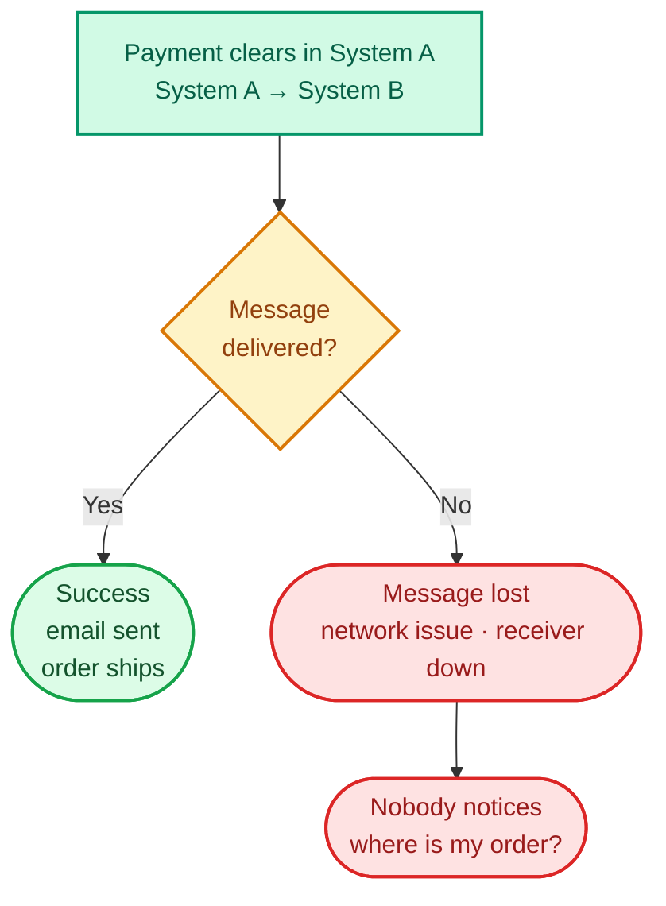
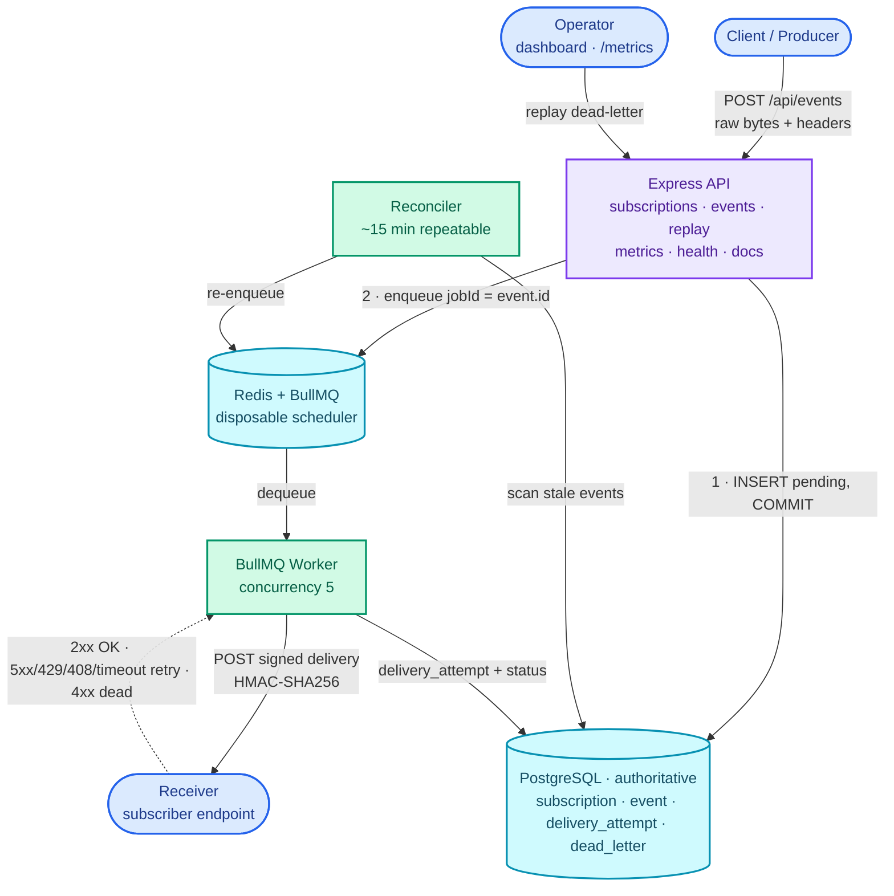
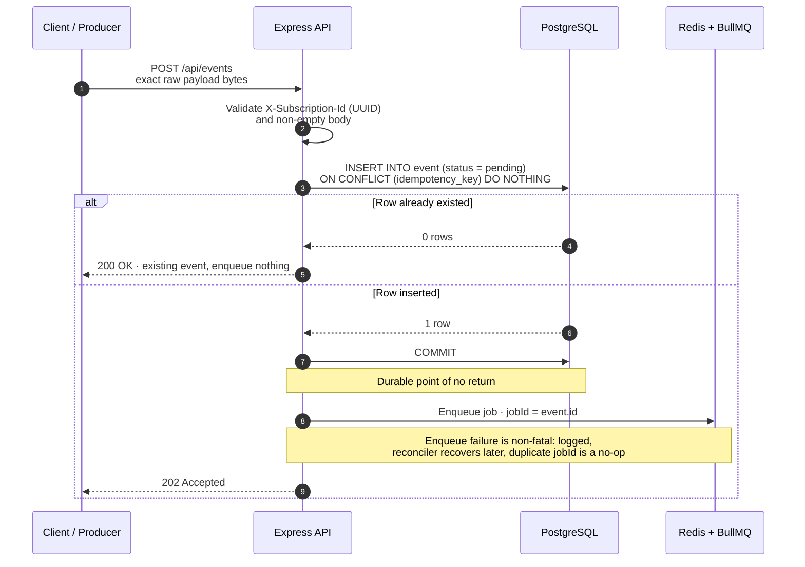
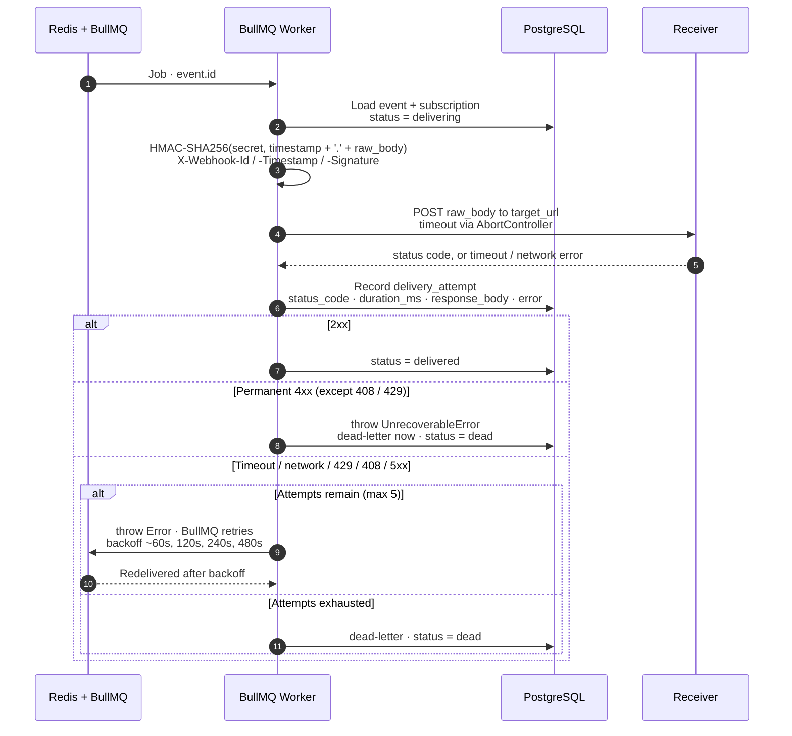
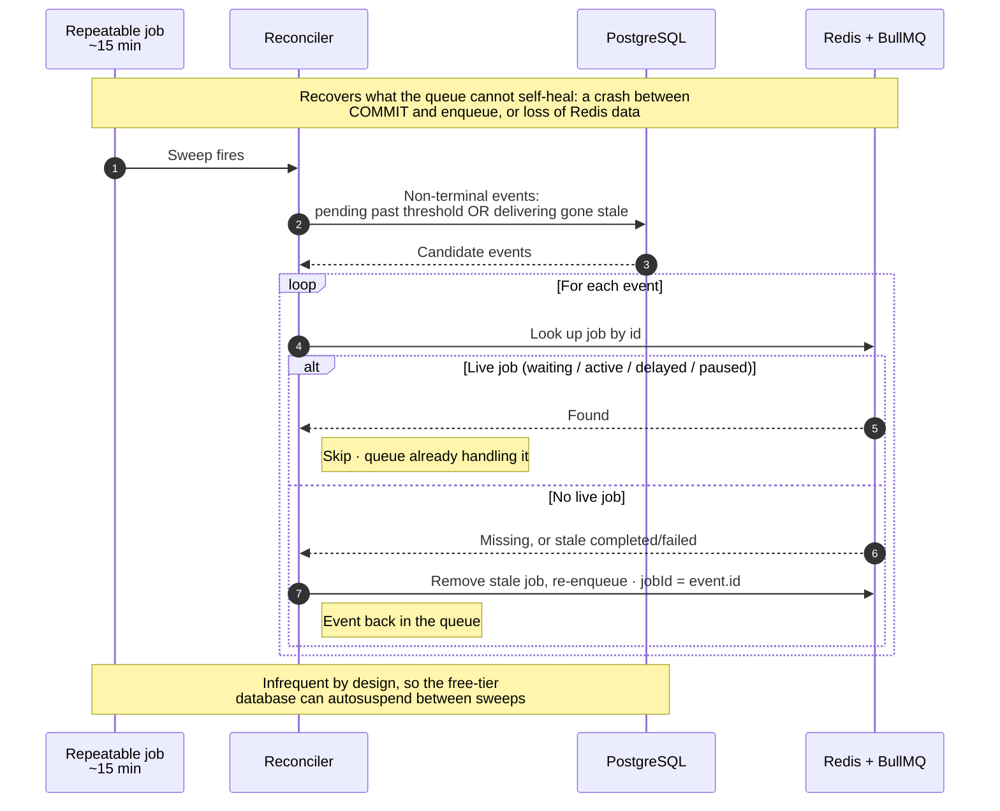
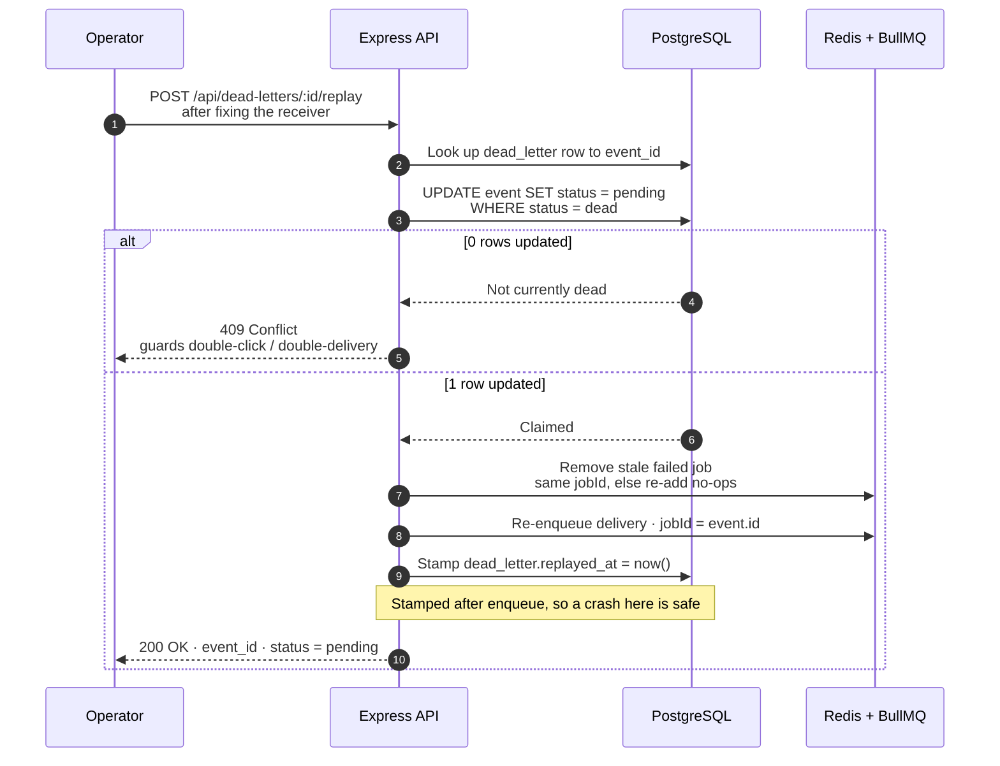

Think about the last time you bought something online. You hit Pay, and within a second or two
a lot of things happened at once: a confirmation email landed in your inbox, the store's
warehouse got told to start packing, maybe your bank pinged your phone. You didn't do any of
that. The payment happened in one system, but a handful of other systems found out about it
almost instantly.

How? A webhook. When something important happens in System A (a payment clears), System A
sends a small message over the internet to System B (the email service) saying "hey, this just
happened, here are the details." That's it. One computer tapping another on the shoulder.

So far, so boring, and I assumed it was a one-line problem too. Send a message to a URL. Then I
tried to build one I could actually trust.

## The catch: that little message can quietly vanish

The internet is not a reliable courier. When System A sends its "you've been paid" message, any
number of things can go wrong:

- System B might be down for a moment, or busy, or slow.
- The network might drop the message somewhere in between.
- System A itself might crash in the half-second right after the payment, before it ever got the
  message out.

The cruel part, and the thing that turns "send a message" into a hard problem, is that failure
is usually silent. Nobody gets an error. The payment went through, so the customer is happy. But
the warehouse never heard about it, so the order never ships. The money moved and the message
about the money evaporated: no alarm, no log, no trace. Days later someone files a support
ticket asking where their package is.

That's what this project exists to kill. An event happens, the news of it is lost, and nobody
finds out until the damage is already done.



The fix sounds easy. Just try again if it fails. But that innocent sentence hides a whole nest
of follow-up questions. Try again how many times? What if it failed because the message was bad
and will never work? What if the retry causes the customer to get charged, or emailed, twice?
What if your own server dies in the exact instant between recording the payment and sending the
message, and now how would you even know there was a message you still owed?

That last one is the rabbit hole, and I couldn't answer it, which is most of why I ended up
building the thing.

So: a self-hostable webhook delivery engine in Node.js, backed by Postgres and Redis, written
from scratch so I'd have to answer every one of those questions out loud.

What follows is why it's shaped the way it is. If you want the code first:
[github.com/rishabh0111/webhook-delivery-engine][repo]. Around 2.5k lines, fully tested, runs
on $0 of infrastructure. It's also deployed, so you can poke at the running thing: the
[operator dashboard][dashboard] and the [Swagger docs][docs].

---

## The promise the system makes

Most of the work was getting to one sentence I could state precisely and then never violate:

> Once the API returns `202`, the event will reach exactly one terminal state, `delivered` or
> `dead`, and every attempt in between is recorded and auditable.

Unpacked, that's three guarantees:

- **Exactly-once acceptance.** The same event submitted twice (same idempotency key) is stored
  once. No duplicate work, no duplicate delivery.
- **At-least-once delivery.** I will deliver your event one or more times until a receiver
  acknowledges it, so receivers have to be idempotent, exactly like with Stripe or GitHub. I
  send a stable event ID on every attempt precisely so they can dedup.
- **No silent loss.** Every accepted event is either `delivered`, or `dead` with a recorded
  reason and a one-click replay path. There is no fourth state where an event just disappears.
  That last one is the whole point, and it's by far the hardest to keep.

---

## The architecture, in one picture



There aren't many moving parts. The entire design hangs off a single decision about who is
allowed to be the source of truth:

> Postgres is authoritative for business state. Redis/BullMQ is a disposable scheduler.

That reads like a throwaway line. It's the load-bearing wall. I can lose my entire Redis
instance, every queued job gone, and still not lose an event or break the promise. The queue is
a fast, convenient way to schedule work, nothing more. The answer to "has this been delivered?"
lives in one place, and I treat that place as sacred.

The pipeline is ingest, durably persist, commit, enqueue, deliver, with an Express API and a
BullMQ worker in one Node process, a periodic reconciler as a safety net, and an operator-driven
replay path out of the dead-letter store.

---

## Decision #1: the dual-write problem, and finding the point of no return

Here's the trap, and it has a name. The naive ingestion handler does two writes to two systems:

```
1. INSERT event into Postgres
2. enqueue a delivery job in Redis
3. return 202 Accepted
```

This is the dual-write problem, and it's broken in a way that's invisible until it isn't. What
happens if step 2 fails? Redis blips, the process gets OOM-killed, a deploy cycles the
container, and now you've told the caller `202 Accepted` while no job exists and nothing will
ever deliver that event. It sits in the database, `pending`, forever. Silent, unrecoverable
loss, and it violates guarantee #3 on day one.

The fix is the transactional outbox pattern, and the insight that made it click for me was being
ruthless about which exact line is the point of no return:



```
1. INSERT event (status = pending)  -- ON CONFLICT (idempotency_key) DO NOTHING
2. COMMIT                            <-- the durable point of no return
3. enqueue job (jobId = event.id)   -- allowed to fail. genuinely.
4. return 202 Accepted
```

Once the Postgres `COMMIT` lands, the engine has promised. Step 3 is now allowed to fail,
because two other mechanisms catch it:

- The reconciler (a background sweep) finds any event that's `pending` with no live job and
  re-enqueues it.
- Setting `jobId = event.id` makes a duplicate enqueue a harmless no-op. Re-adding a job that
  already exists does nothing.

That second point also closes idempotency for free. The same `Idempotency-Key` twice hits `ON
CONFLICT DO NOTHING`, returns the existing event (`200` instead of `202`), and never spawns a
second delivery. So exactly-once acceptance and at-least-once delivery both fall out of one
schema constraint plus one deliberate job ID.

What this reframed for me: durability isn't a property of a system, it's a property of one
specific line of code. Find that line, say it out loud, and everything after it is allowed to
crash.

---

## Decision #2: not all failures deserve a retry

The lazy move is to retry every failure. But hammering a `401 Unauthorized` five times over
fifteen minutes accomplishes nothing. The receiver is telling you, unambiguously, that you are
never getting in. A `503` deserves another shot. Treat the two the same and you waste work and
delay the dead-letter an operator needs to see.

So the worker classifies every outcome:



| Outcome | Decision |
| --- | --- |
| `2xx` | delivered, done |
| `5xx`, timeout, network error, `429`, `408` | transient: retry, exponential backoff (~60s, 120s, 240s, 480s, 5 attempts) |
| any other `4xx` (`400`, `401`, `404`, ...) | permanent: dead-letter immediately, don't waste retries |

`408` (Request Timeout) and `429` (Too Many Requests) are 4xx codes, but I classify them as
transient. They mean "later," not "never." You only get that right by reading how the big
providers behave, not by eyeballing the status-code ranges. In code the whole thing collapses
onto BullMQ's two error types:

```js
// Permanent client error -> dead-letter now, no further attempts.
if (statusCode !== null && isPermanentStatus(statusCode)) {
  throw new UnrecoverableError(`permanent failure: status ${statusCode}`);
}
// Everything else is transient -> a plain Error, so BullMQ reschedules with backoff.
throw new Error(errorText || `retryable response: status ${statusCode}`);
```

Two lines carry the whole retry policy. The failure mode I'm most glad I handled, though, is
the hang: a receiver that accepts the connection and then never answers. Every timeout goes
through an `AbortController` with a hard per-attempt deadline, because without one a single
dead endpoint pins a worker forever and starves every other delivery behind it.

---

## Decision #3: the reconciler, a backstop for the gap I couldn't close

The outbox shrinks the danger window, it doesn't erase it. There's still a sliver between the
`COMMIT` and the enqueue, and a process that dies exactly there orphans the event. Rare. But
"rare" is not "never," and I wanted the thing to handle "never."

Hence the reconciler, a repeatable job (roughly every 15 minutes) that asks one question: are
there non-terminal events with no live job?



It scans Postgres for events stuck `pending` past a threshold or `delivering` gone stale, looks
each up in BullMQ, and re-enqueues anything with no live job. One mechanism covers two disasters:

1. The crash-after-commit gap above.
2. Total loss of Redis. If the disposable scheduler evaporates, the reconciler rebuilds the work
   queue from the source of truth. The system self-heals, which is the entire reason I was
   allowed to call Redis disposable in the first place.

There's a constraint hidden in that cadence. The free-tier Postgres I targeted autosuspends
when idle, so a chatty backstop polling every 30 seconds would keep it awake around the clock
and burn the quota doing nothing. Fifteen minutes is a deliberate trade of recovery latency for
letting the database sleep. A backstop you run constantly is just a load generator wearing a
useful hat.

---

## Decision #4: replay, without ever double-delivering

When an event dead-letters, the broken thing is usually the receiver, not the engine. Once it's
fixed, an operator should be able to say "try that one again." That's replay. Picture an
impatient operator double-clicking the button and the danger is obvious: you must not deliver
twice, and two replays must not race.



The guard is one atomic statement. No application locks, no race window:

```sql
UPDATE event SET status = 'pending' WHERE id = $1 AND status = 'dead'
```

If `rows updated = 1`, this caller won the replay and proceeds. If `0`, the event wasn't
actually `dead` (already replayed, or never dead) and the API returns `409 Conflict`. The
database does the mutual exclusion. Then I remove the stale failed job, re-enqueue, and stamp
`replayed_at` last, so a crash mid-replay leaves a safe, retryable state rather than a
half-finished one.

Let the database be the referee. Atomic conditional `UPDATE`s are something I now reach for
constantly and used to reach for never.

---

## Decision #5: signing the exact bytes, not a re-serialization

If a receiver is going to act on a webhook, it has to know the webhook came from me. The
standard answer is an HMAC signature, and the part that is painfully easy to get wrong is which
bytes you sign. My rule: sign the exact raw bytes that go over the wire.

```
HMAC-SHA256(secret, timestamp + "." + raw_body)
```

Parse the incoming JSON into an object, re-stringify it, sign that, and the receiver (who
recomputes the HMAC over the raw body they received) gets a different hash from one disagreement
about whitespace, key order, or unicode escaping. The signature fails for no real reason. So the
API is shaped around it: routing metadata, meaning subscription ID and idempotency key, rides in
headers, and the body stays the untouched payload, stored and signed and delivered byte for
byte.

Each signed delivery carries a stable `X-Webhook-Id` (dedup across retries), an
`X-Webhook-Timestamp` (so receivers can reject stale or replayed requests), and the
`X-Webhook-Signature`. Verification uses a constant-time comparison to avoid timing attacks.
Skip any one of those and the signature is decoration.

---

## The constraint that made the project real: $0 of infrastructure

This is where it stopped being a textbook exercise. I wanted it to deploy and stay running for
free, which meant the architecture had to bend around free-tier metering:

- **One process, two roles.** API and worker share a Node process because the target free host
  offers no separate worker dyno. This bugged me, since it's not how you'd scale, so the worker
  is fully isolated in its own module and splitting it is a one-line deployment change. I haven't
  done it, and I say so.
- **Memory-metered Redis (`noeviction`).** Successful jobs are dropped immediately
  (`removeOnComplete: true`) to reclaim space. Failed jobs are kept (`removeOnFail: false`)
  because replay needs them. Concurrency caps at 5, enough that one slow receiver can't stall the
  queue, low enough to fit the memory budget.
- **An autosuspending database**, which is the reason the reconciler is lazy rather than eager.

Designing inside hard limits sharpened every "disposable vs. authoritative" call, because on a
free tier the disposable thing really can vanish at any moment.

---

## The bugs that actually cost me time

The things that never make it into the tidy final diagram:

- **BullMQ's `failed` event fires on every attempt, not just the last.** My first dead-letter
  logic wrote a dead-letter row on the first `503`, before retries even began. The fix:
  dead-letter only when `job.attemptsMade >= job.opts.attempts` (or on an `UnrecoverableError`).
  Obvious in hindsight, an hour of real confusion in the moment.
- **Worker and producer need separate Redis connections.** Workers issue blocking commands, and
  sharing the producer's connection causes mystifying stalls. Also, `maxRetriesPerRequest: null`
  is mandatory on the worker connection or BullMQ refuses to boot.
- **`attempt_number` must survive replays.** I compute it as `MAX(attempt_number) + 1` per event
  rather than resetting, so a replayed event's audit trail reads as one continuous story instead
  of restarting at 1. Tiny thing, but it's what makes the log trustworthy.
- **Demoing time-delayed, async behavior is its own problem.** A real "retries exhausted ->
  dead-letter" takes around 15 minutes, and nobody watches a demo that long. So I built a runtime
  "fast mode" that compresses backoff to about 2s with no redeploy and no env change. It touches
  only newly-enqueued jobs and leaves production timing alone. Making the system demonstrable
  turned out to be its own engineering problem.

---

## What I deliberately left out, and why

This isn't a production webhook platform, and pretending otherwise would be the actual red
flag. So here's what I scoped out on purpose, each one a known, bounded piece of work rather
than an oversight:

- **Auth / multi-tenancy.** The API is open. Production needs API keys or OAuth and per-tenant
  isolation. Omitted to keep the focus on delivery semantics.
- **Topic fan-out** (one event to many subscribers) would mean splitting the `event` row from a
  per-target `delivery` entity, each with its own status. The right model, but a real schema
  change.
- **Per-subscription FIFO ordering** is not guaranteed (neither is it by most providers). It
  needs per-subscription serialization.
- **Secret encryption at rest.** Secrets are plaintext because they have to be readable to sign
  each delivery. They're not passwords, so you can't hash them. Production would use envelope
  encryption / KMS.
- **SSRF hardening.** Target URLs aren't yet validated against private or link-local ranges.
- **Honoring `Retry-After` on `429`.** Currently retried with normal backoff.

Writing that list clarified more for me than most of the code did. Some of those items were
hard problems I'd solved well. Others were hard problems I was quietly choosing not to solve,
and until they were written down I wasn't being honest with myself about which was which.

---

## What I'd tell myself three weeks ago

1. **Pick your source of truth and defend it like your life depends on it.** Every good decision
   here traces back to "Postgres authoritative, Redis disposable."
2. **The database is a better concurrency engine than your application code.** Atomic conditional
   `UPDATE`s replaced every lock I thought I'd need.
3. **Find the exact line that makes data durable, then let everything after it fail**, and build
   the backstop that cleans up when it does.
4. **Constraints are a feature.** The free-tier limits didn't dilute the project. They're the
   reason it has a point of view.

It was the most fun I've had being paranoid about failure. If you build webhooks after reading
this and remember to set a per-attempt timeout, that's enough for me.

---

## Project at a glance

| | |
| --- | --- |
| **Stack** | Node.js, Express, BullMQ, PostgreSQL, Redis, Zod, Pino, Jest |
| **Guarantees** | exactly-once acceptance, at-least-once delivery, no silent loss |
| **Patterns** | transactional outbox, dead-letter + replay, reconciliation, HMAC signing |
| **Code** | [github.com/rishabh0111/webhook-delivery-engine][repo], MIT |
| **Live demo** | [operator dashboard][dashboard], one-click walkthrough of every delivery outcome |
| **API docs** | [Swagger][docs] |

[repo]: https://github.com/rishabh0111/webhook-delivery-engine
[dashboard]: https://webhook-delivery-engine-on21.onrender.com/dashboard
[docs]: https://webhook-delivery-engine-on21.onrender.com/docs

*Built and written by Rishabh Sharma. The [live dashboard][dashboard] runs a self-contained
demo of every delivery path: happy, retrying, timing out, and dying.*
