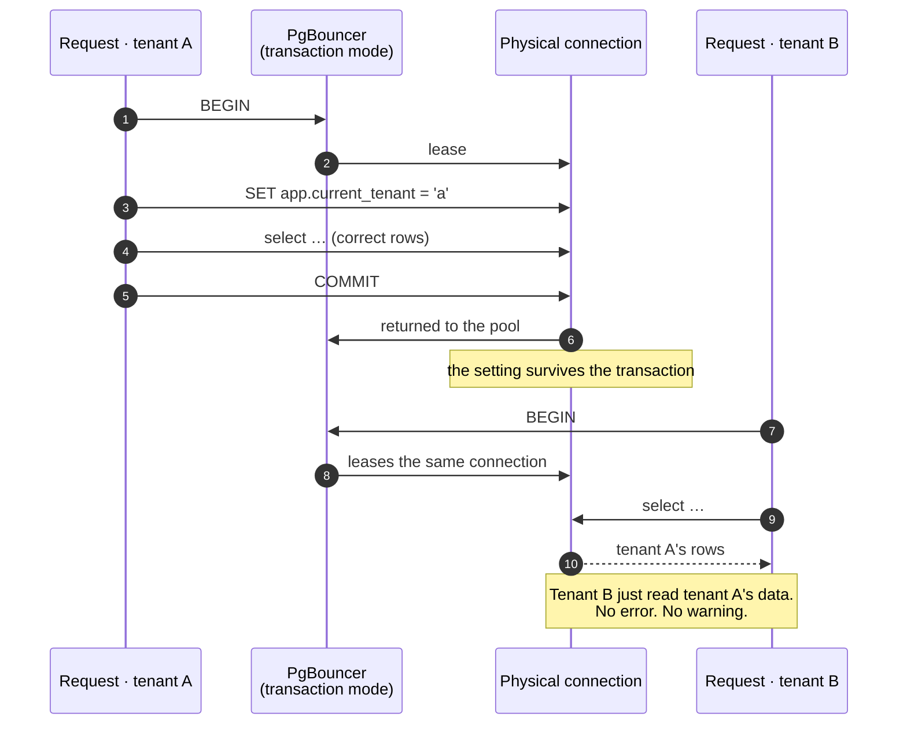
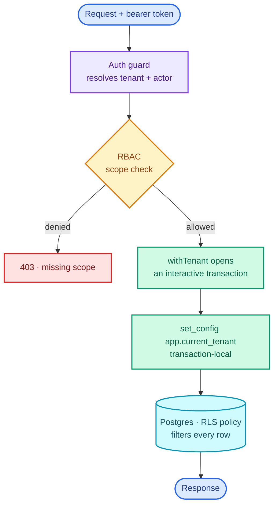

<p align="center">
  
</p>

In a multitenant system, the bug that ends the company looks like this:

```ts
const tickets = await prisma.ticket.findMany({ where: { state: 'open' } });
```

Someone forgot `tenantId`. There's no error. The tests pass, because in dev there's one tenant and
its rows are the only rows. It ships, and now one customer's agents are looking at another
customer's tickets.

Every mitigation I've seen for this is a discipline: a code review checklist, a lint rule, a
repository wrapper everyone is supposed to use. They all share one failure mode. They work until
somebody is in a hurry.

This post is about putting the filter in Postgres instead, as row-level security, and about the
three things that have to be true for that to be a guarantee rather than a decoration. I got each
of them wrong at least once. The worked example is a multitenant support desk I built
([the API is on GitHub](https://github.com/rishabh0111/nivara-api-nestjs)), NestJS and Prisma
against Neon's serverless Postgres, but none of it is specific to that stack.

## The policy

Every tenant-scoped table gets a policy that reads a transaction-local setting:

```sql
alter table tickets enable row level security;
alter table tickets force  row level security;

create policy tenant_isolation on tickets
  using (tenant_id = current_setting('app.current_tenant', true)::uuid);
```

The `true` in `current_setting` is doing real work. It means "return NULL if unset" rather than
"raise". Unset context therefore matches *no* rows, which is the direction you want to fail in.

Application code sets the context per request and then queries with no tenant clause at all:

```ts
const tickets = await tenancy.withTenant(
  { tenantId, actor: { kind: 'user', id: userId } },
  (tx) => tx.ticket.findMany(),   // no tenant filter here, and none needed
);
```

That `findMany` can't see another tenant's rows because the database will not return them. A
forgotten `where` now returns nothing rather than everything.

Where `tenantId` comes from matters as much as where it's enforced. It is read from the auth token
or the channel context, and it is never a value the client sends. No `?tenantId=` in a URL, no
tenant in a body, no tenant in a header the caller controls. The moment a client can name the
tenant, every endpoint becomes an access-control decision that some future version of you will
forget to make.

Locally this is perfect. One process, one connection per request, the variable set at the start and
gone at the end. Then you deploy it.

## 1. A role that can't bypass the policy

A policy is only a guarantee while nothing in the process can bypass it, and Postgres has two
bypasses: the `BYPASSRLS` role attribute, and being the table's owner.

On Neon, the default role the dashboard hands you is a member of `neon_superuser`, which **carries
`BYPASSRLS`**. Wire your application up with the connection string from the dashboard and every
policy you wrote is silently inert. Your tests pass. Your queries return data. Nothing is enforced.

So there are two roles:

| Role | | Used for |
| --- | --- | --- |
| owner | Superuser locally; `neon_superuser` on Neon | Migrations and seeding only, over the **direct** endpoint |
| `app_user` | `NOSUPERUSER NOBYPASSRLS`, and not the table owner | Every request-path query, over the **pooled** endpoint |

```sql
create role app_user nosuperuser nobypassrls;
-- app_user is deliberately NOT the owner of any table
```

`FORCE ROW LEVEL SECURITY` covers the second bypass. Without it, a table's owner is exempt from its
own policies even with RLS enabled.

The deployed application is never given the owner credential at all. Migrations run as a release
step in CI, so the owner is a CI secret; the image's entrypoint `env -u`s the variable before
starting node; and the application refuses to boot in production if it finds one anyway. Three
belts, because this is the guarantee everything else rests on, and the failure is silent.

You can ask the database whether any of this is actually on:

```sql
select rolname, rolsuper, rolbypassrls from pg_roles where rolname = current_user;
select relname, relrowsecurity, relforcerowsecurity from pg_class where relname = 'tickets';
```

If `rolbypassrls` is `t`, nothing below this line matters.

## 2. Transaction-local, not session-level

Here's the ugly one.

Managed Postgres puts a connection pooler in front of the database. Neon uses **PgBouncer in
transaction mode**, and so do a lot of other hosts. In transaction mode, a physical server
connection is lent to a client **only for the duration of one transaction**, then returned to the
pool for someone else.

Now re-read the policy. It depends on a session setting. From the PostgreSQL docs on `SET`:

> Once the surrounding transaction is committed, the effects will persist until the end of the
> session, unless overridden by another `SET`.

Until the end of the *session*. And the session is a physical connection that a pooler is about to
hand to a different request.



You have built a cross-tenant leak out of the mechanism you added to prevent cross-tenant leaks.

This isn't obscure. PgBouncer's own feature table marks `SET` and `RESET` as **"Never"** compatible
with transaction pooling, and Neon lists session variables among the things pooled connections do
not support. Both are easy to miss, because nothing in your stack tells you at the moment you make
the mistake.

The fix is to make the setting transaction-local, so it's torn down at `COMMIT` or `ROLLBACK`,
which happens **before** the pooler takes the connection back:

```sql
select set_config('app.current_tenant', $1, true)
```

Prefer the function form over `SET LOCAL`, because `SET` can't take a bind parameter. With
`SET LOCAL` you're interpolating a value into SQL; `set_config` takes a normal parameter. And that
third argument is the entire difference between working and leaking. `false` is session-level.

## 3. One connection, one transaction

The setting and the queries that depend on it must run on the **same connection inside the same
transaction**. In Prisma that means an interactive transaction:

```ts
await prisma.$transaction(async (tx) => {
  await tx.$executeRaw`select set_config('app.current_tenant', ${tenantId}, true)`;
  return tx.ticket.findMany();   // same connection, same transaction
});
```

This is wrong, and looks almost identical:

```ts
await prisma.$executeRaw`select set_config('app.current_tenant', ${tenantId}, true)`;
await prisma.ticket.findMany();   // ← may be a different connection entirely
```

Two separate pool checkouts. The second query may land on a connection with no tenant context set
at all, which, thanks to the `true` in `current_setting`, returns *no rows* rather than the wrong
ones. Fail-closed, but a baffling bug to debug if you don't know why.

In the API it's one function, `withTenant`, and callers don't have to remember any of it. Which
makes the whole request path look like this, with the tenant resolved from the credential and never
from the caller:



## 404, never 403

A small decision that RLS gives you almost for free.

When you ask for a ticket that belongs to another tenant, the API returns **404**, not 403. Not
"you're not allowed to see this." It says "there's no such thing."

403 leaks. It confirms the record exists, which turns any id-taking endpoint into an oracle: walk
ids, collect 403s, and you've learned the shape of another tenant's data without ever reading a row
of it.

Under RLS the row genuinely isn't visible to the query, so "not found" isn't a polite fiction. It's
what the database actually said.

## How to know it's actually on

The reason this is worth a whole post is that a broken setup and a working one are
indistinguishable from the outside. Both return data. Both pass a test suite that only has one
tenant in it.

**Seed a second tenant, and make it small.** One tenant makes isolation unfalsifiable, because every
query returns the only rows that exist. A second tenant, small enough to read end to end, is what
turns the claim into something checkable.

**Run the isolation tests as `app_user`, in the default suite.** Not behind an opt-in flag. If you
can point them at the owner and they still pass, they aren't testing isolation. Mine collapse
entirely under the owner role, which is the property I want.

**Don't mock the database.** Because the guarantee lives in SQL, a test that mocks Postgres proves
nothing about it. So nothing in the suite mocks the data layer; suites boot the application and
drive it over HTTP. That has a cost I want to be honest about: database suites run **in band**, one
at a time, because they share one Postgres and one seed. Under Jest's default parallelism those
assertions become races that pass or fail on worker scheduling.

**Test the deploy as text.** There's one deliberate exception to "drive the real thing":
[`deploy-contract.spec.ts`](https://github.com/rishabh0111/nivara-api-nestjs/blob/main/test/deploy-contract.spec.ts)
reads the Dockerfile, the compose file and the release workflow as strings and asserts that the
owner credential is absent from the running process and that `.env.example` documents every key.
Those aren't properties of any running process. The way each breaks is a line added to a YAML file
that nothing reads until a deploy. That file has caught two real regressions for me, including one
where the widget origin allowlist had been edited in the live database and in neither seed file, so
a reseed would have silently 403'd the deployed front end.

## Portability

None of this is Prisma-specific. The requirement is "one connection, one transaction,
transaction-local setting, a role that can't bypass", and every ecosystem has that:

- **Spring.** A `TransactionSynchronization` or an AOP aspect issuing `set_config` on the same
  connection the transaction holds.
- **FastAPI / SQLAlchemy.** A session-scoped dependency that runs `set_config` at the start of the
  unit of work.
- **Anything with raw SQL.** A `BEGIN`, the `set_config`, the work, the `COMMIT`.

The trap is the same everywhere: a helper that runs the `set_config` on a connection borrowed
separately from the one doing the work, or a connection string that quietly carries `BYPASSRLS`.

## What I'd do differently

**I'd put the two-role split in from commit one.** I retrofitted it, and retrofitting meant
auditing every existing query for whether it had been silently relying on owner privileges. Starting
with a restricted role would have surfaced each one at the moment it was written.

---

The long version, with inline citations to the PostgreSQL, PgBouncer, Prisma and Neon
documentation, lives in the repository as a research note:
[`docs/research/rls-neon-pooling.md`](https://github.com/rishabh0111/nivara-api-nestjs/blob/main/docs/research/rls-neon-pooling.md).

Related, from the same codebase: [a job queue in Postgres with `SKIP LOCKED`]({{ site.baseurl }}/blogs/postgres-job-queue-skip-locked/),
and on the AI side, [MCP as the guardrail]({{ site.baseurl }}/blogs/mcp-tool-surface-as-the-guardrail/).
