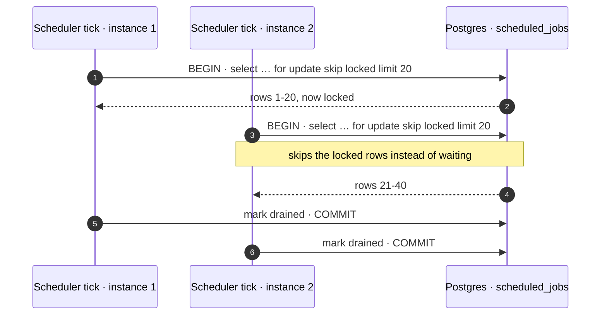
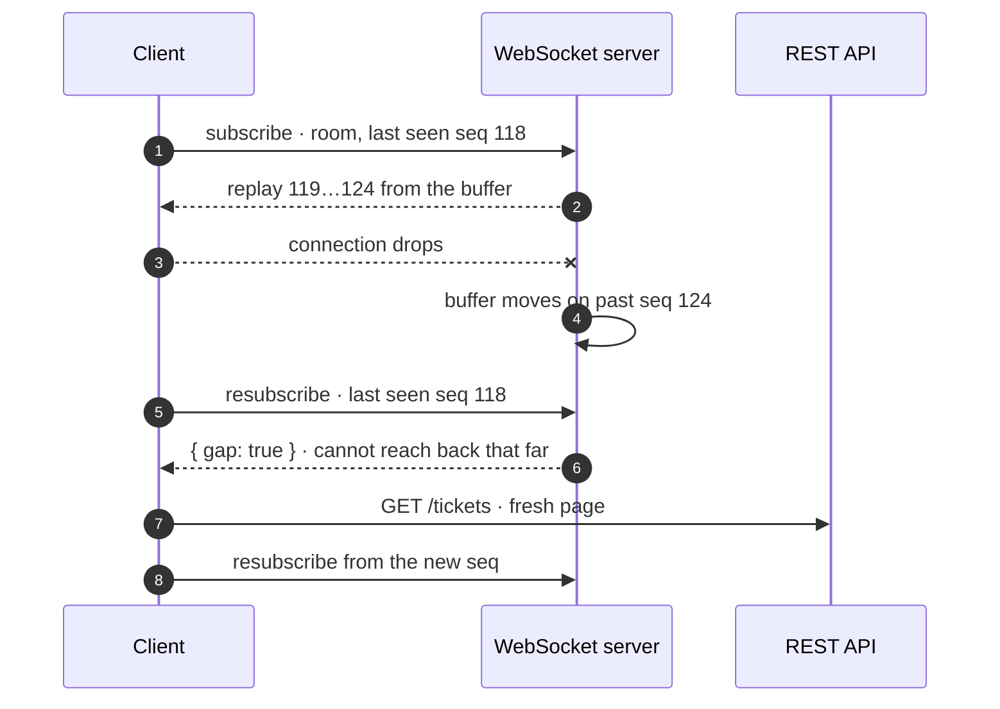

<p align="center">
  
</p>

Every support desk has clocks. A first-response deadline starts the moment a ticket opens. A
resolution deadline runs beside it. When either expires a breach has to latch, and a sweep has to
close tickets nobody has touched in days. None of that happens inside a request, so something has to
tick.

The obvious home for that is a Redis-backed queue with a worker process. I didn't use one, and the
reason is a constraint I'd set for the whole project: **it has to come up with `docker compose up`
and no credentials.** Every dependency I make load-bearing is a dependency that can break that, and
a job queue is about as load-bearing as it gets.

So the scheduler claims work out of Postgres, and this post is about that decision and the three or
four others that fell out of the same instinct. The code is a multitenant helpdesk API on NestJS and
Prisma ([nivara-api-nestjs](https://github.com/rishabh0111/nivara-api-nestjs)); the ideas are
plain SQL.

## The claim query

Due jobs live in a table. A tick claims a batch:

```sql
select … from scheduled_jobs
where due_at <= now() and claimed_at is null
for update skip locked
limit 20
```

`FOR UPDATE` locks the rows the tick is about to process. `SKIP LOCKED` is the part that makes it a
queue rather than a bottleneck: a second tick, on a second instance, doesn't wait for those locks to
clear. It skips past them and takes the next twenty.



Two instances can drain the same table safely, each taking rows the other hasn't locked, with no
coordination beyond the database they already share. No Kafka, no Celery, no second datastore that
has to be up for SLA clocks to tick.

Running the scheduler in a second process is a deployment flag, `RUN_SCHEDULER`, rather than a
rewrite. And running both at once, the API process ticking *and* a dedicated worker ticking, is safe
rather than merely tolerated, which is the property that lets you scale it out by turning a flag on
somewhere else.

The usual objection is throughput, and it's a fair one at a scale this project will never see. At
the scale where Postgres polling becomes the problem you have the budget for a real broker, and
more importantly you have the traffic data to size it. Before that point, a queue in the database
you already run is one fewer thing to operate, back up, and explain in an incident.

## Redis is still there. It's just not allowed to matter

Redis does exist in this system, for rate limiting and caching. The rule is that everything on it
**fails open**: an unreachable Redis means no ceilings enforced and every request still served.

That sounds backwards until you name the alternative. A cache outage that takes the API down has
converted a performance layer into an availability dependency, and you now run two databases where
one of them can take the other one offline. A cache outage should cost this API its protection,
never its availability.

The readiness probe follows the same logic. It reports Redis as `degraded` and doesn't fail on it.
Failing readiness for a cache would pull every healthy instance out of rotation at once, in the one
moment they were all fine.

Third-party integrations get the same treatment: unconfigured means dormant, not fatal. That's the
whole mechanism behind a key-free first run. Nothing optional is allowed to be the reason the
process won't start.

## Same instinct, three more places

Once "a dependency is a thing that can be down" is the lens, a few other API decisions stop looking
unrelated.

### Cursor pagination, and the `total` I refused to ship

Tickets and messages are high-insert tables. Offset pagination on a high-insert table drifts: rows
arrive while you're paging, and page two shows you rows you already saw on page one, or skips some
entirely.

So pagination is keyset, over `(created_at, id)`, with an opaque cursor:

```
GET /tickets?limit=25&cursor=<opaque>
→ { "data": [ … ], "nextCursor": "…" }
```

And there's no `total`. Not even opt-in. A `COUNT` under row-level security with concurrent inserts
is expensive and out of date by the time it arrives, and once a client can ask for it, some UI
renders "Page 3 of 47" and now you own a number that's both costly and wrong.

The consequence is visible all the way up in the interface: the queue offers "load more" and never
numbered pages. A decision about SQL travelled into what the UI can honestly offer, which I think is
the good kind of constraint.

<picture>
  <source media="(prefers-color-scheme: dark)" srcset="/assets/img/nivara/queue.dark.png">
  
</picture>

### Idempotency keys, and 400 on unknown parameters

Every side-effecting request accepts an `Idempotency-Key`, so a client retrying over a flaky
connection replays the first result instead of acting twice. Retries are the normal case, not the
error case, and an API that can't be retried safely pushes that problem onto every client it has.

And an unknown query parameter is a **400**, not a silent ignore. A silently-ignored typo returns
confidently wrong results and hides the client bug until somebody notices the data is off, which is
the same failure shape as the forgotten tenant filter: no error, wrong answer.

### An audit log the application can't lie to

Audit logs are usually written by the code being audited, which is a bit like asking someone to mark
their own homework. If a code path forgets to pass the actor, you get an entry attributed to nobody,
or worse, to whoever was convenient.

Here the actor is armed as a transaction-local setting, the same way the tenant is for row-level
security, and read by a **database trigger**:

```sql
app.current_actor_kind = 'user'
app.current_actor_id   = '…'
```

An absent actor **raises** rather than defaulting. A write that can't say who made it doesn't
happen. That turns "we always record the actor" from a convention into something the database will
not let you violate, and the application code that does the write never touches the audit table at
all.

## Real-time, with the same shape

The WebSocket layer that pushes ticket events to the dashboard is the one place the instinct runs
in memory rather than in Postgres, but it's the same instinct. Each room keeps a monotonic sequence
number and a bounded replay buffer. A reconnecting client sends the last sequence it saw and gets
the events it missed replayed; a client that was away too long gets an explicit `gap` and refetches
over REST.



The server is precise about the limits of what it can replay, and a gap is an ordinary path, not an
error. The client's cursor is deliberately **not** advanced on a gap, because a buffer moving on
isn't evidence the client saw anything. There's no broker behind this either; the buffer is per
process, and the honest answer to "what if there are two processes" is the REST refetch that a gap
already triggers.

## What I'd tell myself at the start

**Count the things that have to be up.** For each one, write down what happens to a request when
it isn't. If the answer is "the request fails" for something that isn't the primary database, ask
whether it has to be.

**`SKIP LOCKED` is the whole trick.** Everything else about a Postgres queue is a table and a loop.
That one clause is what lets two loops share the table.

**Don't write the read model last.** The analytics endpoint needed aggregate shapes the schema
wasn't quite right for, and by then the schema had opinions. A read model you know you need should
influence the write model earlier than mine did.

---

Related, from the same codebase: [row-level security for multitenancy, and the pooler leak]({{ site.baseurl }}/blogs/postgres-rls-multitenancy/),
which is where the transaction-local settings the audit trigger reads come from.

Code: [nivara-api-nestjs](https://github.com/rishabh0111/nivara-api-nestjs) ·
[live OpenAPI docs](https://nivara-api-nestjs.onrender.com/docs)
