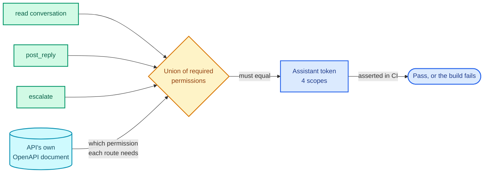
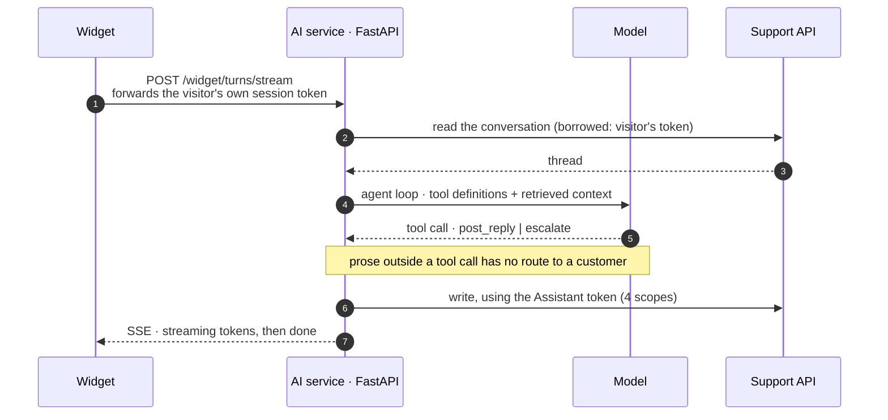
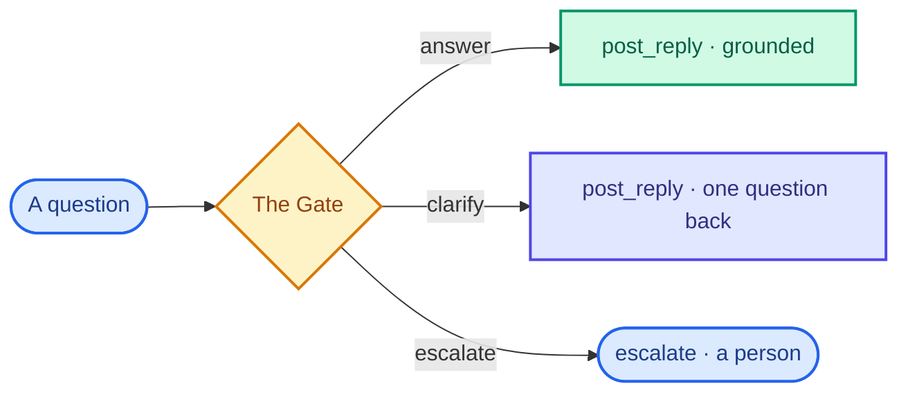
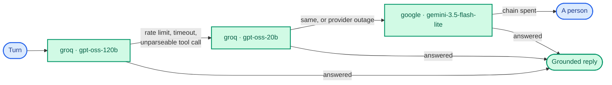

  

The pitch for support AI is deflection: the bot handles the easy questions, humans handle the rest,
your queue gets shorter. The failure mode is just as well known. It confidently answers a question
it shouldn't have touched, and now a customer has been told something false about their money.

Most of the advice for the second problem is guardrails: an output filter, a moderation pass, a
system prompt that says "never discuss refunds". Every one of those is a check you can forget to
apply, apply incorrectly, or that a sufficiently strange input slips past.

This post is about a different shape of answer. The agent's entire ability to act is a tool surface
published over the **Model Context Protocol**, and the surface is designed so that the bad outcome
isn't *unlikely*. It's unrepresentable. The worked example is the AI service of a support desk I
built ([nivara-ai](https://github.com/rishabh0111/nivara-ai), Python and FastAPI, talking to a
NestJS API), but the pattern is the point.

## The guarantee, first

> Prose the model writes outside a tool call is never posted to a customer.

The only route from the model to a customer's inbox is a tool call carrying retrieved content. If a
model decides to be helpful and free-associate about your refund policy, that text has nowhere to
go. It isn't filtered, or scored, or judged. There's simply no path.

I want to be precise about why this is stronger than a guardrail. A guardrail sits *on* a path and
tries to catch things travelling down it. This is a missing edge in the graph. The model produces
text; the loop reads tool calls out of that text; anything that isn't a tool call is discarded
before it reaches anything with a customer on the other end.

Everything else in the design is about making sure the tool calls themselves can't be talked into
doing the wrong thing.

## Three tools, enumerated

The agent can do exactly three things: read the conversation it's answering, post a reply to it,
and escalate it to a person.

That is the entire surface. It's published over MCP, so the tools are enumerable by the client
rather than described in a document somebody has to keep current. When the eval harness later
wants to assert that "every tool call in every trace names a tool that exists", it can list the
tools and check, and the list it checks against is the one the model actually saw.

Two of those tools are sensitive, and both are designed by contract rather than by detection.
Neither `post_reply` nor `escalate` exposes a "granted" output variant: there is no argument
meaning "and also do this other thing", no free-text field that ends up in front of a customer
without having come from retrieval. A prompt injection buried in a ticket can try to steer the model
toward an output shape that would help the attacker, and the reason it fails is that there's no
such shape to steer toward.

That's tested rather than assumed, by a hand-written adversarial suite replayed on every pull
request. Zero successful injections across it. But the resistance is a property of the schema, and
the suite is there to catch me changing the schema.

## Four scopes, and a test that they're exactly enough

The AI service authenticates to the API with its own service token, and that token holds **four
scopes**. Not admin. Not "the AI role". Four named permissions, and nothing else.

The interesting part is how that number is kept honest. The API emits an OpenAPI document from its
own code, and each operation in it declares the permission it requires. The AI service's tooling
reads that document and asserts that the union of permissions its three tools need equals
**exactly** the scopes the token holds.

Equality in both directions. If a tool starts calling a route that needs a fifth scope, the test
fails before the token gets one. If a tool is removed and a scope is left dangling, the test fails
too, because a scope nothing uses is a scope an attacker could. The mapping between "what the agent
can do" and "what the agent is allowed to do" is mechanical, derived from the API's contract, rather
than a claim in a README.

There's one more credential decision worth naming. The business metric for this system is
deflection, and it's read from the API's own `/analytics` endpoint. The AI service **never holds the
credential that reads it**. Two separate tokens: one that answers tickets, one that reads analytics.
The system being measured has no way to quote its own score.

## Whose token is it, anyway

A subtlety in the read tool. When a visitor types into the widget, the AI service doesn't read the
conversation with its own token. The widget forwards the visitor's own short-lived session token,
and the AI service uses **that** to read, then uses its own Assistant token to write.

The read is *borrowed*. The AI can't be tricked into reading a conversation the visitor couldn't
read themselves, because it's reading as the visitor, and the API's row-level security decides what
the visitor can see. The AI's own token only ever writes, and only through the two sensitive tools.

## Three outcomes, and it commits to one

Every turn ends in exactly one of three states, and the tool surface is what makes that a hard
constraint rather than a prompt instruction:

Not "answer, with a confidence score attached". Three discrete outcomes, one of which reaches a
human, and the trace records which. Clarification is capped at one: a system that keeps asking
questions has found a way to never be wrong and never be useful, so if the turn after a
clarification is still uncertain, it escalates.

How the gate decides which of the three is a post of its own. What matters here is that
"escalate" isn't a fallback the model reaches when it gives up. It's a first-class tool, called
deliberately, that lands the ticket on the same queue a human agent works from with an SLA clock
already running.

## The AI doesn't have its own inbox

That last point is the one I'd push hardest in a design review.

A widget message opens a real ticket, on the real queue. If the AI answers it, the ticket resolves.
If it escalates, an agent picks up a ticket that was never in a separate system waiting to be
reconciled.

<picture>
  <source media="(prefers-color-scheme: dark)" srcset="/assets/img/nivara/ticket.dark.png">
  
</picture>

I've used support tools where the bot conversations live somewhere else and get "escalated" by
being copy-pasted into a real ticket. It's a mess, and it's a mess that comes from treating the AI
as a product rather than as a participant. Making the AI a participant, with a scoped credential
and the same three actions an agent has, is what makes the tool surface small enough to reason
about in the first place.

## When the model doesn't answer at all

The model behind the loop is a chain, three rungs and then a human:

A rung that rate-limits, times out, or returns a tool call the parser can't read is a rung that did
not answer, so the next is tried. When the last is spent, the turn escalates and a person gets a
ticket. **An outage of the AI isn't an outage of support**, which is the only reason running the
whole chain on free tiers is defensible at all. Actual spend is $0; cost is reported as modelled at
list price against real token counts, and the worst real turn is about 2,500 tokens.

Notice that "unparseable tool call" is in the same bucket as "timeout". A model that emits
something that isn't one of the three tools hasn't done anything; it has failed to act, and the
failure is safe by construction. That turned out to matter when I read the traces, but that's the
evals post.

## What I'd tell myself at the start

**Decide what the system isn't allowed to do before deciding what it should do.** "Prose outside
a tool call never reaches a customer" shaped more of this codebase than any feature did, and it was
cheap to enforce because it was there from the beginning.

**Make the tool schema the guardrail.** If a sensitive tool has no output shape an attacker would
want, injection has nothing to aim at, and you can spend your red-team budget proving that instead
of patching a filter.

**Derive the scopes; don't declare them.** A token's scopes should be a function of what the
tools call, checked against the API's own contract, so that the number can't drift in either
direction without a test going red.

---

Related, from the same codebase: [calibrating the gate that picks between answer, clarify and escalate]({{ site.baseurl }}/blogs/calibrating-a-rag-gate/),
[evals for an agent that can't grade itself]({{ site.baseurl }}/blogs/evals-for-an-llm-agent/),
and the [row-level security]({{ site.baseurl }}/blogs/postgres-rls-multitenancy/) the borrowed read relies on.

Code: [nivara-ai](https://github.com/rishabh0111/nivara-ai) ·
[try the widget](https://rishabh0111.github.io/nivara-web-nextjs/)
