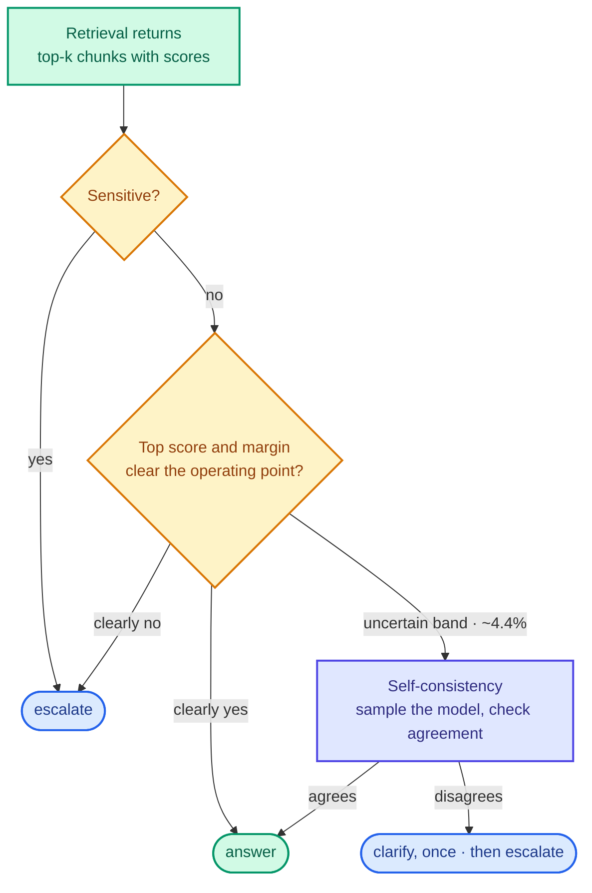

<p align="center">
  
</p>

The hard part of retrieval-augmented generation isn't retrieval, and it isn't generation. It's the
decision in between: given what came back from the index, should the model answer at all?

Get that wrong in one direction and the system escalates questions it could have handled, which is
annoying. Get it wrong in the other and it answers a question about someone's refund from three
documents that are *about* refunds and don't contain the answer, which is how a language model
produces something fluent and false.

This post is about how that gate is built, measured and pinned in the AI service of a support desk
I built ([nivara-ai](https://github.com/rishabh0111/nivara-ai): Python, FastAPI, hybrid retrieval
over Qdrant). The gate is the piece I'd most want to be asked about.

## Three outcomes, and it commits to one

Every turn ends in exactly one of three states: **answer**, with a grounded reply citing the
retrieved document; **clarify**, one question back to the visitor, capped at one per conversation;
or **escalate**, a real ticket on the human queue.

Not "answer, with a confidence score attached". Three discrete outcomes, and the trace records
which. The reason it has to be discrete is that the outcomes have different costs, and a
confidence score invites someone downstream to treat them as the same unit. They are not.

## What the gate reads

The obvious implementation is to ask a model "are you confident?" That doesn't work, for the reason
everyone eventually discovers: models are agreeable, and a model that has just written an answer is
not a neutral judge of it.

So the gate reads **free signals** first, things already computed by the time the question has been
retrieved for, costing nothing extra:

| Signal | What it is |
| --- | --- |
| Top retrieval score | How well the best chunk matched |
| Margin | The gap between the best chunk and the next one |
| Sensitive score | Whether this is about money, fraud, or account recovery |

The margin is the one I wouldn't have guessed was the most useful. Here are two real turns from the
deployed system:

```
"What column headers does the contact importer expect?"
  top score 2.277 · margin 0.127 · sensitive 0.000015   → answered

"How long is the refund window on an annual plan?"
  top score 1.623 · margin 0.005 · sensitive 0.000753   → escalated
```

Retrieval on the second one wasn't weak. 1.62 is a respectable score, and a threshold on top score
alone would very plausibly have let it through. But the margin was **0.005**. Five thousandths.
Five chunks came back and nothing distinguished any of them from the others. That's the signature
of a corpus that doesn't contain the answer but contains several documents about roughly the right
topic, which is precisely the situation in which a model will confabulate.

And it was a question about money, which never takes the answering path at all. The sensitive
score alone takes that slice from 33-of-70 answered down to none.

Only turns that land in a genuinely uncertain middle band spend a second model call on
self-consistency, sampling the model a few times and checking whether it agrees with itself. That's
about **4.4%** of turns. Everything else is decided for free, before any generation happens.



## Choosing an operating point instead of a threshold

The gate has a dial. Turn it one way and it escalates more, which is annoying but safe. The other
way and it answers more, which is useful until it isn't.

Picking that number by feel would make every measurement downstream meaningless, so the curve is
swept over the labelled set and **committed to the repository** as an artifact, with
the chosen point marked:

**6.8% ordinary false-escalation, at zero false-deflection.**

That's: on the labelled set, it wrongly escalates 6.8% of ordinary questions it could have handled,
and wrongly answers **none** it should have escalated.

Two things make that a pinned decision rather than a number in a notebook:

- The **rule** that picks the point is a committed constant: lowest false-escalation among
  thresholds achieving zero false-deflection.
- A **test** re-derives the point from the committed curve and fails if the artifact and the code
  disagree. Change the threshold in code without re-sweeping, or re-sweep without updating the
  code, and CI goes red.

The asymmetry is the whole design. A false escalation costs an agent two minutes. A false deflection
costs a customer a wrong answer about their money. Those aren't the same unit and should not be
traded off as though they were, which is why the rule is "zero on one axis, then minimise the
other" rather than a single blended score.

## Retrieval, and the stages that got deleted

Retrieval is hybrid: dense embeddings and BM25 over Qdrant, fused. The measured result on the
labelled set:

| Configuration | recall@1 |
| --- | --- |
| Naive dense baseline | 92.9% |
| Deployed hybrid path | **94.2%** |

What I find more interesting is what sits in the same artifact under **Stages deleted**:
server-side reranking, and a local cross-encoder. Both are standard advice. Neither moved the number
on this corpus, so neither ships, and both are kept as rows rather than quietly dropped.

Reranking is genuinely good advice in general. It did nothing *here*, on a corpus this small and
this clean, and I'd rather publish "we tried reranking and it did nothing" than draw a pipeline
diagram that only shows the winners and implies a sophistication the measurements don't support.


## The numbers, per category

| | |
| --- | --- |
| Correct disposition | **93.6%**, over 595 of 600 cases |
| Not false deflection | **95.3%** |
| Retrieval recall@1 | **94.2%** vs 92.9% dense baseline |
| False escalation at zero false deflection | **6.8%** |
| Turns needing a second model call | **~4.4%** |

The headline number is reported per category, never as one average. An average hides the
categories where you're bad by drowning them in the ones where you're good, and the categories
where a support AI is bad are usually the ones that matter: billing, account recovery, anything
where the corpus has several near-misses and no hit.

Everything above is a claim about a set I labelled. How those claims are kept honest, with recorded
model responses replayed in CI, a red-team suite, and a judge that had to earn its place, is the
next post.

## What I'd tell myself at the start

**Read the signals you already have before buying new ones.** The gate's best feature cost nothing.
A second model call is the expensive last resort, not the first idea.

**Sweep, commit, and test the commit.** A threshold in code with no artifact behind it is a guess
with a variable name. The artifact plus the re-derivation test is what makes it a decision.

**Keep the deleted stages in the table.** The reranker row that says "no change" is more useful to
the next person than a pipeline that only shows what survived.

---

Related, from the same codebase: [MCP as the guardrail]({{ site.baseurl }}/blogs/mcp-tool-surface-as-the-guardrail/),
on why the three outcomes are tool calls and not prose, and
[evals for an agent that can't grade itself]({{ site.baseurl }}/blogs/evals-for-an-llm-agent/).

Code: [nivara-ai](https://github.com/rishabh0111/nivara-ai) ·
[try it](https://rishabh0111.github.io/nivara-web-nextjs/), and ask about the contact importer, then
about refunds.
