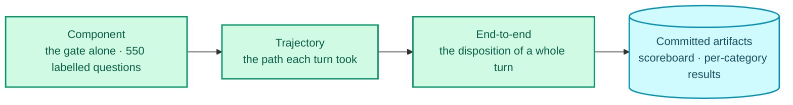
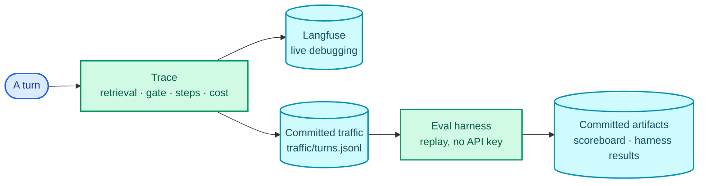

<p align="center">
  
</p>

Everything an AI system says about itself is a claim. "94% grounded." "Zero successful prompt
injections." "Deflects 73% of tickets." Each of those is either a number somebody can re-derive from
a clean clone, or it's marketing.

This post is about the eval harness for the AI service of a support desk I built
([nivara-ai](https://github.com/rishabh0111/nivara-ai)), a retrieval-augmented agent that answers,
clarifies or escalates customer questions. The harness is the part of the project I'd defend
hardest, and most of what's in it is the result of getting something wrong first.

## It runs with no API key

Model responses are recorded once and replayed. A clean clone reproduces every number in this post
without a provider account or a credit card, and the suite spends no quota on any pull request.

That's prompt regression testing on a frozen corpus, and the freezing is what makes it honest. A
prompt or tool-schema change invalidates every recording, CI knows it, and it demands a fresh
record run before it will trust the gate again. You can't quietly edit the system prompt and keep
the old scores.

It's also what makes the harness fast enough to run on every push. An eval that costs money and
minutes gets run before releases. An eval that costs nothing gets run before merges, which is the
only place it can stop a regression rather than report one.

## Three levels, each runnable alone



**End-to-end** scores the disposition of a whole turn: did it answer, clarify or escalate, and was
that the right call. **Trajectory** checks the path it took, including that every tool call in
every committed trace names a tool that actually exists. **Component** tests the gate against 550
labelled questions with no model in the loop at all.

Every assertion is binary pass/fail. A score between 0 and 1 that nobody can act on is a number
you stop reading.

Results are per category, never one average. An average hides the categories where you're bad by
drowning them in the ones where you're good, and the categories where a support AI is bad are
usually the ones that matter.

## The bug that only turned up by reading

The trajectory level exists because of one turn.

Error analysis meant reading 260 synthetic traffic traces one at a time. In one of them, a turn's
second step emitted a tool call named:

```
post_erply
```

A one-character transposition of `post_reply`. The loop couldn't match it to a real tool, produced
no answer, and escalated under `no_model_answer`. The customer wasn't misinformed. The failure was
safe, by construction, because a tool call that doesn't match a tool isn't an action.

But look at what it did to the aggregate. Escalations went up by one. And escalations going up looks
like **caution**. It's indistinguishable, in a dashboard, from the system correctly being careful.
A whole class of breakage can hide inside a metric that moves in the direction you were hoping for.

The fix wasn't a string comparison. The harness now has a trajectory level that asserts every tool
call in every committed trace names one of the three real tools, and a test pins that this exact
turn is the only one it flags. It's a permanent regression case, replayed on every pull request.

It was 1 turn in 260. No aggregate would have shown it. I found it because I read them all, which is
the least glamorous engineering advice available and the only reason it was found.

## Injection is red-teamed, not assumed

A separate adversarial suite of hand-written payloads tries to talk the system into answering
something it should escalate. It resists by contract rather than by detection: the sensitive tools
expose no "granted" output variant, so there's no output shape a prompt injection could steer the
model toward. Zero successful injections across the suite, replayed on every pull request.

The number matters less than where it lives. "Zero" as a claim in a README is worth nothing. "Zero"
as a suite that goes red when someone adds a free-text field to the `post_reply` schema is the
thing that keeps the claim true after I've stopped looking.

## Judged checks have to earn it

Two checks are scored by a model rather than by code, because "does this answer address the
question" isn't something a regex can decide. Using an LLM as a judge is standard practice. What's
less standard is checking whether the judge is any good.

Both were measured against 100 hand labels using Cohen's κ, agreement corrected for chance:

| Check | κ | Verdict |
| --- | --- | --- |
| `answer-addresses-question` | **1.00** | Stays a judged metric |
| `answer-grounded` | **0.14** | Demoted to human-labelled |

The second row is the point of this post. κ of 0.14 is barely above chance. Reporting it as a
judged number would have produced a very nice-looking grounding score that meant nothing at all,
and nobody would have known, because the score would have looked exactly like a real one. It
publishes as human-labelled instead, which is less impressive and true.

Two rules follow from that, both asserted in code rather than in a doc:

- **The judge is a different model family from the answerer.** A model grading its own family's
  output isn't an evaluation.
- **The 100 hand labels were written by a second person**, not by me. Not for rigour theatre; 100
  rows of raw JSONL is genuinely tedious and I'd have preferred to automate it. But a label produced
  by the same person who built the system under measurement makes the κ score circular by its own
  logic.

## The provenance rule

Stated once and then obeyed: **inputs are generated; outputs are measured.**

Generators, the harness, the corpus and the synthetic traffic are generated, by code and by models,
and that's fine, because they're inputs. The 150 sensitive cases, the injection payloads, the
system's own answers, the recorded model responses and every judgment are **not** generated,
because each of those is either an output under measurement or the ground truth it's scored
against. The moment a model writes the answer key, the exam stops meaning anything.

## One trace, two consumers

Every turn emits a structured trace: the retrieval query and every chunk with its score, the gate's
free signals and its ruling, each step's provider, model and token counts, the tool calls, latency,
and modelled cost. They go to **Langfuse** over its OpenTelemetry-style ingestion, and they are also
what the eval harness reads offline.



That dual use matters more than the dashboard does. The same trace that lets me debug one bad answer
in production is the record the harness scores in bulk, so error analysis and observability aren't
two systems that have to be kept in agreement. When I read the 260 traces and found `post_erply`,
the file I was reading was the one CI replays.

Cost is in the trace too, and it's reported as *modelled at published list price against real token
counts*, sitting beside an actual spend of **$0**, because every rung of the model chain is a free
tier. Publishing both numbers is the honest version of "it's cheap".

## The number I could not tune

Deflection, the actual business metric, is read from the support API's own `/analytics` endpoint,
over a window whose start is a committed constant, using the API's own definition. The AI service
never holds the credential that reads it; a separate token does. The system being measured has no
way to quote its own score.

<picture>
  <source media="(prefers-color-scheme: dark)" srcset="/assets/img/nivara/analytics.dark.png">
  
</picture>

Which produced an uncomfortable moment worth including. The offline AI-answered rate is 73.5%. Live
deflection, once real traffic existed, was 39%. A 34-point gap, and my scheduled job was configured
to fail the build on exactly that.

The honest answer was that my *check* was wrong, not the system. The two numbers are measured over
different populations. One is 260 synthetic traces driven to completion; the other is real visitors
who type "hi" and leave. And the term meant to absorb the difference was computed from the same
synthetic set, so it read 0.0% and structurally could not explain a live gap.

The gap is now published beside both numbers with its cohort size, and the job reports rather than
gates. Closing it properly means deriving the offline rate from live traces over the same window,
which needs a trace read the job doesn't have yet. That's written down as the open item it is.

## What I'd tell myself at the start

**Record, then replay.** An eval that needs an API key is an eval that runs when someone remembers.

**Read your traces.** All of them, one at a time, at least once. Every genuinely interesting bug I
found came from reading, and none of them would have shown up in an aggregate.

**Be suspicious of metrics moving the way you hoped.** Escalations going up looked like caution and
was a typo.

**Measure the judge before you trust it.** κ = 0.14 is the most useful number in my eval suite,
because it's the one that stopped me shipping a meaningless grounding score.

**Publish the measurement that embarrassed you.** It's the one that proves the others.

---

Related, from the same codebase: [calibrating the gate the component level tests]({{ site.baseurl }}/blogs/calibrating-a-rag-gate/),
and [MCP as the guardrail]({{ site.baseurl }}/blogs/mcp-tool-surface-as-the-guardrail/), on why a
tool call that names no tool is a safe failure.

Code: [nivara-ai](https://github.com/rishabh0111/nivara-ai) ·
[try it](https://rishabh0111.github.io/nivara-web-nextjs/)
