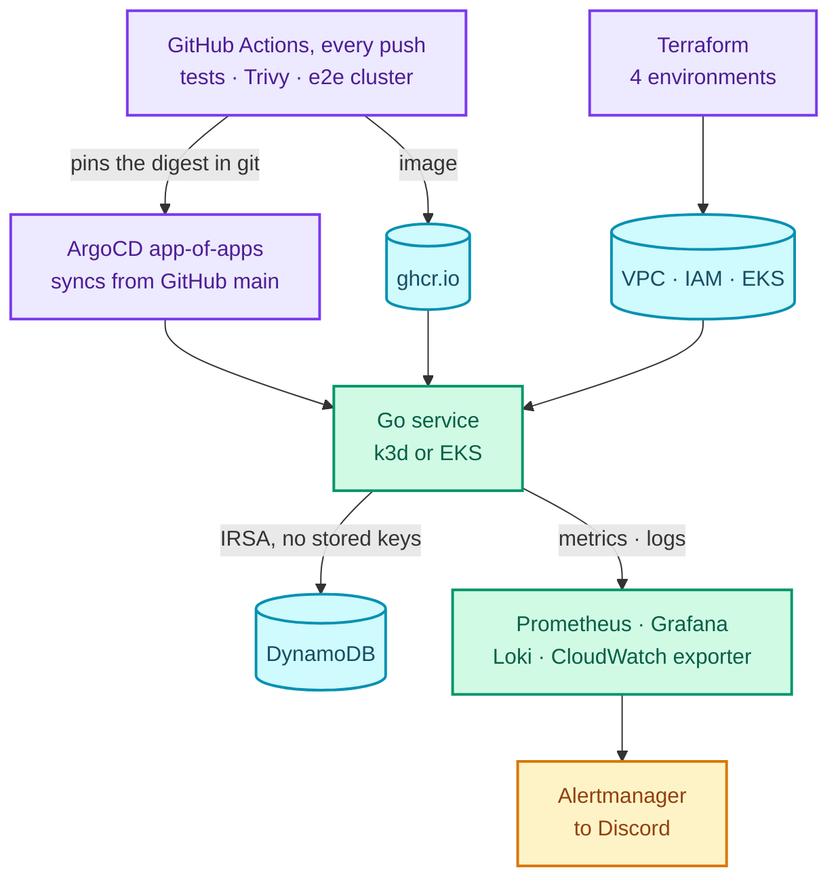
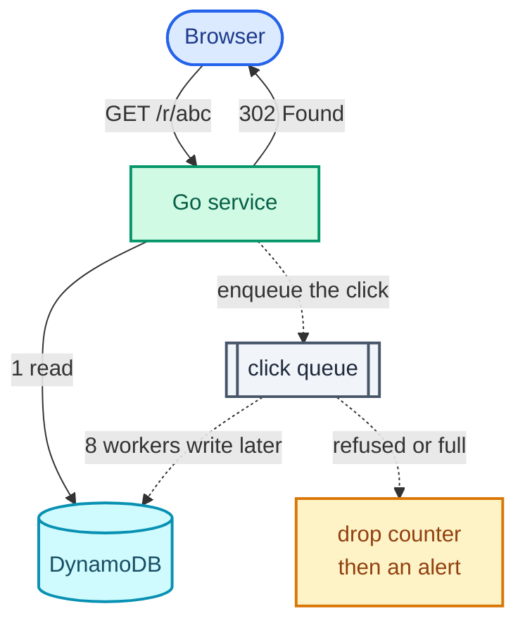

<p align="center">
  
</p>

**Source:** [github.com/rishabh0111/linkpulse](https://github.com/rishabh0111/linkpulse).
`mise run dev` brings the whole platform up on a laptop with nothing installed but Docker.
The README makes sixteen claims and names the test, experiment or check behind each one,
and [the EKS run's evidence](https://github.com/rishabh0111/linkpulse/tree/main/docs/evidence/burst)
holds every result from real AWS, graphs included.

---

A green pipeline proves that code builds. It does not prove that a system survives
production. That takes answers to harder questions. What happens when the database starts
refusing writes? Does the alert fire, and does it fire for the right thing? Can the whole
environment be rebuilt from nothing, on a machine that isn't yours? Does it still work on
the real cloud, or only on the laptop that built it?

LinkPulse answers each of those with evidence. The service at its centre is a URL shortener
with click analytics, a Go API over one DynamoDB table, kept deliberately compact because
the service is the load, not the point. The point is the platform around it:

- **One command** brings up a three-node Kubernetes cluster with GitOps, TLS from its own
  certificate authority, encrypted secrets, and a full monitoring stack.
- **Four Terraform environments**, from a LocalStack mock in CI to real AWS, with the
  metered one in its own state so `terraform destroy` can never reach the data.
- **Zero stored cloud credentials** in the cluster: IRSA on EKS, Sealed Secrets for
  everything else.
- **Thirteen alert rules, every one watched firing**, by five chaos experiments that
  cause the exact failure each rule names.
- **A 55-minute CI job** that builds a three-node cluster on every push and runs the load
  test, four chaos experiments and a destroy-and-restore backup against it.
- **Twelve hours on EKS against real DynamoDB**: real throttling, zero user-facing
  errors, thirteen production bugs found and fixed, **$3.32**.

This post walks through the decisions behind each of those, with the code.

## The platform



| Layer | What it runs on |
| --- | --- |
| Service | Go, GraphQL, a plain HTTP redirect on the hot path |
| Data | DynamoDB, single-table design, one GSI |
| Infrastructure | Terraform, five modules, four environments |
| Delivery | GitHub Actions, Trivy, ghcr.io, ArgoCD app-of-apps |
| Platform | k3d locally, EKS on AWS; cert-manager, Sealed Secrets, the AWS Load Balancer Controller |
| Observability | Prometheus, Alertmanager, Grafana, Loki, Alloy, kube-state-metrics, a CloudWatch exporter |
| Verification | k6, five chaos experiments, a 29-assertion observability check, TLS and Sealed Secrets checks |

## Decision 1: the hot path never waits for analytics

A click does two things. It redirects the user, which they notice, and it records the
click, which nobody has ever waited for. The architecture is built on that asymmetry. The
redirect does one DynamoDB read, answers `302`, and hands the click to a bounded queue
that background workers drain:



The whole trick is one `select` with a `default`:

```go
// Enqueue never blocks. A full queue means writes are not keeping up with
// redirects, and blocking here would turn an analytics backlog into latency.
func (r *Recorder) Enqueue(code string, c store.Click) {
	select {
	case r.queue <- job{code: code, click: c}:
		metrics.ClickQueueDepth.Set(float64(len(r.queue)))
	default:
		metrics.ClicksDropped.WithLabelValues("queue_full").Inc()
	}
}
```

Eight workers write each click, and every failure is classified rather than logged and
forgotten. Throttling is its own label, because "the table refused the write" and "the
table was unreachable" are different incidents with different runbooks:

```go
switch {
case err == nil:
	metrics.ClicksRecorded.Inc()
case store.IsThrottle(err):
	metrics.ClicksDropped.WithLabelValues("throttled").Inc()
default:
	metrics.ClicksDropped.WithLabelValues("error").Inc()
}
```

Every `reason` label is seeded at zero on startup. A Prometheus counter that has never been
incremented exports nothing, so `rate()` over it returns *no data* rather than 0, and an
alert on it would be blind until the first incident it exists to catch.

Under pressure this system gives up analytics, never users, and it knows every time it
does. Liveness checks only the process; readiness checks the datastore with a
`DescribeTable` cached for two seconds, so a DynamoDB outage makes pods unready without a
single restart.

## Decision 2: a table designed around its own failure mode

The DynamoDB model was written before any code: seven access patterns, one table, one
sparse GSI for "links by owner, newest first". The failure it is built around is the hot
partition. Every click on a popular link increments the same daily counter, so that
counter is sharded:

```go
// STAT#<day>#<shard>, width fixed at 4 so the sort key orders numerically as
// well as lexicographically, which keeps the range query correct.
func statSK(day string, shard int) string {
	return fmt.Sprintf("%s%s#%04d", prefixStat, day, shard)
}

// "#~" sorts above every digit, so the upper bound covers every shard of the
// last day without the query knowing the shard count.
func statRangeLo(from string) string { return prefixStat + from + "#0000" }
func statRangeHi(to string) string   { return prefixStat + to + "#~" }
```

Writes pick a shard with `crypto/rand` rather than round-robin, because a round-robin
counter would have to be shared across replicas, and under an autoscaler the replica count
isn't fixed. Reads sum sixteen items with one `Query`.

Capacity is set at exactly the AWS free allowance, and the allowance is enforced in
Terraform, not remembered. The allowance is per account and includes indexes, which the
first version of this module got wrong: it validated the table alone, and 25 on the table
plus 5 on the index would have billed about $3 a month on an environment whose one
defining property was costing nothing. The metered-resource audit caught it, and the
module now checks the sum:

```hcl
validation {
  condition     = var.read_capacity > 0 && var.read_capacity + var.gsi_read_capacity <= 25
  error_message = "read_capacity + gsi_read_capacity must be 1-25 to stay inside the always-free allowance."
}
```

## Decision 3: four Terraform environments, one blast radius each

| Environment | State | What it holds |
| --- | --- | --- |
| `local` | local, disposable | LocalStack; applied, checked for drift and destroyed in CI on every push |
| `bootstrap` | local, backed up | the S3 state bucket: versioned, encrypted, TLS-only, public access blocked |
| `aws` | S3, `aws/terraform.tfstate` | the always-free baseline: table, IAM, VPC with no NAT, budgets |
| `aws-burst` | S3, `aws-burst/terraform.tfstate` | EKS and everything that bills by the hour |

The split between the last two is the most important decision in the Terraform. The burst
environment reads the base environment's outputs through `terraform_remote_state` and owns
nothing the base owns, so `terraform destroy` on it is *incapable* of reaching the table.
The most dangerous command in the project is safe to type in a hurry.

The guardrails watch **gross** cost:

```hcl
cost_types {
  include_credit = false
  include_refund = false
}
```

AWS Budgets subtracts credits by default. On an account funded by credits, every budget
reads $0.00 forever and no alarm can ever fire. There is a $1 tripwire that fires at one
cent of actual spend, and a $25 ceiling with a forecast alert at 100%.

## Decision 4: GitOps where the sync waves actually wait

ArgoCD deploys everything from git through an app-of-apps, in waves: the platform
(cert-manager, Sealed Secrets) at wave −2, the application at 0, monitoring at 1. Two
AppProjects draw the privilege line: the platform may install cluster-scoped resources such
as CRDs, the application may not.

Waves only wait if the root application knows when a child is *done*. ArgoCD dropped that
health check from its defaults, and the snippet in its own documentation reads only the
child's reported health, which is Healthy the moment whatever has been applied so far is
healthy, mid-sync. Building the GitOps path from an empty cluster exposed it: the
application started syncing five seconds into cert-manager's twenty-second sync. The
health check now also requires the child's sync to have finished:

```lua
hs = { status = "Progressing", message = "" }
if obj.status ~= nil then
  if obj.status.operationState ~= nil and obj.status.operationState.phase == "Running" then
    hs.message = "sync in progress"; return hs
  end
  if obj.status.sync == nil or obj.status.sync.status ~= "Synced" then
    hs.message = "not yet synced"; return hs
  end
  if obj.status.health ~= nil then
    hs.status = obj.status.health.status
  end
end
return hs
```

The same empty-cluster run found that ArgoCD 3 excludes EndpointSlices by default, so the
hand-written slice that routes the application to its datastore was silently never applied.
The exclusion list is now restated without it.

The pipeline closes the loop. After a green run on `main`, a promote job writes the exact
digest it pushed into the EKS overlay and commits it:

```yaml
promote:
  needs: [image, e2e]
  if: github.event_name != 'pull_request' && github.ref_name == github.event.repository.default_branch
  permissions:
    contents: write
  steps:
    - uses: actions/checkout@v5
    - env:
        DIGEST: ${{ needs.image.outputs.digest }}
      run: |
        docker compose run --rm -T --entrypoint sh ops \
          scripts/promote-image.sh "$REGISTRY/${IMAGE_NAME,,}" "$DIGEST"
```

Only a build that passed the full end-to-end suite is promoted. Tags are mutable and
digests are not, so "which build is running?" has exactly one answer. The job pushes with
`GITHUB_TOKEN`, which starts no new workflow run, so the loop cannot recurse. And it only
commits if `main` is still the commit it built, so an older build can never overwrite a
newer one.

## Decision 5: no stored credentials anywhere

On EKS the pods get AWS credentials through IRSA: the service account is annotated with a
role, and STS issues short-lived credentials against the cluster's OIDC provider. The trust
policy is where IRSA is usually subtly wrong. With only the audience condition, *any*
service account in the cluster can assume the role. The subject condition is the point:

```hcl
condition {
  test     = "StringEquals"
  variable = "${var.oidc_provider_url}:sub"
  values   = ["system:serviceaccount:${var.service_account_namespace}:${var.service_account_name}"]
}
```

Everything else follows the same rule. The Discord webhook and the Grafana admin password
are committed as Sealed Secrets and decrypt only in a cluster holding the key. Every
ingress gets a certificate from a CA the cluster owns, issued and renewed by cert-manager.
CI refuses to push any image with a fixable HIGH or CRITICAL vulnerability. On the host,
nothing is installed but Docker and a task runner: Go, Terraform, kubectl, k6 and Python
run in pinned containers, so every command behaves identically on Linux, macOS and Windows.

## Decision 6: an alert rule that has never fired is a guess

The monitoring stack is Prometheus, Alertmanager, Grafana with three provisioned dashboards,
Loki and Alloy for logs, kube-state-metrics, node-exporter, and a CloudWatch exporter for
DynamoDB's own metrics. A 29-assertion check proves it is actually observing: every target
up, every rule evaluating, logs queryable by field, dashboards rendering to PNG.

That check is necessary and not sufficient, which the experiments proved. Two rules were
syntactically valid, reported `health: ok` by Prometheus, and **mathematically incapable of
ever firing**:

```promql
container_memory_working_set_bytes{...} / kube_pod_container_resource_limits{...} > 0.85
```

PromQL matches vector operands on their full label set. cAdvisor stamps `id`, `image` and
`instance` on the working set, kube-state-metrics stamps `node` and `uid` on the limit, and
no pair of series ever had identical labels, so the expression was always empty. The fix
names the join:

```promql
container_memory_working_set_bytes{namespace="linkpulse", container="api"}
  / on (namespace, pod, container) group_left
kube_pod_container_resource_limits{namespace="linkpulse", container="api", resource="memory"}
  > 0.85
```

The memory experiment caught the first one by querying the rule's expression *before*
injecting anything and getting zero rows. The node-loss experiment caught the second by
holding the service below its replica minimum for five minutes with no page. Both are in the
postmortem. Alert inhibition is proven the same way: when the whole service is unready,
the per-pod alert is suppressed so a human gets one page, not three.

## Decision 7: chaos engineering as code, with assertions

Each experiment is a script with phases: verify the system is healthy, cause exactly one
failure, assert what must happen *in order and with timings*, undo it, verify recovery.
Each writes a timeline and renders the relevant Grafana panels as evidence.

| # | Failure induced | What the system did |
|---|---|---|
| 1 | DynamoDB refuses writes while one link takes 20 redirects/s | clicks dropped and counted, alert in about a minute, **zero 5xx, redirect latency unchanged** |
| 2 | A deploy that starts but never becomes ready, shipped through GitOps | old pods kept serving, ArgoCD flagged it Degraded, `git revert` rolled it back with nobody touching the cluster |
| 3 | The datastore disappears | pods went unready with **zero restarts**; both alerts fired and the per-pod one was inhibited |
| 4 | A pod leaks memory past its limit, repeatedly | OOM-killed, alerted, CrashLoopBackOff detected, while the other replica served throughout |
| 5 | A node is drained, then lost | the disruption budget held; redirects were served throughout by the surviving replica |

An experiment can be dead in the same way an alert rule can. The CrashLoopBackOff assertion
first checked for the alert just after each killed container restarted, by which point the
waiting reason the rule depends on had already cleared. It passed locally and failed in CI
six kills out of six, because the slower runner exposed the timing. It now watches *inside*
the backoff gap, while the condition is actually true.

## Decision 8: CI builds the whole cluster on every push

Eight jobs. The static ones run in parallel and fail in seconds: Go tests with the race
detector, `terraform validate` for every environment, every kustomization rendered,
shellcheck, and the Trivy gate. Then the end-to-end job builds a **three-node Kubernetes
cluster on the runner**, applies the Terraform against LocalStack, deploys everything, and
runs the smoke test, the observability check, the TLS check, the Sealed Secrets round trip,
the k6 baseline, chaos experiments 1, 3, 4 and 5, and a backup that destroys the table,
recreates it, and restores it byte for byte.

Building it exposed a class of bug worth naming: steps that report success after failing.
k6's summary export, `k3d image import`, and this repository's own chaos steps all did it.
The chaos steps originally read `phase || recover`, which succeeds whenever the recovery
does, so a failed assertion that cleaned up after itself turned the build green. They now
capture the assertion's exit code, recover regardless, and fail with it:

```bash
rc=0
docker compose run --rm -T ops python3 scripts/chaos/experiment5.py loss || rc=$?
docker compose run --rm k3d node start k3d-linkpulse-agent-0
test "$rc" -eq 0 || { echo "::error::experiment 5 'loss' failed (exit $rc)"; exit "$rc"; }
```

## Real AWS: the experiment the design was built for

The final test ran the same manifests on **EKS 1.34**, deployed by ArgoCD straight from
GitHub, against **real DynamoDB**, with pods authenticating through IRSA.

The headline experiment was the first one with **nothing injected**. Locally the throttling
has to be simulated through LocalStack's fault injection, because LocalStack doesn't
enforce provisioned capacity at all (measured: 78 writes a second against a 20-unit table,
zero throttles). On AWS it was real. Twenty redirects a second on one link is forty write
units a second against a table provisioned for twenty.

For about five minutes, nothing happened. DynamoDB banks up to 300 seconds of unused
capacity as burst credit, and the idle table spent it, exactly as predicted. Then this, from
CloudWatch:

<p align="center">
  
</p>

Blue is consumed capacity, green the provisioned 20, red the refusals. Forty units a second
while the credit lasted, then clamped at *exactly* twenty as refusals rose to meet the
difference.

DynamoDB refused **6.6 writes a second**. Both alerts fired **30 seconds** after the first
dropped click. Users saw **nothing**: **7,202 requests, zero failed**, every one a `302`,
redirect p99 at **7 ms**. The smoke test passed every access pattern against real DynamoDB,
the observability suite passed 29 of 29, the k6 baseline passed every threshold, and the
cluster ran twelve hours with no restarts and no evictions.

## What production taught that no mock could

Thirteen defects surfaced in that window, each impossible to see on k3d, LocalStack or a
Docker network, and each fixed at the root and committed with its cause. The ones worth
knowing about:

**On EKS, capacity is pods, not CPU.** The VPC CNI assigns every pod a real VPC address, so
a node's pod limit is `ENIs × (IPs per ENI − 1) + 2`: eleven on a t3.small. The planned
two-node cluster could not hold thirty pods while both nodes sat half idle on memory. The
cluster was re-sized on the axis that actually binds. It also exposed that the per-node
metrics and log agents had no priority, so ordinary pods had filled two nodes first and left
them silently unmonitored:

```yaml
spec:
  template:
    spec:
      priorityClassName: system-node-critical   # a node agent must be able to displace a replaceable pod
```

**Portability, measured.** EKS ships no metrics-server, so the autoscaler read
`cpu: <unknown>`. The load balancer controller's webhook rejects an ingress class it doesn't
own, which left Grafana and Prometheus unreachable while their pods ran fine. And four
ingresses sharing one ALB need explicit rule ordering, or the application's catch-all
answers for every host. Five manifest fixes later, the same manifests run on both clusters.

**Real CloudWatch isn't a mock.** On its first run the exporter returned NaN for every
DynamoDB metric. Provisioned capacity is published every five minutes, a 60-second query
window misses it, and idle counters publish nothing rather than zero:

```yaml
period: 60
length: 300            # look back far enough to hold the five-minute points
metrics:
  - name: WriteThrottleEvents
    statistics: [Sum]
    nilToZero: true    # a throttle-free minute is 0, not a gap
```

**IAM propagation is per session.** Revoking the pods' DynamoDB permission reached one pod
in 80 seconds and the other not at all, and restoring it took four minutes to reach the
affected pod. That's eventual consistency measured on a live workload, and it is now in the
runbook: reverting a bad IAM change does not end the incident.

**N+1 is counted in pod slots.** A drain evicted a replica cleanly within its disruption
budget, and the replacement had nowhere to land, because every free slot was on the node
being drained. The service answered every request throughout, and the sizing rule is now
explicit: the other nodes together must have room for any one node's pods.

## $3.32, by design

Twelve hours of EKS against real DynamoDB cost **$3.32** of a $25 ceiling: $1.47 of control
plane, $0.99 of nodes, $0.34 of public IPv4, $0.29 of load balancer, the rest disks and
CloudWatch queries. The morning after teardown, the bill read $0.00. That comes from
structure, not luck:

- The always-free environment is **verified free**: an audit enumerates everything that
  bills by the hour and fails if it finds any.
- The metered environment lives in **its own state**, created and destroyed on demand
  without risk to the data.
- The teardown **waits for AWS to confirm the load balancer is gone** before destroying the
  cluster. The ALB is created by an in-cluster controller that Terraform doesn't know
  about, and destroying the cluster first is the classic way to leave one billing forever.
- The table is **backed up first**, paced to stay inside the free read capacity so the
  backup can't throttle the service it protects.

## Project at a glance

| | |
| --- | --- |
| Service | Go: GraphQL for links and analytics, a plain HTTP redirect on the hot path |
| Data | DynamoDB single-table design, free-tier capacity enforced in Terraform, sharded counters, async click writes |
| Infrastructure as code | Terraform: 5 modules, 4 environments, isolated state, LocalStack in CI, real AWS on demand |
| Delivery | GitHub Actions, Trivy gate, digest-pinned promotion, ArgoCD app-of-apps with sync waves |
| Security | IRSA with a subject-scoped trust policy, Sealed Secrets, cert-manager CA, nothing installed on the host |
| Observability | Prometheus, Alertmanager, Grafana, Loki, Alloy, CloudWatch exporter; 13 alerts, all proven |
| Reliability | 5 chaos experiments with timelines and rendered evidence; a runbook per alert; a postmortem |
| CI | 8 jobs; a 3-node cluster built, load-tested and chaos-tested on every push |
| Real AWS | 12 hours on EKS against real DynamoDB, 13 production bugs fixed, $3.32 |

The code, the runbooks, and every result:
[github.com/rishabh0111/linkpulse](https://github.com/rishabh0111/linkpulse).

Related: [a webhook delivery engine]({{ site.baseurl }}/blogs/webhook-delivery-engine/), which
also decides what it may lose and makes sure it knows when it does, and
[a job queue in Postgres with `SKIP LOCKED`]({{ site.baseurl }}/blogs/postgres-job-queue-skip-locked/),
the other way to hand work to a background worker.
