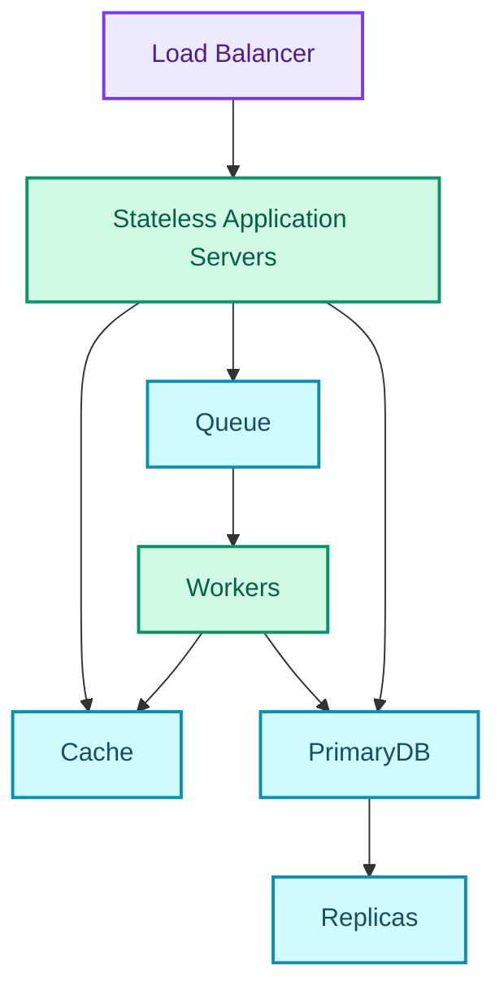

  

I used to say a system "needs to scale" the way people describe a car as "needs to be fast." It sounds like a requirement. It isn't one. Fast compared to what, under what load, measured how? "Scale" has the same problem, and I didn't notice until I sat down to design a URL shortener for practice. Then someone asked me the obvious first question. How many requests per second, on what hardware, with how much data. I had nothing.

So this is the post where I stop treating scale as an adjective and start treating it as arithmetic. What scaling means, the two axes people confuse, the numbers you probably need memorized before you can estimate anything, and a worked example that turns all of it into an architecture decision instead of a vibe.

None of it is hard maths, mostly division.

## Why bother naming the goal

Strip away the buzzword and the goal is plain. Handle more users, more requests, more data, without performance or availability quietly degrading while nobody's looking. That's it. Everything else here is detail stacked on top of that one sentence.

## Vertical vs horizontal

### Scaling up

Scaling **up** means adding resources to a single machine (more CPU, more RAM, faster storage). The appeal is real. The architecture stays dead simple, there's no distributed-systems complexity to reason about, no partial failures, no two machines that can disagree about the state of the world. For a while that trade is usually worth taking.

But it's a loan rather than a strategy. You're borrowing against a hardware ceiling that exists whether you look at it or not, cost climbs with diminishing returns as you move up the tiers, and the whole time you're still running on a single point of failure that just happens to be a more expensive single point of failure than it was last quarter.

### Scaling out

Scaling **out** means adding more identical application servers and distributing requests across the cluster, where any request can in principle be serviced by any server. The advantages are concrete. Higher throughput, better availability, and usually better cost-effectiveness than chasing specialized hardware, because you're buying commodity machines instead of the next tier of an increasingly expensive single box.

It isn't free, though, and I think this is the part that gets glossed over. Going horizontal means:

- More operational complexity. There are now many instances to clone, deploy, and monitor instead of one.
- Application servers have to be **stateless**, full stop. If a server holds state a request depends on, that request can no longer land on just *any* server, and the whole premise of horizontal scaling breaks.
- Downstream systems (databases, caches) now have to absorb far more concurrent connections than they would have from a single server.

You didn't remove complexity by going horizontal. You moved it from "how big a machine can I buy" to "how do I keep a fleet of identical, disposable machines, and everything downstream of them, both correct and fast." A real trade, not a free upgrade.

Most "why don't we just add more servers" conversations skip past it entirely.

## Two different diseases

The first mistake is conflating two questions that feel like the same question, so it's worth putting them side by side.

| Concept | Definition |
| --- | --- |
| **Performance** | The ability to process work efficiently. Serve more requests, handle larger workloads. |
| **Scalability** | The ability to improve performance *proportionally* as you add resources. |

And the diagnostic that tells you which one you're looking at.

| What you're seeing | What it actually is |
| --- | --- |
| Slow for a single user, no load | A **performance problem** |
| Fast for one user, falls over under heavy load | A **scalability problem** |

You fix them differently. Profiling a slow endpoint doesn't help if the endpoint is fast in isolation and only dies under concurrent load. Throwing more servers at a single slow query doesn't make the query faster, though it might hide the problem for a while. Misdiagnose which one you have and you'll probably spend a sprint "fixing" the wrong layer.

Scalability, properly defined, is boring on purpose. A resource increase should produce a proportional performance increase, whether that shows up as higher request throughput or the ability to chew through a larger dataset.

In distributed systems, resources sometimes get added purely for **reliability** (redundancy, not raw performance) and the definition still has to hold. A system stays scalable only if adding that redundancy doesn't badly tax performance while it's doing its job.

Get more available through redundancy but lose proportional throughput doing it, and you probably haven't scaled anything. You've traded one property for another and called it a win.

### Why it's hard

Scalability has to be designed into the architecture from the start; it is not something you bolt on once traffic shows up. Bolting it on later usually means rewriting whichever parts quietly assumed one machine, one disk, one clock. Concretely, scaling has to guarantee two things at once. Added resources increase performance, and added redundancy doesn't erode it.

There's a trap hiding underneath both. Algorithms that perform perfectly well at a low request rate, a small dataset, or a handful of nodes can become prohibitively expensive as any of those three grow, and the failure is rarely a clean one you can point at in a profiler. Same code, same logic, quietly falling off a cliff once the input size crosses some threshold nobody thought to test against.

### Heterogeneity shows up whether you plan for it or not

Here's a detail that's easy to skip past in a system design write-up but tends to show up constantly on real fleets. Scaling out doesn't give you identical machines forever. Over time you accumulate different hardware generations, different compute and storage capacities, sometimes machines spread across different geographies.

So nodes end up with quite different performance characteristics, and algorithms that quietly assumed homogeneous nodes will either fail outright or, more insidiously, just underutilize the newer hardware without ever throwing an error you could page on. Nothing breaks loudly. You get less than you paid for.

### Designing for it, as a process

Roughly an order of operations. Identify which axis you expect to grow, since traffic, dataset size, and node count each pull the design in a different direction. Plan the redundancy requirements up front. Assume heterogeneous infrastructure, because you'll usually get it whether you asked or not. Only then pick the algorithms and architectural patterns that can hold up under the conditions you just named.

Skip the naming step and you'll often end up designing for growth along an axis that was never the constraint.

## Latency and throughput pull in different directions

Here's the pairing that finally made scalability click for me.

| Metric | Definition | Unit |
| --- | --- | --- |
| **Latency** | Time required to complete one operation or produce one result | Time (seconds, ms, ns, clock cycles) |
| **Throughput** | Number of operations completed per unit time | Operations / time |

Latency is how long *one* thing takes. Throughput is how many things get done *per unit time*. Improving one does not automatically improve the other. The goal in almost every real system is to maximize throughput while holding latency at an acceptable level, not to maximize either one in isolation.

A factory that finishes one car every eight hours has a latency of eight hours. Run five assembly lines in parallel and you finish five cars every eight hours. Throughput goes up 5x, and the latency for any individual car doesn't move at all. **High throughput does not imply low latency.** Easy sentence to agree with, and a common thing to get backwards in the moment, usually when a dashboard shows one metric looking great and you quietly assume the other one must be fine too.

### The same idea in hardware

Hardware designers run into this constantly, and the numbers make the gap concrete. Take a device clocked at 100 MHz, where each computation takes 1000 ns, moving a 64-bit output word, with a measured device throughput of 640 Mbits/s. Work through it and you get:

| Metric | Result |
| --- | --- |
| Latency | 100 clock periods |
| Throughput | 0.1 words per clock period |
| Equivalent throughput | 1 word every 10 clock periods |

The detail that catches people off guard is that some tools report that last figure as the number **10** rather than **0.1 words/clock period**. Convenient shorthand, technically imprecise. If you're not watching which convention a tool uses, you can misread throughput by an order of magnitude without noticing.

## Numbers to know cold

Most "let's estimate this" conversations go badly because the raw material is missing. The latency figures for the operations a system is built out of, and the size conventions that let you convert between them without reaching for a calculator.

### Powers of two

| Power (2ⁿ) | Exact value | Roughly | Bytes |
| --- | --- | --- | --- |
| 2⁷ | 128 | — | 128 B |
| 2⁸ | 256 | — | 256 B |
| 2¹⁰ | 1,024 | 1 thousand | 1 KB |
| 2¹⁶ | 65,536 | — | 64 KB |
| 2²⁰ | 1,048,576 | 1 million | 1 MB |
| 2³⁰ | 1,073,741,824 | 1 billion | 1 GB |
| 2³² | 4,294,967,296 | — | 4 GB |
| 2⁴⁰ | 1,099,511,627,776 | 1 trillion | 1 TB |

### Latency numbers worth memorizing

| Operation | ns | µs | ms | Comparison |
| --- | --- | --- | --- | --- |
| L1 cache reference | 0.5 | — | — | baseline |
| Branch mispredict | 5 | — | — | — |
| L2 cache reference | 7 | — | — | 14× L1 |
| Mutex lock/unlock | 25 | — | — | — |
| Main memory reference | 100 | — | — | 20× L2, 200× L1 |
| Compress 1 KB with Zippy | 10,000 | 10 | — | — |
| Send 1 KB over 1 Gbps network | 10,000 | 10 | — | — |
| Read 4 KB randomly from SSD | 150,000 | 150 | — | ~1 GB/s SSD |
| Read 1 MB sequentially from memory | 250,000 | 250 | — | — |
| Round trip inside the same datacenter | 500,000 | 500 | — | — |
| Read 1 MB sequentially from SSD | 1,000,000 | 1,000 | 1 | 4× memory |
| HDD seek | 10,000,000 | 10,000 | 10 | 20× datacenter round trip |
| Read 1 MB sequentially over 1 Gbps network | 10,000,000 | 10,000 | 10 | 40× memory, 10× SSD |
| Read 1 MB sequentially from HDD | 30,000,000 | 30,000 | 30 | 120× memory, 30× SSD |
| Round trip California → Netherlands → California | 150,000,000 | 150,000 | 150 | — |

One comparison is worth carrying around. A same-datacenter round trip and a 1 MB sequential SSD read land in the same order of magnitude, both roughly a millisecond. Reading that same megabyte off a spinning disk costs thirty times more. A design that quietly assumes "disk is disk" can therefore be a 30x mistake before a line of application code gets written.

### Units

| Unit | Equivalent |
| --- | --- |
| 1 ns | 10⁻⁹ seconds |
| 1 µs | 10⁻⁶ seconds = 1,000 ns |
| 1 ms | 10⁻³ seconds = 1,000 µs = 1,000,000 ns |

A few derived, rounder numbers help too. Sequential HDD reads run around 30 MB/s, sequential reads over 1 Gbps Ethernet around 100 MB/s, sequential SSD reads around 1 GB/s, sequential main-memory reads around 4 GB/s. At the network layer that's roughly 6–7 worldwide round trips per second, versus around 2,000 within a single datacenter.

Nearly three orders of magnitude, which on its own probably explains why "just call the other region synchronously" is usually the wrong instinct.

## A worked estimate

Tables are inputs. Here's the method for turning them into a design decision.

**Scenario:** a URL shortener. 100 million new links a month, read-heavy. The kind of prompt that shows up in every interview and on plenty of real roadmaps.

**Step 1, traffic.** 100M writes a month, divided by 30 days and 86,400 seconds in a day, rounds to roughly **40 writes/sec**. I round the seconds-per-day figure hard, to 100,000, because the exponent matters here and the trailing digits don't.

Then assume a 100:1 read:write ratio. That's a number you should probably state out loud rather than quietly guess at, since it decides most of what follows. It puts reads at **4,000/sec** on average, and peak for a steady product usually runs 2–3x average, so call peak **~8,000 reads/sec**.

**Step 2, storage.** A short code plus the long URL plus index and metadata overhead rounds to about 500 bytes a record. 100M records a month is **50 GB/month**, so 600 GB a year, so roughly **3 TB over five years**. Three terabytes sits comfortably on a single machine's disk. Which is why the arithmetic comes first. **Storage alone does not justify sharding here.** Had I started from "web-scale systems shard their database" as a principle instead of from a number I could check, I'd probably have built something far too complicated for the problem.

**Step 3, bandwidth.** Writes: 40/sec × 500 B ≈ 20 KB/s. Reads: 4,000/sec × 500 B ≈ 2 MB/s. Negligible either way. Bandwidth isn't the constraint here, and it's worth checking rather than assuming.

**Step 4, memory for cache sizing.** The 80/20 rule seems to hold reasonably well for link access patterns, so roughly 20% of links may serve something like 80% of reads. Daily reads run around 4,000/sec × 86,400 ≈ 350 million. Caching the hot subset (call it 35 million distinct records at 500 bytes each) comes out to roughly **17 GB**. That can sit on one large cache node, or a small cluster, without drama.

**Step 5, read the design off the numbers.** 8,000 peak reads/sec is comfortably served by a cache tier plus a couple of read replicas, so no sharding for reads. 40 writes/sec is nothing, so a single primary is fine. **This is a caching problem, not a sharding problem.** I only know that because I did five minutes of division instead of pattern-matching to "big systems shard."

### Rules of thumb

- **1M/day ≈ 12/sec.** Memorize this one specifically. It converts almost any product metric you'll be handed, instantly.
- Peak traffic runs 2–3x average for steady products, and 10x or more for anything event-driven (ticket sales, live sports, flash sales).
- Round aggressively. 86,400 seconds in a day becomes 100,000. The exponent is what matters; the digits after it mostly don't.
- State the **read:write ratio** out loud, as an assumption. It probably decides replicas vs. shards vs. cache more than any other single number in the estimate.
- Finish by naming the binding constraint. An estimate that doesn't rule anything in or out, or change a decision, was wasted time. You did the math for the wrong question.

## The reference architecture

This is the shape most of what follows keeps coming back to. Worth seeing once, whole, before it gets taken apart piece by piece.

Requests come in through a load balancer and hit a fleet of stateless application servers. From there they fan out to a cache for hot reads, a primary database for the source of truth (with replicas absorbing read load), and a queue for anything that doesn't need to happen synchronously. Workers drain the queue and write back into the same cache and primary database the application servers use.

Nothing exotic about any of it. A small, recurring set of components, wired together once so there's a map to point back at later.

## The thesis, as a checklist

A handful of principles that everything else here elaborates on, stated once and plainly.

- Prefer horizontal scaling over unlimited vertical scaling.
- Keep application servers stateless.
- Centralize shared state.
- Use load balancers to distribute requests.
- Replicate databases for read scalability.
- Partition databases once a single database becomes the bottleneck.
- Cache aggressively to reduce database load.
- Cache assembled objects instead of raw query results where possible.
- Move expensive work to background workers whenever synchronous execution isn't required.
- Precompute and serve static content wherever possible.

## Check yourself

The test I gave myself before moving on. If I couldn't answer these cold, I hadn't internalized the material, I'd only read it.

1. What separates a performance problem from a scalability problem, and how would you tell them apart from a latency graph alone?
2. Why doesn't adding redundancy automatically make a system less scalable?
3. A product has 5M daily active users making 20 requests each. What's the average QPS, and what would you assume for peak?
4. Which is slower: a round trip inside a datacenter, or reading 1 MB sequentially from SSD? By roughly how much?
5. Your estimate produces 3 TB of data and 200 QPS. Do you shard? Justify it from the numbers, not from instinct.
6. At what point does vertical scaling stop being the right answer?

"This needs to scale" was never a requirement. "8,000 reads a second, 3 TB over five years, 40 writes a second" is one, and it's the one I should have written down before any of the rest of this series.
