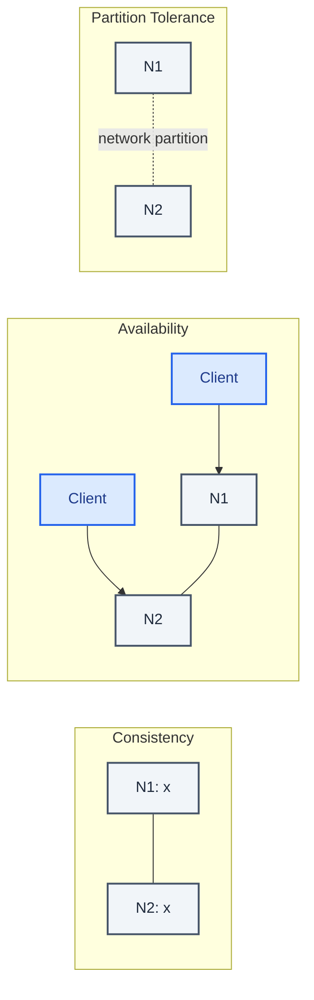
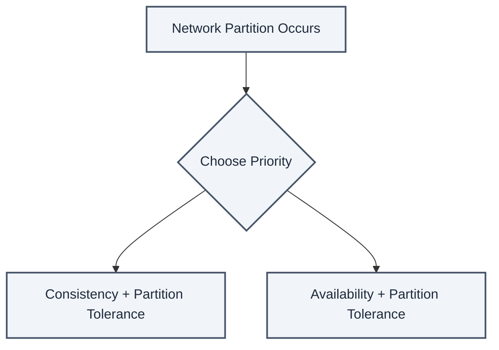
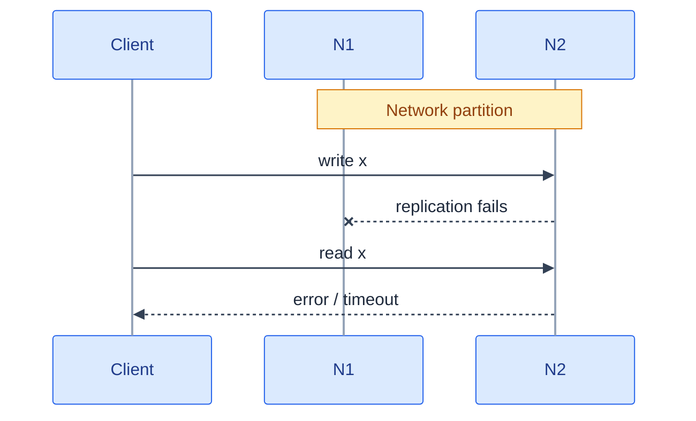
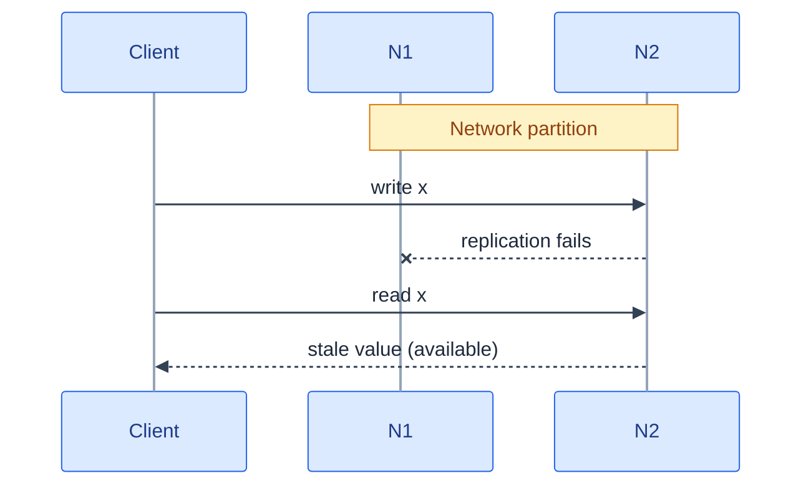
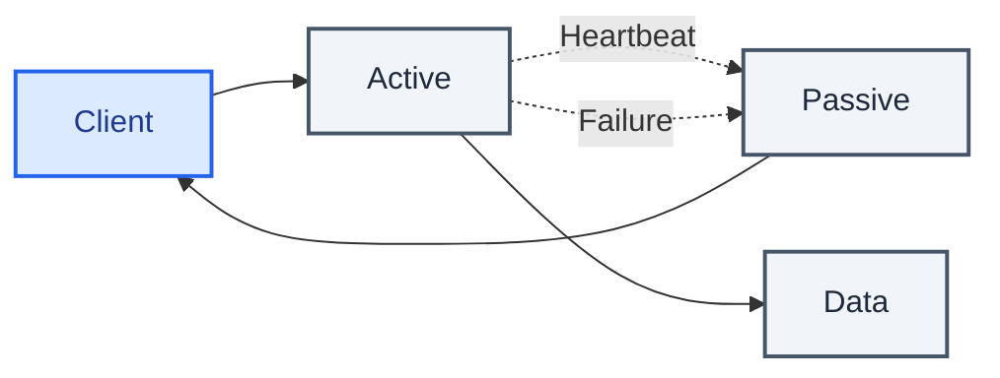
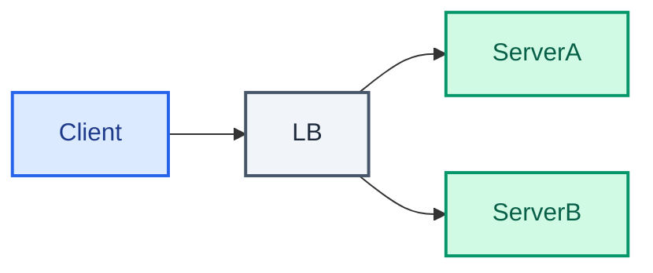
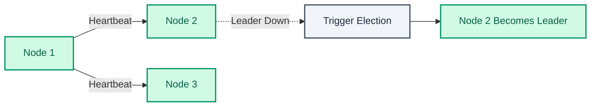
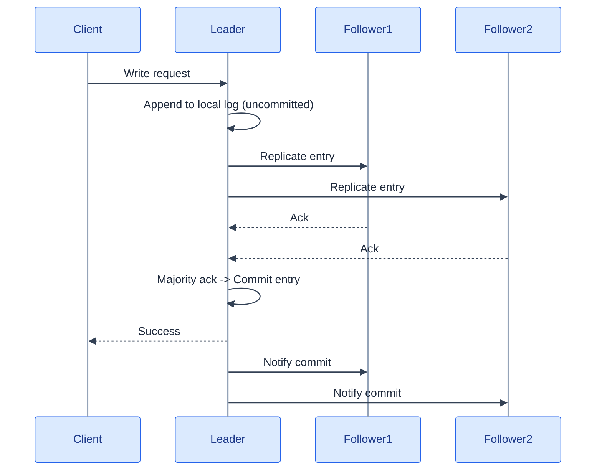

<p align="center">
  
</p>

CAP theorem gets taught as a triangle. Pick two of Consistency, Availability, Partition tolerance. I drew that triangle in a notebook once, circled "AP," and felt like I understood something.

I didn't.

The triangle misleads you about which corner is negotiable.



Network partitions happen. Cables get cut, switches misbehave, a rack loses power, and every so often a region's networking has a bad ten minutes for reasons that nobody ever fully explains in the postmortem afterward. You can't opt out of that with an architecture decision the way you can opt out of (say) WebSockets.

So Partition Tolerance was never the third option standing next to two real ones. It's the precondition. That leaves a much narrower decision than the triangle suggests. **When a partition happens, do you refuse to answer, or do you answer with something that might be stale?**

## What C and A are promising

| Guarantee | Definition |
| --- | --- |
| **Consistency (C)** | Every read returns the most recent write, or an error. No stale answers, ever. |
| **Availability (A)** | Every request receives a response, though it may not contain the latest data. |
| **Partition Tolerance (P)** | The system keeps operating despite a network partition. |

Under a clean network all three coexist fine. That's why the trade-off stays invisible until the day it matters. Partitions are unavoidable in any real distributed system, so partition tolerance is mandatory, and the decision left over is between the other two.



The question only bites during a partition, and it bites in a specific way. Node A has the latest write. Node B can't reach A to hear about it, and a client is asking node B right now.

Node B has two options. Say "I don't know, try later," which is consistency bought with availability. Or answer with what it's got, which is availability bought with a chance of being wrong.

## CP and AP are a per-subsystem decision

Take a payment ledger and a social media feed, sitting in the same product.

The ledger is CP. Hard requirement, not a preference.



| Characteristic | Details |
| --- | --- |
| Reads | Guaranteed latest write |
| During partition | May wait for an unavailable node |
| Result | Timeout or explicit error possible |
| Best when | Atomic reads/writes are business-critical |

If a partition happens mid-transaction, I want the system to refuse to tell you your balance rather than hand you a number that might be wrong. A timeout that makes you retry is annoying. A confidently wrong account balance is probably a lawsuit.

The feed is AP, just as deliberately.



| Characteristic | Details |
| --- | --- |
| Reads | Return whatever's most readily available |
| Data freshness | May be stale |
| Writes | Accepted and propagated once the partition heals |
| Best when | Eventual consistency is acceptable, or staying up matters more than being current |

If a partition happens while you're scrolling, I'd much rather you see a feed that's thirty seconds stale than a spinner. Nobody has ever been harmed by seeing yesterday's version of a meme. Refusing to render *anything* because one node can't confirm freshness is probably the wrong failure mode here. The stakes are too low to pay for it.

Same company, same outage, two different answers. The question was never "are we a CP system or an AP system." It was "what does it cost this piece of data to be wrong for a few seconds, versus what does it cost to be unavailable for a few seconds."

CAP is a software design decision, not a network fact. The failures happen regardless of what you choose. Answer the cost question per subsystem and the CP/AP label falls out of the answer, instead of being a religion you pick once at the start of a project.

## Consistency isn't binary either

Even within "eventually correct" there's a spectrum. Knowing where a given data path sits on it matters more than the label you put on the system as a whole.

- **Weak consistency.** A read after a write might or might not see it. Best-effort synchronization, no promises. Common in Memcached, VoIP, video chat, real-time multiplayer games. That sounds bad until you remember how a VoIP call behaves. If you dropped for two seconds, nobody replays those two seconds of audio at you when you reconnect. Replaying stale audio would be worse than losing it.
- **Eventual consistency.** A read after a write *will* eventually see it, usually within milliseconds, via asynchronous replication. DNS and email both run on this. It's generally the right default for anything highly available, since "eventually" tends to be fast enough in practice that no user ever notices there was a gap to begin with.
- **Strong consistency.** Every read after a write sees it, full stop, via synchronous replication. This is what a relational database or a file system gives you by default, and it suits anything that needs real transactions. It also costs the most in latency and availability, so it isn't something to reach for out of habit.

The mistake I used to make was treating strong consistency as the safe default and everything else as a compromise.

It's backwards. Strong consistency is an expensive tool for a specific job. Pick it because a subsystem needs it, not because it sounds more careful.

## Two ways to survive a server dying, and the trade neither of them escapes

Fail-over and replication both buy availability, and both cost you something specific in return.

**Active-passive**, also called master-slave failover. One active server handles all the traffic while a passive standby sits there listening for a heartbeat, and the moment that heartbeat stops the standby assumes the active's IP address and starts serving requests itself.



Simple to reason about. Downtime during the handoff depends on whether the standby was hot or cold. The failure mode that bites you is data written to the active server in the gap between its last successful replication and the moment it died. That data can be gone.

**Active-active**, or master-master failover. Both servers take traffic at once, load split across them.



No standby sitting idle, better resource usage. But now every piece of infrastructure that used to know about "the server" has to know about both of them, which means DNS has to carry both public IP addresses for public-facing services and your application logic has to know both servers for the internal ones. You've traded a simpler failure story for better utilization.

Neither one is free. Fail-over means extra hardware and extra operational complexity, plus the potential data loss described above if the active dies before its last writes replicate, and replication in general means every write costs you more because it has to land in more than one place before anyone is willing to call it safe.

## The arithmetic behind "nine nines," and why it moves the wrong direction in series

99.9% availability sounds close enough to 100% that most people stop thinking about it. Written out as downtime, it looks less comfortable.

| Duration | Acceptable downtime at 99.9% (three 9s) |
| --- | --- |
| Per year | 8h 45min 57s |
| Per month | 43m 49.7s |
| Per week | 10m 4.8s |
| Per day | 1m 26.4s |

One more nine changes the picture by an order of magnitude.

| Duration | Acceptable downtime at 99.99% (four 9s) |
| --- | --- |
| Per year | 52min 35.7s |
| Per month | 4m 23s |
| Per week | 1m 5s |
| Per day | 8.6s |

Each extra nine costs roughly an order of magnitude more and buys you an order of magnitude less downtime. Those two curves don't move together. That's why "just add a nine" is a much bigger ask than it sounds.

Here's the part that changes how you draw an architecture diagram. **Availability compounds differently depending on whether components sit in sequence or in parallel.** In sequence, overall availability is the product of the parts:

```
Availability(Total) = Availability(Foo) × Availability(Bar)
```

Two components at 99.9% each, wired in sequence so a request has to pass through both to succeed. 99.9% × 99.9% ≈ **99.8%**. You added a component and your availability went *down*, even though each piece looked fine on its own.

Wired in parallel instead, the formula flips to what fails, not what succeeds:

```
Availability(Total) = 1 − (1 − Availability(Foo)) × (1 − Availability(Bar))
```

Same two components at 99.9% each. 1 − (1 − 0.999)(1 − 0.999) ≈ **99.9999%**. Same components, same individual reliability, and the only thing that decides whether you land under your target or three nines above either component alone is whether the request needs both of them or just one.

So "how many services does this request pass through" is a design question, not diagram aesthetics.

Every service you add in sequence is availability debt, whether or not any individual service ever fails.

## Getting nodes to agree without a referee

Underneath both the CP/AP decision and fail-over sits a harder problem. Multiple nodes have to agree on one value or state, meaning who the leader is and what the last committed write was, and they generally have to do it while nodes are failing, networks are partitioning, and messages arrive late, twice, or never at all.

You need it for leader election, distributed locks, configuration agreement, replicated logs. It's hard mostly because there's no global clock. Nodes can't agree on who asked first, and any of them can drop off the network at any moment.

### Leader election and the quorum that protects it

One node gets designated leader and coordinates writes and decisions. If it fails, the remaining nodes have to detect that and elect a new one, without ever letting two nodes believe at the same time that they're the leader. That's split-brain. It's the failure mode every consensus protocol exists to prevent.



The mechanism that prevents split-brain is a **quorum**. A decision requires agreement from a majority of nodes, say 3 out of 5. That one requirement is what makes it safe. Any two majorities drawn from the same set of nodes have to overlap by at least one node, which means you can never end up with two disjoint majorities quietly agreeing on two different things at the same time.

Small piece of math, and it's doing most of the load-bearing work behind both consistency guarantees and leader-election safety.

### Paxos and Raft solve the same problem, one of them legibly

**Paxos** is the classic algorithm. Nodes propose values, and a majority has to accept one before it counts as chosen. It's correct, and it's notoriously hard to understand or implement. Historically it backed Google Chubby and, in variant form, Spanner.

**Raft** was designed as a more understandable alternative, built around an explicit leader and an explicit log. First a leader-election phase, then log replication, where the leader ships entries to followers and commits once a majority acknowledges.



| Aspect | Paxos | Raft |
| --- | --- | --- |
| Understandability | Low | High: explicit leader/log model |
| Leader concept | Implicit, rotating | Explicit |
| Adoption | Historical, theoretical | Widely used: etcd, Consul, CockroachDB |

Understandability is why etcd, Consul, and CockroachDB all picked Raft when they needed this primitive in production.

In an interview or a design doc you almost never derive either algorithm from scratch. What gets used is narrower. Justifying how a service registry like Consul or ZooKeeper stays consistent. Designing a distributed lock service. Explaining how a leader gets chosen among database replicas during a failover. Naming the mechanism and its guarantee (majority quorum, which is what keeps leader election safe) is usually enough.

## Check yourself

1. Why is partition tolerance not really a choice in a distributed system?
2. A payment ledger and a social feed. Which is CP, which is AP?
3. Under eventual consistency, what does a user see if they write and then immediately read?
4. Two components each at 99.9% availability: what's the combined figure in sequence? In parallel?
5. What does a quorum guarantee that a designated leader alone does not?
6. What is split-brain, and what mechanism prevents it?
7. Why do modern systems pick Raft over Paxos?

CAP isn't a triangle you stand at one corner of, for the whole system, once. It's a question you ask per subsystem, every time a partition-shaped failure is possible. What does staleness cost here, versus what does refusing to answer cost?

The ledger and the feed in the same app get different answers, and that's not an inconsistency in the architecture. It's the architecture working correctly.
