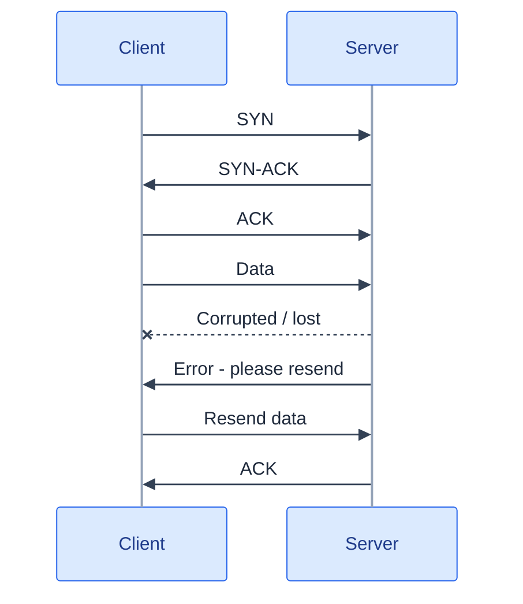
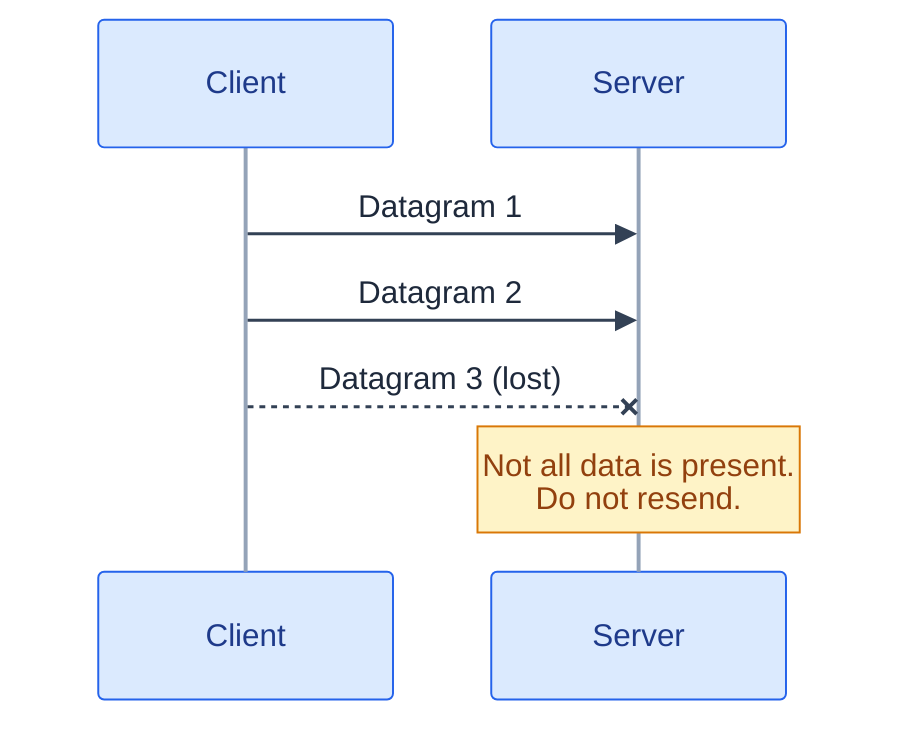
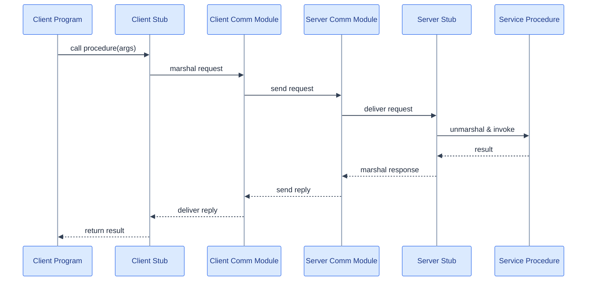
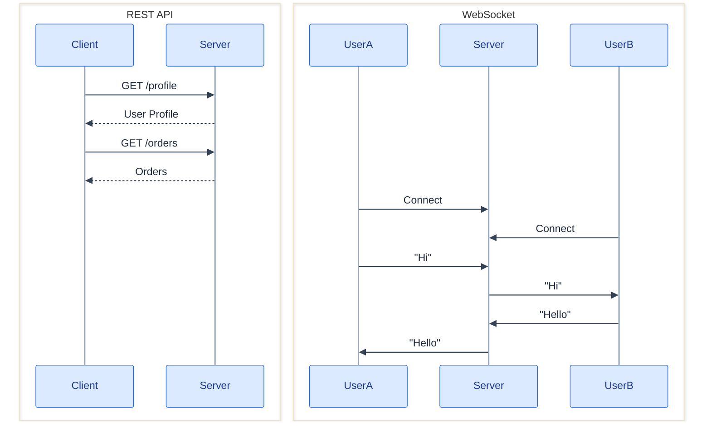

  

Every "REST vs RPC" argument I've sat through skips a question that decides the answer before the argument even starts. Who is going to be reading these bytes, and do they work for the same company as you?

That's not a glib framing. It's the actual axis. Get that answer first, and REST vs RPC vs gRPC stops being a taste preference and turns into arithmetic, the same way scale did in Part 1.

## HTTP, underneath everything here

Before any API style, there's the protocol carrying it. HTTP is an application-layer protocol for encoding and transporting data between a client and a server. The client sends requests, the server returns content plus status information. Requests and responses are self-contained, so they can pass through load balancers, caching layers, or encryption proxies along the way, without any of those intermediaries needing to understand the application on top. HTTP is built on a lower-layer transport, almost always TCP.

Five methods are worth knowing cold. Two properties end up mattering the moment you add retries to anything.

| Method | Purpose | Idempotent | Safe | Cacheable |
| --- | --- | --- | --- | --- |
| GET | Read a resource | Yes | Yes | Yes |
| POST | Create a resource or trigger processing | No | No | If the response carries freshness info |
| PUT | Create or replace a resource | Yes | No | No |
| PATCH | Partially update a resource | No | No | If the response carries freshness info |
| DELETE | Delete a resource | Yes | No | No |

Idempotent means executing it multiple times leaves the same final outcome as executing it once. That distinction sounds academic until a request times out and you have to decide whether it's safe to send it again. Retry a `GET` or a `PUT` freely. Retry a bare `POST` and you might create the same order twice.

## Two layers below HTTP, and why TCP is the boring default worth understanding

**TCP** does a three-way handshake before it sends a single byte of your data. Once it's talking, it guarantees ordered, reliable delivery with data integrity intact.

That reliability comes from sequence numbers, checksums, acknowledgement packets, and automatic retransmission. A missing ack triggers a retransmit. Enough consecutive timeouts and the connection drops. Flow control and congestion control ride along on top.

All of it costs latency, and that's why TCP is less efficient than UDP, but it's also why you don't think about packet loss when you're building a web server, a database client, or an SSH session, because TCP is quietly doing the resending for you. It's the right choice whenever complete, correct delivery matters and you want that handled automatically. That covers the common case. Web servers, databases, SMTP, FTP, SSH.

One operational wrinkle worth knowing. Keeping many TCP connections open at once improves throughput but costs memory, and a large number of persistent connections between services (a web server and Memcached, say) can get expensive. Connection pooling is the usual fix. Switching to UDP where it's appropriate is the other one.

**UDP** skips all of that. No handshake, no ordering guarantee, no delivery guarantee beyond the individual datagram.

A datagram either arrives or it doesn't, possibly out of order, and nobody resends it for you, with no congestion control at all. It also supports subnet broadcasting. DHCP leans on that, because a client that doesn't have an IP address yet still has to be reachable.

All of that sounds strictly worse than TCP. Until you hit a workload where a resent, late packet is *actively harmful* rather than merely annoying: VoIP, video chat, streaming, real-time multiplayer games. A retransmitted, half-second-late audio frame doesn't improve the call. It makes it worse. Better to drop it and move on. UDP is the right choice when the lowest possible latency matters, when late data is worse than lost data, and when the application is willing to do its own error correction.

| Feature | TCP | UDP |
| --- | --- | --- |
| Connection | Connection-oriented | Connectionless |
| Reliability | Guaranteed | Best effort |
| Packet ordering | Guaranteed | Not guaranteed |
| Retransmission | Yes | No |
| Congestion control | Yes | No |
| Flow control | Yes | No |
| Latency | Higher | Lower |
| Efficiency | Lower | Higher |
| Broadcast | No | Yes |
| Typical use | Web, databases, FTP, SSH | Streaming, VoIP, gaming |

That's a surprisingly specific and useful test to run before defaulting to TCP just because it's the safe-sounding option. Ask whether late is worse than missing for this workload.

## RPC vs REST is a coupling decision wearing a syntax costume

Remote Procedure Call lets a client invoke a function on a remote server as if it were local. The marshaling, network transport, and unmarshaling all sit hidden behind a stub.

Seven hops for what feels like one function call. The client program calls its stub, the stub marshals the procedure ID and arguments, the client comm module sends it, the server comm module receives it, the server stub unmarshals it, the matching procedure runs, and the response retraces the same path back. The syntax difference (`POST /addItemToUsersItemsList` versus `POST /persons/1234/items`) is the part everyone notices first and the part that matters least. The real difference underneath is how tightly the client and the service are allowed to know about each other.

RPC is behavior-oriented, and the coupling is tight on purpose. Client stub, wire format, server procedure. All generated from the same contract, giving a native-feeling call with controlled error handling and access patterns the client can't misuse. Popular frameworks like Protobuf, Thrift, and Avro exist to generate exactly that pairing. Choose an SDK when the target platform is known, when access patterns and error handling need to stay controlled, and when performance and the resulting user experience are the primary concern.

The cost is real. A new API is required for every new operation. Tight coupling makes debugging hard when something in the marshal/unmarshal chain goes wrong. Existing infrastructure, a caching layer like Squid, say, often needs extra integration work to understand behavior-oriented calls at all.

REST is resource-oriented on purpose. Clients operate on resources the server manages. Statelessness isn't a style choice tacked onto it. It's the property that lets a REST API sit behind an arbitrary number of interchangeable servers, with a load balancer that doesn't need to know anything about the request except which server is free. The interface follows four principles: identify resources through a URI that stays the same regardless of the operation performed on it, change state through the standard HTTP verbs rather than inventing new ones, let status codes be the self-descriptive error message instead of reinventing that wheel, and (the one people skip) make the API reachable and inspectable from a plain browser (HATEOAS).

That looseness is exactly what a public API needs. Thousands of external developers, in languages you don't control, hitting endpoints they can read and debug from the response alone. No generated client required.

Every REST API eventually pays a cost for that looseness. Business operations that don't map cleanly onto GET/POST/PUT/PATCH/DELETE end up as awkward, slightly apologetic endpoints. Complex queries spread across URI paths, query parameters, and request bodies all at once. Nested resources cost multiple round trips a single RPC call would have avoided, and API evolution tends to grow payload size over time as older clients keep receiving fields they'll never read.

| RPC | REST |
| --- | --- |
| Behavior-oriented | Resource-oriented |
| Exposes operations | Exposes resources |
| Higher client-service coupling | Lower client-service coupling |
| Common for internal communication | Common for public APIs |
| Optimized native calls | Uniform HTTP interface |
| Performance-focused | Scalability and interoperability focused |

Same operations, two different shapes:

| Operation | RPC | REST |
| --- | --- | --- |
| Signup | `POST /signup` | `POST /persons` |
| Resign | `POST /resign` | `DELETE /persons/1234` |
| Read person | `GET /readPerson?personid=1234` | `GET /persons/1234` |
| Read person's items | `GET /readUsersItemsList?personid=1234` | `GET /persons/1234/items` |
| Add item | `POST /addItemToUsersItemsList` | `POST /persons/1234/items` |
| Update item | `POST /modifyItem` | `PUT /items/456` |
| Delete item | `POST /removeItem` | `DELETE /items/456` |

Neither is "better." RPC when you control both ends and want the tight contract; REST when you don't control the other end and coupling would be a liability, not a convenience.

## gRPC is RPC that picked a fight with JSON, on purpose

gRPC deserves its own mention because it isn't really competing with REST for the same job. It's Protocol Buffers over HTTP/2, binary and strictly typed. The entire point is internal service-to-service calls, where both ends are your own code and nobody needs to read the payload with their eyes.

| | REST | gRPC |
| --- | --- | --- |
| Format | JSON (text) | Protocol Buffers (binary) |
| Audience | External / public | Internal, service-to-service |
| Performance | Lower | Higher: smaller payloads, multiplexed over HTTP/2 |

Here's the comparison I keep coming back to. Stripe's public payments API has to be REST, because the audience is thousands of developers in every language who need to read and debug a response by looking at it. Inside Uber, when the trip service calls the pricing service hundreds of times a second, both ends are Uber's code, deployed together, versioned together. gRPC's compact binary payload and enforced schema matter far more there than human readability, since no human is ever meant to read that payload directly.

Same company, two different answers. Not because one protocol is objectively superior, but because "who's on the other end" changed. REST for public-facing APIs, gRPC for high-performance internal communication.

## When the client isn't the one asking

Everything above assumes the client initiates. REST, RPC, gRPC, all of them work the same way. The client asks, the server answers, connection's done. That breaks the moment the *server* needs to speak first. A new chat message arriving. A price tick. A driver's dot moving on a map. Four options exist, in increasing order of capability and cost, and they're not interchangeable.

| Requirement | Use |
| --- | --- |
| Client always initiates | REST |
| Server pushes, one direction, text only | Server-Sent Events |
| Both sides send continuously | WebSockets |
| Must traverse hostile proxies or legacy infrastructure | Long polling |

**Short polling.** The client just asks "anything new?" on a timer. Simple and stateless, works everywhere. Most of those requests come back empty, which is wasted work, and best-case latency is capped by however often you poll.

**Long polling.** The client sends a request, the server *holds it open* until data is available or a timeout fires, and the client immediately re-requests. Near-real-time delivery over plain HTTP, no new protocol needed. The cost is one held-open connection per waiting client, and a full reconnect cycle after every single message.

**Server-Sent Events.** One long-lived HTTP connection over which the server streams events. The client cannot send back on it. Reconnection and event IDs for resuming after a drop are part of the standard, not something built by hand. Text only, one direction, ideal for feeds, notifications, live dashboards, progress updates.

**WebSockets.** A single TCP connection, upgraded from HTTP, fully bidirectional, carrying text or binary frames, with the lowest per-message latency and overhead of the four. The costs matter in design discussions. The connection is **stateful**, pinning a client to one specific server, which breaks the statelessness a REST API takes for granted. Reaching a given user requires either sticky routing or a shared pub/sub backplane (commonly Redis) so any server can push to any connected client. Load balancers have to be explicitly configured to support the upgrade and long-lived connections. And concurrent connection count becomes its own capacity dimension, entirely separate from request rate.

| | Short polling | Long polling | SSE | WebSockets |
| --- | --- | --- | --- | --- |
| Direction | client pull | client pull | server → client | bidirectional |
| Latency | interval-bound | low | low | lowest |
| Connection | new each time | held, then re-opened | one, persistent | one, persistent |
| Protocol | HTTP | HTTP | HTTP | ws:// (upgraded) |
| Server state | none | one per client | one per client | one per client |
| Payload | text | text | text only | text or binary |
| Typical use | legacy, low-frequency | fallback | feeds, notifications, tickers | chat, gaming, collaborative editing, live location |

Here's the decision rule I actually use. If the client always initiates, REST. If only the server pushes and it's text, SSE. If both sides talk continuously, WebSockets. Long polling is the fallback for infrastructure too old or too hostile to support anything better.

One practical note that gets skipped a lot. Plenty of production systems use SSE where people reflexively reach for WebSockets. If the server is the only party that ever needs to push, SSE is simpler, survives flaky proxies better than a raw upgraded connection, and reconnects for free.

## WebSockets quietly break a rule from Part 1, and you have to pay for it

REST is fine when the client always asks first: "give me my order history." It breaks down for real-time updates, where the client would otherwise have to keep re-asking "anything new?"

Here's the part that I think gets glossed over in most comparisons. A WebSocket connection is **stateful**, and that state lives on one specific server. That's not a footnote. It directly breaks the "any request can be served by any server" property horizontal scaling depends on. A REST request can land anywhere. A WebSocket message for a given user has to reach the *one* server that user's connection is pinned to.

That forces one of two fixes: sticky routing at the load balancer, so a given client always lands back on the same server and reintroduces the kind of per-server state affinity stateless design was trying to avoid, or a shared pub/sub backplane, so any server can publish a message and whichever server actually holds that user's connection picks it up and forwards it. Concurrent connection count becomes its own capacity dimension too, separate from request rate, because a WebSocket connection sits open and costs memory whether or not a message is currently flowing over it.

None of this makes WebSockets the wrong choice for chat or live location. It just means choosing them is choosing to reintroduce a piece of state the rest of the architecture spent effort trying to get rid of. That trade is worth making with eyes open, not by default. Uber's live driver-location map couldn't work any other way. REST would mean the client polling "anything new?" constantly, which is strictly worse for a dot that's meant to move continuously.

## Check yourself

1. When would you choose UDP over TCP, and what must the application then handle itself?
2. Why is REST's statelessness a scalability property rather than a style preference?
3. Name an operation that's awkward in REST and natural in RPC.
4. Why is gRPC rarely the choice for a public API?
5. The server needs to push and the client never sends: SSE or WebSockets? Defend it.
6. What does introducing WebSockets break about a stateless application tier, and how do you work around it?
7. Which HTTP methods are idempotent, and why does that matter the moment you add retries?

Here's the one-question filter I collapse this whole part into. Before picking a protocol, ask who's on the other end of the connection, whether they initiate or you do, and whether that connection needs to outlive a single request.

REST, RPC, gRPC, plus the four real-time options, aren't a ranked list from worst to best. They're four answers to four different versions of that one question. The wrong answer isn't "you picked an inferior protocol." It's "you answered a question you never asked yourself."

## Further reading

- [Know Your HTTP Well: Headers](https://github.com/for-GET/know-your-http-well/blob/master/headers.md)
- [What is REST? (REST API Tutorial)](https://restfulapi.net/)
- [HATEOAS (REST CookBook)](http://restcookbook.com/Basics/hateoas/)
- [gRPC](https://grpc.io/)
