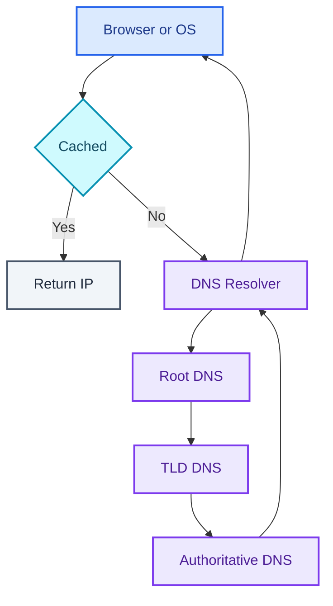
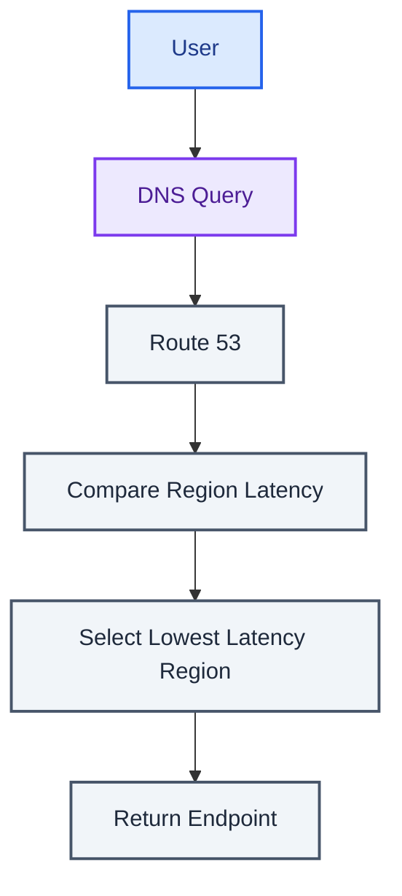
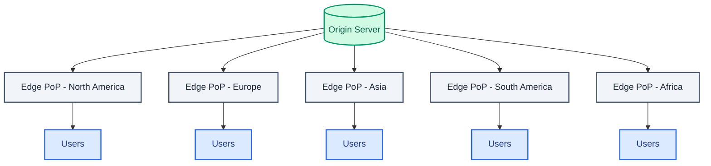
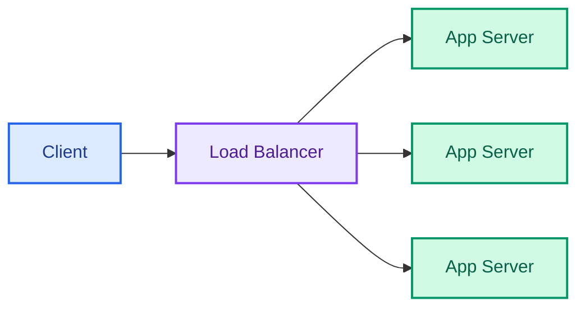
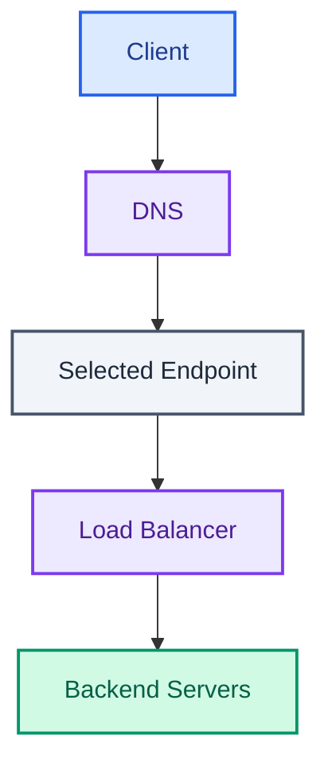
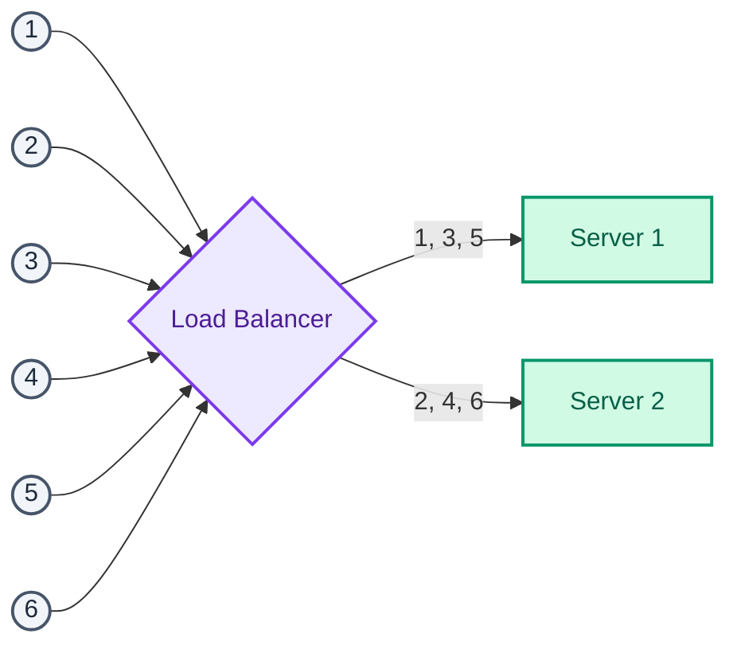
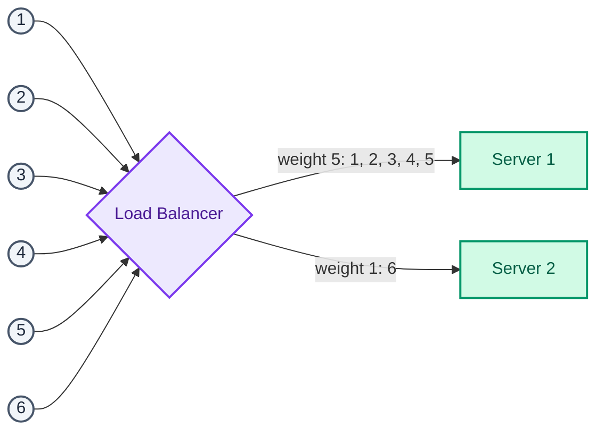
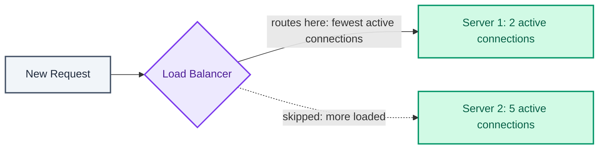
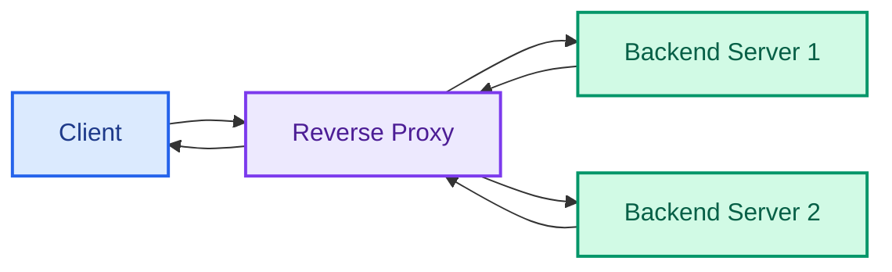

  

Type a URL, hit enter. By the time a single line of your application code runs, that request has already survived name resolution and maybe an edge cache. It's also passed through a load balancer and a reverse proxy. Most system design conversations start at "the application server receives a request." That skips four systems that already decided whether the request gets there at all, and what it looks like when it does.

I'd rather trace the whole thing, in the order a real request takes it.

## DNS: the first hop nobody thinks about

Domain Name System exists to translate `www.example.com` into an IP address, and it does it as a hierarchical, distributed system with authoritative servers at the top:

Your router or ISP hands you a resolver. That resolver climbs the hierarchy. Root, then TLD, then the authoritative server for the actual domain, until it gets an answer. Every level along the way caches what it learns, and so does your browser and OS, for as long as the record's **TTL** says to. Most managed providers default new records to something in the 60s-300s range, and that caching is why DNS mostly disappears from your latency budget after the first lookup.

It's also the source of the one recurring headache, propagation delay. A cached record can be technically stale with nothing forcing it to refresh yet, and there's no clean way to force every resolver on the internet to drop it early.

Four record types cover most of what you'll touch:

| Record | Purpose | Example |
| --- | --- | --- |
| **NS** (Name Server) | Names the authoritative servers for a domain or subdomain | `example.com` delegates to `ns1.provider.com`, `ns2.provider.com` |
| **MX** (Mail Exchange) | Names the mail servers that accept email for the domain | `example.com → mail.example.com`, priority 10 |
| **A** (Address) | Maps a hostname to an IPv4 address | `www.example.com → 192.0.2.10` |
| **CNAME** (Canonical Name) | Aliases one hostname to another | `example.com → www.example.com` |

Managed DNS providers (Cloudflare, Route 53) usually layer routing policies on top of plain resolution. Three of them are worth knowing by name, because each one can answer a different question.

**Weighted routing** answers "what fraction of traffic should reach each endpoint." Weights are configured by hand and traffic splits proportionally:

| Endpoint | Weight | Approximate traffic share |
| --- | --- | --- |
| Server 1 | 5 | 5/6 |
| Server 2 | 1 | 1/6 |

A 5:1 split like the one above sends roughly 83% of traffic to the stronger endpoint, which is the knob you want for draining traffic off a server going into maintenance, balancing across clusters with different capacity, or running an A/B test.

**Latency-based routing** answers "which region is fastest for this specific user, right now":

Route 53 compares measured latency from the user's location to each configured region and returns the closest one. A user in London, with load balancers in Oregon and Singapore, gets whichever of those two measures faster from London. That isn't always the geographically closer one. And the measurement is specifically between the user and AWS's own regions, so it drifts if your resources aren't hosted inside AWS, and it can shift over time as internet routing itself changes.

**Geolocation routing** answers a different question. Not "what's fastest" but "what's allowed or appropriate for this user's actual location." Localized content, language-specific sites, licensing restrictions, or just wanting the same user to land on the same endpoint predictably every time. It resolves at continent, country, or U.S. state granularity, with smaller regions taking precedence over larger overlapping ones:

| Configured records | Query from | Selected record |
| --- | --- | --- |
| North America + Canada | Canada | Canada |
| North America + Canada | Mexico | North America |

It needs an explicit default record for IPs that can't be mapped to a location. Without one, Route 53 just returns no answer at all.

None of this is free. Every DNS lookup, even a cached one, is a small delay stacked in front of everything else. The infrastructure behind it is largely run by governments, ISPs, and large providers, which can make it hard to reason about end to end. And because it's foundational and feels centralized, DNS itself has been a DDoS target: the 2016 Dyn attack took down access to sites like Twitter for people who didn't happen to know Twitter's raw IP address, even though Twitter's own servers were never touched. I still think that's the cleanest illustration of why "just resolve the name" is load-bearing infrastructure and not a formality.

## Why CDNs treat distance as the default problem

A content delivery network is a globally distributed network of proxy servers that serves content from a location physically closer to the user than your origin:

It's built for static content (HTML, CSS, JS, images, video), though some CDNs handle dynamic content too. The client gets pointed at the nearest edge server as part of DNS resolution itself. That's why CDN and DNS end up discussed together, even though they're solving different problems. The payoff is two-sided. Lower latency, because users pull from a nearby data center instead of a distant origin. Reduced origin load, because on a well-tuned setup 80% or more of requests never reach the origin at all.

There are two different ways content gets onto the edge, and the difference is who initiates the copy.

**Push CDN**: the origin proactively uploads new or changed content. The application owns rewriting static asset URLs to point at the CDN, and configuring the expiration policy. Only new or modified content moves, which means higher CDN storage usage but lower origin-to-CDN traffic. Usually a good trade for low-traffic sites, or content that rarely changes.

**Pull CDN**: the CDN fetches content from the origin the first time it's requested, and content stays at the origin as the source of truth. That first request pays a cache-miss penalty. TTL controls how long the edge holds onto what it fetched, and storage usage stays lower at the cost of some origin traffic every time a TTL expires and content gets re-pulled. This is the right shape for high-traffic sites where the same popular content keeps getting requested. The cache stays warm on its own.

| Feature | Push CDN | Pull CDN |
| --- | --- | --- |
| Content population | Origin uploads proactively | CDN fetches on first request |
| First request | Fast | Slower: cache miss |
| Storage usage | Higher | Lower |
| Best suited for | Low traffic, infrequently updated content | High traffic, frequently accessed content |

None of it is free either. A single link going viral can generally send origin traffic up 10x within minutes if the CDN layer isn't tuned right, cached content can go stale until its TTL clears, and every static URL has to be rewritten to point at the CDN in the first place. I'd default to a pull CDN unless the traffic pattern is already predictable, since guessing wrong on push just means paying to store things nobody's asking for.

## Hiding a fleet of servers behind one endpoint

Once traffic reaches your infrastructure, a load balancer sits in front of the application servers. It hides them behind a single endpoint and distributes incoming requests across them:

Zoomed out to the whole path so far:

The backend server does the actual work. The load balancer just returns whatever comes back to the client, having kept requests off unhealthy servers, kept any single server from getting overloaded, and made it possible to add or remove capacity without the client ever noticing. To me it's the mechanism that turns "a fleet of servers" into something that behaves like one reliable endpoint. It gets deployed as either a hardware appliance (fast, expensive) or software like HAProxy or NGINX (cheaper, more common today). None of that works unless requests can land on any server interchangeably, no reliance on local memory or local filesystem, identical behavior no matter which instance answers. That's the statelessness requirement carrying straight through from how horizontal scaling was framed earlier in this series.

Beyond raw distribution, a load balancer typically earns its place through three extra jobs. **Health checks** continuously probe backend health and route only to instances that pass. **SSL termination** decrypts incoming requests and re-encrypts responses, so backend servers skip the computationally expensive TLS work and nobody has to install an X.509 certificate (the standard digital certificate binding an identity to a public key) on every single instance. And **sticky sessions** use a cookie to keep a client's requests landing on the same backend. Useful when an application hasn't externalized its session state elsewhere; if you find yourself reaching for sticky sessions, treat that as a symptom, not a fix.

| Mode | Description | Benefit |
| --- | --- | --- |
| Active-passive | One load balancer actively serves traffic, a standby takes over on failure | High availability |
| Active-active | Multiple load balancers handle traffic simultaneously | Higher throughput and availability |

### Five ways to pick the next server

**Round robin** cycles through servers in turn:

Simple. It assumes every server has identical hardware and processing capacity. It doesn't look at current load or hardware differences at all. Put a server with 50% of its neighbors' CPU into that rotation and it still gets an equal share, and it can quietly buckle under it.

**Weighted round robin** fixes the hardware-mismatch case, by giving each server a configured weight so stronger servers get proportionally more:

It's also the knob for deliberately routing less traffic to a server running something business-critical, even when its hardware is identical to its neighbors. I've seen teams use it that way just to give one node a quieter blast radius, nothing to do with capacity at all.

**Least connections** looks at runtime state instead of a static rule, routing each new request to whichever server currently has the fewest active connections:

This usually matters when request duration or connection lifetime varies a lot. Round robin doesn't know a server is drowning in five long-lived connections; least connections does. **Weighted least connections** stacks both signals, blending configured server weight with current connection count. Better fit once a fleet has different hardware *and* variable request duration at the same time. And **random** assignment does what it says, converging toward even distribution over enough requests, without looking at load, capacity, or connections at all. Fine when the fleet is already uniform.

### Layer 4 vs Layer 7: how much of the request the balancer is allowed to read

| Aspect | Layer 4 | Layer 7 |
| --- | --- | --- |
| OSI layer | Transport (Layer 3 IP + Layer 4 TCP) | Application |
| Routing decision | Source IP, destination IP, TCP/UDP ports | URL, headers, cookies, body |
| Payload inspection | No | Yes |
| Traffic handling | NAT-based packet forwarding | Reverse proxy |
| Routing granularity | Connection/packet level | Application/request level |
| Flexibility | Lower | Higher |
| Computational overhead | Lower | Higher |
| Typical use | Fast packet forwarding | Content-aware routing |

**Layer 4** works purely off IP addresses and ports. It rewrites the destination IP to the chosen backend via NAT (network address translation, the network-layer trick of rewriting addresses in packet headers while forwarding traffic), then rewrites it back on the way out so the client never sees the backend's real address. It decides everything from the opening packets of a TCP stream, never looks at application data, and costs less compute because of it.

**Layer 7** terminates the client's connection and reads the full request. Only then does it open a fresh connection to whichever backend it picks, functioning as a genuine reverse proxy rather than a packet router. That lets it route on URL, headers, cookies, content type. Video requests go to video-tuned servers, billing requests to security-hardened ones, at the cost of more processing per request. Layer 4 used to win on raw performance. On modern commodity hardware that gap has mostly closed. I'd say that's why Layer 7's flexibility wins the argument in most designs today.

### Cutting the load balancer out entirely

There's another option. Instead of a dedicated load balancer, the **client** holds the list of backend instances and picks one itself, running its own round robin or least-connections logic, tracking which instances are healthy, noticing when new ones come online, sometimes its own retries, timeouts, and circuit breakers. It's common for internal service-to-service traffic in a microservice architecture. The appeal is real. No dedicated load balancer to run, no extra network hop, direct service-to-service communication.

The cost shows up somewhere else instead. Every client or SDK now generally carries load-balancing and failure-handling logic that used to live in one place. Changing routing behavior generally means updating every client, and keeping behavior consistent across different client implementations tends to be hard. For most systems I'd default to a software load balancer as the simpler, cheaper option. Smart clients earn their complexity only when a specific scalability or architectural requirement justifies it.

Load balancers aren't free either. Under-provisioned or misconfigured, they become the bottleneck themselves, and a single load balancer is a single point of failure by construction. That's why active-passive and active-active deployment modes exist. Redundancy fixes the failure mode, and adds its own operational weight back.

## The reverse proxy is your infrastructure's public face

A reverse proxy sits in front of backend servers, accepts client requests on their behalf, forwards them internally, and returns the response. It acts as the application's single public entry point:

It earns its place through a specific bundle of jobs. **Security** hides backend servers entirely and gives you a place to put IP denylisting, connection limits, DDoS mitigation, a web application firewall, deep content inspection. Clients only ever see the proxy's IP, so backends can be added, removed, or reshuffled freely behind it. There's the same certificate-consolidation benefit a load balancer provides through SSL/TLS termination, plus caching (returning cached responses directly for cacheable requests), compression, serving static content directly (skipping the backend entirely for assets that don't need application logic), and intelligent routing based on health, client device, geography, network conditions, even time of day.

It's easy to mix up with a load balancer because NGINX and HAProxy both do both jobs, but they answer different questions:

| Reverse proxy | Load balancer |
| --- | --- |
| Useful even with a single backend server | Typically deployed once there are multiple servers doing the same job |
| The application's public-facing endpoint | Distributes incoming requests across backends |
| Provides abstraction, security, SSL termination, caching, compression, static content, routing | Maximizes utilization, prevents overload, improves throughput and availability |
| May also perform Layer 7 routing and load balancing | Primarily focused on distribution |

A system with exactly one backend server still benefits from a reverse proxy. SSL termination and hiding the origin's real address are useful even with a fleet of one. A load balancer with nothing to balance across isn't doing anything yet.

Some reverse proxies go further and act as a **full proxy**, maintaining two independent TCP connections (client to proxy, proxy to backend) rather than just forwarding packets through:

Because the two connections are independent, the proxy is generally free to inspect, modify, and enforce policy on requests and responses in each direction. Cloud-native deployments tend to lean on software reverse proxies for routing, load balancing, and general web performance work. Hybrid or enterprise setups push full proxies further into application-layer security, web acceleration, page routing, and secure remote access.

The cost is the same shape as everywhere else here. More infrastructure, more operational surface. A single reverse proxy is a single point of failure unless you run it redundantly, and redundancy is its own added complexity.

## Rate limiting: reject cheap, reject early

Rate limiting belongs at the edge (API gateway, reverse proxy, or load balancer), for one reason. Rejecting a request is cheapest before it's gone anywhere near application code. It exists to protect against abuse, scraping, and credential stuffing, to enforce per-plan quotas on a paid API, to stop one noisy client from eating shared capacity, and to contain retry storms, where clients hammering retries after a failure turn a recoverable blip into an outage that can't recover on its own.

A rejected request gets **HTTP 429 Too Many Requests**, ideally with a `Retry-After` header and remaining-quota headers so a well-behaved client knows how to back off. Worth keeping 429 mentally separate from 503. **429 means the caller sent too much. 503 means the service itself can't currently cope.** Different causes, and in my view they deserve different retry behavior from the client.

The algorithms trade burst tolerance against smoothness. Fixed window is the simplest and can still let through a 2x burst if requests happen to straddle a window boundary:

| Algorithm | Idea | Trade-off |
| --- | --- | --- |
| Fixed window | Count requests per clock interval | Simplest; allows a 2× burst straddling a window boundary |
| Sliding window log | Keep a timestamp per request | Exact; memory grows with request rate |
| Sliding window counter | Weighted blend of current and previous window | Good accuracy for very little state |
| Token bucket | Tokens refill at a fixed rate, each request spends one | Allows controlled bursts; the common default |
| Leaky bucket | Requests drain from a queue at a fixed rate | Smooths output completely, no bursts at all |

Enforcing any of them across a fleet, rather than on one box, has its own trap. Counters have to be **shared**, or each instance ends up counting independently, and the effective limit becomes your configured limit multiplied by however many instances you're running. Say four instances and a 100/minute limit. Get this wrong and a client can slip through at closer to 400/minute. The usual fix is Redis, with an atomic increment and a short TTL (often just a few seconds, sometimes as low as 1s) per key.

Strict global accuracy usually costs a network round trip on every request. Plenty of systems deliberately accept approximate enforcement instead, counting locally and reconciling periodically. Running 5% over quota is cheaper than adding a network hop to every single call, and I'd rather ship the approximate version first and only tighten it if someone abuses the slack.

The key you rate-limit on matters as much as the algorithm. Per-IP alone punishes anyone behind shared NAT and does nothing against an attacker spread across many IPs. Per-user, per-API-key, or per-endpoint keys are usually the more honest choice.

## Check yourself

1. Trace a request from browser to application server, naming every hop.
2. Push CDN or pull CDN for a high-traffic news site? Why?
3. What can a Layer 7 load balancer do that Layer 4 cannot, and what does that capability cost?
4. Why are sticky sessions usually a sign of a design problem rather than a solution?
5. If a system has exactly one backend server, is a reverse proxy still useful? Why?
6. Where do you enforce rate limits, and what goes wrong if each instance counts independently?
7. When do you return 429 and when do you return 503? What does each tell the client to do?

Six systems, minimum, before a request reaches code you wrote. DNS, maybe a CDN, a load balancer, maybe a reverse proxy, then rate limiting sitting across all of it. Design the application server in isolation and you've designed for the easy slice of the path. The rest of it decides whether the request gets there, how fast, and whether it should have been rejected three systems earlier.

## Further reading

- [DNS Architecture (Microsoft Learn)](https://learn.microsoft.com/en-us/previous-versions/windows/it-pro/windows-server-2008-R2-and-2008/dd197427(v=ws.10))
- [Articles in DNS (DNSimple Help)](https://support.dnsimple.com/categories/dns/)
- [Amazon Route 53](https://aws.amazon.com/route53/)
- [Cloudflare DNS](https://www.cloudflare.com/products/dns/)
- [Who controls the DNS servers? (Super User)](http://superuser.com/questions/472695/who-controls-the-dns-servers/472729)
- [The 2016 Dyn cyberattack](https://en.wikipedia.org/wiki/2016_Dyn_cyberattack)
- [HAProxy architecture guide](https://www.haproxy.org/download/1.2/doc/architecture.txt)
- [Listeners for your Classic Load Balancer (Elastic Load Balancing)](https://docs.aws.amazon.com/elasticloadbalancing/latest/classic/elb-listener-config.html)
- [TCP/UDP Load Balancing with NGINX](https://blog.nginx.org/blog/tcp-load-balancing-udp-load-balancing-nginx-tips-tricks)
- [HTTP Load Balancing (NGINX Documentation)](https://docs.nginx.com/nginx/admin-guide/load-balancer/http-load-balancer/)
- [Inside NGINX: How We Designed for Performance & Scale](https://blog.nginx.org/blog/inside-nginx-how-we-designed-for-performance-scale)
