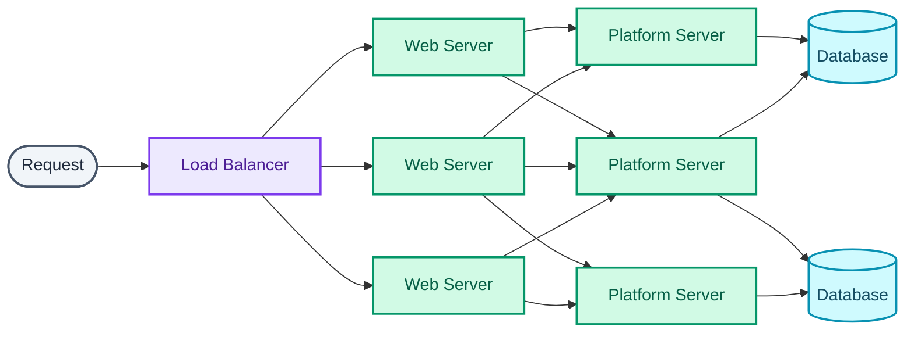
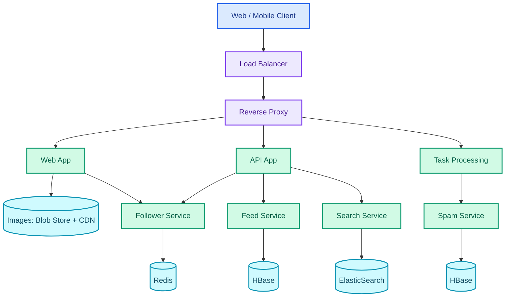
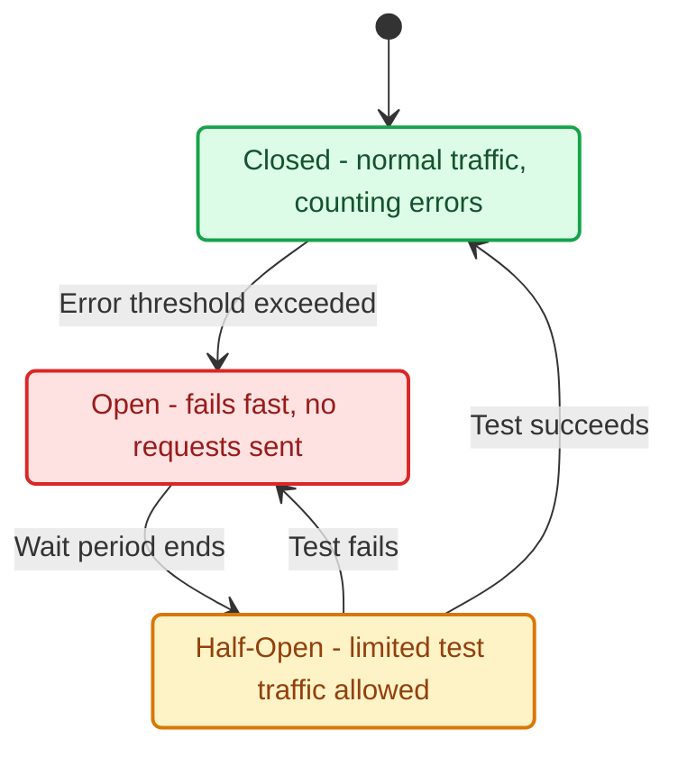

  

Here's a rule that sounds almost too simple to matter. Every application server has to run the same codebase, and none of them are allowed to remember you specifically. No session in local memory, no profile picture cached to local disk, no request-specific state sitting anywhere a server calls home. A server that holds nothing client-specific is stateless. Any request from any user can land on any instance and get identical behavior back.

Taken seriously, that one sentence explains most of what the rest of an application tier ends up looking like.

## Where state lives

If a server can't hold session data, that data has to live somewhere every server can reach. An external persistent cache like Redis or Memcached is the usual pick for performance. An external database is the pick when the data needs SQL or NoSQL semantics more than raw speed. "External" just means separate from the application servers themselves, typically still inside the same data center so the round trip doesn't dominate the request. This is what makes sticky sessions optional rather than mandatory: a nice-to-have caching layer instead of the thing holding the whole system together.

Statelessness also dictates how deployment has to work. Every server needs identical code, because a fleet running mixed versions is a fleet that behaves differently depending on which instance happens to answer. The usual pattern is building a machine image from a known-good, configured server, then launching new instances from that image and deploying the current application version onto them. Cloning and managing a growing number of identical instances is the real operational cost of horizontal scaling.

And it doesn't stop at the application tier. Every server added downstream means the database and cache both have to absorb more concurrent connections than they did before.

## A layer between the web app and the database

Most systems start with the web app talking straight to a database. Growth usually adds a layer in between:

Now the web app talks to a platform layer, and the platform layer talks to the database. The split earns its keep in a few concrete ways. The web tier and the platform tier scale and get configured independently of each other. Adding a new API means adding platform servers, not necessarily touching web servers at all. Each tier can specialize its hardware, too. Database-adjacent servers lean into I/O throughput; application servers lean into CPU since they're not doing heavy disk work.

The platform layer also becomes reusable. It can serve a web app, a public API, and a mobile app at once without duplicating the caching and database-access boilerplate three times over.

There's an organizational payoff as well. A well-designed platform exposes a product-agnostic interface that hides its own implementation, which lets one team build against it even as a different team owns and optimizes what's underneath. Application-layer workers, sitting at this layer, are what make it possible to move work off the request path entirely.

## Where SOA turns into microservices

Service-Oriented Architecture is focused on integrating separate applications together. Microservices Architecture is what SOA evolved into once the goal shifted from integration toward small, modular services that each belong to one application. Faster compute and the growing demand for continuous delivery pushed that shift along. A microservice suite is a set of independently deployable, small, modular services. Each runs its own process, talks over a well-defined lightweight mechanism, and serves one specific business goal.

A Pinterest-style breakdown makes the shape concrete. User profile, follower graph, feed, search, photo upload. Each is its own service with its own datastore, chosen for what that specific service needs to do.

The follower service gets Redis, the feed gets HBase, search gets ElasticSearch. Three completely different storage technologies, each chosen for the shape of the problem it's solving, and none of that decision has to ripple through the other services.

That freedom to pick the right language and storage per service is the headline benefit. It's what avoids the alternative, a full-system rewrite the moment one part of a monolith needs a different tool. The CI/CD payoff follows from the same modularity. Changes deploy in isolation as long as the external API contract stays the same, which shrinks test scope, speeds up time-to-production, and lets one bad deploy fail fast instead of taking the whole system down with it.

It's the Single Responsibility Principle applied at the service level (small, autonomous services working together, small teams owning small services), positioned for more aggressive parallel growth. None of it is free. It trades a monolith's simpler operational story for a genuinely different architectural, operational, and process approach, and that trade needs to be made on purpose.

There's a failure mode on the far side of "small services": **nano-services**, where the overhead of managing dozens of tiny services outweighs whatever modularity got bought.

The rule that holds up is splitting along functional verticals (billing, payments, booking), not granular actions. A service for `GetUser` sitting next to a separate service for `GetUserById` isn't microservices discipline. It's nano-service territory, usually a sign the boundary got drawn around a function name instead of a business capability.

## Finding a service that keeps moving

Once there are many services instead of one, something has to answer "where is the follower service running right now," and there are two real answers:

| Approach | Mechanism | Also known as |
| --- | --- | --- |
| Load balancer / proxy (e.g. HAProxy) | Centralizes service addresses; adds its own latency, its own failure point, and DNS-switching complexity across regions | Server-side discovery |
| Service registry (e.g. Consul, etcd, ZooKeeper, Eureka) | Services register themselves centrally with environment and app name; consumers poll the registry for connection info; the registry can do basic round-robin balancing itself | Client-side discovery |

Registry software typically runs alongside the service it's tracking, for performance and scaling reasons. Health checks, usually a plain HTTP endpoint, verify a registered service is still good before anyone gets routed to it. Consul and etcd both ship a built-in key-value store as a side benefit, handy for shared configuration.

Client-side discovery cuts out a network hop and a load balancer that has to stay highly available and performant. Modern cloud load balancers are cheap enough that this advantage matters less than it used to, though. What it costs is new tooling every team has to learn, a client now coupled directly to the registry, and a registry that needs working client support across every language and framework in use. (A proxy like Zuul can remove that coupling, but it also removes the performance win that justified going client-side in the first place.) It's a real trade-off. Not a strictly-better option in either direction.

## What a contract saves you from re-learning

Without a documented contract between services, the costs show up as friction everywhere at once. Inter-team communication overhead. Inconsistent API conventions from team to team. Custom client plumbing rebuilt for every integration. Everyone needing re-notification on every contract change, QA re-learning services it already tested once, public docs that drift behind whatever the API actually does.

**OpenAPI** is the standard answer for REST, a vendor-neutral, language-neutral, machine-readable specification (JSON or YAML) run under the Linux Foundation. It started life as the Swagger spec before SmartBear donated it. Retrofitting an existing API with a spec is usually a small effort next to the payoff, which includes auto-generated docs with a working "try it" console, client SDKs generated across languages, contract testing, mock servers, and direct import into an API gateway. gRPC gets an equivalent for free, in a stricter form. The `.proto` file *is* the contract, enforced by the compiler rather than by convention and team discipline.

## Staying up when a dependency isn't

**Retries** sound trivial but hide three real rules. Cap the retry count. Cap the *total* timeout across all attempts, so one retry loop can't quietly eat the whole request budget. And back off exponentially between attempts (immediate first try, then 10ms, then 50ms) so a struggling service doesn't get bombarded while it's trying to recover.

**Circuit breakers** solve a sharper problem. Service calls are non-deterministic. They can go slow, hang, or error. A caller sitting on timeouts is burning connections and threads while it waits, which slows its own responses down and can cascade the failure sideways into services that depend on *it*. The fix is to track error count per downstream service. Once errors cross a threshold, stop calling it at all for a stretch.

**Closed** is the normal state. All traffic goes through, errors get counted quietly in the background. Cross the threshold and the circuit trips to **Open**: every request fails immediately, on purpose, with no call to the struggling service at all. That buys it time to recover instead of piling on. After a wait period, the circuit goes **Half-Open** and lets a small amount of test traffic through. Succeed, and it closes back to normal. Fail, and it snaps back open for another wait.

It's the difference between one dependency having a bad five minutes and that same bad five minutes taking down everything that calls it. Retries alone, without a breaker, make the cascading version of this worse. They're the thing hammering an already-struggling service harder right when it needs load taken off. Hystrix on the JVM and Akka.NET on .NET are the usual names attached to this pattern.

## What the pager needs to see

Three signal types cover observability. They're deliberately different in cost and in what they're for:

| Signal | Answers | Cost profile |
| --- | --- | --- |
| Metrics | Is something wrong, and since when? | Cheap, aggregated, low cardinality |
| Logs | What exactly happened on this one request? | Expensive at volume, maximum detail |
| Traces | Which hop in the chain was slow? | Moderate, usually sampled |

Metrics drive alerts, logs drive debugging, traces drive latency attribution. The usual mistake is trying to make one of the three do another's job, paging off a log grep or trying to debug one weird request from an aggregated dashboard. **Distributed tracing** propagates a correlation ID through every service hop a request touches. It's the only practical way to work out which of six services a slow request got stuck in, and it costs almost nothing to wire in up front. A lot more to retrofit once six services already exist without it.

Two smaller rules save a lot of pager fatigue. **Alert on symptoms, not causes.** Error rate, p99 latency, and queue depth are things a user actually feels; CPU utilization on its own is not, and cause-based alerts fire constantly enough that people learn to ignore the pager entirely. **Use percentiles, not averages.** A healthy-looking p50 routinely hides a p99 that's failing hard for your heaviest users, the ones you can least afford to lose.

Health checks come in two depths that get conflated more often than they should. A shallow check proves the process is alive. A deep check proves its dependencies are reachable too. A load balancer deciding whether to route traffic to an instance should stick to the shallow version. Otherwise one slow database pulls every single instance out of rotation at once, and what should have been a degraded response turns into a full outage caused by the health check itself.

## Who owns the data when the service is gone

| Approach | Description | Verdict |
| --- | --- | --- |
| Database per service | Each service is fully independent, deployed on its own, free to pick its own persistence technology | Best option, choose by default |
| Schema per service | One shared database, data isolated by schema, ownership stays clear | Acceptable fallback |
| Tables per service | One shared database and schema, dedicated tables per service, held together by process discipline alone | Too hard to enforce — avoid |

Database-per-service is what lets a service pick Elasticsearch for search or Redis for a follower graph without asking anyone's permission. It costs something specific at query time, though. Cross-functional data that used to be one join now means querying each owning service separately and interpolating the results in application code, because a join across two services' private databases isn't a thing that exists anymore.

For analytics, the usual answer is each service publishing its own data contract, independent of its internal schema. Commonly that means pushing events onto a queue that feeds a data warehouse, so the warehouse gets a stable contract even as the underlying service schema changes freely underneath it.

## Why a gateway beats a shared library every service imports

Services often need to speak more than one transport protocol and enforce authentication consistently, especially anything internet-facing. The tempting fix is a shared library everyone imports for that plumbing, and it undermines microservices almost immediately. Any fix has to be tested and redeployed across every service that uses it. Switching a piece of tech means reworking the shared module and keeping every service in sync on it. Every internet-facing service still has to independently clear the same security bar.

The better answer is an **API Gateway**, a proxy that knows every registered service's location and translates whatever protocol clients speak into one common internal protocol (almost always HTTP). It centralizes authentication and authorization so the backend services can live on a closed network instead of each reimplementing security from scratch. Mashery, Apigee, and AWS API Gateway are the usual names here. The AWS option in particular plugs straight into OpenAPI specs and serverless deployment.

## What elasticity buys back

A monolith is more resource-efficient per server than a microservices fleet, with fewer network hops and less duplicated infrastructure. What MSA buys instead is development speed and faster time-to-market, at the price of real setup cost up front. The lever that claws that cost back is elastic scaling. Run small machines, add capacity under load, remove it again the moment load drops. You stop paying for peak capacity around the clock.

| Deployment context | Elasticity approach | Notes |
| --- | --- | --- |
| On-premise / traditional IaaS, slow provisioning | Containers (e.g. Docker) | Skips the hypervisor layer for speed; estimate and pad hardware up front, then allocate to services on demand |
| Public cloud (AWS, Azure, etc.) | Auto scaling via VM images | Servers added or removed by metric-driven triggers, billed per hour or minute of actual use; containers still work here but the hypervisor limits their upside, so they're mainly useful for keeping on-prem and cloud environments uniform |
| Sporadic traffic, public cloud | Serverless (API Gateway + Lambda) | No servers to maintain, billed per unit of execution time so idle truly costs nothing, but cold starts add latency to the first request after a quiet period, which rules it out for anything on a latency-critical path |

## Check yourself

1. Why must application servers be stateless, and where does the state actually go?
2. What is the nano-service anti-pattern, and what's the rule for drawing service boundaries?
3. Client-side vs server-side service discovery: what's the trade-off?
4. What does a circuit breaker prevent that retries alone actively make worse?
5. Why database-per-service, and what does it cost you at query time?
6. Should a load balancer health check test the service's dependencies? Justify either way.
7. Why does an API gateway centralize authentication rather than each service handling it?
8. Metrics, logs, and traces answer different questions. Which would you reach for to find out why one specific request took 4 seconds?

Every pattern in this part is downstream of the same one sentence. An application server can't remember you. Statelessness isn't just an application-tier detail. It's the constraint that makes horizontal scaling, service discovery, circuit breakers, and elastic scaling all possible in the first place. Take it away and half of this part stops being necessary. The other half stops working.

## Further reading

- [Consul Documentation — HashiCorp Developer](https://developer.hashicorp.com/consul/docs)
- [etcd](https://etcd.io/)
