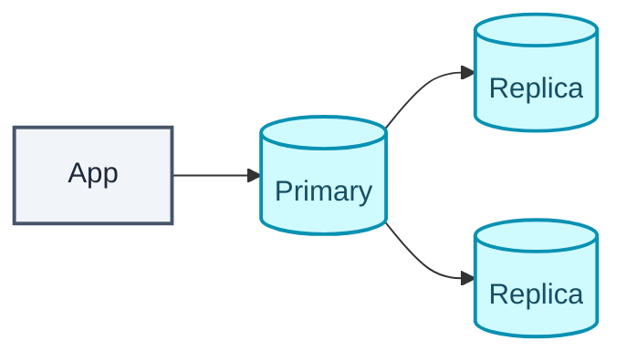
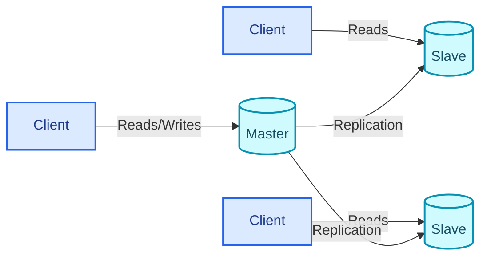
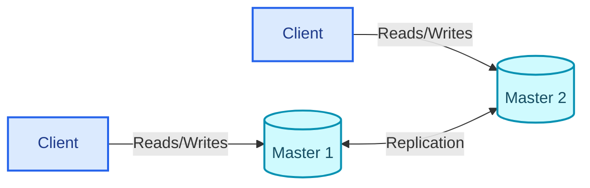
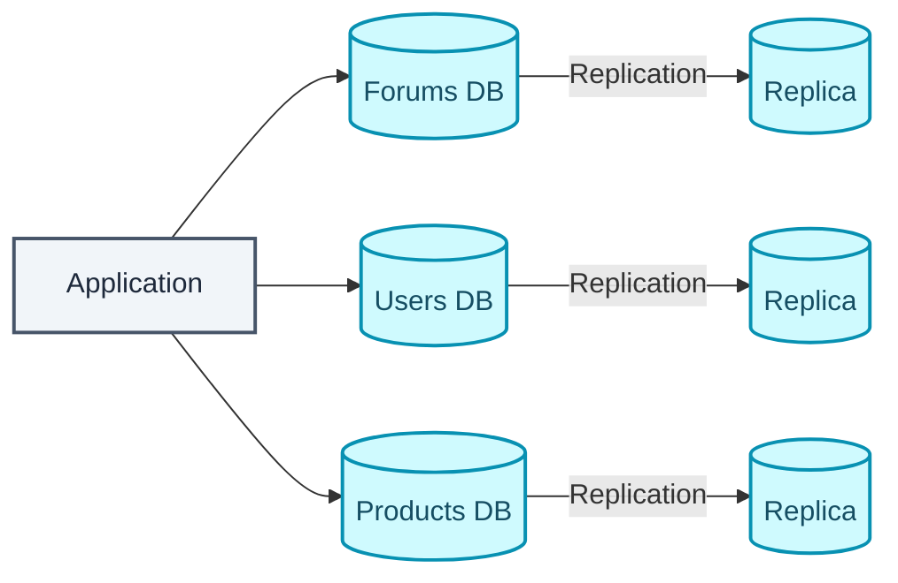
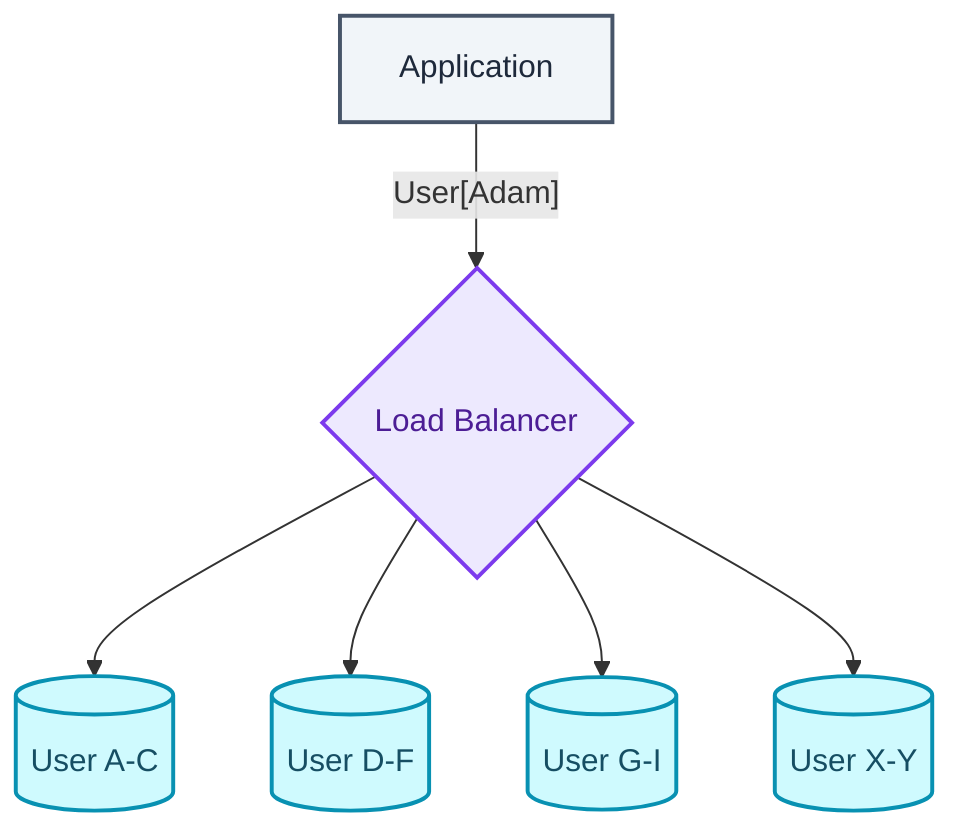
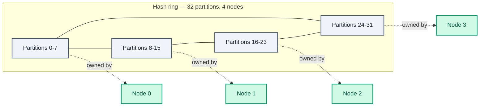
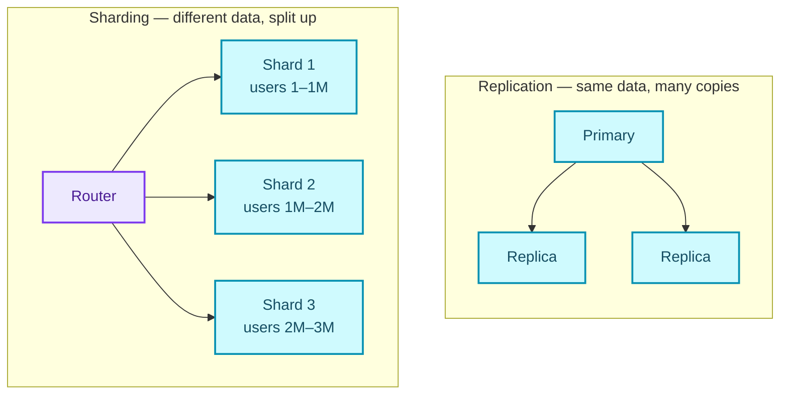

  

A relational database is a collection of data organized into tables. The reason anyone trusts one with anything important comes down to four letters.

| Property | Definition |
| --- | --- |
| Atomicity | Each transaction is all or nothing |
| Consistency | Any transaction moves the database from one valid state to another |
| Isolation | Concurrent transactions produce the same result as running them one at a time |
| Durability | Once committed, a transaction stays committed |

ACID is a strong promise. It is not, by itself, a promise that two people can't both believe they got the last seat on a flight. That's a different problem sitting one layer below ACID, and it's the one that shows up in ticket booking, inventory, and collaborative editing questions.

## The lost update, and two opposite ways to prevent it

The shape of the problem is small. Two transactions read the same row, both conclude it's available, and both write. One silently overwrites the other. Nobody gets an error. Somebody finds out later that the seat they booked doesn't exist.

**Pessimistic locking** stops it before it can happen. Lock the row the moment you read it (`SELECT ... FOR UPDATE`) and the second transaction blocks until the first one commits. It's correct and easy to reason about, because the database does the waiting for you. The costs are equally plain. Throughput collapses under real contention, deadlocks become possible once more than one lock is in play, and a lock held open across a network call is a boring, reliable way to cause an outage. Reach for it when contention is high and conflicts are expected rather than hypothetical. Seat reservation, inventory decrement, payment capture.

**Optimistic locking** bets the other way. Read freely, take no lock, but carry a `version` or timestamp column on the row, so that the write becomes `UPDATE ... WHERE id = ? AND version = ?` and a result of zero rows updated tells you somebody else won the race. You retry, or you surface the conflict to the caller. Holding no locks means it scales far better under light load. The cost only arrives when a conflict does: the work gets thrown away and the caller has to know how to retry. Use it where contention is low (profile edits, document metadata, settings pages) and two people editing the same row in the same instant is rare enough to just handle when it happens.

The decision rule is the **expected conflict rate**, not how important the data feels. High contention, pessimistic. Low contention, optimistic. A payment table under low contention can still be optimistic, and a low-stakes table under brutal contention still wants a lock.

## Isolation levels are a dial, not a switch

| Level | Prevents | Still permits |
| --- | --- | --- |
| Read uncommitted | nothing | dirty reads |
| Read committed | dirty reads | non-repeatable reads, phantoms |
| Repeatable read | + non-repeatable reads | phantoms (engine-dependent) |
| Serializable | all of the above | lowest concurrency |

Three anomalies sit behind that table. A **dirty read** is seeing data another transaction wrote but hasn't committed yet, data that might vanish entirely if that transaction rolls back. A **non-repeatable read** is what you get when you read the same row twice inside one transaction and the two reads disagree, because somebody else committed a change to that row in the gap between them. A **phantom read** is running the same query twice and finding new rows that weren't there the first time.

The defaults aren't universal, and assuming otherwise is a good way to get surprised. PostgreSQL and Oracle default to read committed. MySQL's InnoDB defaults to repeatable read. Most engines implement isolation through MVCC (multi-version concurrency control), where readers see a consistent snapshot instead of blocking behind writers. That's the mechanical reason reads don't block writes on most modern databases.

Higher isolation always costs concurrency. So pick the *lowest* level that prevents the anomaly your workload can produce, instead of reaching for serializable out of general nervousness. Serializable for everything isn't caution. It's unpaid-for latency.

One boundary needs stating plainly. Row locks don't span databases. The moment a single business workflow touches several services that each own their own store, "lock the row" stops being an available tool, and you need a pattern built for coordinating a transaction across services, not across rows.

## Six ways to scale a database that's become the bottleneck

Once application servers scale out, the database is usually next in line to become the constraint. There's a menu of techniques for it, and each one solves a different shape of bottleneck.

| Technique | Purpose | Limitation |
| --- | --- | --- |
| Master-replica replication | Writes to primary, reads from replicas | Write bottleneck remains |
| Vertical scaling | Add RAM/resources | Hardware limits |
| SQL tuning | Improve query performance | Increasing complexity |
| Denormalization | Reduce joins | More application complexity |
| Sharding | Split data | Operational complexity |

### Master-slave replication

Stripped to its simplest form, it's one primary with one or more replicas hanging off it.

The master takes both reads and writes, then replicates every write out to one or more read-only slaves, which can themselves chain into sub-slaves. Split the client side out explicitly and the read/write separation that buys the scalability gets clearer.

It buys read scalability and redundancy in exchange for replication lag. A slave can legitimately serve a stale read for a moment after a write. If the master goes offline the system stays read-only until a slave gets promoted or a new master gets provisioned, and that promotion needs its own logic. It doesn't happen automatically just because a slave exists.

### Master-master replication

Both masters take reads and writes, coordinating with each other.

If either master goes down the system keeps serving both reads and writes, which sounds like a pure win until the coordination cost shows up. A load balancer or your application logic now has to decide which master gets which write. Most real implementations are either loosely consistent (a violation of ACID) or pay higher write latency for the synchronization that keeps them consistent. Conflict resolution gets harder as more write nodes and more latency enter the picture.

Both replication styles share a set of costs regardless of which one you pick. Data loss is possible if the master fails before a write finishes replicating. Heavy write volume can bog down read replicas. More read slaves means more replication traffic and greater lag. And on some systems the master writes multi-threaded while replicas apply changes single-threaded, which caps how fast a replica can catch up. All of it on top of more hardware and more operational complexity than a single database ever had.

### Federation splits by function

Instead of one monolithic database, split along functional lines. Forums, users, products, each in its own database.

Each database sees less traffic and less replication lag than the monolith did. Smaller datasets fit in memory better, so cache hit rate goes up. With no single master serializing every write, writes across the different functional databases run in parallel.

It falls apart when a schema needs one huge table or function that can't be cleanly split. It pushes "which database has this data" knowledge into application logic. Cross-database joins now need a server link and get noticeably more complex. And, the recurring line in this list, it costs more hardware and more operational complexity than one database did.

### Sharding, and splitting within one function

Where federation splits by function, sharding splits *within* one. A users table growing past what a single database can hold gets split into shards, each owning a subset of users.

Common shard keys for a users table are a last-name initial or a geographic location. The function that maps a key to the right shard is consistent hashing, covered in the next section.

The benefits stack the same way federation's did. Less traffic and replication load per database, smaller indices and therefore faster queries, a single shard failing without taking the others down, no central master and so parallel writes. Two more are specific to sharding: higher aggregate write throughput, and more total storage than any single machine could hold. The costs are sharper too. Application logic has to understand shards, which complicates SQL. Uneven distribution is a real risk, since a handful of power users can overload one shard while the rest sit idle, and rebalancing to fix that means moving data between live shards, which is expensive in both time and risk (a good hashing function at least reduces how much of it has to move). Cross-shard joins get harder. And again, more hardware and more complexity.

### Denormalization buys back the joins you broke

Denormalization stores redundant data across tables to avoid expensive joins, trading write performance for read performance. Some engines, PostgreSQL and Oracle among them, support materialized views to manage those redundant copies instead of hand-rolling the job.

It earns its place once federation or sharding has made cross-database joins too painful to keep doing live. The underlying pattern is common: reads can outnumber writes 100:1 or even 1000:1, and a disk-heavy join on every one of those reads adds up fast. The cost is duplication itself. Copies need constraints to stay in sync, which is more design complexity up front, and under heavy write load a denormalized schema can end up slower than the normalized one it replaced, since every write now has to touch more than one place before it can be called done.

### SQL tuning is the boring, high-leverage option

Before touching architecture at all, benchmark and profile to find the real bottleneck. Use a tool like `ab`, or a slow query log, instead of guessing. A few concrete levers, in the order they usually apply.

**Tighten the schema.** MySQL dumps to disk in contiguous blocks, so schema choices carry a physical cost. `CHAR` beats `VARCHAR` for fixed-length fields because `CHAR` gives fast random access while `VARCHAR` has to scan to the end of the string. `TEXT` suits large blocks like blog posts, supports boolean search, and is stored as an on-disk pointer rather than inline. `INT` covers numbers up to 2^32 (about 4 billion). `DECIMAL` is non-negotiable for currency, since floating point will eventually produce a rounding error that costs someone real money. Large BLOBs shouldn't live in the row directly. Store a reference to wherever they live instead. `VARCHAR(255)` is that size because 255 is the largest count an 8-bit number can hold, which maximizes byte usage in some engines. And setting `NOT NULL` where it's true improves search performance, not just correctness.

**Use good indices.** Index the columns that show up in `SELECT`, `GROUP BY`, `ORDER BY`, and `JOIN`. Most engines implement this as a self-balancing B-tree, giving sorted data with log-time search, sequential access, insert and delete. The cost isn't hypothetical. Indices increase memory usage and slow every write, because the index has to update alongside the row. For bulk loads it's often faster to disable indices, load the data, then rebuild them once at the end.

**Avoid expensive joins** by denormalizing where performance demands it, not preemptively. **Partition tables** to move hot data into its own table, small enough to stay resident in memory. And **tune the query cache** deliberately. In some configurations the query cache becomes the performance problem instead of the fix for one.

## Consistent hashing, or which shard owns this key

Sharding needs an answer to one question. Given a key, which node owns it?

Consistent hashing answers it by hashing the key and mapping the result onto a ring. The same key always hashes to the same position, which always belongs to the same partition, which always belongs to the same node.

Concretely. Store `artist = "REM"`, hash `"REM"`, land on a position on the ring. That position falls inside partition 19, and partition 19 is owned by Node 2. That's where the record lives. The hash maps to a partition, and the partition (not the raw hash) determines the owning node.

**It reduces hotspots** compared to range-based partitioning. A range scheme like `Node A: Jan–Mar, Node B: Apr–Jun, Node C: Jul–Sep, Node D: Oct–Dec` looks balanced on paper, but if most of your writes carry today's timestamp then whichever node happens to own the current range absorbs nearly all of the traffic while the other three sit there doing very little. Hash the same keys instead and `"Jan"`, `"Feb"`, `"Mar"`, `"Apr"` land on four different, essentially random nodes. Sequential keys spread out instead of piling onto one node, at the direct cost of losing key ordering.

**It enables partitioning** cleanly. Modern implementations divide the ring into a fixed number of equal-sized partitions and assign them evenly across nodes, and a key belongs to whichever partition its hash falls into. Early implementations let nodes pick random ring positions instead, which routinely produced uneven partition sizes and the very hotspots consistent hashing is supposed to prevent.

**It makes scaling predictable.** When a new node joins it takes ownership of *some* partitions instead of triggering a full reshuffle. If Node 2 owns partitions 17, 18, 19 and 20, and Node 4 joins and takes partition 19, Node 2 is left with 17, 18 and 20. Only partition 19 moves. That's the whole reason consistent hashing exists, minimizing how much data has to shift when the cluster changes shape.

One limitation stays with you. It balances the *count* of keys per partition, not their size, so one partition holding one outsized object can still end up imbalanced under a perfectly even key count.

**It simplifies replication.** Each partition gets one primary owner plus one or more replicas on different nodes. Partition 19 might primary on Node 2 and replicate to Node 0 and Node 3. No master node is required anywhere in the scheme, since every node owns some partitions and replicates others for its neighbors at the same time. More replicas buys more fault tolerance directly. And because a read can be served by any replica rather than only by the primary, load spreads across the whole set, which is what lets read throughput scale close to linearly as you add nodes. Memcached, Amazon Dynamo, and Cassandra all build on this.

## Replication and sharding solve different bottlenecks, and usually get combined

| | Replication | Sharding |
| --- | --- | --- |
| Solves | Availability, read scaling | Write scaling, storage scaling |
| Data | Full copies of the same data | Different subsets of data |

Replication protects against a machine failing and spreads read traffic, but every replica still holds the *entire* dataset. It stops helping the moment the data no longer fits on one disk. Sharding splits the data across machines so each holds only a slice, which scales storage and writes at once. The price is a router that knows which shard owns a given record, and the loss of easy cross-shard joins.

Instagram shards users by ID because no single database could hold all of them. Inside each shard it still runs read replicas, so a spike in profile views doesn't slow down writes to that same shard.

**Takeaway:** replicate for availability and read scaling, shard for write and storage scaling.

| Aspect | Sharding | Traditional replication |
| --- | --- | --- |
| Data normalization | Denormalized — some duplication across shards for distribution and performance | Normalized — minimal redundancy, consistency and integrity preserved |
| Scaling direction | Scale out — parallel, independent instances | Scale up — a bigger master |
| Write bottleneck | None — writes run in parallel | Master is the bottleneck and the single point of failure |
| Data locality / cache | Small shard size fits cache well | Large master dataset is harder to cache |
| Availability | Shard failures stay isolated; a shard can run its own internal master-slave or dual-master setup | Master failure is a write outage |

## Check yourself

1. State what each letter of ACID guarantees.
2. Two users try to book the last seat. Walk through both the pessimistic and the optimistic solution.
3. Which isolation level does your database default to, and which anomaly does it still permit?
4. Master-slave vs master-master: what does the second buy you, and what does it cost?
5. Federation and sharding both split a database. Along what different axes?
6. Why does consistent hashing move less data than modulo hashing when a node joins?
7. What does hash partitioning cost you that range partitioning would have given you?
8. Why are UUIDs poor primary keys under a B-tree index, and what does Snowflake fix?

Every technique here answers one of two questions. Is the bottleneck reads, or is it writes and storage? Replication, vertical scaling and SQL tuning all buy time on the read side. Federation, sharding and denormalization are what you reach for once the data itself, or the write volume, is the constraint. And consistent hashing is the reason sharding stays operable once you're running it.

## Further reading

- [Consistent Hashing — ByteByteGo](https://bytebytego.com/courses/system-design-interview/design-consistent-hashing)
