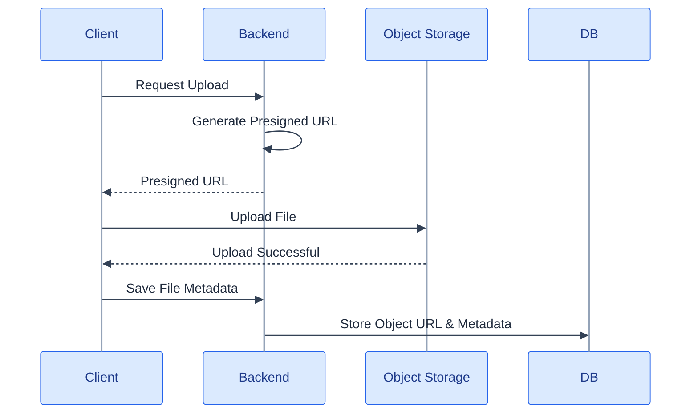
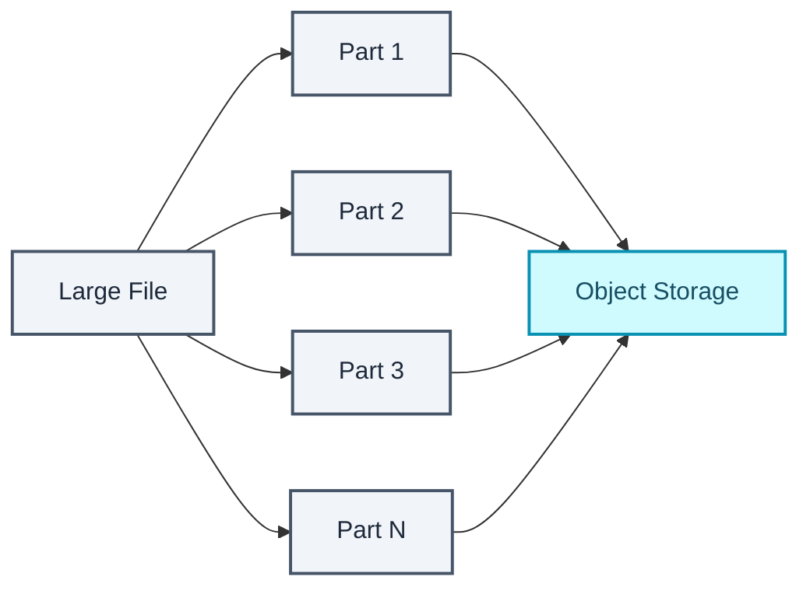
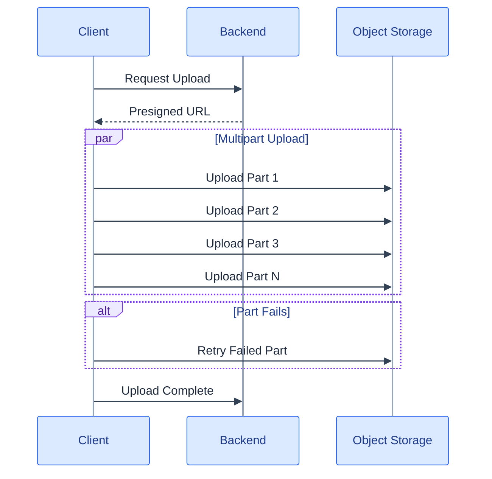
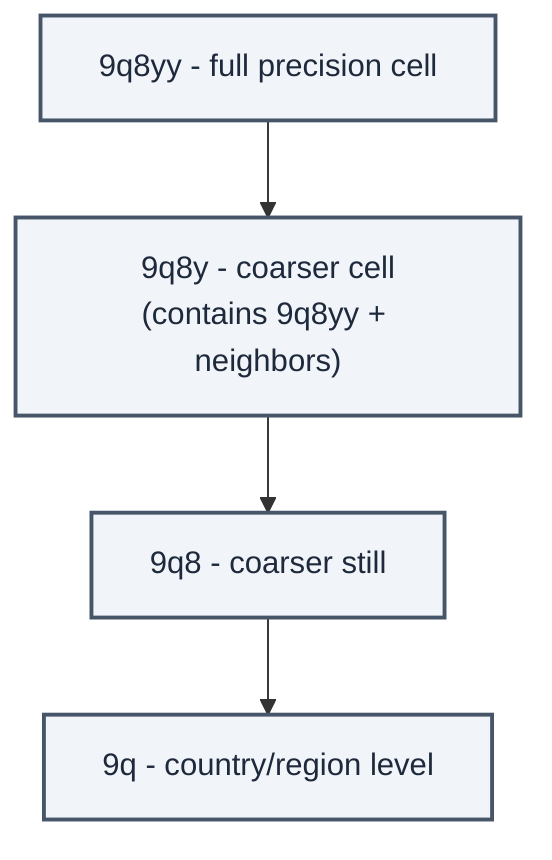
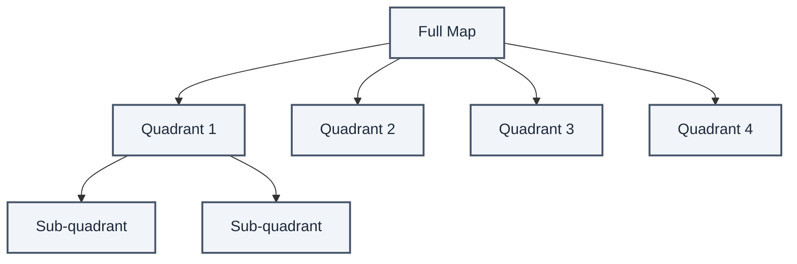

<p align="center">
  
</p>

A book has an ISBN, a page count, an author. A television has a screen size, a refresh rate, a panel type. Force both into the same rigid SQL table and you get columns that are `NULL` for half your catalog, plus a schema migration every time a new product category shows up. That's not a database problem, it's a shape mismatch. The fix isn't a better SQL schema. It's admitting the data was never relational to begin with.

## Denormalize early

If horizontal scale is even a plausible future for a system, the cheapest time to plan for it is before the first table gets designed. Denormalize early, keep joins out of database queries, do the joining in application code instead.

You can run this style inside MySQL itself, or migrate to something built for it (MongoDB, CouchDB). Either way the earlier that decision gets made, the less there is to refactor later. Waiting until performance degrades under real load means retrofitting a data model that was never designed for the shape it's now being asked to hold.

## NoSQL, and the promise it makes instead of ACID

NoSQL stores data as one of four shapes, key-value, document, wide column or graph, denormalized by default, with joins pushed into application code. Most don't offer true ACID transactions. What they offer instead is a weaker promise, and an explicit one.

| BASE (NoSQL) | Meaning |
| --- | --- |
| Basically available | The system guarantees availability |
| Soft state | State can change over time even without new input |
| Eventual consistency | The system becomes consistent over time, absent new writes |

Set next to CAP, BASE is availability winning the trade-off that consistency would have won in a strict relational system. Neither is more "correct". They optimize for different failure modes.

Those four shapes aren't interchangeable. Each one is built for a different access pattern.

| Type | Abstraction | Notes |
| --- | --- | --- |
| Key-value store | Hash table | O(1) reads and writes, often memory- or SSD-backed; some preserve lexicographic key order for range scans; can carry metadata alongside values. Great for simple, rapidly changing data like an in-memory cache, but the limited operation set pushes complexity into the application layer. It's also the foundation document stores and some graph databases are built on. |
| Document store | A key-value store where the values are documents | Centered on XML, JSON, or binary documents, with an API or query language that understands their internal structure, organized by collections, tags, metadata, or directories. Documents in the same collection can have different fields entirely. MongoDB and CouchDB are the usual names; DynamoDB straddles key-value and document. High flexibility, well suited to data that changes occasionally rather than constantly. |
| Wide column store | A nested map — `ColumnFamily<RowKey, Columns<ColKey, Value, Timestamp>>` | The basic unit is a column, a name/value pair; columns group into column families, roughly analogous to a SQL table, and families can group further into super column families. A row is the same row key appearing across columns, and every value carries its own timestamp for versioning and conflict resolution. It traces back to Google Bigtable, which shaped HBase in the Hadoop ecosystem and Cassandra at Facebook. Built for very large datasets with high availability and scalability. |
| Graph database | A graph | Nodes are records, arcs are relationships, optimized specifically for complex, many-to-many relationships like a social network. High performance for relationship-heavy models, at the cost of being newer and less widely adopted — fewer tools, fewer people who've used one, often reachable only through a REST API rather than a native driver ecosystem. |

## SQL vs NoSQL isn't a preference, it's a fit test

| | SQL | NoSQL |
| --- | --- | --- |
| Schema | Fixed, defined upfront | Flexible, varies per record |
| Transactions | ACID | Eventual consistency |
| Joins | Yes | Generally no |
| Scaling | Vertical / read replicas | Horizontal (sharding) |

| Choose SQL when | Choose NoSQL when |
| --- | --- |
| Data is structured | Data is semi-structured |
| Schema needs to be strict | Schema needs to stay dynamic |
| Data is genuinely relational | Data is non-relational |
| Complex joins are required | Complex joins aren't needed |
| Transactions are required | You're storing many TB or PB of data |
| Scaling patterns are clear and moderate | Workload is very data-intensive |
| An established ecosystem matters — developers, community, tooling | Very high IOPS throughput is required |
| Fast index lookups are the priority | — |

Typical NoSQL-shaped data includes rapid clickstream or log ingestion, leaderboard and scoring data, temporary data like a shopping cart, frequently accessed "hot" tables, and metadata or lookup tables.

Underneath the table sits a simpler rule. Pick SQL when records depend on each other and have to stay correct *together*. An order touches inventory, payment and shipping at once, and if the payment succeeds while the inventory update fails you've just sold something you don't have. ACID transactions exist to make that impossible.

Pick NoSQL when records are independent and shapeless. That's the book/TV catalog problem this post opened with. Forcing it into rigid SQL columns leaves a table full of unused fields for every category a given row doesn't belong to, and a flexible document store fits the data far better.

Orders, payments, banking, booking systems and inventory go in SQL. Product catalogs, chat messages, activity feeds, logs and recommendations go in NoSQL. SQL for correctness-critical related data, NoSQL for flexible independent high-throughput data.

## Moving from RDBMS to NoSQL is a real project, not a swap

It usually starts the same way. A three-tier app scales its application tier by adding commodity servers behind a load balancer, cheaply and horizontally, but the RDBMS data tier doesn't scale out that way. Scaling it means bigger, often proprietary, disproportionately expensive hardware. Performance problems start showing up as the user base grows, and that's the moment NoSQL gets seriously evaluated instead of just discussed.

A migration that works tends to follow this order. Start by understanding what the application needs: rapid development against a changing data model, scalability against unpredictable demand, low-latency performance that holds under viral growth, operational reliability with monitoring built in. Then accept that NoSQL options aren't interchangeable with each other any more than they're interchangeable with SQL. Cassandra suits analytical columnar workloads. Neo4j suits relationship-heavy ones. Couchbase and MongoDB cover the document-oriented middle.

Run a proof of concept that measures response time, throughput, and how easily the thing scales out. Not a theoretical comparison, a measured one. Rework the data model itself, from fixed tabular schemas to flexible document objects, and expect this step to take longer than planned, because it's the one people underestimate. Deploy to staging and production with cluster monitoring, online scaling, and admin tooling in place before go-live. Then keep learning, because the NoSQL landscape moves faster than the SQL ecosystem most teams are used to.

Spell the modeling difference out. An RDBMS holds a fixed schema with uniform records, normalized across multiple tables to reduce duplication, and changing that schema means expensive locking `ALTER TABLE` statements across every affected table. A document database lets every document differ in structure, with no migration ceremony when the shape of new data changes.

That flexibility is the headline benefit. Schema-less inserts that can change format at any time. Data spreading across servers with instances added or removed without downtime. Consistent performance from in-memory caching that stays invisible to developers and operators alike.

For developers it means iterating faster without schema-change overhead, which helps most with sparse, changing, or third-party data. It also means SQL-heavy developers have to learn document modeling as its own skill, structuring data around documents instead of normalized tables. JSON-based stores at least reduce the impedance mismatch, since most application code is already juggling JSON on the way in and out.

Some risks deserve stating plainly. The database choice has to match the requirement, because a database suited for analytics can fail the latency and throughput needs of an interactive app, and that failure shows up as bad UX or as an inability to scale at the exact moment growth goes viral. Using an OLTP-shaped database for advanced analytics or heavy processing tends to underperform too, and a dedicated big-data solution usually fits that job better.

That capability gap has narrowed a lot in recent years. Most major document stores now support multi-document ACID transactions. Joins across collections, though, still tend to happen in application code rather than in the database, which is the part people forget when they read the transaction headline and assume the gap has closed completely. A relational database remains the better default for highly relational, correctness-critical data, and **polyglot persistence**, meaning the right store per data shape with several coexisting in one system, is usually the realistic end state. Not a wholesale migration away from SQL.

## Large files do not belong in the database, they belong next to it

Databases are optimized for structured data, not multi-megabyte files. So the pattern that works is storing only file metadata and an object URL in the database, with the file itself living somewhere built for files.

| Database | Object storage |
| --- | --- |
| User profile | Image / video / PDF |
| Order | Audio |
| Metadata | Backup |
| Relationships | Logs |

A record ends up looking like this.

| id | name | image_url |
| --- | --- | --- |
| 1 | Alice | `s3://bucket/img1.jpg` |

Shorthand for the same rule. Images, videos, PDFs, audio, backups and logs go in object storage. User profiles, orders, metadata and relationships stay in SQL or NoSQL.

### Presigned URLs get the backend out of the upload path

A naive implementation routes every upload through the backend first.


That spends backend bandwidth and CPU on every file transfer, and it turns the backend into a scalability bottleneck for bytes it never needed to touch. The fix is a **presigned URL**. The backend issues temporary, scoped permission to write to one specific object, valid until it expires and returning a plain 403 after that, and the client uploads directly to object storage.



| Without presigned URL | With presigned URL |
| --- | --- |
| File passes through the backend | Client uploads directly to object storage |
| Backend transfers the entire file | Backend transfers 0 MB |
| Backend becomes the bottleneck | Scales independently of upload volume |

### Multipart upload

A 10 GB upload that fails at 99% and restarts from zero is a miserable experience, and it gets worse linearly with file size. Split the file into independent parts and upload each one separately.



Only the failed part needs a retry, parts can generally upload in parallel for better throughput, and an interrupted upload usually resumes instead of restarting from the beginning. A 20 GB upload that fails at 19 GB retries the missing sliver, not the nineteen gigabytes that already landed safely.

A real large-file upload flow interleaves both patterns. A presigned URL to skip the backend, multipart to make failure local instead of total.



That's close to what a Google Drive upload does end to end. A client asks for permission, the backend hands back a presigned URL, and the client uploads directly to object storage, splitting large files into parts that go up in parallel with independent retries. Only once it has all landed does the backend write filename, owner and object URL into the database.

## Relevance is not your primary database's job

RDBMS and NoSQL indexes alike are built for exact-match or range lookups, not for ranking full-text matches by relevance, and geospatial proximity queries need a structure neither one provides out of the box. `LIKE '%term%'` is the tell. It can't use a normal index, so it degrades to a full scan of the table, and even when it finds every match it has no concept of one of them being more relevant than another.

### The inverted index behind full-text search

An inverted index maps each term to the list of documents containing it, the reverse of the usual document-to-words direction. Hence the name.

```
"scalable" → [doc1, doc5, doc9]
"database" → [doc1, doc2, doc9]
```

A query flows through it in a fixed shape.


A tokenizer splits text into terms, strips stop words and applies stemming. Underneath, each term maps to a posting list of document IDs, term frequency and positions. Ranking then scores relevance, commonly via TF-IDF or BM25. Elasticsearch and Apache Solr, both built on Lucene, are the usual implementations, covering product search, log search, and general document or content search.

None of it is free. The index is eventually consistent with the source-of-truth database, updated asynchronously through a change stream or queue instead of synchronously on write. It's additional infrastructure with its own operational weight. And it belongs in your head as a derived, read-optimized index rather than a primary data store. If the whole search index vanished tomorrow, nothing authoritative should go with it.

## Finding what's nearby without scanning everything

Finding nearby drivers or restaurants rules out the naive approach immediately. Computing the distance from every row in the table to the query point doesn't scale past a trivial dataset.

**Geohash** encodes latitude and longitude into a single string, built so that nearby locations share string prefixes.

```
"9q8yy" → San Francisco area
"9q8yz" → nearby location (shares prefix)
```



Nearby entities become a prefix-match query. Precision is controlled by string length alone, so a longer string means a smaller area, which is a property you can lean on directly when you want coarser or finer buckets without changing anything else about the storage. And because a geohash is a string, it stores as an ordinary indexed column on a standard B-tree index instead of anything specialized.

One edge case matters. Two points that are physically close can land on opposite sides of a grid boundary and get different prefixes entirely, so a real implementation has to check neighboring cells too, not just an exact prefix match.

**Quadtree** takes a different approach, recursively subdividing 2D space into four quadrants until each region holds fewer than some threshold of points.



Dense areas subdivide further into smaller cells while sparse areas stay coarse, and the structure supports range queries like "everything within radius X" directly instead of approximating them through string prefixes.

| Aspect | Geohash | Quadtree |
| --- | --- | --- |
| Storage | Flat string, indexable in a normal database | Tree structure, needs dedicated storage and traversal |
| Density adaptation | Fixed precision per string length | Cell size adapts to point density |
| Implementation | Simpler | More complex |
| Common use | Redis GEO commands, DynamoDB range queries | Custom spatial services, mapping systems |

Uber and Lyft lean on this for nearby-driver matching, and Yelp for nearby restaurant search. Redis ships geohash-based commands natively (`GEOADD`, `GEORADIUS`), which is usually enough for anything short of a fully custom spatial engine.

## Check yourself

1. What does BASE trade away relative to ACID, and when is that trade acceptable?
2. Name the four NoSQL families and give one use case each.
3. A product catalogue where attributes vary wildly by category: SQL or NoSQL? Defend it.
4. Why store files in object storage rather than in the database?
5. What problem does a presigned URL solve, and whose problem is it?
6. Why does multipart upload matter for a 10 GB file?
7. Why does `LIKE '%term%'` fail at scale, and what replaces it?
8. Geohash or quadtree, and when does the tree structure earn its complexity?

Every store in this part exists because one access pattern didn't fit a relational table. Shapeless records, huge binary blobs, relevance-ranked text, proximity in physical space. None of them replace SQL. They sit next to it, each holding the slice of data shaped for it, and that is the whole argument for polyglot persistence over picking one database and forcing every kind of data through it.
