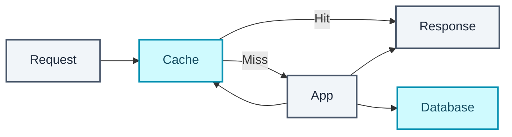
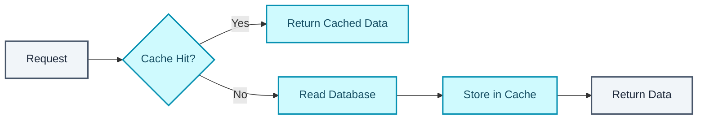
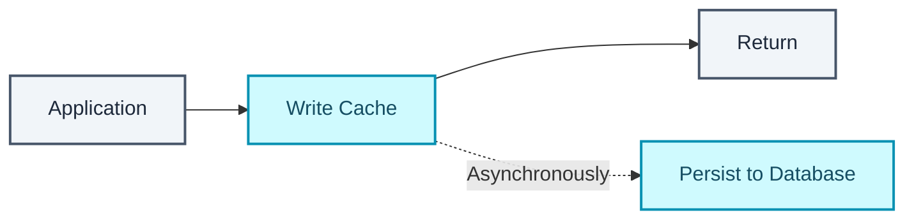

  

Caching pitches itself as almost insultingly simple. Stop re-executing work you already did, and return the answer you computed last time instead.

Serve hot data from memory instead of disk. Skip an expensive database round trip. Cut load on the servers behind it, get lower latency and higher throughput out of that, and absorb uneven traffic spikes before they turn into a hot partition on the database. Every one of those benefits is real, and none of them are the hard part. The difficulty starts the moment the underlying data changes and the cache hasn't heard about it yet.

## Every layer can cache

| Cache layer | Purpose |
| --- | --- |
| Client cache | Browser or OS cache |
| CDN cache | Edge caching — a CDN is, structurally, a type of cache |
| Web server cache | A reverse proxy like Varnish caching static and dynamic content without ever reaching the application server |
| Database cache | Built-in caching inside the database itself, tunable for the workload |
| Application cache | An in-memory key-value store sitting between the application and persistent storage |

That last row is what people usually mean when they say "the cache," and its shape rarely varies. Sit it between the application and the database, check it first, fall through to the database only when it has no answer.

## RAM is why caches are fast, and RAM is what they cost

Memcached and Redis both hold data in RAM, which is why they're so much faster than anything disk-backed. RAM is also finite in a way disk usually isn't, so an eviction policy is mandatory rather than optional.

Most systems default to **LRU**, least recently used. Evict the coldest entries and keep whatever's being accessed. It's the default because it's cheap to implement, and because its assumption (recently used data is likely to be used again soon) holds up well enough across most real workloads that a smarter, more expensive policy isn't worth the complexity it would add.

One blanket rule survives every variation of this. Prefer in-memory caching and avoid file-based caching, since a file-based cache complicates cloning and auto-scaling in the way an in-memory one doesn't.

### Redis or Memcached

| Feature | Redis | Memcached |
| --- | --- | --- |
| In-memory key-value store | Yes | Yes |
| Data model | Rich — lists, sets, sorted sets, hashes | Key-value strings only |
| Persistence | Yes | No |
| Pub/sub, streams, distributed locks | Yes | No |
| Horizontal scalability | Good, via cluster mode | Excellent, and very simple |

Memcached does one thing, store and fetch a string, and it does that extremely fast with nothing else competing for the simplicity. Redis does the same plus considerably more. Its sorted-set type keeps a gaming leaderboard ranked in O(log n) as scores change. Its pub/sub lets services notify each other in real time without a separate message bus. Persistence means a restart doesn't wipe the cache back to empty.

Memcached generally earns its place when the need is nothing but plain caching, and when the simplest available tool is worth more to you than any of the extras Redis would bring along with it. For most systems Redis is the default: caching plus data structures, persistence and messaging in one box. Memcached stays deliberately narrow.

## Granularity decides what invalidation costs you

| Cache level | Description |
| --- | --- |
| Row-level | Individual database rows |
| Query-level | Full database query results |
| Object-level | Fully formed, serializable application objects |
| HTML-level | Fully rendered HTML pages |

Avoid file-based caching at any of these levels, for the same cloning and auto-scaling reason as above. The choice that matters most is query-level versus object-level, because the two fail differently.

| Pattern | Advantages | Drawbacks |
| --- | --- | --- |
| Cached database queries | Simple to add | Invalidating cached results for complex queries is genuinely hard |
| Cached objects | Easier invalidation, matches the application's own model, supports async processing | Needs an actual object-oriented caching strategy to build |

**Query-level caching** hashes the query itself as the cache key and stores the result under that hash. It's the easiest thing to bolt on. Its cost usually arrives the moment one underlying value changes, because that single change can invalidate every cached query that happened to touch it, and there is no cheap way to know in advance which of those hashes are now wrong.

**Object-level caching** moves the unit of caching to the application's own assembled objects instead of raw query results. When underlying data changes, the specific object gets invalidated directly, not some unknown set of query hashes. It also supports asynchronous processing cleanly, since a worker can consume the latest cached object and assemble a derived object from it independently. Your application does the assembly once, stores the whole object, and every later read skips re-assembling it from scratch. Invalidation is simpler here because you're invalidating the same unit your code already reasons about.

Common candidates: user sessions, rendered web pages or articles, activity streams, and user relationship or social graph data. All of them get read far more often than they change, and that ratio is the property that makes something worth caching.

## Four ways to keep a cache and a database from disagreeing

**Cache-aside (lazy loading)** is what most people reach for first.

Check the cache, miss, read the database, write the result into the cache, return it. The application owns both the cache and the database directly, only data that has been requested ever gets cached, and this is the pattern Memcached is most often paired with.

Two costs come with it. A miss is now three steps instead of one (lookup, database read, cache write), and cached data can go stale the moment the underlying row changes, which you mitigate with a TTL or by combining cache-aside with write-through. Then there's the cold-start failure. A freshly replaced cache node starts completely empty, and every request against it pays the full miss cost until it warms back up.

**Write-through** flips where writes go first.

Here the application writes to the cache, the cache synchronously writes through to the database, and only then does the call return. The cache becomes the primary interface for both reads and writes. Recently written data is immediately available, the two stores stay consistent with each other, and a read right after a write is fast because nothing has to fall through.

That buys consistency at the price of a slower write path, since every write now waits on the database round trip as well. A fresh cache node still starts empty until something writes through it, which teams commonly patch by combining write-through with cache-aside so reads can populate it too. And plenty of data gets written under this strategy that nobody ever reads again. That's what a TTL is for, reclaiming the wasted space instead of holding it forever.

**Write-behind (write-back)** trades consistency for write speed on purpose.

Here the application writes to the cache, gets an immediate return, and the cache persists to the database asynchronously, off the request path entirely. Write performance improves directly. This one's cost is blunt. If the cache dies before that async persistence completes, the write is gone, and the pattern is harder to build correctly than either cache-aside or write-through.

**Refresh-ahead** is built around prediction instead of reaction. Rather than waiting for a miss to trigger a reload, the cache proactively refreshes recently accessed entries before they expire. When the prediction of what gets accessed next is accurate, read latency drops for the hot data that matters most. When it's wrong the refresh work is waste, and in the worst case it reduces performance by burning cycles on entries nobody was about to ask for.

| Strategy | Read behavior | Write behavior | Main benefit | Main drawback |
| --- | --- | --- | --- | --- |
| Cache-aside | Cache, fall to DB on miss | Application writes DB directly | Only requested data gets cached | Higher miss latency; staleness possible |
| Write-through | Read from cache | Cache synchronously writes DB | Strong cache/DB consistency | Slower writes |
| Write-behind | Read from cache | Cache asynchronously writes DB | High write performance | Possible data loss |
| Refresh-ahead | Read from cache | Automatic pre-expiration refresh | Lower latency for hot data | Bad predictions waste resources |

## What caching costs underneath the speedup

None of the four strategies make the underlying tension disappear. They move where it shows up. Keeping a cache consistent with its source of truth is ongoing work, and invalidation logic tends to get complicated faster than anyone estimates at the point where the cache is first introduced. Choosing the right update strategy for a given workload isn't obvious in advance, and integrating Redis or Memcached is more application complexity than having no cache at all. Users will occasionally be served stale data. And RAM isn't free, so every cached byte is memory footprint and cost that a purely disk-backed system never paid.

## Check yourself

1. Name the cache layers between a user's browser and your database.
2. Query-level vs object-level caching, and why is invalidation easier for one of them?
3. Walk through cache-aside on a miss. What are its two main failure modes?
4. Write-through vs write-behind. Which can lose data, and under what conditions?
5. What is a cold cache problem, and how do you mitigate it?
6. Why is LRU the default eviction policy rather than something smarter?
7. Redis or Memcached for a live leaderboard? Why?

Adding a cache is the easy 80% of this part. One flowchart, one library import. The other 20% is a single question that all four strategies above are answers to. The instant the underlying data changes, what does the cache do about it? Get that wrong and the cache doesn't merely fail to help. It hands users a fast, confident, wrong answer, which is worse than the slow correct one it replaced.

## Further reading

- [Redis Quick Start Guide](https://redis.io/tutorials/howtos/quick-start/)
