<p align="center">
  
</p>

Here's an order placement flow, timed honestly.

| Operation | Time |
| --- | --- |
| Save order | 20 ms |
| Reduce inventory | 30 ms |
| Send email | 1 second |
| Send SMS | 2 seconds |
| Update analytics | 500 ms |

Run all five synchronously and your user watches a spinner for roughly 3.5 seconds. The two slowest steps in that chain, the email and the SMS, happen to be the two they care about least in the moment. They want to know the order went through. Everything past "save order" and "reduce inventory" is work that matters but doesn't need to happen *before* the response does.

That's the whole argument for asynchronism. Get expensive, non-essential work off the request path, respond fast on whatever blocks correctness, and let the rest finish in the background. It improves frontend responsiveness and backend scalability at once. It also opens the door to doing expensive work *before* anyone asks for it, through periodic aggregation or precomputed reports, instead of paying for it inline on every request.

## The shape underneath it all

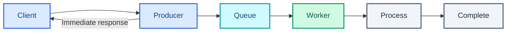

The application publishes a job to a queue, the client gets an immediate acknowledgment or a status it can poll, and a worker processes the job independently, signaling completion when it's done. Twitter's UI leans on this directly. A tweet appears in your own timeline the instant you post it, while delivering it into every follower's feed keeps running in the background, invisibly, after the response already went back.

## Two patterns

**Precomputation** does the expensive work *before* anyone asks. Static HTML generation, scheduled cron jobs, CDN deployment, pre-generating objects ahead of demand. Done right, request latency usually drops to almost nothing and scalability goes up enormously, because the dynamic content has effectively become static by the time any request arrives for it. The catch is timing. It only works when you can predict what will be needed before it's needed.

**Background jobs** handle the opposite case, where the work can't happen ahead of time because it depends on something the user just did.

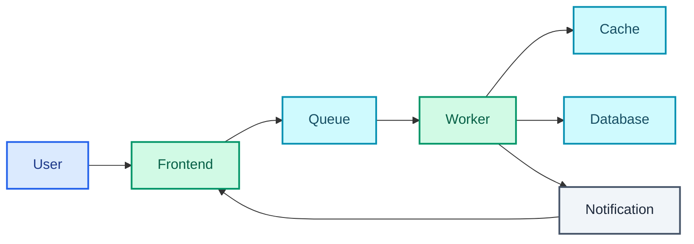

A user submits a long-running task. The frontend drops it onto a queue and acknowledges immediately, then a worker picks it up, processes it, and signals completion back to the frontend, typically through RabbitMQ, ActiveMQ, SQS, or plain Redis lists underneath. You get a frontend that stays responsive no matter how long the work takes, workers that scale independently of the request-serving tier, and expensive operations that no longer hold a single request open.

## The pattern behind every feed

This is the most reusable decision in this part. It's the precomputation-versus-background-job choice applied to one common problem, building a feed.

**Fan-out on write (push).** The moment a user posts, write a copy into every follower's precomputed feed. Reads become trivial, since the feed already exists by the time anyone asks for it, so read latency stays very low. The cost is write amplification. One post from an account with 10 million followers is 10 million writes.

**Fan-out on read (pull).** Store the post once, and build each follower's feed at read time by querying everyone they follow. Writes stay cheap and constant regardless of follower count. The cost moves to reads, which are now expensive and repeated on every refresh.

| | Fan-out on write | Fan-out on read |
| --- | --- | --- |
| Work happens at | post time | feed load |
| Read latency | very low | high |
| Write amplification | high, ×follower count | none |
| Wasted work | feeds built for users who never log back in | none |
| Storage | one copy per follower | one copy total |
| Best when | read-heavy, follower counts bounded | write-heavy, or follower counts extreme |

Pure push breaks the instant an account has millions of followers, because one post turns into a write storm that delays every other post sitting in the same queue. Pure pull is too slow for everyone else, all the time.

Nearly every real feed system converges on a hybrid. Push for ordinary accounts, pull for celebrities, and a user's feed becomes the merge of their precomputed feed with a live query against the handful of very-high-follower accounts they follow. It's precomputation applied per user, and it inherits precomputation's trade-off. Spend work up front to keep the read path cheap, and accept that some of that work goes to waste.

## Message queues

A message queue decouples producers from consumers, buffers requests during traffic spikes instead of dropping them, and makes asynchronous communication reliable rather than best-effort. The workflow is simple on paper. A producer publishes a message, the queue stores it, a consumer retrieves and processes it, and the message gets acknowledged only after processing succeeds.

| Broker | Advantages | Limitations |
| --- | --- | --- |
| Redis | Lightweight, simple | Messages can be lost |
| RabbitMQ | Mature, rich routing, AMQP support | Requires AMQP adoption and self-managed nodes |
| Amazon SQS | Fully managed | Higher latency; at-least-once delivery can produce duplicate messages |

## Task queues

A plain message queue moves bytes from a producer to a consumer. A **task queue** manages the whole execution lifecycle of background work. It serializes tasks and their metadata, dispatches to workers, retries failures, handles timeouts, schedules delayed or recurring work, tracks task status and results, and orchestrates tasks that depend on each other. Celery is the usual name here, mostly in the Python ecosystem, and it runs on top of a message broker rather than replacing one.

| Aspect | Message queue | Task queue |
| --- | --- | --- |
| Purpose | Transport messages | Execute background work |
| Focus | Delivery, routing, buffering | Scheduling, execution, retries, lifecycle |
| Payload | Generic messages | Serialized tasks: callable, arguments, metadata |
| Scheduling | Generally unsupported | Supported |
| Retry | Delivery-level | Task-level |
| Result tracking | No | Yes |
| Orchestration | No | Often supported |

The relationship is layered, not competing.

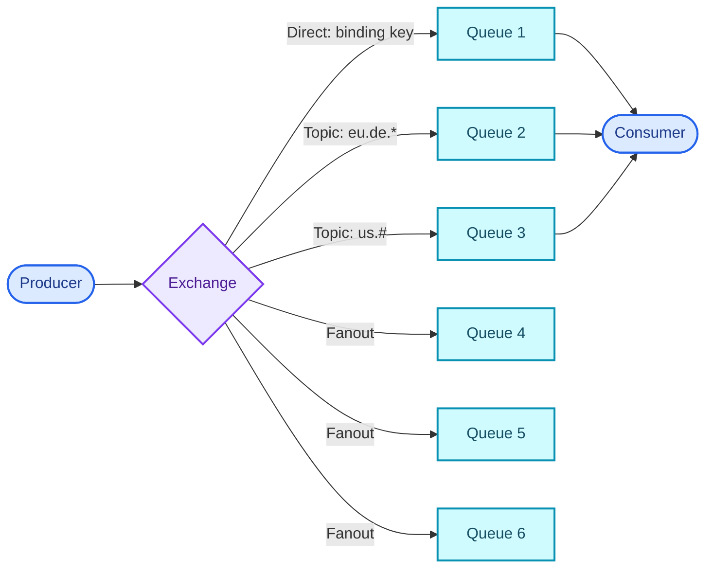

Brokers handle reliable message transport. The task framework sitting on top adds execution semantics: retries, scheduling, orchestration, result tracking.

That layering is deliberate. A broker already provides durable storage, delivery guarantees through acknowledgements, requeueing and visibility timeouts, independent scaling of producers against workers, routing with priorities and delayed delivery across multiple queues, and buffering with back pressure built in. You can build all of that from scratch on a database table or a plain Redis list, and teams do when they want something lighter. It costs more manual locking and coordination, lower scalability, and fewer delivery guarantees than a purpose-built broker hands you for free.

| Architecture | Broker | Task framework |
| --- | --- | --- |
| Celery + RabbitMQ | RabbitMQ | Celery |
| Celery + Redis | Redis | Celery |
| Database-backed queue | RDBMS | Custom workers |
| AWS | SQS | Lambda / Workers |
| Google Cloud | Cloud Tasks | Managed execution |

## AMQP, the protocol RabbitMQ speaks

The Advanced Message Queuing Protocol is an open, binary, application-layer standard for reliable, secure, asynchronous messaging. Know it by name, because RabbitMQ's entire routing model is built on it.

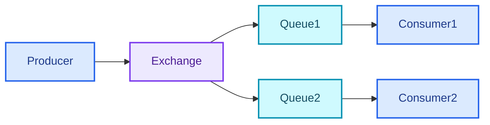

| Component | Responsibility |
| --- | --- |
| Producer | Creates and publishes messages |
| Broker | Receives and routes messages |
| Exchange | Routes messages to queues via bindings |
| Queue | Stores messages until consumed |
| Consumer | Processes messages |

Routing logic lives in the exchange, which comes in four shapes. **Direct** matches an exact routing key. **Topic** matches a wildcard pattern against the routing key. **Fanout** broadcasts to every bound queue regardless of key. **Header** routes on message headers instead of a key at all.

On top of routing, AMQP gives you compact binary framing, reliable delivery, message acknowledgements, quality-of-service controls and delivery confirmations. Two versions exist in the wild. AMQP 0-9-1 is broker-specific and the one RabbitMQ is known for. AMQP 1.0 is a more general, interoperable ISO/IEC wire protocol that Azure Service Bus builds on instead.

## Separating what happened from what anyone should do about it, service by service

The synchronous order-placement example that opened this part is the canonical motivating case. The fix isn't cleverness, it's sequencing. Do only the critical operation synchronously, return immediately, and let everything else react to what just happened.

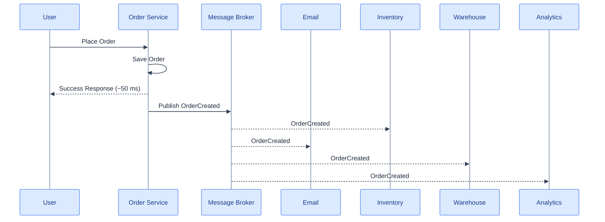

The response comes back in roughly 50 ms instead of 3.5 seconds. Every downstream service runs independently, and none of them are coupled to each other. Inventory doesn't need to know email exists, and email failing doesn't touch inventory.

A **message broker** (Kafka, RabbitMQ and SQS are the usual names) sits in the middle, decoupling producers from consumers by storing and distributing messages instead of letting services call each other directly. A **producer** publishes messages. Here the order service publishes an `OrderCreated` event right after saving the order.

```json
{
  "orderId": 123,
  "userId": 45,
  "amount": 80000
}
```

A **consumer** reads and processes those messages. Inventory, email, warehouse and analytics services here, each one independent. A **topic** is the logical stream a producer publishes to and consumers subscribe to (orders, payments, notifications, inventory), and it's what keeps different event types organized instead of every service reading everything.

### One event, several groups, and nobody stepping on anybody else's toes

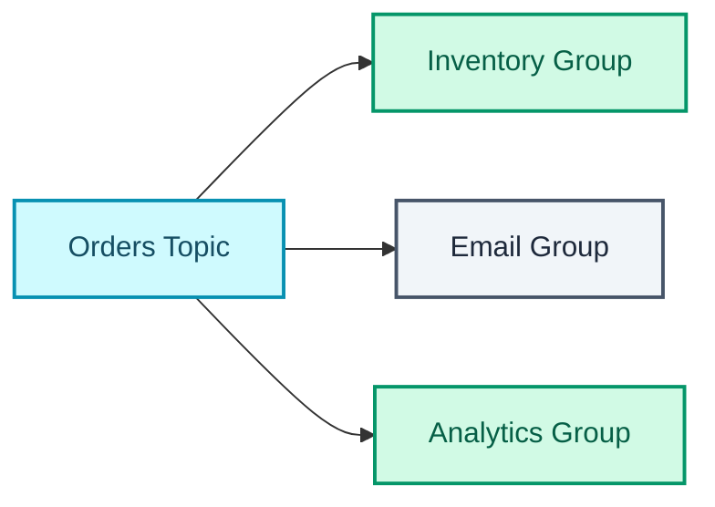

Every consumer group receives every event and processes it independently. Inventory updates stock, email sends a confirmation, analytics records a metric, all reading the same `OrderCreated` event with no coordination between them.

### Partitions are how a topic scales

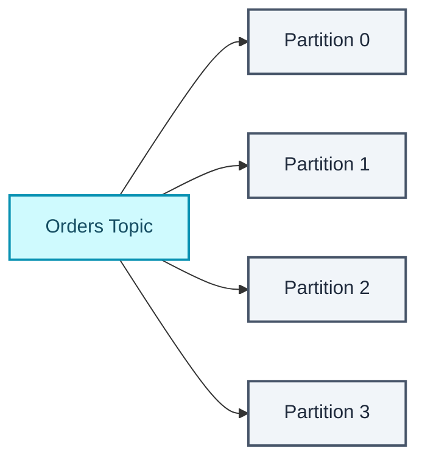

A topic splits into multiple partitions, each holding a subset of its messages, and that split is usually what enables parallel processing, higher throughput, and load spread evenly across the consumers reading from it. Same idea as splitting traffic across several roads instead of forcing it down one congested one.

A **consumer group** is a set of consumer instances sharing the work of one topic.

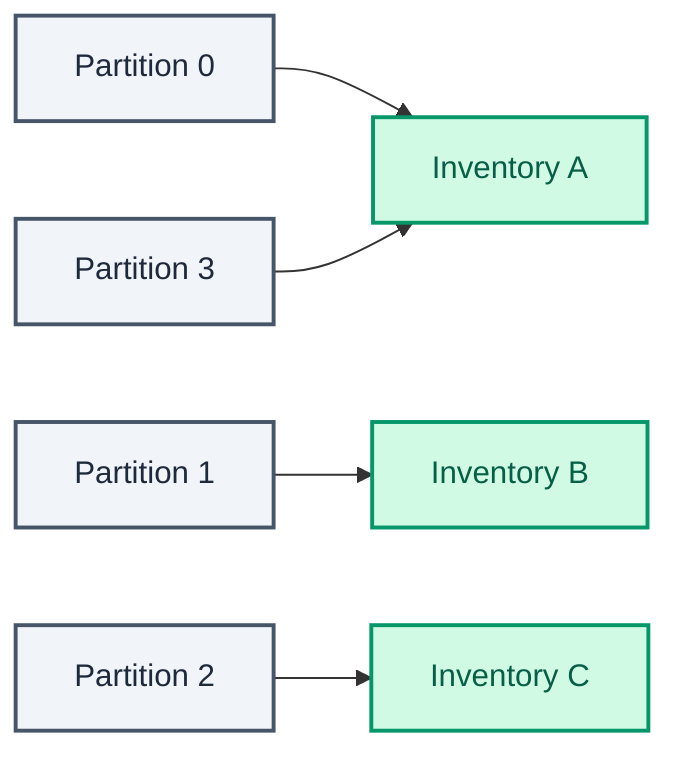

One partition maps to one active consumer within a given group, each message is processed once per group, and different consumer groups each get their own copy of every message. That last property is what makes the multiple-groups picture above work.

### Ordering is a per-partition promise

Kafka guarantees ordering *within* a partition and makes no promise across partitions. Producers usually partition on a key such as `userId` or `orderId`, so related events land on the same partition and hold their order relative to each other.

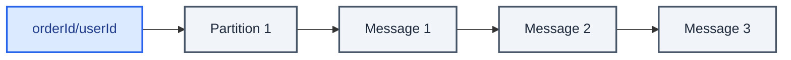

If a consumer crashes mid-message the message stays in Kafka and another consumer in the same group picks it up. Nothing is lost, because Kafka's retention normally means the message was never removed from the log to begin with.

### Retry and the dead letter queue

Transient failures get a straightforward retry loop. A database that's briefly unavailable, a flaky network, a dependent service that's down for a moment.

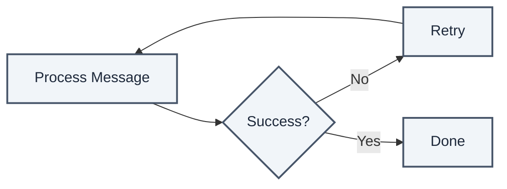

Not every failure is transient, though. Invalid data, corrupted messages and permanent business-validation failures will never succeed no matter how many times you retry them, and letting them retry forever blocks the queue behind them. That's what the **dead letter queue** is for.

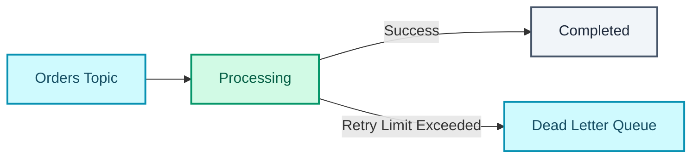

Once a message exceeds its retry limit it moves to the DLQ instead of blocking everything behind it, and waits there for a human to look at it. End to end, the whole thing looks like this.

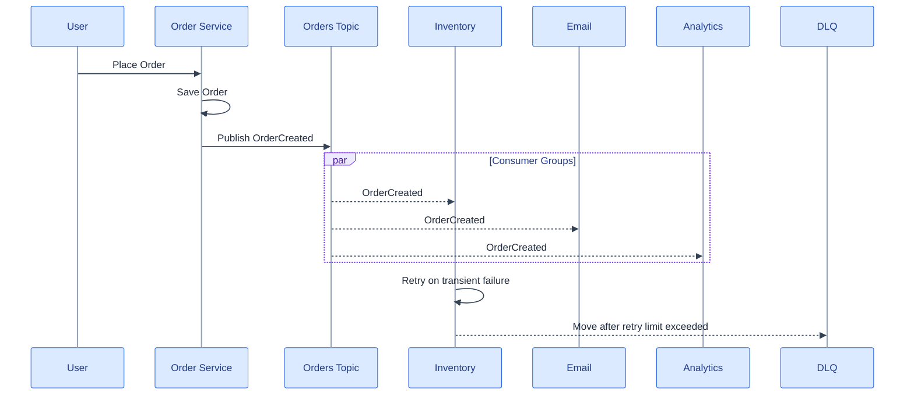

That's close to Amazon's own order flow. Save the order, publish `OrderCreated`, let inventory, email, warehouse and analytics run as separate consumer groups so each gets its own copy, partition on `orderId` so events for the same order stay ordered, retry transient failures, and move anything that keeps failing into a DLQ instead of letting it jam the pipeline.

| Concept | Definition |
| --- | --- |
| Producer | Publishes messages to the broker |
| Consumer | Reads and processes messages from the broker |
| Topic | Logical stream or category of related messages |
| Partition | Subdivision of a topic enabling parallelism and ordering within itself |
| Consumer group | Set of consumers sharing partitions; each message processed once per group |
| Retry | Reattempts processing after a temporary failure |
| Dead letter queue | Stores messages that repeatedly fail, for later investigation |

## Kafka is an event log, RabbitMQ is a task queue

| | Kafka | RabbitMQ |
| --- | --- | --- |
| Model | Event log: many consumers read the same event | Task queue: one worker consumes each task |
| Retention | Retains events, replayable | Removed once processed |
| Throughput | Very high | High |

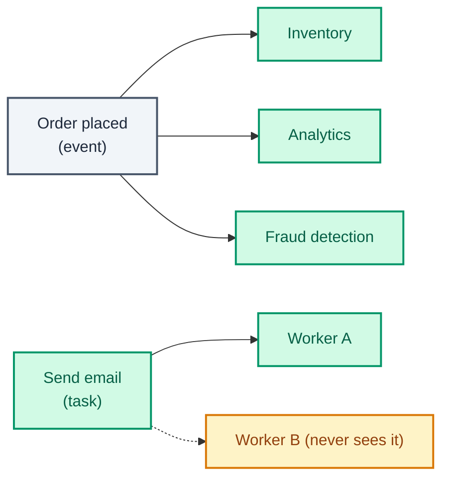

When a Netflix user finishes an episode, that single event has to update watch history, feed the recommendation model and log analytics. Three unrelated systems reading the same event, replayable later if a brand-new consumer joins and needs the history. That's Kafka's shape.

Sending a password-reset email should happen once, by one worker, with nothing to replay afterward. That's RabbitMQ's. Inventory, analytics, recommendations and fraud detection go to Kafka. Email jobs, payment jobs and background processing go to RabbitMQ. Kafka broadcasts an event to many independent consumers. RabbitMQ hands a task to one worker.

## Back pressure, or what stops a queue from becoming the outage

If arrival rate exceeds processing capacity for long enough, queues don't hold steady, they grow continuously, and a growing queue drags latency, cache misses, disk reads and memory consumption up along with it until throughput itself starts dropping and the system risks crashing outright.

Back pressure is the deliberate choice to reject excess requests instead of letting the whole system degrade together. Use bounded queues. Reject once they're full, return **HTTP 503 Server Busy**, and let clients retry with exponential backoff instead of hammering straight back in.

Queue length isn't arbitrary. You can derive it from what the system sustains.

```
max latency = (transaction time / number of threads) × queue length
```

Rearranged, that sizes the queue straight from a latency budget.

```
queue length = max latency / (transaction time / number of threads)
```

Queue length sets the ceiling on queuing latency, and an unbounded queue has no ceiling at all. Latency there grows without limit, which is the failure mode a bounded queue exists to prevent.

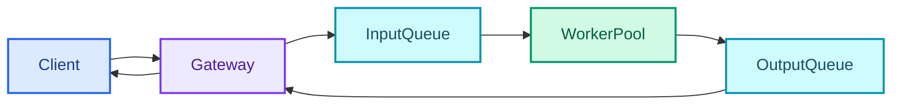

The gateway handles protocol translation, authentication and forwarding. The transaction service behind it handles business logic and, optionally, durable persistence. Back pressure also propagates for free through the transport layer, because blocking bounded queues push pressure upstream and TCP buffer saturation slows senders without anyone coding that behavior. Pressure travels backward from workers, to gateway, to client.

Oversized queues aren't a neutral safety margin. They're an active cost: CPU cache misses, reduced worker efficiency, higher contention, eventually memory exhaustion. On Linux, memory overcommit can delay an allocation failure until the memory is touched, which is how a slowly growing queue ends up triggering the OOM killer long after the point where a bounded queue would have started rejecting cleanly.

Even fully synchronous systems aren't queue-free. They hide their queues. Thread pool wait queues, semaphore and lock queues, CPU run queues, all still there. You can't eliminate queues, only size them deliberately for the quality of service you want, and lock-free queues claw back some of the cost where contention is the bottleneck. For synchronous protocols like REST, the gateway should return 503 the moment its bounded queue fills.

Monitor queue depth, thread pool utilization and transaction latency. A fairly common threshold is alerting once queue utilization crosses 70%, well before the queue is actually full.

| Bounded queue | Unbounded queue |
| --- | --- |
| Predictable latency | Continuously increasing latency |
| Rejects excess requests | Accepts all requests initially |
| Stable throughput | Throughput degrades under sustained load |
| Prevents memory exhaustion | Risk of OOM and system crashes |
| Preserves QoS for accepted requests | QoS deteriorates as queues grow |

## Making retries safe instead of dangerous

Network retries mean the same request can get processed more than once. A client submits a payment, the response gets lost to a timeout, the client retries, and now you have a real risk of double-charging for something that already succeeded.

An **idempotent** operation produces the same result no matter how many times it runs. `GET`, `PUT` and `DELETE` are naturally idempotent. `POST` generally isn't, and "create order" or "charge payment" are the operations retries make dangerous by default.

**Idempotency keys** fix this at the API layer. The client generates a unique key per logical operation, usually a UUID, and sends it with the request in a header. The server checks whether that key has already been processed before doing anything else.

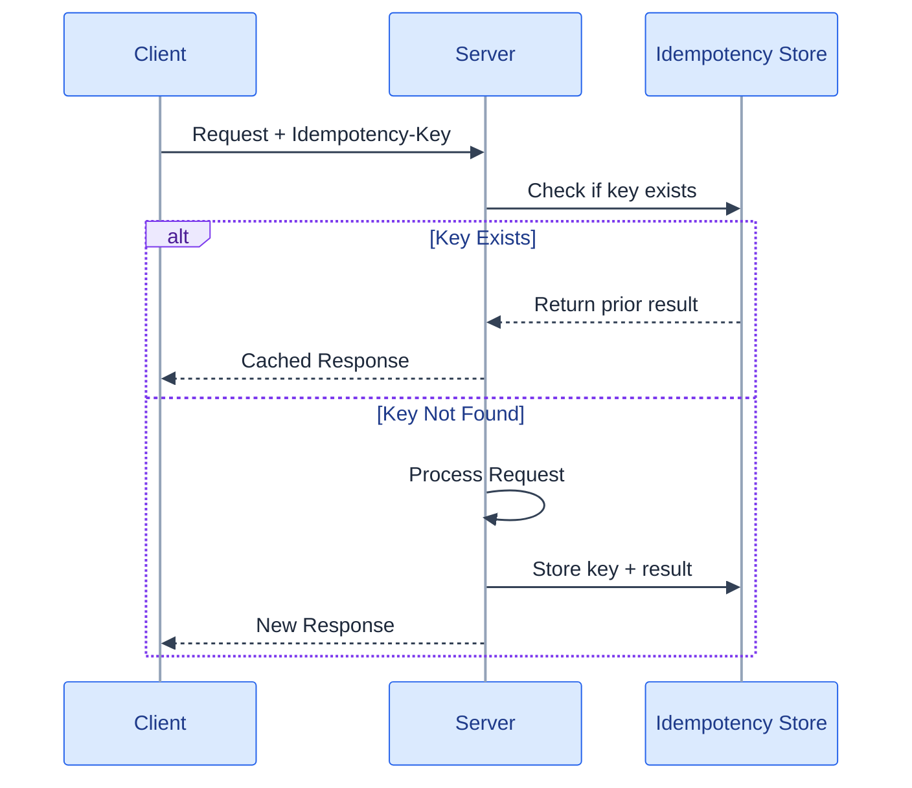

Underneath it's usually a map from idempotency key to response, kept with a TTL so that the store doesn't grow forever. A retry carrying the same key returns the stored response instead of reprocessing anything. That's how Stripe and most other payment APIs make retries safe by default.

### Why "exactly-once" is mostly a simulation

| Semantic | Meaning | Trade-off |
| --- | --- | --- |
| At-most-once | Delivered 0 or 1 times | Risk of message loss |
| At-least-once | Delivered 1 or more times | Risk of duplicate processing |
| Exactly-once | Delivered and processed exactly once | Hardest to guarantee; usually simulated |

True exactly-once delivery across a network, without coordination overhead, generally isn't achievable. The network can always fail in the gap between "sent" and "acknowledged".

The practical answer combines **at-least-once delivery with idempotent processing** into an *effectively-once* outcome. Let the broker redeliver on failure, as at-least-once already implies, and let the consumer's own idempotency check absorb the duplicates that redelivery produces.

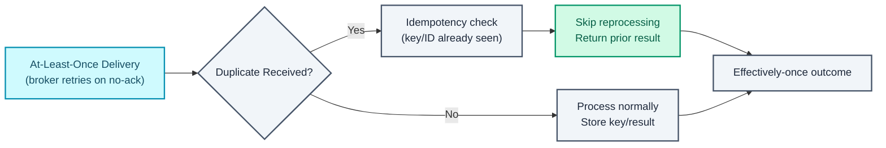

Deduplication itself tends to happen one of three ways. Store processed message IDs with a TTL and skip anything already seen. Use a database unique constraint, on `order_id` plus `operation_type` say, to reject a duplicate write at the database layer. Or run a **Bloom filter** as a cheap pre-check before touching the real store.

A Bloom filter is a probabilistic set-membership structure with only two answers: "definitely not present" and "possibly present". Never "definitely present". False positives happen, false negatives don't, and that asymmetry is the whole point, because a negative answer is fully trustworthy and lets you skip an expensive lookup that would otherwise happen every time.

Underneath it's a fixed-size bit array plus *k* hash functions. Adding an element sets *k* bits, checking tests those same *k* bits. It uses a tiny fraction of the memory that storing the real keys would need, paid for with occasional wasted lookups on false positives. The limitations bite too. You can't remove elements from the standard variant, and the false-positive rate climbs as the filter fills, so it has to be sized against expected cardinality ahead of time rather than adjusted afterward. It turns up wherever skipping a disk or database read for a key that certainly doesn't exist is worth something: LSM-tree storage engines, distributed caches, and crawlers skipping re-crawls of URLs already seen.

### Keeping writes and events honest

Writing to a database and publishing an event to a broker isn't one atomic operation. A crash between the two leaves the database changed and the event never sent, or the reverse. The **outbox pattern** fixes it by writing the event into an outbox table inside the same database transaction as the business write, then letting a separate relay process read that table, publish to the broker, and mark rows sent once they succeed.

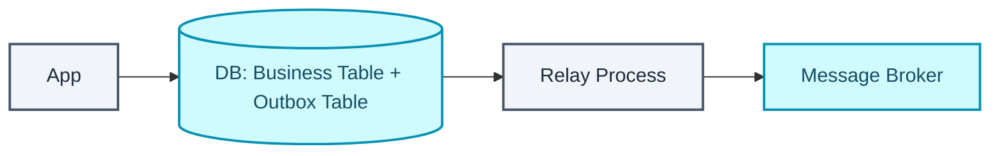

That guarantees the event gets published if and only if the database transaction committed. No window exists where one happened without the other.

The **saga pattern** solves a neighboring problem, a business transaction spanning several services that each own their own database, where a single ACID transaction across all of them isn't available. A saga models the workflow as a sequence of local transactions, each publishing an event that triggers the next step. On failure it runs **compensating transactions** that semantically undo whatever completed, issuing a refund rather than trying to roll back a payment that already cleared.

Two ways generally exist to coordinate the sequence. **Choreography** has services react to each other's events with no central controller, which is simple at small scale and hard to trace once the step count grows. **Orchestration** puts a dedicated coordinator in charge of the sequence, easier to reason about and to monitor, at the cost of a coordinator that now has to stay available.

Either way a saga gives up atomicity and isolation on purpose. Intermediate states are visible from outside the transaction, and the system has to tolerate looking briefly inconsistent while a saga is mid-flight. **Two-phase commit** preserves atomicity instead, but it holds locks across every participating service and blocks entirely on coordinator failure, which is why it's rarely the choice across service boundaries once traffic is real.

This shows up in interviews in three recurring shapes. An idempotency key on `POST /charge` for payment and order systems. Safe handling of redelivery in any message queue consumer. And the outbox pattern as the standard answer whenever a design needs a database write and an event publish to stay honest with each other.

## Check yourself

1. What's the rule for deciding whether work belongs on the request path?
2. Precomputation and background jobs both move work off the request path. How do they differ?
3. Fan-out on write vs fan-out on read, and what does a celebrity account do to each?
4. Message queue vs task queue. What does the second add?
5. Kafka retains messages; RabbitMQ deletes them on ack. What does retention enable?
6. What does a partition key guarantee about ordering, and what does it explicitly not guarantee?
7. What happens when a consumer crashes mid-message? And after repeated failures?
8. Why is exactly-once delivery not achievable, and what do you build instead?
9. What does the outbox pattern solve? What does a saga solve?
10. What actually goes wrong with an unbounded queue under sustained overload?

Every pattern in this part is downstream of one 3.5-second order confirmation. Once "does this need to finish before I respond" becomes a question you ask per operation, instead of assuming everything runs inline by default, the rest of it (queues, brokers, partitions, idempotency, back pressure) is the machinery for doing that safely once traffic grows.

## Further reading

- [RabbitMQ](https://www.rabbitmq.com/)
- [Amazon Simple Queue Service (SQS)](https://aws.amazon.com/sqs/)
- [Celery: Distributed Task Queue](https://docs.celeryq.dev/en/stable/)
- [When to Use Event Driven Architecture in System Design Interviews (Hello Interview)](https://www.hellointerview.com/blog/event-driven-architecture)
