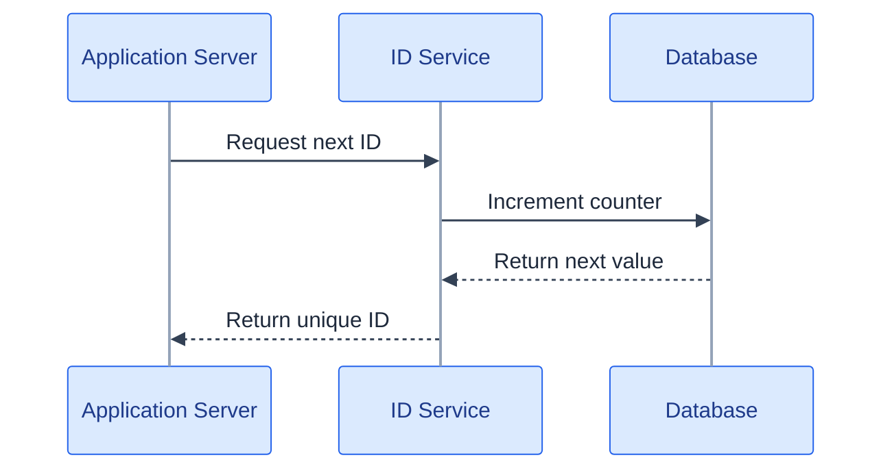
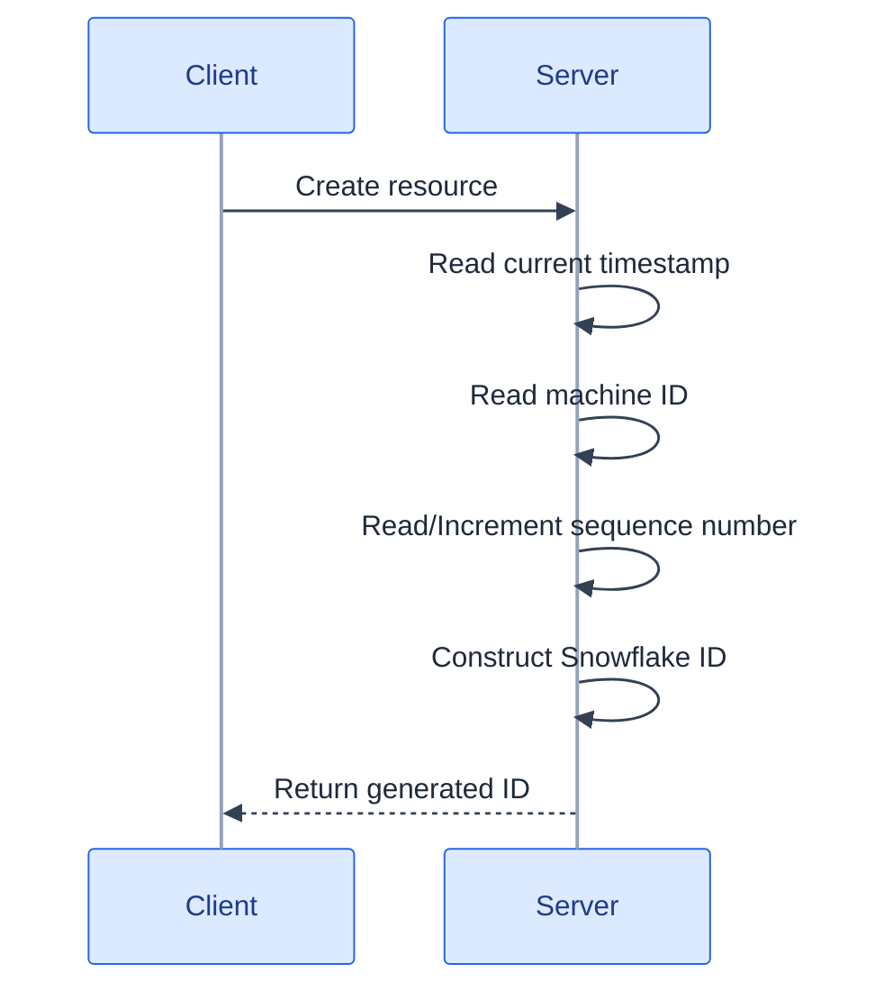
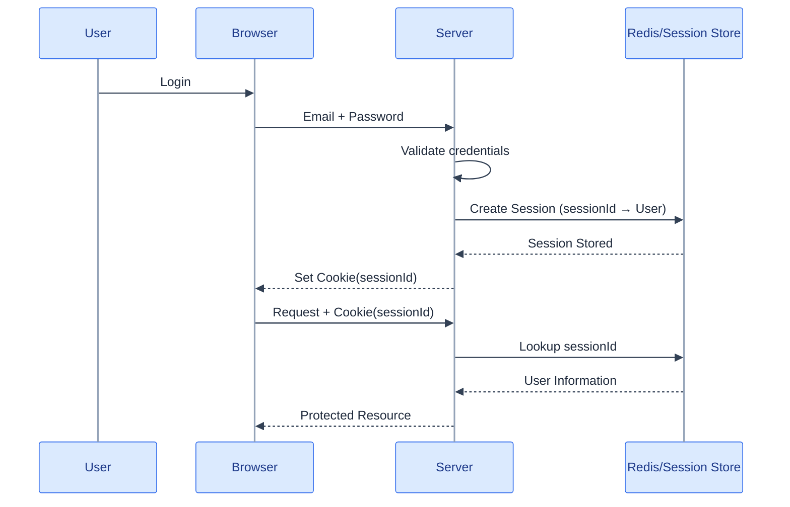
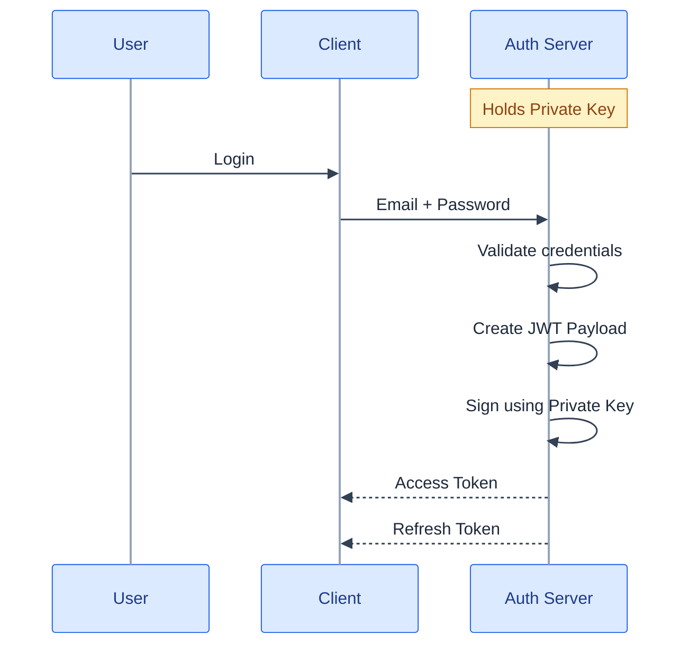
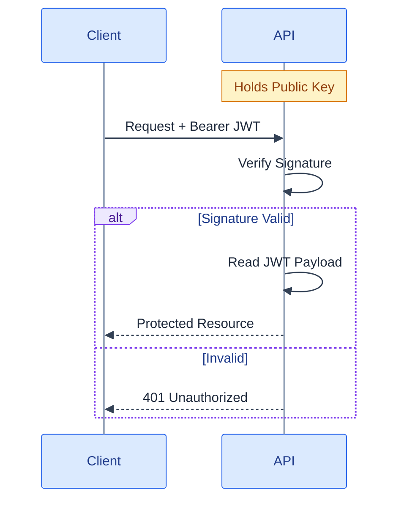
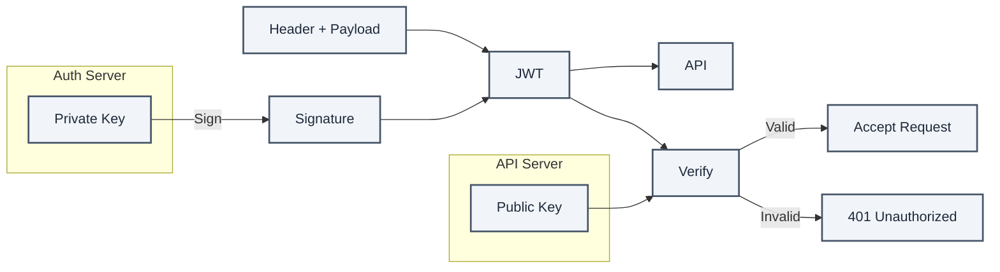
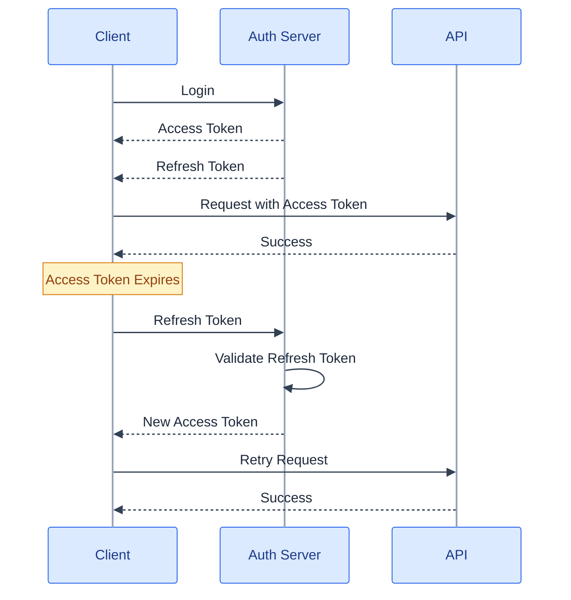
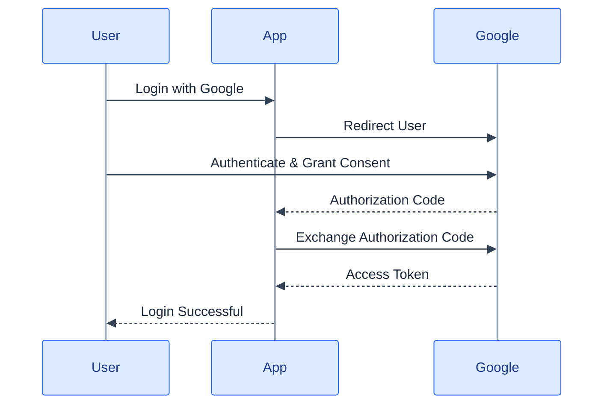

  

Two problems tend to show up in almost every distributed system, whatever the system does. Every record needs an identifier, and no two servers generating identifiers independently can be allowed to collide. Every request needs to know who's calling, on every request, without that check becoming the bottleneck itself.

Neither problem is specific to chat apps or e-commerce or social feeds. They're what happens the moment more than one machine is involved.

## Generating an ID nobody else could have generated

Every message in a chat app needs a unique identifier. The interview expectation is narrower than it sounds. Explain how IDs get generated once you have many machines, compare the approaches, justify the one you'd pick. Exact bit layouts matter only if someone asks for them.

**Auto increment** is the obvious first answer, the database's own `AUTO_INCREMENT` producing clean sequential numeric IDs. It works for as long as one database generates every ID. The moment a second database starts generating IDs independently, both of them start handing out `1`, `2`, `3`, and whatever global uniqueness you thought you had disappears the instant those two sets of rows have to live in the same place.

**A centralized ID generator** fixes the collision problem by making every server ask one shared service for the next ID.

You get globally unique, sequential IDs, and you pay what a single point of dependency always costs. A network round trip on every ID request. A bottleneck the moment request rate climbs. And a real single point of failure, because if the ID service is down then nothing new can be created anywhere in the system no matter how healthy the rest of it is.

**UUIDs** remove the coordination requirement. Every server generates its own IDs independently, with no network call and practically no chance of a collision, which means there is no centralized service to keep alive and nothing that has to stay up for record creation to keep working.

The cost shows up later and quietly, inside the database. A UUID is effectively random, and most databases index primary keys with a B-tree, a structure that quietly expects insertions to arrive in roughly ascending order and pays for it when they don't. Random 128-bit values scatter insertions across the whole index instead of appending at the end, causing far more page splits and considerably more disk I/O than a sequential key would. That sits on top of the storage cost of a 128-bit ID against a much smaller integer.

**Snowflake IDs** get both properties at once, globally unique *and* time-ordered, with no central coordinator. Usually three components go into one ID.

| Component | Purpose |
| --- | --- |
| Timestamp | Orders IDs chronologically |
| Machine ID | Identifies the generating server |
| Sequence number | Prevents collisions within the same timestamp on the same machine |

The timestamp, typically in milliseconds, makes later IDs numerically larger, so IDs sort by creation time without anyone querying for that ordering separately. The machine ID is baked into every ID a given server produces, and that single field is what lets dozens of servers generate IDs independently, at the same instant, without ever needing to talk to each other. The sequence number handles the last edge case, several IDs requested on the same server inside the same millisecond, by incrementing on each request until the timestamp itself ticks forward and resets the count.

Everything happens locally. No database lookup, no network call, so it's fast. And because the IDs are time-ordered rather than random, insertions land with much better locality than UUIDs would give a B-tree index.

| Feature | Auto increment | UUID | Snowflake |
| --- | --- | --- | --- |
| Globally unique | No | Yes | Yes |
| Sequential | Yes | No | Mostly — time-ordered |
| Central server required | Usually yes | No | No |
| Database-friendly | Yes | No | Yes |
| Human-readable | Yes | No | No |
| Scales across many servers | No | Yes | Yes |

| Approach | Use when | Typical examples |
| --- | --- | --- |
| Auto increment | Single database, small to medium applications, internal or admin tools | Blog, school management system, CRM |
| UUID | Simplicity is preferred, multiple services generate records independently, ordering doesn't matter | File IDs, session IDs, API keys, correlation and trace IDs |
| Snowflake | Large distributed systems, high write throughput, IDs should roughly follow creation time, database indexing efficiency matters | Chat message IDs, large e-commerce orders, X (Twitter), Uber, Discord variants |

## Security basics

Unless the role calls for deep security expertise, the baseline is short and non-negotiable. Encrypt data in transit and at rest. Sanitize every user input and any parameter exposed to a user, which heads off XSS and SQL injection. Use parameterized queries instead of string-concatenating them together. Apply least privilege everywhere a permission gets granted.

## Proving who's calling without asking a database every time

Once a user logs in, the server needs to identify them on every subsequent request, and there are broadly two different ways to do it.

### Session-based authentication

The server holds the session data. The browser holds only a session ID, usually in a cookie. Every request sends that ID back, the server looks the corresponding user up in the session store on the way in, and that lookup *is* the authentication step for the request.

| Advantages | Disadvantages |
| --- | --- |
| Logout is trivial — just delete the session | Needs shared session storage (Redis, typically) once there's more than one server |
| A session can be invalidated instantly, on demand | Every authenticated request costs a session lookup |

### JWT-based authentication

The alternative removes server-side session storage. After authentication the client gets back a signed JWT, every subsequent request carries it, and API servers verify the signature instead of looking anything up.

The payload carries application-specific claims (`userId`, `role`, an expiry) and the client holds onto both the access token and a refresh token. Verifying it later is a signature check.

No Redis lookup, no session store. The whole authentication decision is "does this signature verify", and only once it does is the payload trusted.

### The asymmetric key split makes that trust possible

| Key | Purpose |
| --- | --- |
| Private key | Signs JWTs; only the auth server ever holds it |
| Public key | Verifies signatures; shared out to every API server |

Only the auth server can *produce* a validly signed token, but any API server can *verify* one, independently, without talking to the auth server or to each other. That asymmetry is what makes JWT verification a local operation.

It's also what stops tampering. Say an attacker edits the payload directly, changing `"role": "user"` to `"role": "admin"`.

The signature was computed over the *original* payload, so the moment the payload changes the old signature stops matching it. Verification fails, the request gets rejected, and the attacker has no way to produce a fresh valid signature over the payload they just modified without holding the private key that only the auth server has.

None of that security comes from hiding the payload. A JWT payload is base64, readable by anyone who cares to look. It comes from the signature being unforgeable without the private key.

### Two tokens, two jobs

| Access token | Refresh token |
| --- | --- |
| Sent with every API request | Sent only to the auth server |
| Short-lived — 15 to 60 minutes | Long-lived — days or weeks |
| Grants API access | Used to obtain a new access token |
| Limited blast radius if compromised | More sensitive; needs secure storage |

That split is the answer to "how do you invalidate a JWT", a question with no clean answer once a stateless token has been issued. Keep the access token short-lived enough that a compromised one expires quickly on its own, and put the revocation power in the refresh token instead, at the one place in the whole design that still keeps state. The auth server.

### OAuth answers a different question

JWT proves *who you are*. OAuth grants a *third party* permission to act on your behalf without handing that party your password. "Login with Google" is the canonical example.

| Authentication | Authorization |
| --- | --- |
| JWT proves the user's identity | OAuth grants third-party applications permission to access resources |

The user authenticates directly with Google and never types their Google password into the third-party app. Google issues the access token, not the app, often as a JWT itself, once the user has explicitly granted consent.

| Feature | Session authentication | JWT authentication |
| --- | --- | --- |
| Server stores user state | Yes | No |
| Client stores | Session ID | Signed JWT |
| Session lookup required | Yes | No |
| Scales easily across distributed APIs | No — needs a shared session store | Yes |
| Authentication method | Session lookup | Signature verification |

## Check yourself

1. Why does auto-increment stop working the moment you have more than one database?
2. Why are UUIDs poor primary keys under a B-tree index?
3. What three components make up a Snowflake ID, and what does each one guarantee?
4. Which ID scheme would you choose for chat messages, and which for API keys? Justify both.
5. Session-based vs JWT authentication. Which scales better across services, and what do you give up?
6. Why can't you simply invalidate a JWT, and what do you do instead?
7. What stops an attacker from editing a JWT payload to escalate their role?
8. What is the difference between what a JWT proves and what OAuth grants?

## What the series was building toward

Ten parts, and almost every decision in them collapses to a handful of one-liners once the reasoning behind them sticks.

Scale vertically until it stops being cheap, then go horizontal, and make servers stateless before you do. Replicate for read scaling and availability, shard for write and storage scaling. They compose, and neither replaces the other. Don't shard until a single machine can't hold the data or the write volume, because sharding buys permanent operational complexity instead of a one-time cost.

Partition tolerance was never optional, so the choice left to you is consistency versus availability *during* a partition, subsystem by subsystem. Money, inventory and bookings usually lean CP. Feeds, timelines and counters lean AP. A quorum is a majority, and that majority is the entire mechanism making leader election safe and split-brain impossible.

Public API, REST. Internal service-to-service at real volume, gRPC. Client always initiates, REST; server pushes one direction, SSE; both sides talk continuously, WebSockets. TCP by default, UDP only once late data is genuinely worse than lost data.

CDN for static assets, always. Pull for high traffic, push for low traffic and infrequent updates. Layer 7 by default, and Layer 4 only when raw packet throughput matters more to you than content awareness. Rate limit at the edge, token bucket as the sane default, and remember shared counters or the effective limit silently multiplies by instance count. 429 means the caller sent too much. 503 means the service can't cope right now.

Split services along functional verticals, never along individual operations. Retries need exponential backoff and a total timeout budget, and without a circuit breaker sitting behind them, they amplify outages instead of absorbing them. Database per service, and cross-service data comes from querying the owner, never a shared join. Alert on symptoms a user actually feels, and keep load balancer health checks shallow.

SQL for correctness-critical related data, NoSQL for flexible independent high-throughput data. Choose locking by expected conflict rate, not by how important the data feels. Use the lowest isolation level that prevents the anomaly your workload can produce. Snowflake IDs when order matters and the system is distributed, UUIDs when order doesn't matter, auto-increment only ever on a single database. Files go in object storage, metadata and the URL go in the database. Full-text and geospatial queries get their own index, kept eventually consistent with the source of truth.

Cache-aside is normally the default. Write-through when a read must never be stale. Write-behind only when data loss is tolerable. Cache objects instead of raw query results, because that's the version where invalidation stays tractable. Redis unless the need is nothing but a fast string store, in which case Memcached. Every cache entry needs a TTL, since invalidation you reason about by hand is invalidation you will eventually get wrong.

If the user doesn't need the result to continue, get it off the request path. Kafka broadcasts one event to many independent consumers. RabbitMQ hands one task to one worker. Ordering holds only within a partition, so pick the partition key to match whatever has to stay ordered. Exactly-once delivery doesn't exist, so build at-least-once delivery plus idempotent consumers. Every queue needs a bound, and every consumer needs a retry limit and a dead letter queue behind it. Outbox when a database write and an event publish have to happen together, saga when a workflow spans services. Fan-out on write for read-heavy feeds, hybrid the moment celebrity accounts exist.

## What it deliberately left out

Being honest about the edge of a series is probably worth as much as anything inside it. These were left out on purpose rather than by oversight.

Consensus internals, meaning the Paxos derivation, Raft's log compaction and ZooKeeper's ZAB protocol, where naming the guarantee is enough at this level and the primary sources are where to go deeper. Conflict resolution for concurrent writes (vector clocks, CRDTs, last-write-wins), which matters once multi-master or collaborative editing goes past the basics here. Multi-region architecture: active-active across regions, data residency, RPO/RTO planning. Storage engine internals, B-tree against LSM-tree write amplification and compaction strategies. Two-phase commit mechanics, named earlier alongside sagas but never derived in full. Transport specifics like TLS handshake mechanics and HTTP/2 against HTTP/3 and QUIC. Orchestration, meaning Kubernetes scheduling and service mesh internals.

None of that is a gap in the reasoning this series was trying to teach. It's the difference between knowing a mechanism exists and being able to name the guarantee it gives you, against needing to sit down and implement that mechanism correctly from scratch. For most system design conversations the first one is what's being asked for.

Ten parts back, this series opened with a sentence that turned out to be the thesis for all of them. "This needs to scale" was never a requirement. It's a number you're supposed to compute. Every part since has been a different unit that number gets measured in, whether that's reads per second, availability nines, partition count, cache hit rate or queue depth. Compute the number and the architecture mostly falls out on its own.

## Further reading

- [Design a Unique ID Generator in Distributed Systems](https://www.systemdesignhandbook.com/guides/design-a-unique-id-generator-in-distributed-systems/)
- [OWASP Top 10](https://github.com/OWASP/Top10)
- [API Security Checklist](https://github.com/shieldfy/API-Security-Checklist)
- [Security Guide for Developers](https://github.com/FallibleInc/security-guide-for-developers)
- [Cross-site scripting (XSS)](https://en.wikipedia.org/wiki/Cross-site_scripting)
- [SQL injection](https://en.wikipedia.org/wiki/SQL_injection)
- [Principle of least privilege](https://en.wikipedia.org/wiki/Principle_of_least_privilege)
