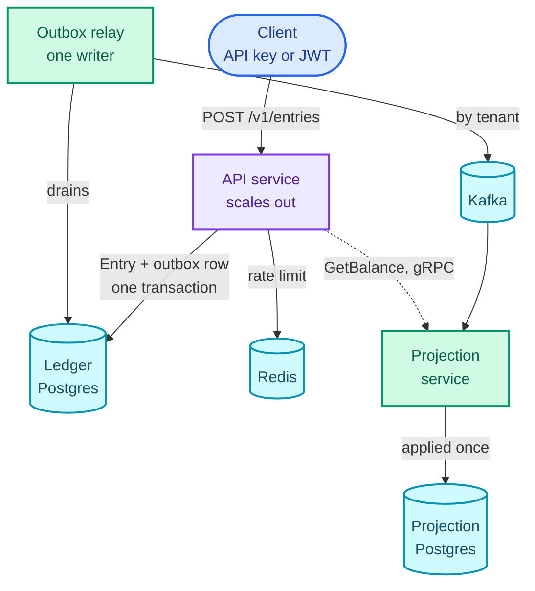
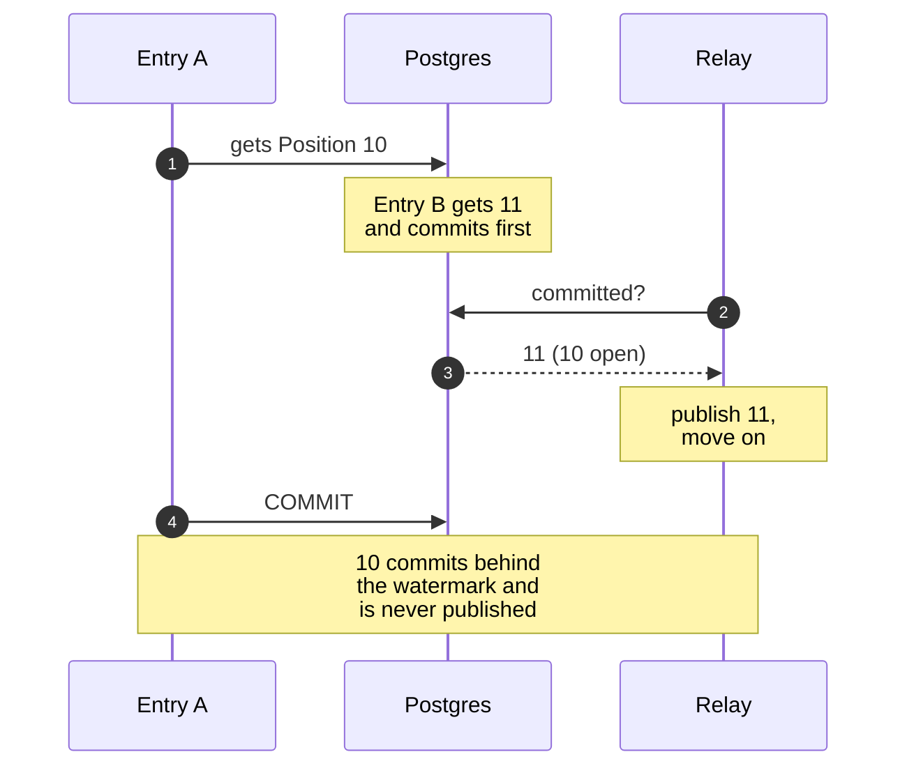

<p align="center">
  
</p>

**Source:** [github.com/rishabh0111/nostro-ledger][repo]. `docker compose up --build` starts all
three services with two demo tenants and their API keys printed to the console, and the README walks
from there to a refused cross-tenant write in six requests. Its 25 claims each name the test that
proves them, and CI ticks that list from the test reports on every push.

---

Two requests arrive at the same moment. Both want to take 5.00 out of an account that holds 5.00.

The obvious Java reads the balance, checks it is at least 5.00, and saves the new one. Run that twice
in parallel and both requests read 5.00, both pass the check, and both save. The account now holds
-5.00. Nobody got an exception, and the tests passed, because the tests send one request at a time.

That race is the kind of question a backend interview is really asking, and a CRUD demo never has to
answer it. So I built a Java project that has to answer all of them:

- What happens when two requests race for the same row?
- When the network drops a response and the client retries?
- When Kafka delivers a message twice, or a slow transaction commits out of order?
- When a request from one tenant names another tenant's data?
- What does the compiler catch, and what only shows up in production?

Nostro is a multitenant double-entry ledger with an HTTP API. Money is the domain because it punishes
every one of those mistakes, and a ledger can get money wrong in four ways: record a movement that
does not balance, lose one, apply one twice, or let one tenant see or touch another's money. I wanted
each of them to be impossible rather than unlikely. What it adds up to:

- **Three Spring Boot 4 services on Java 21** from one ten-module Maven reactor: an HTTP API, a Kafka
  outbox relay, and a gRPC projection service with its own database.
- **Failure modes as types.** Every refusal is a record in a sealed interface, mapped to an RFC 9457
  response by an exhaustive `switch`. A new failure without a response does not compile.
- **Concurrency that holds under load.** 32 concurrent writers on one hot account in a Gatling run:
  zero deadlocks, zero serialization failures, zero lock timeouts.
- **Exactly-once effects on at-least-once delivery:** idempotency keys in the same transaction as the
  write, a single-writer relay with leader failover, and a projection that halts rather than skip
  a message.
- **Tenant isolation through every layer:** Spring Security derives the tenant, Hibernate 7 carries
  it on the right connection, gRPC metadata passes it between services, and Postgres enforces it.
- **211 tests on every push**, 127 of them against real Postgres, Kafka and Redis in Testcontainers,
  in a CI run of under three minutes.

This post walks through the decisions behind each of those, including the ones I rejected.

---

## The shape of it



The vocabulary matters, so here it is once. An **Entry** is one balanced movement of money. It is made
of **Postings**, each a signed amount against one **Account**, and the Postings of an Entry sum to zero
in every currency they touch. A **Tenant** owns Accounts and can never see anyone else's. I refused to
call an Entry a "transaction", because this design leans on database transactions constantly, and
"the transaction is recorded in one transaction" is a sentence that is both true and useless.

Writes go to the API service, which records the Entry and an outbox row in the same database
transaction. A relay drains the outbox into Kafka. A projection service consumes Kafka into Balances
in a database of its own, and the API asks it for a Balance over gRPC. Redis holds per-tenant rate
limits and nothing else.

The code is split the same way. `nostro-domain` is plain Java with no Spring and no database: the
Entry rules, the money arithmetic and the outcome types, tested with JUnit 5 and AssertJ
without starting anything. Persistence, the outbox, the gRPC contract and shared test fixtures are modules of
their own, and each of the three services depends on only what it uses. It is about 6,800 lines of
main Java and 6,300 lines of test Java.

The stack is current on purpose: Java 21, Spring Boot 4.1 on Spring Framework 7, Hibernate ORM 7,
Spring gRPC, the plain Kafka Java client, Flyway, Micrometer Tracing, springdoc OpenAPI, and virtual
threads on in the API service.

---

## Decision 1: a refusal is a value, and the compiler checks every one is handled

An unbalanced Entry, a breached floor or a reused idempotency key is not an exceptional event in a
ledger. It is an answer the caller needs. So recording an Entry returns a value, and the domain
models every refusal as a record in a sealed interface:

```java
sealed interface Refused extends RecordOutcome
        permits Unbalanced, UnknownAccount, CurrencyMismatch, InsufficientBalance,
                IdempotencyKeyReused, UnknownEntry, AlreadyReversed {
}
```

One `switch` maps every refusal to an RFC 9457 Problem Details response, with no `default` branch.
Because the switch is exhaustive over a sealed type, adding a refusal without deciding its HTTP
response is a compile error, not a `500` somebody finds in production. A test pins each case to its
status and problem type, and another asserts that the whole catalogue appears in the generated
OpenAPI document. Even the framework's own refusals, a malformed body or a missing credential, come
back in the same shape.

The same idea runs past the compiler, into startup. Three mistakes stop the application from
**starting** rather than failing on the first unlucky request:

- **An endpoint with no permission declared.** Every handler states the permission it needs, and
  Spring Security enforces it. One that declares none fails the boot.
- **A Kafka producer setting that would break ordering.** The relay's ordering depends on idempotent,
  in-order delivery, and a configuration that quietly weakens that fails at startup.
- **A Kafka topic with the wrong shape.** The partition count decides where each Tenant's Entries
  land, so the relay creates the topic itself and refuses to start on one with a different count.

A failure at startup cannot hide on an untested path. Each of the three has a test.

---

## Decision 2: the race is settled by the row lock, not by a check in Java

Back to the two withdrawals. An Account can be declared **constrained** when it is created, meaning
its balance may never go below zero. Any check in Java has the same problem: it holds only for the
code paths that remember to perform it, and even those race each other. I looked at three ways to hold
the line.

**`SUM()` under `SELECT ... FOR UPDATE`.** Lock the Account, add up its history, compare. It is correct,
and its cost grows with every Posting the Account has ever had.

**`SERIALIZABLE` isolation.** The database detects the conflict and aborts one transaction. Also
correct, and under contention on a hot account it produces retry storms, which is exactly the workload
the floor exists for.

**A stored balance, moved by a guarded `UPDATE`.** This is what I built:

```sql
UPDATE account
   SET balance_minor = balance_minor + :delta
 WHERE tenant_id = :tenant AND id = :account
   AND (NOT constrained OR balance_minor + :delta >= 0)
```

The `UPDATE` takes the row lock and checks the floor in one statement. The second writer waits for
the first to commit, re-evaluates the predicate against the new balance, and updates zero rows. The
Java side reads zero rows as `InsufficientBalance`, one of the sealed refusals above, and the API
answers `422`. No exception is involved. A `CHECK` constraint on the column is the backstop, for any
future `UPDATE` that forgets the predicate.

The Java around that statement is where the rest of the concurrency work lives:

- **Locks are taken in a fixed order.** An Entry that touches two constrained Accounts updates them
  sorted by id, so two Entries moving money in opposite directions can never deadlock. A test runs
  exactly that, and another puts 40 concurrent writers on one Account and checks the only refusals
  are the floor.
- **Retries are for transient failures only.** Serialization failures, deadlocks and lock-not-available
  (SQLSTATE `40001`, `40P01`, `55P03`) are retried with Spring Framework 7's core `RetryTemplate`:

  ```java
  this.transientFailures = new RetryTemplate(RetryPolicy.builder()
          .predicate(SqlFailure::isTransient)
          .maxRetries(3)
          .delay(Duration.ofMillis(25))
          .multiplier(2.0)
          .maxDelay(Duration.ofMillis(400))
          .jitter(Duration.ofMillis(25))
          .build());
  ```

  A floor refusal is never retried: it is an answer, not a failure.
- **Unconstrained Accounts take no row lock at all.** They carry no stored balance, so their writes
  are pure inserts. Only Accounts that asked for a floor pay for one.
- **The request path has hard limits:** a 1-second `lock_timeout` and a 3-second `statement_timeout`
  on its database role, so a stuck lock becomes an error instead of a hung thread.

The rule that took me longest to accept: **a reversal is subject to the floor too**, so a correction
can be refused. An exemption cannot be written as a database constraint, so granting one would have
moved the invariant back into application code, the thing this decision exists to avoid.

A balanced Entry is enforced the same way. The domain refuses an unbalanced Entry as a value, and a
deferred constraint trigger re-checks every Entry's Postings per currency at `COMMIT`, so even raw SQL
cannot commit one. Entries and Postings are insert-only for the application's role.

---

## Decision 3: idempotency is a unique index inside the same transaction

A client sends an Entry, the network drops the response, and the client retries. Without idempotency
that is a duplicate payment.

The common designs put an idempotency record in Redis, or model a little state machine: pending, then
complete, with timeouts for requests that died halfway. I did neither. The idempotency record holds the
key, a SHA-256 fingerprint of the request body, and the response to replay. It is written **in the same
transaction as the Entry**, under a unique constraint on `(tenant_id, idempotency_key)`.

That removes the in-flight state entirely. A duplicate that arrives while the original is still open
blocks on the unique index until the original commits. It then fails the constraint, reads the stored
response, and returns it verbatim. A test fires concurrent duplicates and checks that exactly one
Entry exists afterwards.

Three smaller choices follow from that:

- The key is **required**. An optional key means the duplicate-payment hole is on by default.
- The same key with a different body is a loud `422`. Replaying the old response to a different
  request would be a silent lie, and the fingerprint exists to catch it.
- Redis must not hold these keys. Redis cannot join the Entry's transaction, so moving the key there
  turns a guarantee back into a race.

---

## Decision 4: the tenant comes from the credential, through every layer

A caller's Tenant is derived by Spring Security from the API key or the 15-minute staff JWT they
present. It is never a header, a path segment or a body field, so there is nothing for a caller to
change. Postgres then enforces it twice: row-level security on every tenant-scoped table, and
composite `(tenant_id, id)` foreign keys, so a Posting cannot reference another Tenant's Account even
if row-level security were somehow off. I wrote about those database mechanics in
[an earlier post]({{ site.baseurl }}/blogs/postgres-rls-multitenancy/). The traps that were new here
were all in the Java layers above it.

**Hibernate 7 has to use the transaction's connection.** Row-level security reads the Tenant from a
transaction-local setting on the connection. I used Hibernate's `StatelessSession` for the write path,
and if that session ever opened its own connection it would have no Tenant set, and every query would
quietly return nothing. Spring's source suggested the session shares the transaction's connection,
but no document promised it. So the first thing I built was a test that compares `pg_backend_pid()`
across both paths. It still runs in CI, next to another that proves nothing in the request path
borrows a second connection inside a transaction.

**Hibernate 7 turns the second-level cache on for stateless sessions by default.** A cached entity
outlives the Tenant context that was allowed to load it, so that default would have undone the
isolation work without a single error. The cache is off, explicitly, with a comment saying why.

**gRPC carries the Tenant in call metadata**, and the projection applies the same row-level security
to its own database. The isolation test runs over a real socket, because gRPC's in-process transport
skips metadata serialization, and metadata is exactly what carries the Tenant.

Another Tenant's Account answers `404`, never `403`. A `403` confirms the Account exists.

---

## Decision 5: every Balance says how stale it is

Balances are served from the projection, which lags the write by however long the relay and Kafka
take. Serving a lagging number as if it were current would be a lie. So every Entry returns a
**Position** when it is recorded, and every Balance reports the Position it reflects. A caller that
needs to read its own write passes that Position back as `minPosition`, and the read waits for it,
up to a server-side cap.

The hard part was choosing what a Position is.

A `bigserial` column looks perfect, and it is broken for this. Sequence values are assigned when a
transaction first writes, not when it commits. Transaction A takes value 10 and is slow. Transaction
B takes 11 and commits first. A reader tailing by sequence sees 11, moves past it, and never goes back
for 10. Nothing errors and nothing rolls back. One Entry never reaches the projection, and every
Balance after it is wrong.



The Position is the transaction's `xid8`, prefixed with the database's system identifier, so a token
from a different database fails loudly instead of comparing as a plausible number. The relay publishes
a row only once its Position is below the oldest transaction still open:

```sql
SELECT ...
  FROM outbox o
 WHERE o.published_at IS NULL
   AND o.position < pg_snapshot_xmin(pg_current_snapshot())
 ORDER BY o.position
 LIMIT ?
```

Below that line, every transaction has either committed or rolled back, so nothing can appear later
underneath what the relay has already published. Publish order becomes exactly Position order, and
there is a test in which a late committer is never overtaken.

The read contract got as much thought as the token. A `minPosition` read always answers `200` with the
Position it actually reflects, even when the wait timed out. The caller asked for freshness, can see
whether they got it, and decides. And the service releases its JDBC connection **before** it parks
the request to wait. If it held the connection, a lagging projection would drain the Hikari pool, and
the freshness feature would become an outage under exactly the conditions it exists for. There is a
test for that too, on both sides of the gRPC call.

---

## Decision 6: three services, because two replica counts conflict

I did not split this into services for style. The relay has to be a single writer, because publishing
in Position order needs one reader of the outbox. `SKIP LOCKED`, the usual trick for parallel queue
consumers, reorders rows by design. The API has to scale out horizontally, with every instance
drawing on one shared per-tenant rate limit in Redis. One process cannot run one replica and many
replicas at the same time.

So there are three Spring Boot applications from one Maven reactor. The relay elects its writer with
`pg_try_advisory_lock` on the connection that drains, so if the leader dies its session ends, the lock
goes with it, and a standby takes over. There is a test that kills the leader mid-drain and checks
that nothing is lost or reordered.

I did not split reads from writes. They have no different scaling need, and it would have doubled the
authentication code for nothing.

---

## Decision 7: the Kafka consumer stops instead of lying

Kafka redelivers, so applying an Entry has to be idempotent. The projection writes an `applied_entry`
row, unique on Entry id, in the same transaction as the Balance update, and stores the consumed offset
with that same write. Kafka's exactly-once semantics do not cover a consumer writing into an external
database, which is what this is, so I do not rely on them. The test publishes every Entry twice, then
replays the whole topic from offset zero, and checks that each Tenant's Balances still sum to zero.

The more interesting decision is what happens to a message the projection cannot apply. The reflex
answer is a dead-letter topic. For a ledger that is the wrong answer. Skipping one Entry means serving
a wrong Balance to everyone, indefinitely, while the dead-letter topic makes the problem look handled.
So the consumer **pauses that partition**, seeks back to the failed record, and raises a metric
immediately. A halted ledger pages someone. A ledger that skips an Entry keeps serving wrong balances,
and nobody finds out.

---

## Decision 8: each piece of infrastructure has to earn its place

Kafka, Redis and gRPC are what Java backend teams run in production, and that makes it easy to add
them without a reason. So I set a rule: at most one of them may be justified as generic
infrastructure, and the other two have to answer a need the ledger actually has.

- **Kafka** is the replayable log between the write model and the read model. A projection polling
  Postgres could not rebuild from zero without loading the write database, or add a second consumer
  without a second poller. The relay uses the plain Kafka Java client, keyed by Tenant over 12
  partitions, so each Tenant's Entries stay in order.
- **gRPC** is how the API asks the projection for a Balance: internal, frequent, typed by a Protobuf
  contract in its own module, and it carries the Position back with the answer. Each call has a
  deadline and bounded retries on `UNAVAILABLE` and `DEADLINE_EXCEEDED`.
- **Redis** holds per-Tenant rate limits through Bucket4j, because a limit shared across API instances
  cannot live in one process. This is the one generic justification, and it is at least the relevant
  kind: one noisy tenant starving the others is this project's actual subject.

Two things I decided **not** to build: a balance cache and a circuit breaker.

Redis must not cache Balances. It would be a third source of truth next to the stored balance and the
projection, it would need Position semantics of its own, and a cached value outlives the Tenant
context that authorized loading it.

The one remote call gets a timeout and bounded retries, and no circuit breaker. A breaker is worth as
much as the fallback it enables, and there is no honest fallback for a Balance. The stronger argument
is that the write path never calls the projection at all. The floor check runs on the stored balance
in the API's own database, so if the projection is down, reads fail and money can still be recorded
correctly.

---

## How 211 tests keep the claims honest

A design like this is only as good as the evidence that it still holds after the next change, so the
tests got as much design as the services.

- **Real infrastructure, not mocks.** 127 integration tests run against Postgres, Kafka and Redis in
  Testcontainers 2, using the same image tags as `docker compose`, so CI exercises what a developer
  runs locally. Each module's suite shares one container per dependency, and Awaitility waits on the
  asynchronous paths instead of sleeping.
- **One Spring context per deployable.** The context cache is the cost that grows without bound as a
  Spring suite grows, so each service's tests share a single configuration, and CI publishes the cache
  statistics to prove it. In the latest run, every module built exactly one context.
- **Three parallel jobs.** The domain and unit tests come back in under a minute without waiting on
  containers. The integration suites run each service at its own seam. An end-to-end job runs the real
  `docker compose up --wait` and follows one Entry through every service. The whole pipeline takes
  under three minutes.
- **The README is under test.** Its 25 claims each name a test method. `ReadmeClaimsTest` checks that
  every named file and method really exists, and a CI step ticks each claim from the test reports into
  the run summary. The script that does the ticking has tests of its own.

The result is a README that cannot drift from the code without the build going red.

---

## What one hot account costs

I load-tested it with Gatling on my laptop, against the compose stack: 32 concurrent writers for 60
seconds per arm. In the contended arm every request hits one constrained Account. In the spread arm
the same load goes across 64 Accounts. Each Account starts with 5.00 and the requests random-walk
it, so the floor keeps refusing throughout.

| | One hot Account | Spread over 64 |
| --- | ---: | ---: |
| Requests | 6,346 | 12,769 |
| Throughput | 105.8/s | 212.8/s |
| p50 | 275 ms | 142 ms |
| p99 | 741 ms | 320 ms |
| Refused at the floor | 35 | 324 |
| Anything else | **0** | **0** |

The claim was never the throughput number, which is specific to one laptop running everything at
once. The claim is the last row. Across both arms the ledger met no database error of any SQLSTATE:
no deadlock, no serialization failure, no lock timeout, no `5xx`. Every refusal was the floor, and the
server's own Micrometer counter matched the clients' count exactly, 359 = 35 + 324. One hot row costs
half the throughput and 2.3 times the p99, and nothing fails to pay for it.

I recorded the API service with JFR over the whole run. It was not CPU-bound: no method held more than
3% of samples, and GC paused for 1.44 s in total over 162 s. The time went to waiting on the database,
and mostly on the Hikari pool rather than the row lock. That looks like a reason to raise the pool
size from its default of 10, and the arithmetic says not to. At 105.8 commits per second the hot row
is held for about 9.5 ms at a time, so ten queued transactions wait at most about 95 ms for it, well
inside the 1-second `lock_timeout`. Thirty-two connections would move 22 more waiters from Hikari's
queue, where waiting is free, into Postgres's lock queue, where each waiter holds a backend and an open
transaction, for no extra throughput. The row serializes them either way.

JFR also left two leads I have not chased yet: something reflects on every request, and both Jackson 2
and Jackson 3 serialize at runtime, so some dependency still pulls in the old line. The full notes,
with the raw data and the JFR views, are [in the repo][results].

---

## What I left out on purpose

- **Holds and reservations.** They are a real two-phase concept, and they would roughly double the
  balance model (available versus posted) and add expiry, which means a scheduler.
- **"Balance as of time T".** A running projection cannot answer it, and a `SUM` over history can,
  which brings back the mechanism Decision 2 rejected.
- **Change data capture with Debezium.** Its ordering is documented, which is a real advantage over
  my hand-written relay. It also adds logical replication, a replication slot that can fill a disk,
  and a Kafka Connect worker to a stack whose whole point is `docker compose up`. If the ordering
  requirement ever hardens to global commit order, that is the migration, and I would make it.
- **Deployment.** No Kubernetes and no cloud. The problems worth showing are in the types, the
  concurrency and the service boundaries, and none of them needs a cluster. My
  [DevOps platform post]({{ site.baseurl }}/blogs/production-grade-devops-platform/) is where the
  cluster work lives.

---

## What I would tell myself at the start

1. **Model failure as data.** A sealed type of refusals turns "did we handle every case?" from a code
   review question into a compiler error.
2. **Put every invariant where the least disciplined code path still hits it.** For money, that is
   the schema. Application checks are for good error messages.
3. **Find out what your ordering number actually means.** "Assigned in order" and "committed in
   order" are different promises, and the difference loses data without an error.
4. **Refuse loudly.** A halted partition, a failed boot and a compile error are all cheaper than a
   wrong balance that nobody notices.
5. **Make the claims checkable.** A README that names a test for every claim, parsed by a test and
   ticked by CI, cannot drift from the code without the build going red.

---

## Project at a glance

| | |
| --- | --- |
| **Stack** | Java 21, Spring Boot 4.1 (Spring Framework 7), Spring Security, Hibernate ORM 7, Spring gRPC, Kafka 4, Postgres 16, Redis 7 + Bucket4j, Flyway, Micrometer, Maven |
| **Services** | API service, outbox relay, projection service, from one ten-module Maven reactor |
| **Guarantees** | balanced Entries, a schema-enforced floor, at-most-once recording, at-most-once projection, tenant isolation through every layer |
| **Tests** | 211 on every push (82 unit, 127 Testcontainers integration, 2 end to end), JUnit 5, AssertJ, Awaitility; CI under three minutes |
| **Proof** | 25 README claims, each naming its test, ticked by CI from the test reports |
| **Load test** | Gatling with JFR: 32 writers on one hot account, 6,346 requests, zero database errors |
| **Code** | [github.com/rishabh0111/nostro-ledger][repo] |

[repo]: https://github.com/rishabh0111/nostro-ledger
[results]: https://github.com/rishabh0111/nostro-ledger/blob/main/docs/results/2026-09-23-load-test/README.md

*Built and written by Rishabh Sharma. The decisions above, and eight smaller ones, are written up one
per file, each with the options it rejected, in the repo's
[`docs/adr/`](https://github.com/rishabh0111/nostro-ledger/tree/main/docs/adr).*

Related: [a production-grade DevOps platform, proven on real AWS]({{ site.baseurl }}/blogs/production-grade-devops-platform/),
[Postgres row-level security for multitenancy]({{ site.baseurl }}/blogs/postgres-rls-multitenancy/),
and [a webhook delivery engine]({{ site.baseurl }}/blogs/webhook-delivery-engine/), which has the same
outbox problem from the other side.
